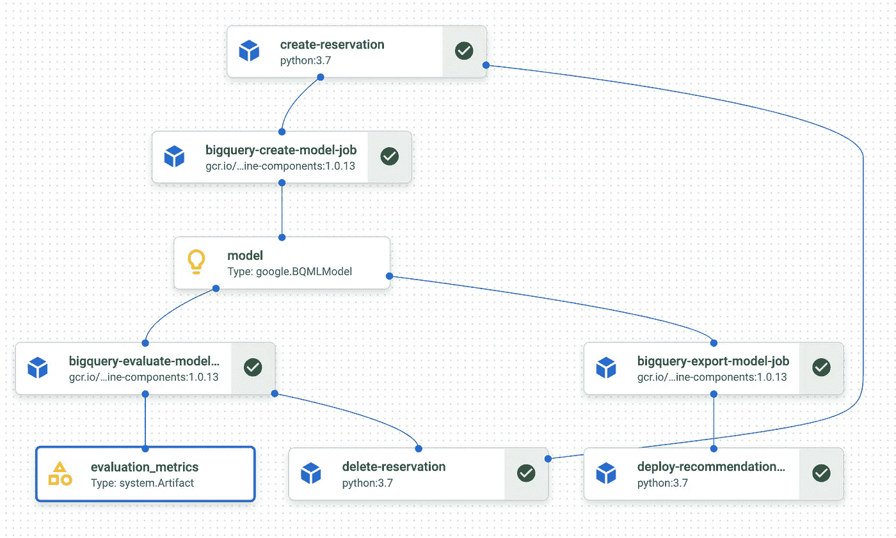

# 基于矩阵分解的大查询 ML 和顶点 AI 管道推荐系统

> 原文：<https://medium.com/google-cloud/recommendations-pipeline-with-matrix-factorization-using-bigquery-ml-and-vertex-ai-pipelines-67e72ddec7f5?source=collection_archive---------0----------------------->

## 如何在 45 分钟内建立一个完全自动化的推荐管道

矩阵分解广泛用于推荐系统。如果您想要构建一个快速简单的解决方案来向您的客户提供出色的推荐，它们是一个很好的、简单的起点。

