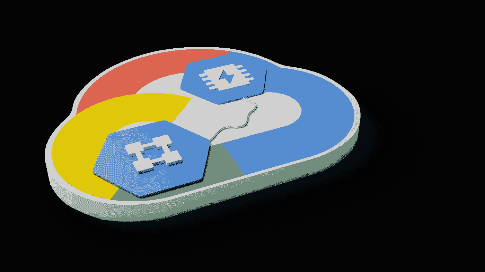

# 具有共享 VPC 和私有服务访问的 Redis

> 原文：<https://medium.com/google-cloud/redis-with-shared-vpc-and-private-service-access-4dad61380bf4?source=collection_archive---------0----------------------->

假设我们希望一个 Memorystore redis 托管实例可用于我们的许多项目。我们如何实现这一目标？

一个答案是利用共享 VPC 和私有服务访问。现在让我们来看一个高级拓扑图，然后我们将解释它的各个部分以及创建它的方法。