# 使用 Google Cloud 上的 DMS 将数据库升级停机时间减少到不到 10 分钟

> 原文：<https://medium.com/google-cloud/reduce-db-upgrade-downtime-to-less-than-10-minutes-using-dms-on-google-cloud-8704681e45ac?source=collection_archive---------1----------------------->

**免责声明:** *本博客中表达的观点、想法和意见仅属于作者，不一定属于作者的雇主、组织、委员会或其他团体或个人。*

这篇博文是为你写的，如果你正在为关键应用程序运行[谷歌云 SQL](https://cloud.google.com/sql/) ，并且打算减少升级数据库的停机时间。数据库(DB)升级在大多数情况下是修复缺陷、采用新功能、合规性的要求，最重要的是，保持应用程序数据的安全，并为应用程序带来利用新功能的灵活性。有时，如果数据库升级没有及时完成，可能会导致严重的影响问题。运营团队通常会花费大量时间来规划和测试升级，以确保停机时间最少，对相关应用和服务的影响最小。这篇博客展示了 Google 云数据迁移服务(DMS)如何减少数据库升级的停机时间。

[Google cloud DMS](https://cloud.google.com/database-migration) 是一种无服务器逻辑复制服务，它简化了源数据库和目标数据库之间的复制。用户可以忽略设置复制背后的复杂性，如服务器、配置管理等。

考虑到关键的生产环境，我将演练首先创建 source env，然后使用 DMS 执行 DB 升级所需的所有步骤。随意忽略调试源 env 的步骤，同时您可以使用剩余的步骤来测试和派生您的策略。以下是这篇博文的高度概括——如何使用 DMS 来升级云 SQL PostgreSQL，但是同样的策略也可以用于升级 Google Cloud SQL MySQL DB 实例:

1.  创建源数据库环境— Google Cloud SQL PostgreSQL
2.  使用 GCE (Google 计算引擎)上的 CloudSQL 代理模拟应用环境—本节还展示了如何保护云 SQL 实例和应用层之间的网络通信。
3.  配置 DMS 复制，该复制隐式创建目标云 SQL PostgreSQL 数据库实例和预期的数据库版本，并启动复制
4.  验证 DMS 复制—完整复制和 CDC 复制(变更数据捕获)
5.  切换—过渡到更高版本的目标数据库并移动应用端点
6.  成本考虑
7.  最佳实践、已知问题和限制以及其他参考资料

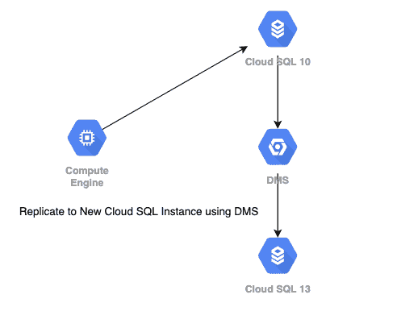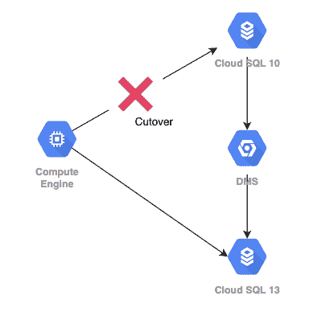

**1 —创建源数据库环境**

**1.1 —假设和先决条件**

对于生产/开发环境，这一部分是可选的，因为您必须有要升级的源数据库。对于那些希望从头开始测试此过程并了解使用复制方法 DMS 升级数据库的整个过程的所有细节的人来说，本节很有帮助。以下是这篇博客的假设:

1.  你应该已经配置好了谷歌云环境，并且可以运行了，如果还没有，那么继续[https://cloud.google.com/gcp](https://cloud.google.com/gcp)。
2.  虽然我们将这篇博客的范围限制在 PostgreSQL，但是推荐的升级数据库的方法也适用于 Cloud SQL MySQL 数据库。
3.  数据库和应用程序都在利用 VPC 专用子网的专用网络中运行。
4.  由于数据库需要安全的通信，所有的网络通信都是使用私有 IP 来完成的。例如:数据库和应用层之间的通信是使用私有 IP 完成的。
5.  使用的数据库引擎是 PostgreSQL，源版本是 PostgreSQL 10，目的是将数据库升级到目标 PostgreSQL 引擎 13。
6.  示例数据库，模式源自开源 PostgreSQL 社区推荐的[示例数据库](https://wiki.postgresql.org/wiki/Sample_Databases)——“航空公司演示数据库”。
7.  应用层准备工作必须已经完成，例如任何数据库级程序和关于目标数据库版本的兼容性测试。
8.  本博客中考虑的 GCP 地区是**孟买** — *亚洲-南方 1* ，不使用默认的 VPC，不建议在生产和安全环境中使用。下面的屏幕截图显示，创建了一个名为" **sh-vpc** "的 VPC，孟买地区的子网为" **subnet-mumbai** "。看一看子网 IP 范围配置。请记住，在这个博客中使用了相同的网络配置。

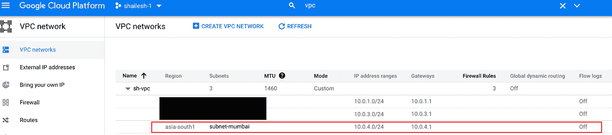

**1.2 —创建源云 SQL PG (PostgreSQL)数据库**

在本节中，我们将在 Mumbai 地区创建一个云 SQL PostgreSQL 数据库，只需很少的配置就可以模拟源生产数据库环境。在云控制台，进入云 SQL 页面:[进入云 SQL](https://console.cloud.google.com/sql/instances) ，创建云 SQL postgreSQL 10 数据库，配置如下截图所示。请记下密码，因为在后面的步骤中会用到它。

根据您的要求选择机器类型。您可能想要测试和存储比下面显示的更多的数据，所以根据您的要求进行选择。

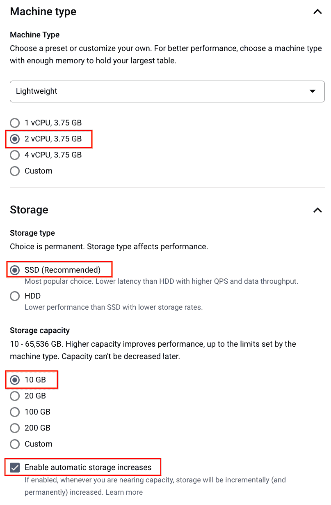

请明智地选择您的网络配置。根据我们的假设和 VPC 配置，我们将网络配置限制为私有，并且不检查公共选项。

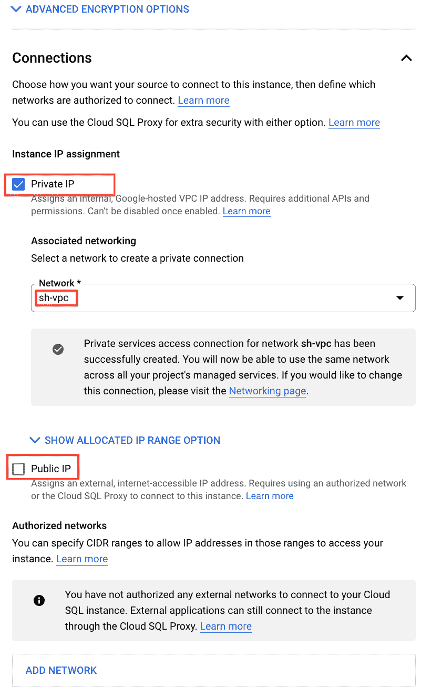

完成源数据库的所有选项后，创建实例:

过一会儿，DB 实例将作为就绪状态列在控制台上。记录分配给实例的私有 IP 地址。在数据库连接的后续步骤中将需要此私有 IP 地址。请记住，这是在 VPC 子网配置下的 IP 范围配置设置的限制下分配的。

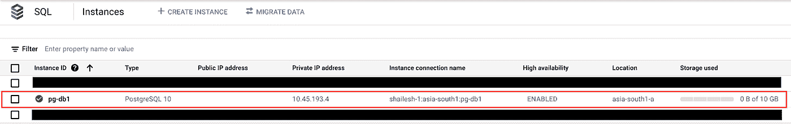

**2 —使用云 SQL proxy 代理模拟应用环境**

**2.1 —设置 GCE 虚拟机**

在本节中，我们将在同一个子网 Cloud SQL DB 实例中设置 GCE VM，这将客户端和数据库之间的通信范围限制在单个子网中，如下图所示。

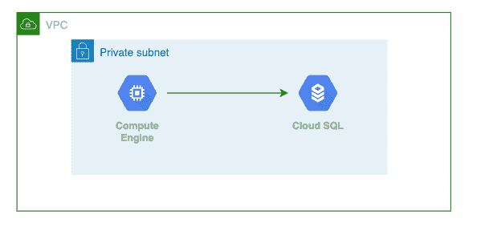

计算引擎用作连接到数据库的应用层，也可以假定为连接到数据库实例的跳转服务器。在云控制台中，进入[虚拟机实例](https://console.cloud.google.com/compute/instances)页面，设置虚拟机，如下图所示。选中以选择 Mumbai 作为区域，并将区域与数据库匹配以防止任何延迟。

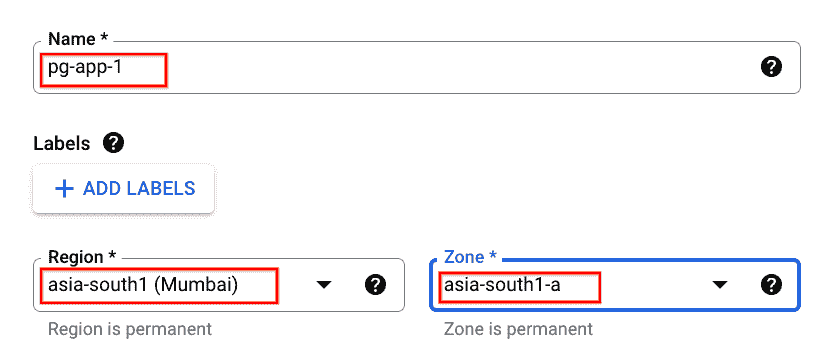

接下来，选择私有网络，类似于数据库的配置，并禁用公共网络和临时连接。这将确保该虚拟机和数据库实例之间的所有连接仅通过专用子网路由，并使通信更加安全。

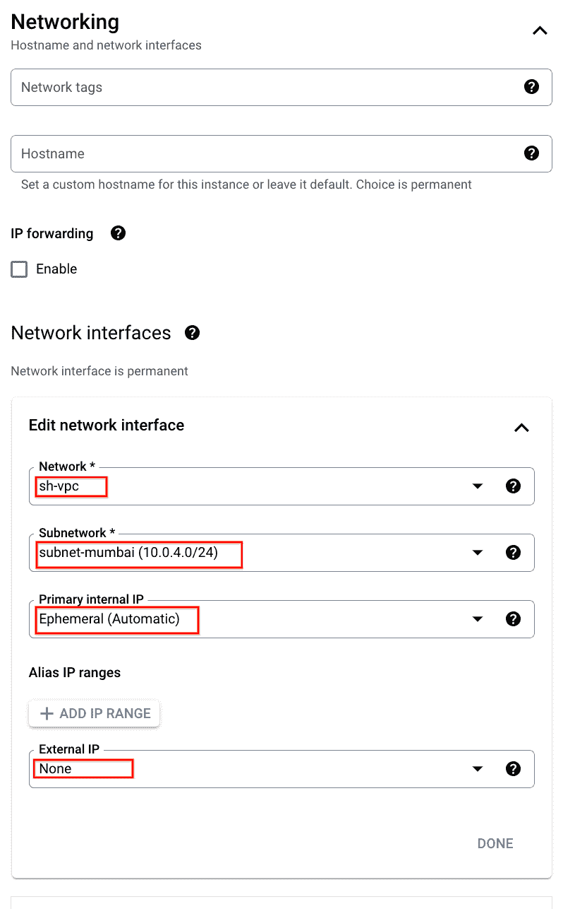

选择创建实例后，请等待一段时间，它将出现在 VM 实例控制台页面上，如下所示。

对于 **ssh** 选项，您可以选择“**在浏览器窗口**中打开”选项来登录虚拟机实例。

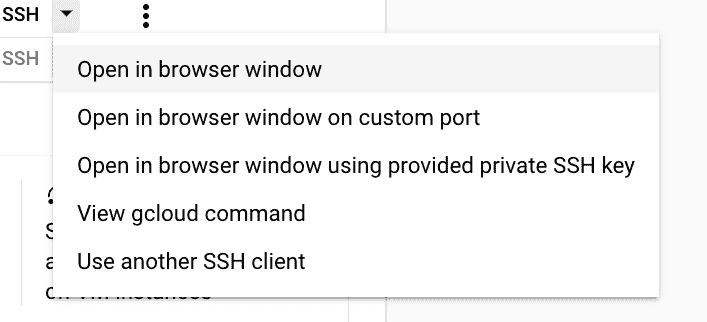

登录 ssh 窗口后，使用最新版本的 [Cloud SDK](https://cloud.google.com/sdk/docs/install) 为虚拟机实例打补丁，并安装 PostgreSQL 客户端— *psql* —如下截图所示:

> sudo apt-get 更新&& sudo apt-get 安装 google-cloud-sdk
> 
> sudo 安装 postgresql 客户端

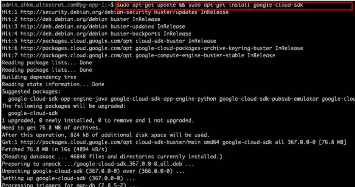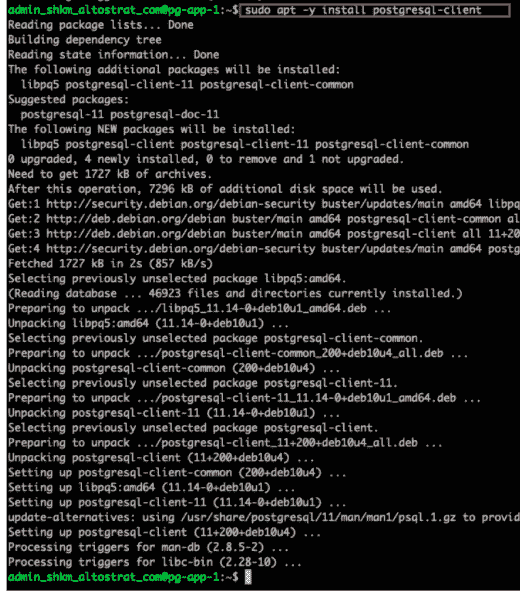

**2.2 连接虚拟机和数据库:**

在本节中，我们将部署[Google Cloud SQL proxy](https://cloud.google.com/sql/docs/mysql/sql-proxy)agent 作为数据库端点，并将数据库模拟为在同一虚拟机上运行的应用层的本地。对于这篇博文，我们假设 psql 应用层。

如果您尚未记录数据库私有 IP，请返回到 [Cloud SQL cloud 控制台](https://console.cloud.google.com/sql/instances/)并复制数据库实例私有 IP 地址，如 10.45.193.4 所示，使用创建数据库时提供的用户名和数据库:

使用虚拟机 ssh 上的私有 IP 连接到数据库，如屏幕截图所示。

> psql -h 10.45.193.4 -U postgres

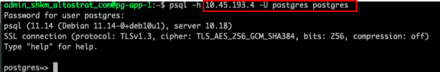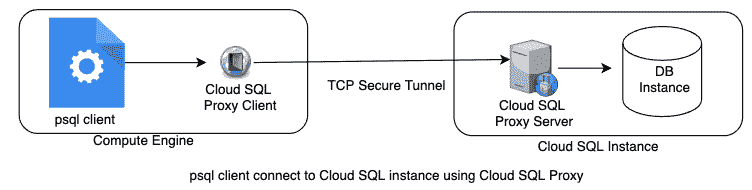

我们将使用云 SQL 代理模拟应用环境数据库连接，云 SQL 代理提供安全连接，使用 TLS 和 128 位 AES 密码自动加密进出数据库的流量，独立于数据库协议，您无需管理 SSL 证书。它还使用 IAM 权限来控制谁和什么可以连接到您的云 SQL 实例。云 sql 身份验证代理作为本地客户端运行，我们的客户端工具 psql 通过标准数据库协议与云 SQL 身份验证代理通信，后者又使用安全隧道与运行在数据库服务器上的伴生进程通信。通过云 SQL 身份验证代理建立的每个连接都会创建一个到云 SQL 实例的连接。SQL 代理充当 psql 客户端应用程序的 DB 端点，这模拟了我们的应用程序环境。接下来，让我们在 GCE VM 上下载并安装云 SQL 代理。

**下载云 SQL Auth 代理:**

> 【wget[**https://dl.google.com/cloudsql/cloud_sql_proxy.linux.amd64**](https://dl.google.com/cloudsql/cloud_sql_proxy.linux.amd64)**-O 云 _sql_proxy**

**使云 SQL Auth 代理可执行:**

> **chmod +x cloud_sql_proxy**

使用云 SQL 代理连接数据库:

回到[云 SQL 云控制台](https://console.cloud.google.com/sql/instances/)并选择您的 PG 实例以检查*连接名称*并在云 SQL 代理中使用相同名称，如屏幕截图所示:

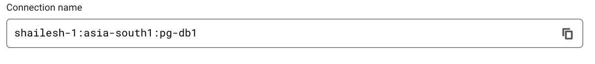

> 。/cloud _ SQL _ proxy-instances =**<<连接名称> >** =tcp:5432 &
> 
> 。/cloud _ SQL _ proxy-instances =**shailesh-1:Asia-south 1:pg-db1**= TCP:5432&

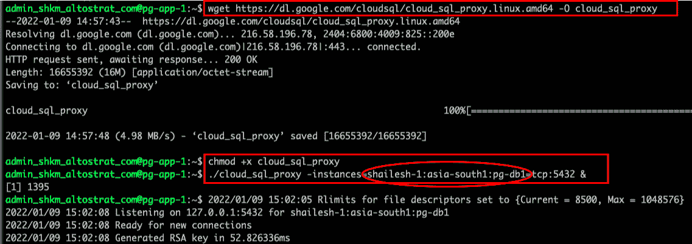

建议将云 SQL 代理作为后台服务运行，但是为了简单起见，这里显示它作为后台命令运行。现在，使用 psql 中的 localhost IP 通过云 SQL 代理连接到数据库，因为云代理正在运行并将连接转发到 *localhost* 上的默认端口 5432 上的数据库。这种方法对应用层隐藏了网络复杂性，并将数据库模拟为本地的。

> psql -h 127.0.0.1 -U postgres

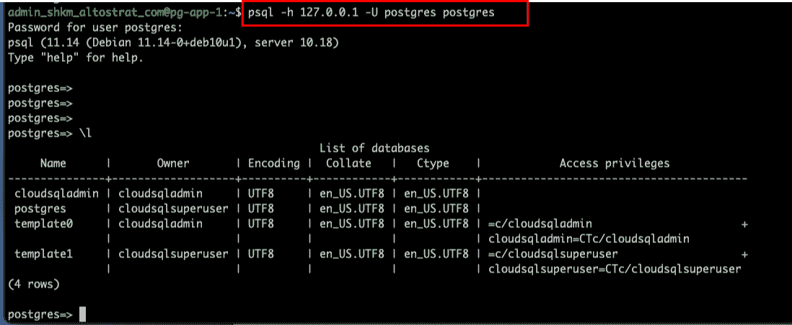

建立连接后，请参见下面云 SQL 代理日志中的连接条目。

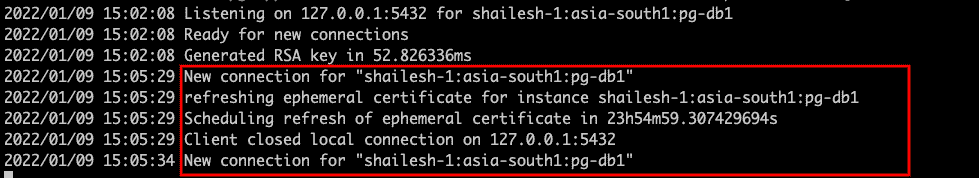

现在，我们将填充一个示例数据库“demo”、模式“bookings”和一组表。它是从[开源 postgresql 社区页面](https://wiki.postgresql.org/wiki/Sample_Databases)下载的，示例数据库是“航空公司演示数据库”。我们正在部署一个样本数据库的更大版本，它有超过 2.5 GB 的数据，具有由复杂数据类型(如“jsonb”)组成的[模式结构](https://postgrespro.com/docs/postgrespro/10/apjs02.html)，主键和外键关系通常代表一个 OLTP 数据库。

> cd ~
> 
> mkdir 航空公司-数据
> 
> cd 航空公司-数据
> 
> https://edu.postgrespro.com/demo-big-en.zip[wget](https://edu.postgrespro.com/demo-big-en.zip)
> 
> 解压缩 demo-big-en.zip

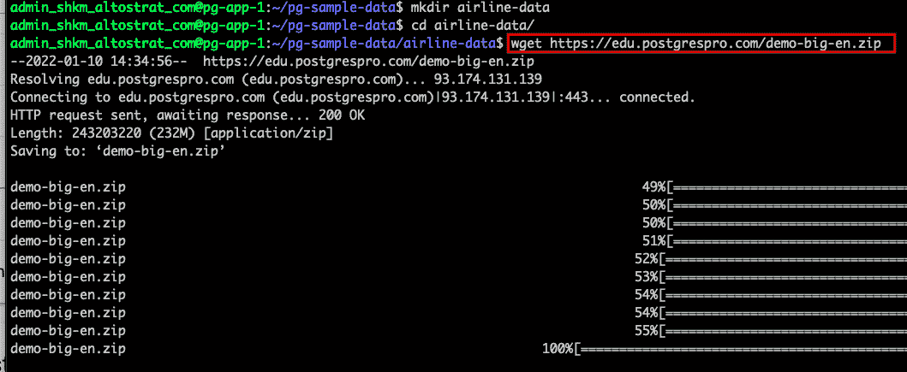

使用 psql 和 cloudsql 代理将提取的文件作为连接数据库的 SQL 文件运行:

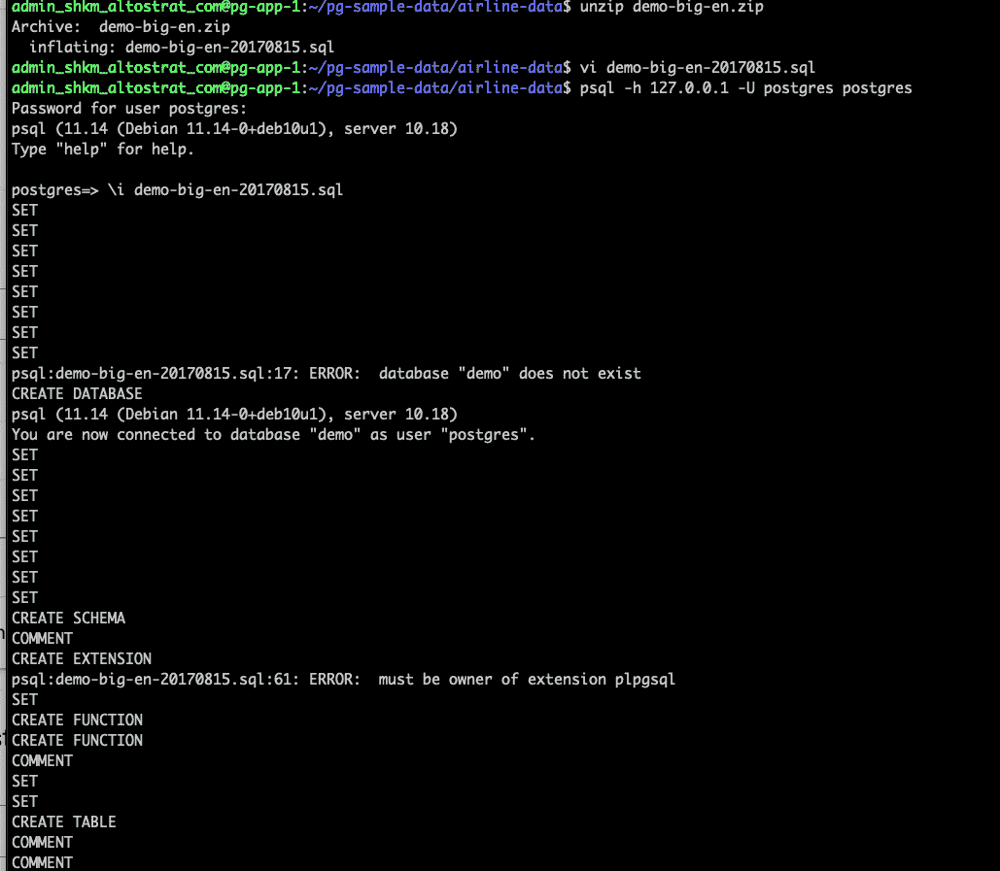

一旦 SQL 脚本完成，就创建了数据库“demo”、模式“bookings”及其表集。让我们验证一下。

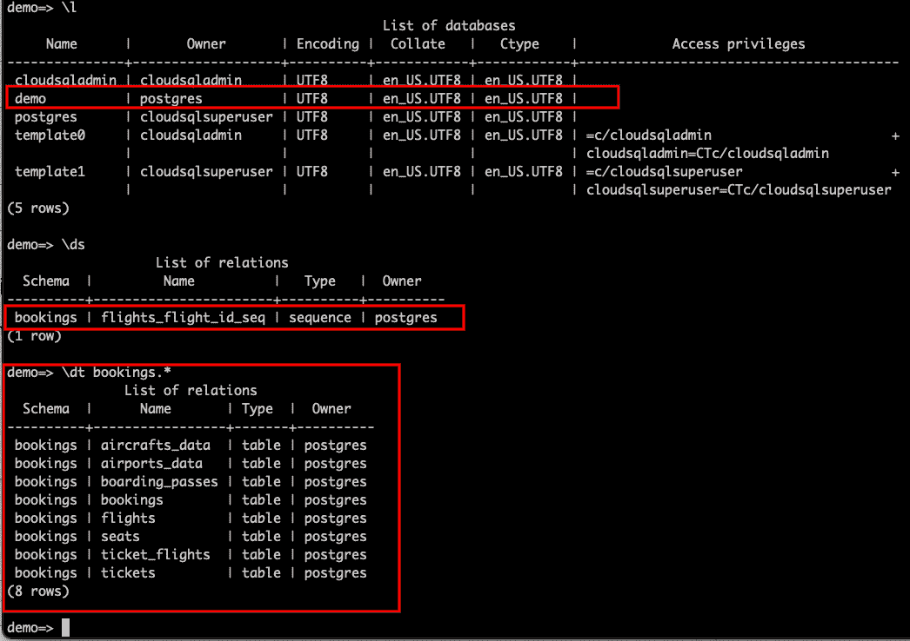

计算创建的每个表的行数。

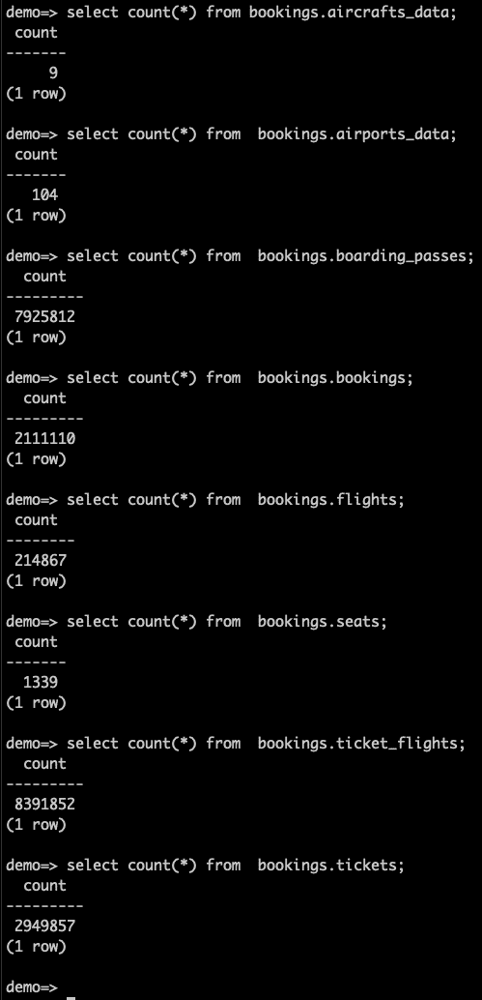

**2–3 在源数据库上配置 DMS 先决条件**

返回到云 SQL 控制台页面，选择源数据库“pg-db-1 ”,然后选择编辑以更改强制标志，这将为实例启用逻辑复制和解码。

打开*逻辑解码*和*使能逻辑*，如下图编辑页面截图所示。

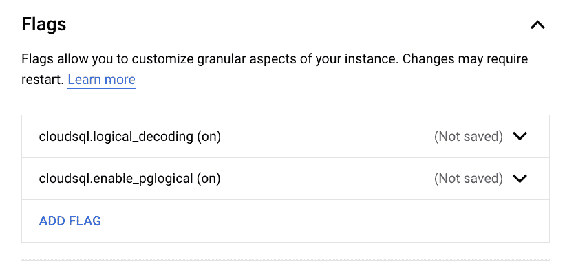

在所有数据库上启用 *pglogical* 扩展，以确保不会留下任何要复制的内容，在 demo 和 postgres 数据库上启用。

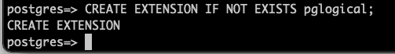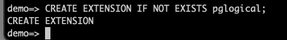

确保以下参数至少设置为这些默认值，否则根据 DMS [文档](https://cloud.google.com/database-migration/docs/postgres/configure-source-database#cloud-sql-postgresql)检查适当的值。

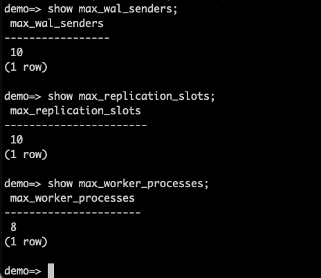

将复制角色授予 DMS 任务中的连接用户 POSTGRES。请查看上述 DMS 文档页面，了解更多配置。

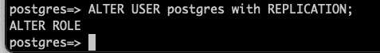

让我们回顾一下用户权限:

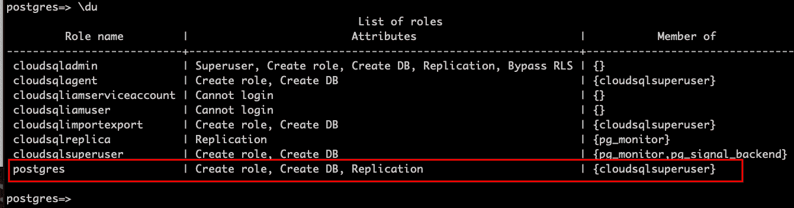

**重新启动数据库实例。**

DMS 不支持某些功能，如没有主键的表。您必须使用[文档](https://cloud.google.com/architecture/postgresql-migration-with-database-migration-service#migrating-tables-without-pk)中规定的代理键来减轻这种情况。查看此处列出的[中是否有任何更复杂的问题，请在继续之前解决。](https://cloud.google.com/architecture/postgresql-migration-with-database-migration-service#prep-the-db-migration)

**3 —创建 DMS 复制任务并启动复制**

在本节中，我们将创建 DMS 实例来启动复制:

**3.1 —创建 DMS 连接配置文件**

为了创建 DMS 复制任务，必须具有源数据库配置。进入 [DMS 云控制台](https://console.cloud.google.com/dbmigration/migration)页面，在左侧面板选择“连接配置文件”。选择顶部的**创建配置文件**，然后从下拉列表中选择“云 SQL for PostgreSQL ”,因为我们的源数据库是我们在上一节中创建的:

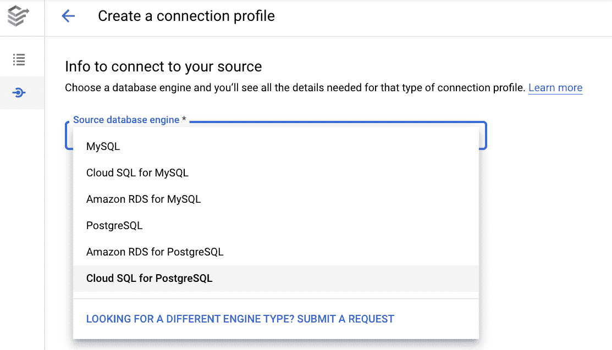

接下来，提供与源数据库相关的所有配置。在我们的例子中，它显示在下面的屏幕截图中，并选择创建一个源数据库连接配置文件，它可以在一个或多个 DMS 迁移任务中使用。

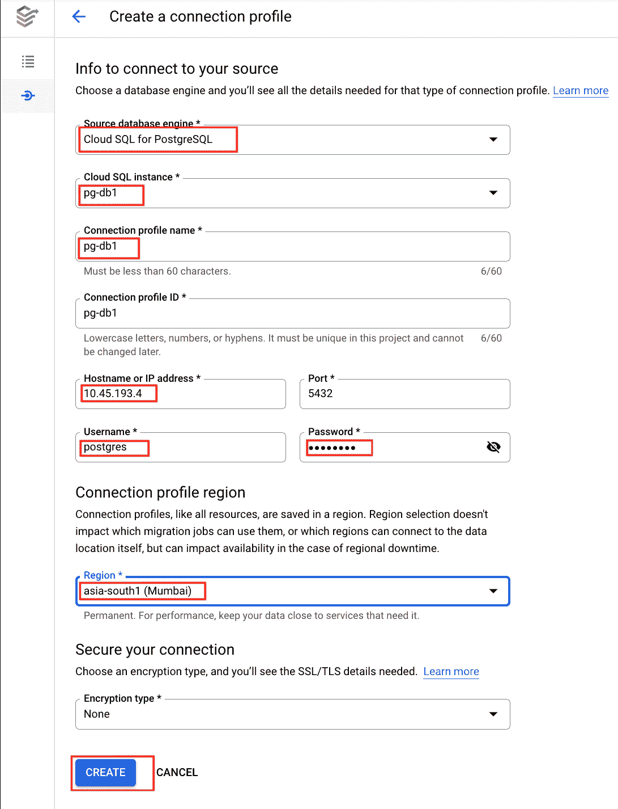

**3.2 —创建 DMS 作业并启动复制**

在本节中，我们将使用源数据库连接配置文件创建一个 DMS 复制作业，并启动数据库复制。此步骤非常全面，因为它验证了建立复制所需的数据库和网络配置。

转到 DMS 控制台页面，从左侧面板中选择“迁移作业”,然后单击“创建迁移作业”

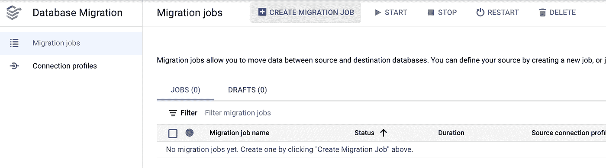

在“入门”步骤中—指定唯一的作业名称，并选择在上一节中创建的源数据库配置文件。确保您选择了正确的地区，因为在我们的案例中，该地区是“Mumbai”和“Continuous”作为迁移工作类型。这将启用源数据库和目标数据库之间的**变更数据捕获**，直到作业被标记为完成。连续(有时也称为持续或在线)迁移是从源到目标的连续变更流，从最初的完全转储和加载开始。底部是一个先决条件，这是一个由“开放”链接组成的自愿部分。此链接指导您检查配置复制的所有先决条件。一旦满足了源数据库和连接的所有要求，就可以前进到下一步。

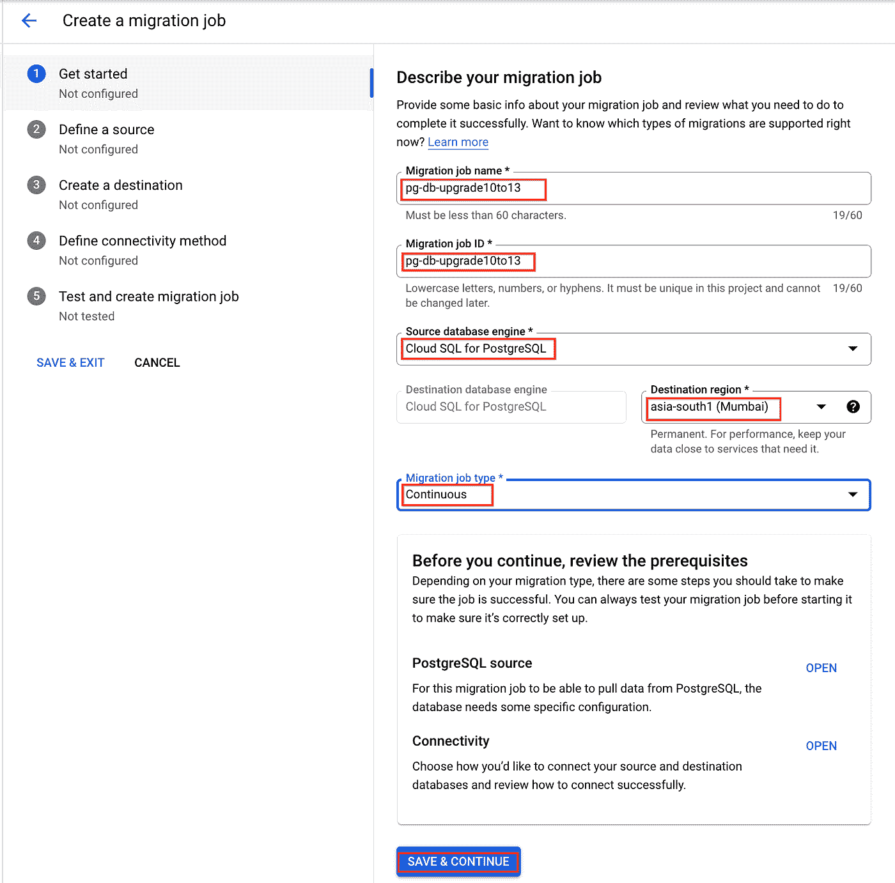

在下一步“定义源”中，选择在上一节中创建的连接配置文件，并前进到“创建目的地”。

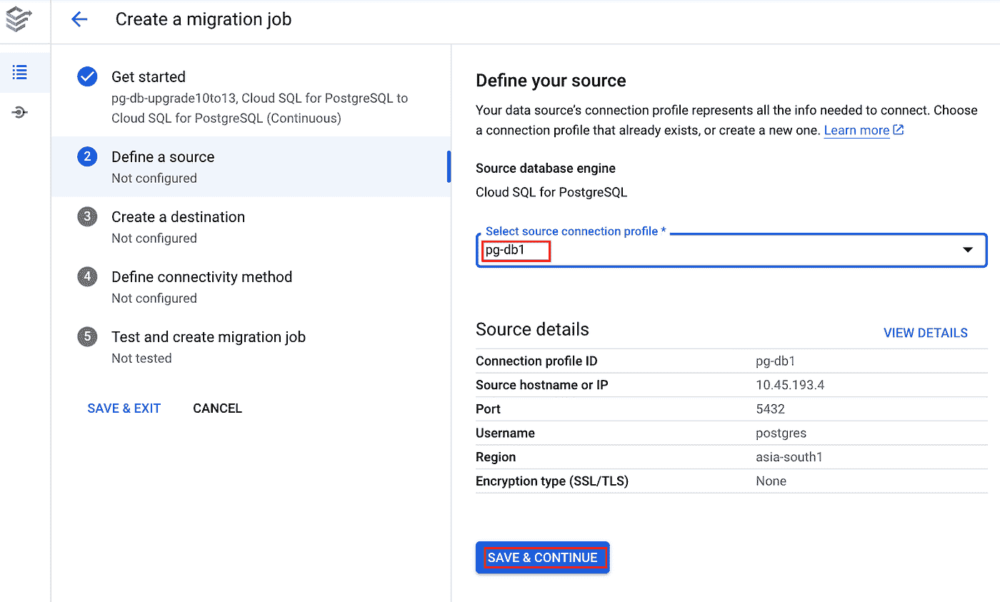

在“创建目标”步骤中，请确保指定要升级的目标 PG 版本以及其他配置，如凭据和实例名。一旦您继续前进，DMS 将尝试创建数据库实例。

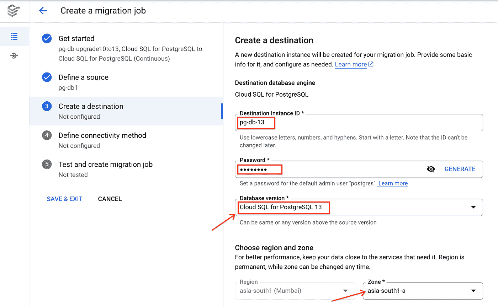

您可以在云 SQL 控制台页面上检查新数据库实例的创建进度:

在 DMS 作业控制台页面和“定义连接方法”步骤中，指定连接方法，如下图所示，因为我们在数据库和应用程序主机之间使用专用 IP。

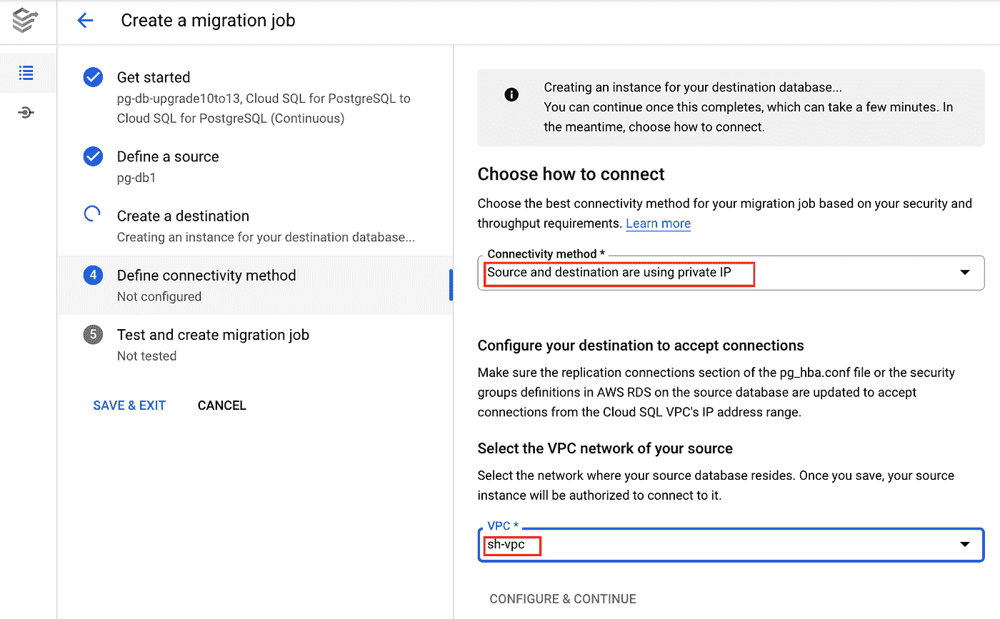

创建新的/目标数据库实例后，您可以继续下一步，通过“测试迁移”步骤验证所有配置。

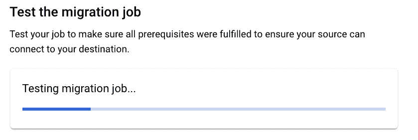

如果上述步骤不成功，则完成 DMS [文档](https://cloud.google.com/database-migration/docs/postgres/configure-source-database#cloud-sql-postgresql)中规定的先决条件配置。

最后，使用“创建和启动作业”来立即启动迁移，因为在我们的情况下，此时我们没有任何理由等待，但是在您的情况下，如果您有任何理由等待，那么可以随意使用“创建作业”,您可以稍后在准备就绪时启动 DMS 作业。

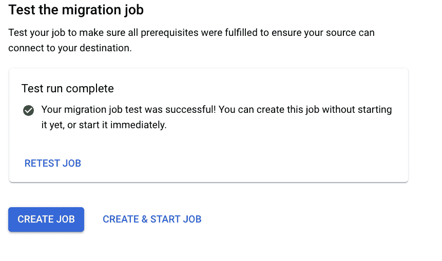

DMS 作业启动后，对其进行监控，直到其状态从“正在启动”经过“正在进行完全转储”变为“正在进行 CDC”。

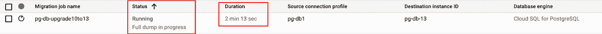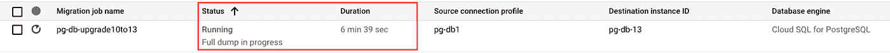

持续监视 DMS 和 DB operations 选项卡，查看是否存在任何瓶颈。

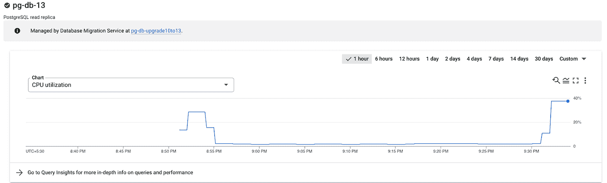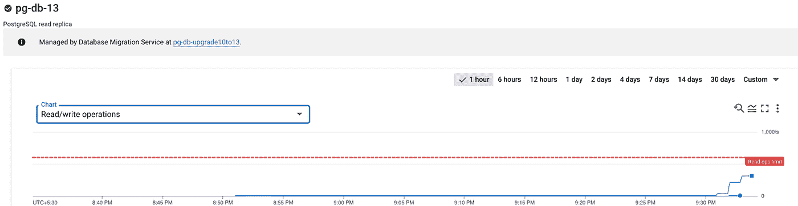

**一旦迁移作业状态达到“CDC 进行中”，您就可以验证复制并切换到目标数据库，但是，只要您愿意，您可以继续在 CDC 状态下运行，只要您还没有准备好切换数据库。**让我们验证是否所有行都从源复制到了目标。

**3.3 验证 DMS 复制**

找出目标数据库私有 IP，使用 psql 连接，并更改提示名称以简化验证。

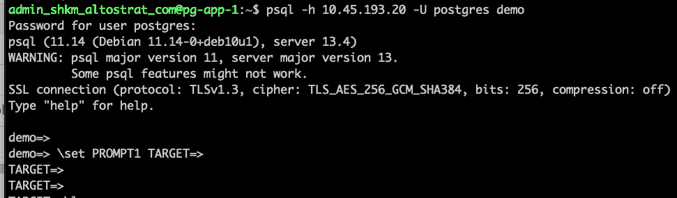

验证数据库和模式创建

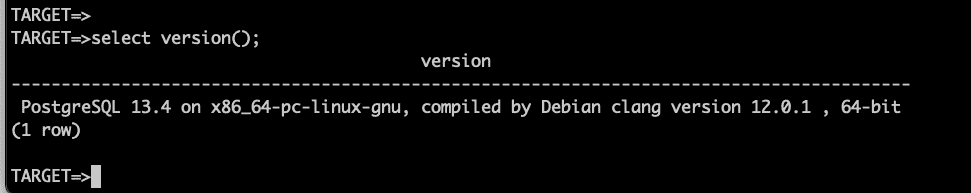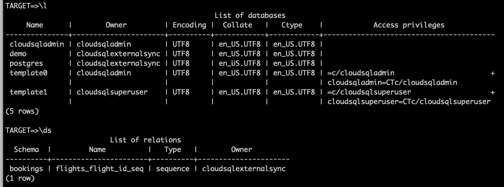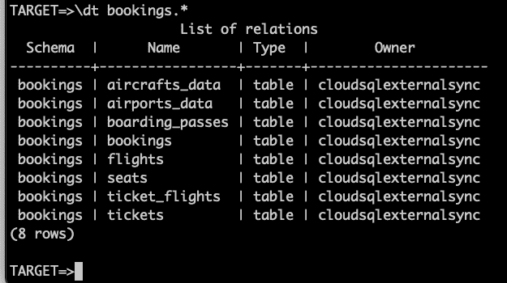

接下来，获取目标中的行数。

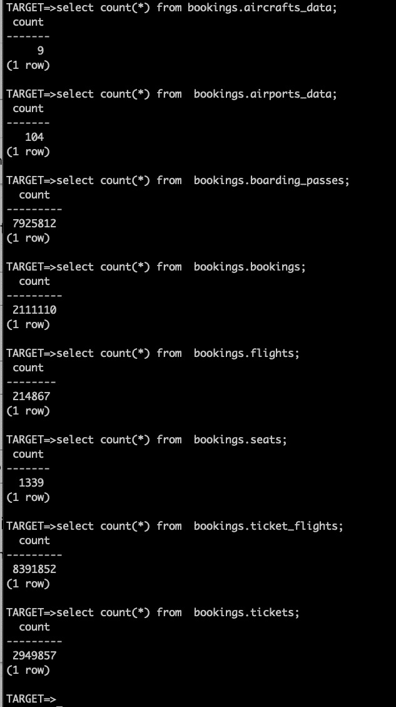

连接到源数据库并更改提示名称以简化验证:

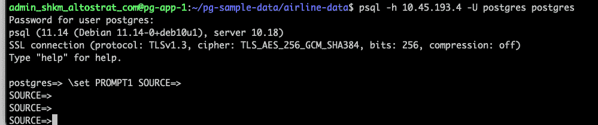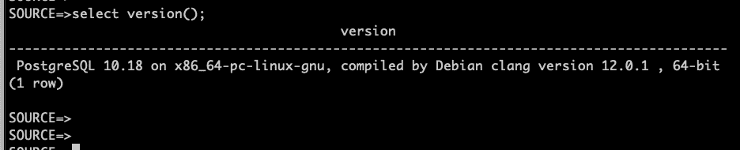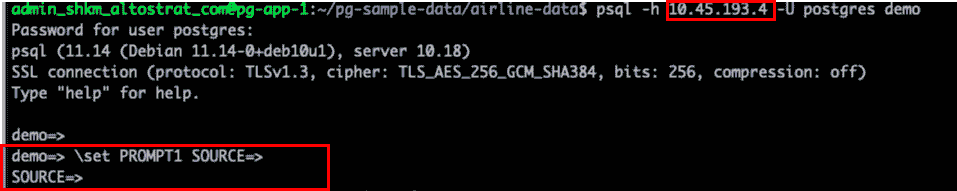

获取并验证源数据库和目标数据库中的行数。一切都好！！

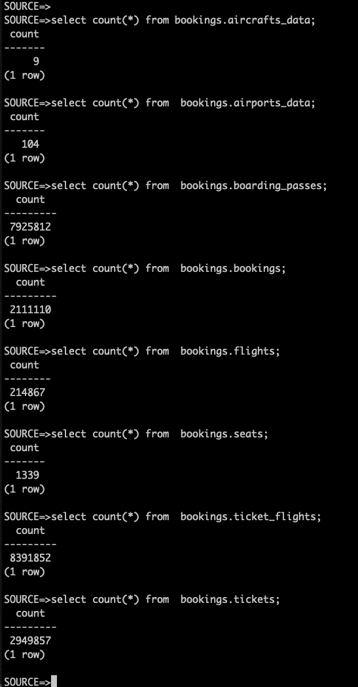

让我们通过在一个源表中插入一行来验证 CDC(变更数据捕获),并再次将行数与目标表进行匹配。

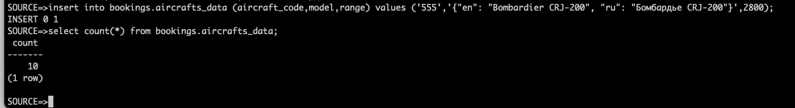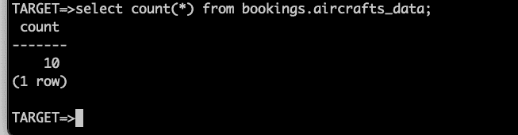

我们可以看到，在插入一行后，总行数保持预期，因此 CDC 工作正常，我们可以切换到目标数据库。

**3.4 切换到目标数据库并测量应用程序层的停机时间。**

让我们在执行切换时测量应用程序层的停机时间。注意停机开始时间如下:

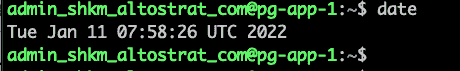

在开始之前，请检查不应该有任何 CDC 延迟，这可以作为我们 DMS 作业的操作指标之一进行检查。

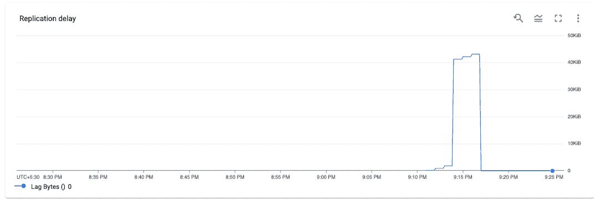

当我们使用云 SQL 代理模拟应用程序层时，我们将关闭它，以便不再有从应用程序到数据库的连接，如下所示。由于它作为后台进程运行，我们将终止仍在连接旧/源数据库的云 SQL 代理

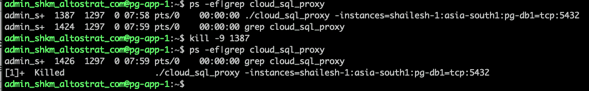

接下来，我们将停止复制，并将目标数据库提升为独立数据库，脱离 DMS 复制。转到 DMS 控制台页面，使用 PROMOTE 选项正常停止 CDC 并升级目标数据库。DMS 的状态将发生如下变化

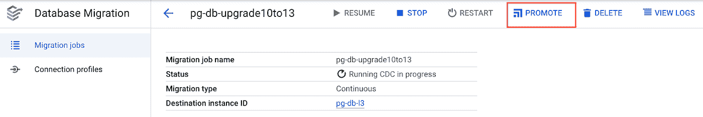

等到低于“已完成…”的状态。

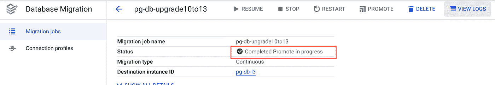

如果您检查云 SQL 控制台页面，您将看到目标数据库是独立的。

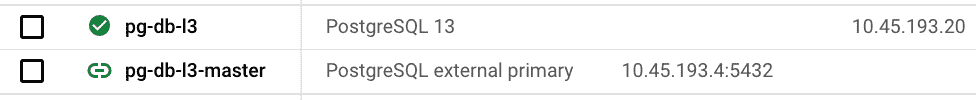

现在打开云 SQL 代理，开始接收到目标数据库的连接。为此，在“从云 SQL 控制台检查目标数据库的连接名称”页面上，单击“pg-db-13 ”,在“概述”选项卡上，记下连接名称:

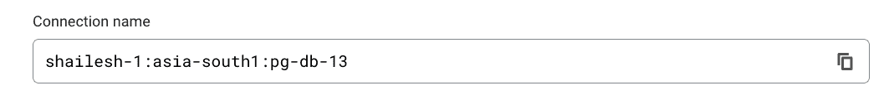

使用相同的连接启动云 SQL 代理，如下图所示。

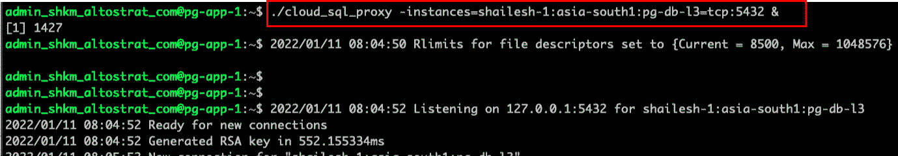

使用云 SQL 代理，连接到目标数据库并验证新的升级版本和表数据集。

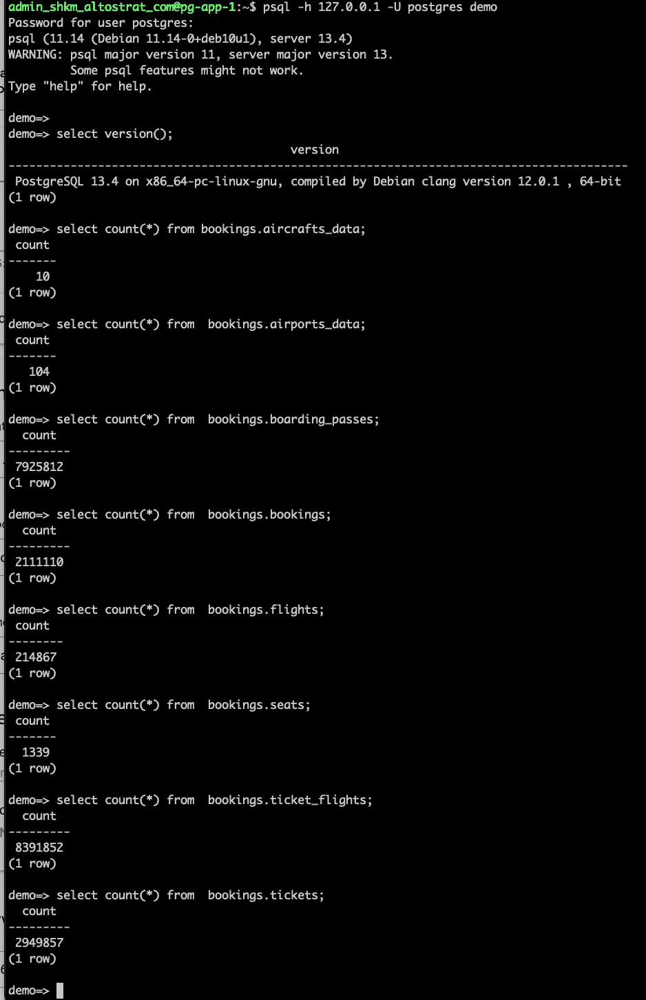

接下来，您可以宣布停机时间结束，我们将再次记录时间。这表明停机时间不到 10 分钟。

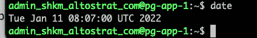

以下是开始时间

您仍然可以通过自动化步骤而不是手动操作来进一步减少停机时间，因为在操作日志中观察到目标数据库升级不到 1 分钟。

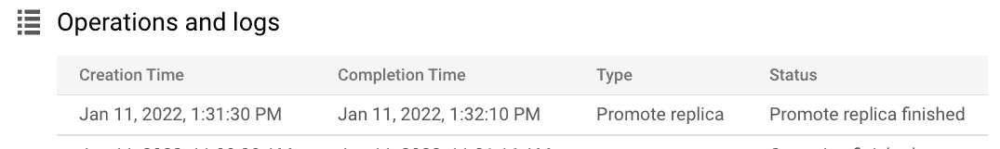

确保旧的不可用，最好是锁定用户并关闭它。

**成本考虑**

数据库迁移服务在 [**提供，无需额外费用**](https://cloud.google.com/database-migration/pricing) 用于向云 SQL 的本地迁移。只要您承担现有数据库的成本，就不会产生任何成本，除非您计划将数据库移出当前地区、区域或 VPC 子网，否则可能不会产生任何费用。从外部源数据库进入网络不收取额外费用。然而，谷歌之外也会产生费用，如平台出口费。

**最佳实践、常见陷阱和其他参考:**

请回顾 DMS 的[限制](https://cloud.google.com/database-migration/docs/postgres/migration-src-and-dest)并找出更多的复杂性。然而，存在如下几个已知问题:

1.  查看并匹配您的源数据库配置，了解如何为 DMS 复制准备源数据库[此处为](https://cloud.google.com/blog/topics/developers-practitioners/preparing-postgresql-migration-database-migration-service)。
2.  源和目的地之间的 DDL 变化需要特别注意，请参考此处的。
3.  如果源数据库有一个复杂的场景，如没有主键的表、实体化视图、大型对象，那么请参考此处的。
4.  创建 DMS 作业时，确保目标实例必须具备所有必需的配置，如存储、CPU 和网络配置。
5.  由于这篇博文的网络范围仅限于私有网络，所以请继续参考[这篇](https://cloud.google.com/blog/topics/developers-practitioners/database-migration-service-connectivity-technical-introspective)关于 DMS 配置的复杂网络场景。
6.  由于这篇博文是同构数据库迁移的超集用例，请回顾它的[最佳实践](https://cloud.google.com/blog/products/databases/tips-for-migrating-across-compatible-database-engines)。

**行动号召**

这是复制有助于减少数据库升级停机时间的另一个使用案例。在这篇博文中，我们观察到使用 DMS 时停机时间减少到不到 10 分钟，而且**仍有通过协调和自动化所有可能的步骤来减少停机时间**的潜力。我鼓励你尝试这种策略，因为 **DMS 可以免费使用**，如果适用，你只需承担数据库和数据输入或输出费用。

特别感谢我的队友 sour abh Gupta[评论了这篇博客。](https://www.linkedin.com/in/saurabh-gupta-b1309926/)

喜欢听到你的反馈，干杯！！