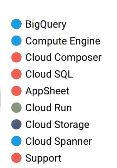

# 减少您的谷歌云支出

> 原文：<https://medium.com/google-cloud/reduce-your-google-cloud-spend-16dc96a96c54?source=collection_archive---------1----------------------->

试图减少你的花费似乎很容易，从以下几点开始:

*   **当你不使用你的资源时，关闭它**
*   **删除**您未使用的资源
*   控制**谁能启用**新资源

> 但是有时候还不够！

# 通过查看您的账单导出，尝试检查哪些是最常用的服务:

这个列表中有两个非常有趣的服务:

*   云运行
*   云 SQL

# 我们能为这两位做些什么呢？

*云运行的承诺使用折扣(CUDs)* 是一种 **17%** 的折扣定价，交换条件是在特定地区至少一年(最长 3 年)的持续使用。

*   您承诺的是每小时的美元等值按需支出。
*   作为交换，您将获得承诺所涵盖的适用用途的折扣率。
*   它只计算一个特定的谷歌位置
*   任何超额部分都按按需费率收费。
*   如果价格发生变化，您仍然可以获得相同的折扣百分比。
*   承诺费按月计费。
*   它会自动更新。

**现在查看我的云运行日常使用情况:**

我可以看到使用云的特定项目在同一个谷歌云位置运行。

我选择了一个每天至少消费**500＄**的例子，这是我的安全额度(我可以在没有任何风险的情况下承诺的最低额度)。

请记住，提交的单位是**美元/小时**，因此 500 美元意味着 **20 美元/小时**

我可以在没有任何消费不足风险的情况下投入这笔钱(当然要记住，在接下来的 12 个月里，我的消费至少会保持不变)

24 小时后，我可以在云控制台的 CUD 分析中看到结果:

[https://cloud . Google . com/billing/docs/how-to/cud-analysis-resource-based](https://cloud.google.com/billing/docs/how-to/cud-analysis-resource-based)

*   **灰色**代表我在 X 地区的所有项目的全部云运行消耗
*   **绿色**代表我已购买的承诺云运行消费。

也请考虑查看推荐页面，在那里您可以找到一些来自 Google 的关于您下次购买折扣的信息:

[https://cloud.google.com/docs/cuds-recommender](https://cloud.google.com/docs/cuds-recommender)

## 现在检查一下**云 SQL** ，它带来了更多折扣的相同体验！

回到 CUD 购买页面，您可以看到，对于云 SQL，采用的是相同的反映。

但是这次 1 年承诺给你 25%的折扣，3 年承诺给你 52%的折扣，太棒了！！！

## 去省钱吧，别忘了:

***“这些月费不可取消，无论实际使用情况如何都适用”***