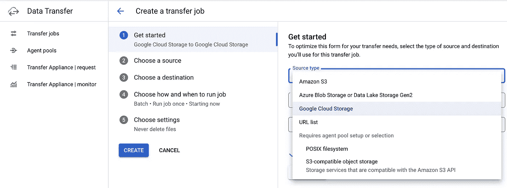
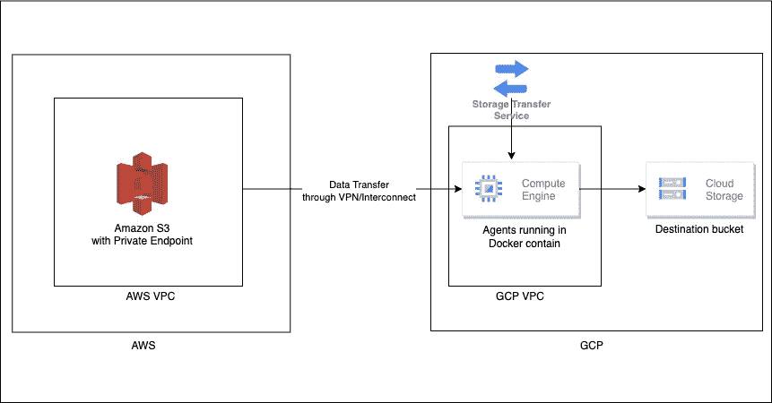
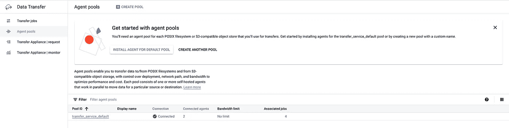
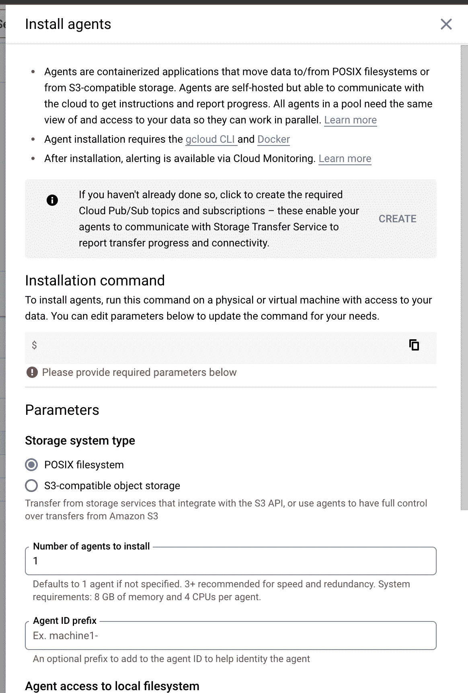
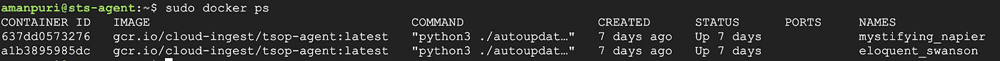
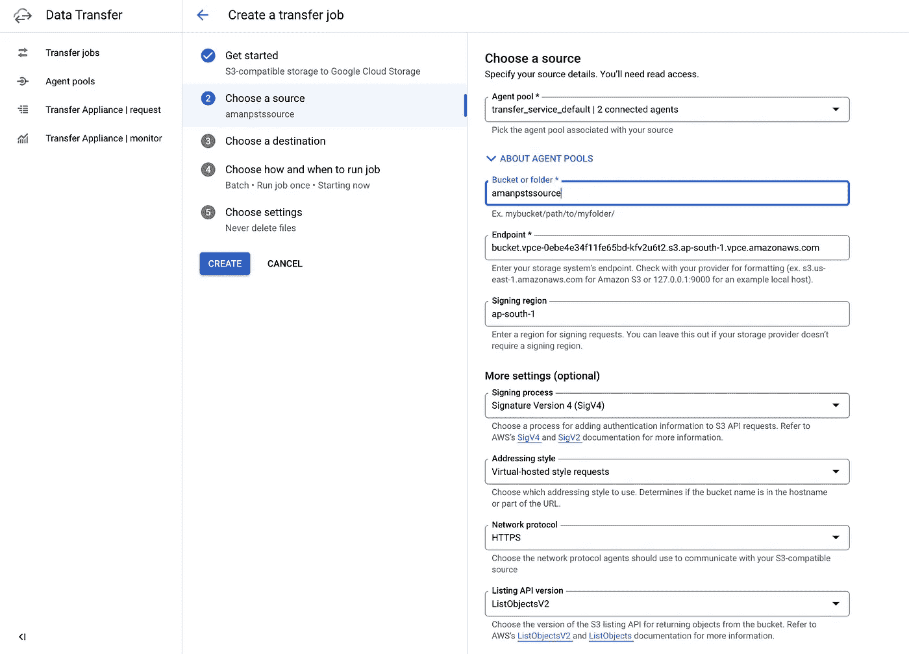
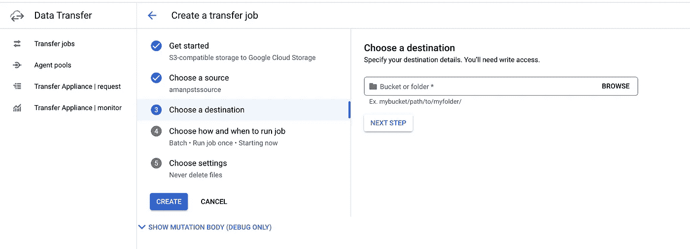
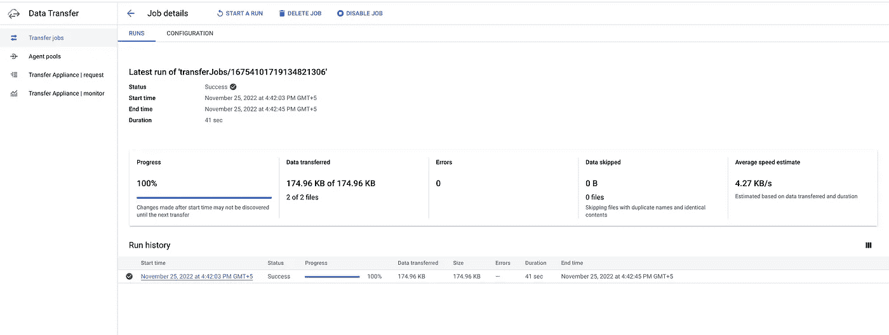

# 通过从亚马逊 S3 到云存储(S3 到 GCS)的存储转移服务降低成本

> 原文：<https://medium.com/google-cloud/reducing-costs-with-storage-transfer-service-from-amazon-s3-to-cloud-storage-s3-to-gcs-7b5759468f5d?source=collection_archive---------1----------------------->

A 云的一个非常重要的方面本质上是迁移。它不仅是关于迁移什么数据，而且是关于如何迁移的。随之而来的主要挑战是数据如何从 AWS 这样的云数据中心发出，以及由此产生的成本。考虑到这一点，我们将深入探讨如何将对象从亚马逊 S3 这样的来源迁移到谷歌云的云存储解决方案。

**什么是存储转移服务？**

存储传输服务有助于跨 Google Cloud、Amazon、Azure、on-premises 等在对象和文件存储之间快速安全地传输数据。

**存储转移服务有什么新内容？**

新增的最新源选项之一称为 S3 兼容对象存储。这用于任何类似于亚马逊 S3 API 的对象存储源。这里，除了提到亚马逊 S3 存储桶的名称，还需要提供存储桶所在的端点。这将使我们能够使用 S3 接口端点，使我们能够以私人方式访问 S3，前提是我们在 AWS 和 GCP 网络之间有 VPN/互连连接。作为一个来源，你需要设置代理池，作为容器运行，可以在谷歌计算引擎上安装 Docker 或云运行或 GKE。建议将代理部署在离源更近的地方，这样即使在 Amazon EC2 上部署代理也可以。



创建传输作业时，GCP 门户将 S3 兼容对象存储显示为源类型

**我们有亚马逊 S3 作为来源，为什么还需要这个？**

目前，基于亚马逊 S3 源的传输使用互联网将数据传输到 GCP 存储。对此有两点需要注意:

1.  虽然吞吐量很大，并且数据传输是加密传输，但基于互联网的传输总会引起一些问题。此选项不能帮助我们通过 VPC/互连通道进行隧道传输。
2.  数据传输期间 AWS 的出口成本也是大量对象迁移期间的一个主要影响因素。成本对 AWS 有巨大的影响，需要一个解决方案来降低成本。互连设置有助于为 AWS 出口费用提供折扣，具体取决于所选择的供应商，前提是数据通过互连从 AWS 输出到 GCP。

考虑到上述场景和用例，我们可以利用 S3 兼容的对象源。

**它是如何工作的？**

存储传输服务使用部署在靠近数据源的虚拟机上的传输代理来访问 S3 兼容源中的数据。这些代理运行在 Docker 容器中，属于一个代理池，代理池是使用相同配置的代理的集合，它们共同并行移动您的数据。

因此，您可以在 AWS 中为亚马逊 S3 创建一个接口端点，这是一个到 S3 的私有链接，并将数据从 S3 存储桶迁移到 GCS。这样做需要使用 VPN 隧道或互连隧道在 AWS 和 GCP 之间建立互连。S3 存储桶将通过私人通道将数据传输到位于 GCP 的代理，然后数据存储在 GCS 存储桶中。或者，我们可以在 VPC 启用私有 Google 访问，以确保从代理虚拟机到云存储的数据也通过私有连接运行。



使用存储传输服务传输数据的流程，使用亚马逊 S3 与 S3 兼容的对象源

**设置环境和启动数据传输所需的步骤**

**先决条件如下**:

1.  确保使用 VPN 或互连在 AWS 和 GCP 环境之间建立连接。
2.  启用[存储转移 API](https://cloud.google.com/storage-transfer/docs/reference/rest) 。
3.  拥有一个具有存储转移管理员角色的 GCP 用户帐户/服务帐户。如果您使用的是 GCP 服务帐户，您需要[将服务帐户密钥导出到一个 JSON 文件中。](https://cloud.google.com/iam/docs/creating-managing-service-account-keys)您必须将此服务帐户密钥文件存储在将要安装代理的计算引擎实例中。
4.  准备好 AWS 访问密钥 ID 和秘密访问密钥。它至少应该拥有对 S3 存储桶的读取权限。
5.  在使用 VPN/Interconnect 与 AWS 环境连接的同一个 GCP VPC 中设置计算引擎，并运行以下命令(确保计算引擎中安装了 gcloud)

```
curl -fsSL https://get.docker.com -o get-docker.sh
sudo sh get-docker.sh
sudo systemctl enable docker
sudo docker run -ti --name gcloud-config google/cloud-sdk gcloud auth application-default login
```

上述命令将在计算引擎中安装 docker，并允许您使用 GCP 凭证对 Docker 进行身份验证。

5.在 AWS 中为亚马逊 S3 创建一个接口端点。这将为我们提供一个类似 vpce-xxxx-xxxx . S3 . * AWS-region * . vpce . Amazon AWS . com 的端点。您可以使用这个[链接](https://docs.aws.amazon.com/vpc/latest/privatelink/create-interface-endpoint.html#create-interface-endpoint-aws)来创建一个 VPC 端点。请注意，我们需要一个 S3 服务的端点，我们需要一个接口端点，而不是连接到 AWS VPC 的网关端点，该端点通过 GCP 隧道连接。

6.测试端点是否可以通过端口 443 上的 GCP 访问。您可以按如下方式使用 telnet:

```
telnet *bucketname*.bucket.vpce-xxxx-xxxx.s3.*region-name*.vpce.amazonaws.com 443
```

您应该会立即得到类似以下内容的响应:

```
Trying 172.31.35.33...
Connected to *bucketname*.bucket.vpce-xxxx-xxxx.s3.*region-name*.vpce.amazonaws.com.
Escape character is '^]'.
```

这验证了建立的隧道工作正常，您可以使用专用链路从 GCP 访问 S3 存储桶。如果您没有收到此输出，请检查并验证隧道连接是否正常工作。

**注意**:注意端点在 bucket 名称之后和端点 url 之前有一个单词 bucket。这将在创建传输作业期间输入端点时嵌入。因此，端点将看起来像**bucket . vpce-xxxx-xxxx . S3 . * region-name * . vpce . Amazon AWS . com .**

**安装传输代理**

1.  在 GCP 控制台中，导航到数据传输>代理池。选择在默认池中安装代理，或者您可以创建另一个代理池。创建另一个池有助于我们设置自定义详细信息，并在需要传输时设置带宽限制。但是，我建议使用默认，因为它们有助于在步骤 2 中创建发布/订阅主题以进行交流



用于创建代理池的数据传输页面

2.选择池后，点击**安装代理**。您将在右侧看到一个弹出窗口。在提到创建云发布/订阅主题和订阅的部分，单击**创建**按钮，这有助于存储转移服务提供有关作业创建/进度/更新的更新。**注意**:此选项目前仅在您选择 transfer_service_default 池时可见，但如果您稍后创建新池，它会有所帮助，并且这是一项一次性任务。



创建按钮，为传输作业创建发布/订阅主题和订阅

3.您还会看到下面的参数选项。将**存储类型**设置为 **S3 兼容对象存储**。**要安装的代理数量**提供将在代理虚拟机中运行的 docker 容器的数量。请注意，容器的数量越多，CPU 的利用率就越高。**代理 ID 前缀**是为容器名设置一个前缀。您还会看到一个用于输入 AWS 凭证的**访问密钥 ID** 和**秘密访问密钥**的参数。扩展高级设置，您可以选择**默认 GCP 凭证**或使用**服务帐户文件**并提及服务帐户密钥文件的绝对路径。所有这些选项都会生成一组命令，如下例所示:

```
export AWS_ACCESS_KEY_ID=XXX 
export AWS_SECRET_ACCESS_KEY=XXX 
gcloud transfer agents install --pool=transfer_service_default --id-prefix=demo- --creds-file="/home/user/sa.json" --s3-compatible-mode
```

**注意**:我在 AWS 环境变量之前添加了 export，因为不添加 export 关键字就不允许代理使用 AWS 凭证。由于此功能是正式发布前的功能，因此某些用户可能会遇到此问题。

4.在安装了 docker 的虚拟机中运行上述命令。这将运行容器和容器内的代理。您可以使用以下命令检查容器:

```
sudo docker ps
```



这样，您的环境就可以开始从亚马逊 S3 传输数据了。

**创建传送作业**

1.  在数据传输中，创建一个传输作业，选择**源类型**作为 **S3 兼容对象存储**，并点击下一步。


2.在**中选择一个源**，选择安装代理的**代理池**，在**桶或文件夹**中键入 S3 桶的名称。在**端点中，**端点的格式应为**bucket . vpce-xxxx-xxxx . S3 . * region-name * . vpce . Amazon AWS . com**。在**签名区域中，**输入铲斗所在的 AWS 区域，然后转到**下一步**。



3.在**选择目的地**中，选择您的目的地存储桶和文件夹路径。



4.在接下来的步骤中，您可以选择是立即运行该作业还是按计划运行。或者，您可以检查与正常传输作业类似的设置，如覆盖对象或删除源对象等..一旦你有了你想要的设置，点击**创建**开始传输。

5.您可以单击作业并检查传输的状态。您会注意到，对象将被发现并进行校验和检查，数据传输将根据源存储桶中对象的大小进行。



当前有什么限制吗？

1.  传输速度将取决于池的最大带宽设置、计算引擎的大小、它支持的最大网络吞吐量以及 VPN/互连隧道的最大带宽容量
2.  虽然如果互连设置提供 AWS 出口折扣，AWS 的出口成本会变得更低，但代价是代理虚拟机的运行成本。然而，该成本没有出口成本高。
3.  对象读取可能会限制传输的速度。这里的建议是在进行大量数据传输时，在多个作业中包含多个前缀(或文件夹路径)。

**结论**

使用 S3 兼容的对象存储作为亚马逊 S3 存储桶的源选项，我们现在可以通过 VPN/互连进行隧道传输，并将对象大容量传输或迁移到云存储。使用互联将有助于节省大量 AWS 出口成本，并使传输更加安全。

感谢阅读！😊

**参考文献:**

你可以在官方文档中读到 S3 兼容的对象源

[](https://cloud.google.com/storage-transfer/docs/s3-compatible) [## 从 S3 兼容来源传输|云存储传输服务文档|谷歌云

### 预览此产品包含在 Google Cloud 服务条款的正式发布前产品条款中。正式上市前的产品…

cloud.google.com](https://cloud.google.com/storage-transfer/docs/s3-compatible) 

存储转移服务发行说明

[](https://cloud.google.com/storage-transfer/docs/release-notes#September_07_2022) [## 存储转移服务发行说明|云存储转移服务文档| Google…

### 针对源自文件系统的传输的多部分上传现已普遍提供(GA ),并且默认启用…

cloud.google.com](https://cloud.google.com/storage-transfer/docs/release-notes#September_07_2022) 

亚马逊 S3 的 AWS 专用链接:

[](https://docs.aws.amazon.com/AmazonS3/latest/userguide/privatelink-interface-endpoints.html) [## 亚马逊 S3 的 AWS PrivateLink

### 借助 AWS PrivateLink for Amazon S3，您可以在虚拟环境中提供接口 VPC 端点(接口端点)

docs.aws.amazon.com](https://docs.aws.amazon.com/AmazonS3/latest/userguide/privatelink-interface-endpoints.html) 

如何在 AWS 和 GCP 之间设置 VPN

[](https://cloud.google.com/architecture/build-ha-vpn-connections-google-cloud-aws) [## 在 Google 云和 AWS |云架构中心之间建立高可用性 VPN 连接

### 发送反馈本教程演示了如何在谷歌云和亚马逊之间创建高度可用的 VPN 连接…

cloud.google.com](https://cloud.google.com/architecture/build-ha-vpn-connections-google-cloud-aws)