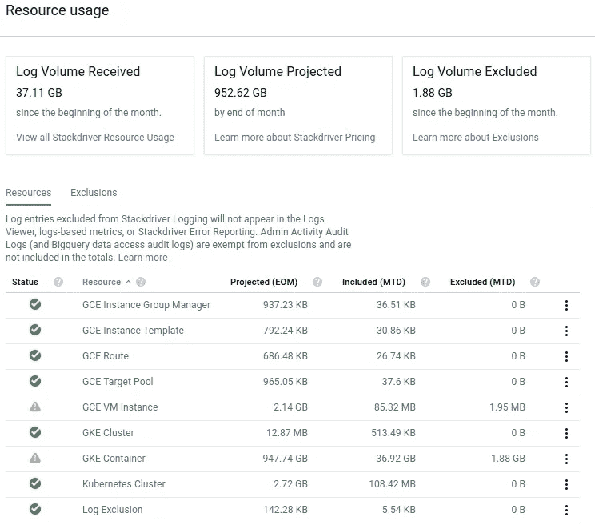
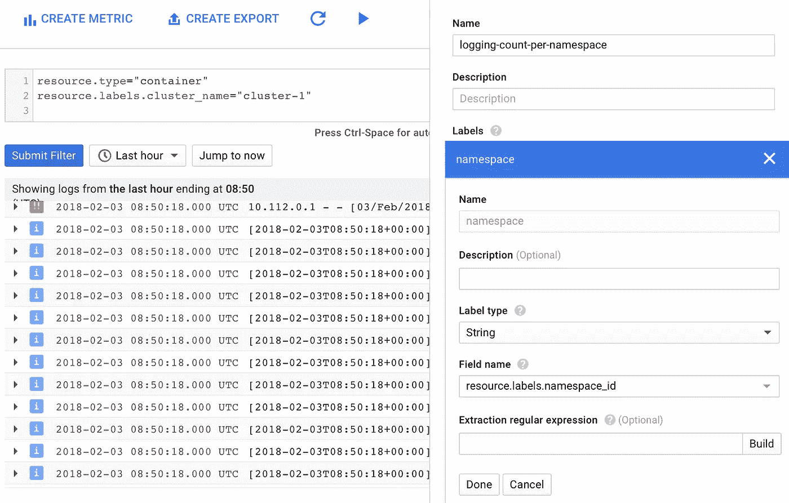
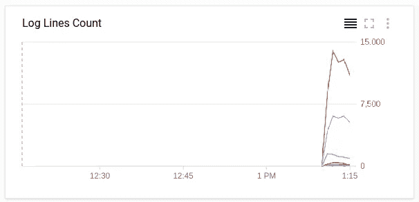
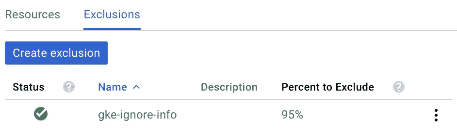
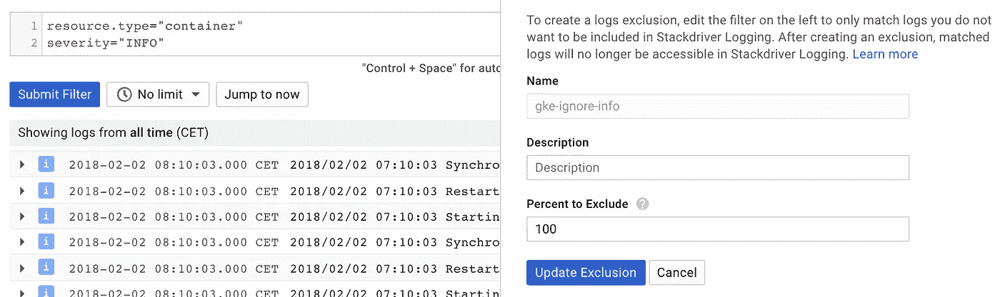
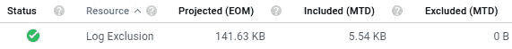
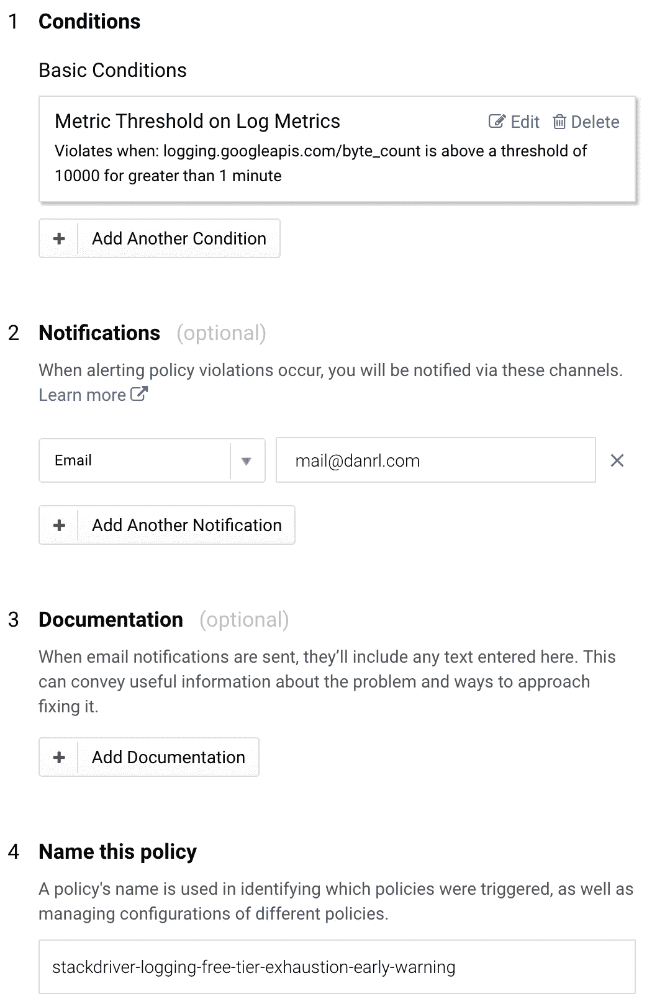
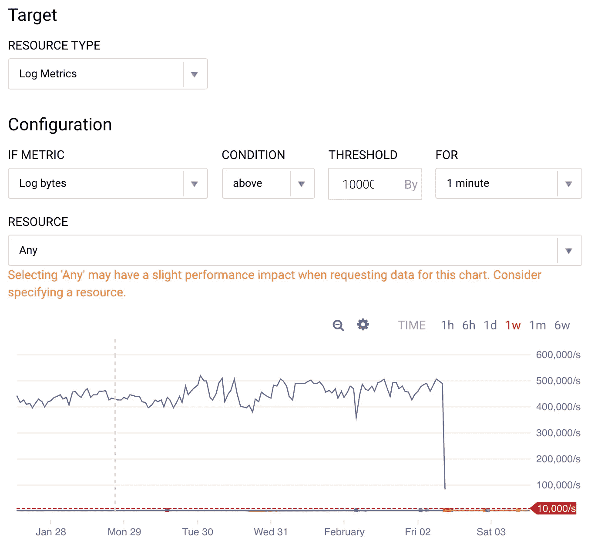
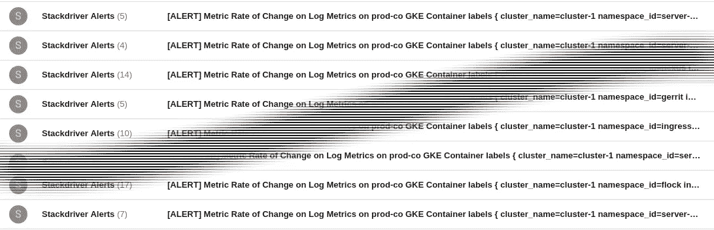

# 减少 Stackdriver 的日志资源使用

> 原文：<https://medium.com/google-cloud/reducing-stackdrivers-logging-resource-usage-641dfe9362d9?source=collection_archive---------0----------------------->

昨天，我收到了一封来自 Google 的令人担忧的邮件，通知我关于 Stackdriver 日志记录的新定价模型，并且我已经超过了免费层的限制。Stackdriver 定价模型有一个粗略的开始，包括一些调整和延期。截至今日，预计 2018 年 3 月 31 日开始充电。这意味着，如果我想保持在自由层限制内，我每月不应超过 50GB 的日志摄入量。对于我的小型集群来说，这已经很多了，为什么还要用更多呢？

# 第一眼

我决定去看看情况到底有多糟糕。



哇哦。😱这个月的第二天早上，我已经有 37GB 了？还好充电还没开始。面对现实，我继续深入研究日志的来源。因为我有很大一部分日志数据，所以我很有可能在日志中找到一些东西，对吗？😉资源表清楚地告诉我要找到容易摘到的果实。资源 *GKE 集装箱*的月初至今(MTD)和预计月末(EOM)数字在数量级上领先于所有其他数字。

# 原因 1:谷歌 Kubernetes 引擎 Bug

通过检查外观，我发现同步器有一个错误。几天来，它每秒钟发射多次:

```
09:18:54 Restarting synchronizer: kubernetes-dashboard-key-holder-kube-system.
09:18:54 Synchronizer kubernetes-dashboard-key-holder-kube-system exited with error: kubernetes-dashboard-key-holder-kube-system watch ended with timeout 
09:18:54 Restarting synchronizer: kubernetes-dashboard-key-holder-kube-system. 
09:18:54 Synchronizer kubernetes-dashboard-key-holder-kube-system exited with error: kubernetes-dashboard-key-holder-kube-system watch ended with timeout 
09:18:54 Restarting synchronizer: kubernetes-dashboard-key-holder-kube-system. 
09:18:54 Synchronizer kubernetes-dashboard-key-holder-kube-system exited with error: kubernetes-dashboard-key-holder-kube-system watch ended with timeout
```

这确实产生了相当多的日志量供 Stackdriver 接收，并增加了总账单。这是我发现自己喃喃自语 [*指数后退*](https://en.wikipedia.org/wiki/Exponential_backoff)……

为了停止来自破损仪表板的日志行的洪流，我重新启动了 kubernetes 仪表板窗格。当然，困难的是:

```
$ kubectl -n kube-system delete pod kubernetes-dashboard-768854d6dc-j26qx
```

# 原因 2:冗长的服务

**注意:**这一小节的数据来自一个不同的集群，该集群没有遇到前面提到的错误，但是由于不同的原因有大量的日志记录。

在另一个集群中，我也经历了大量的日志摄入。然而，没有垃圾日志，这意味着这个集群中充满了规则的日志行。为了找出是否有比其他服务产生更多日志行的服务，我创建了一个基于日志的度量。



这个度量基本上只是一个日志行的计数器，按照资源标签`namespace_id`分组。有了这个指标，我转向 Stackdriver Monitoring 并创建了一个图表，该图表绘制了按名称空间分组的每秒日志行数。



显然，当每个服务都被严格限制在一个名称空间时，这是最有价值的。现在，我能够找出最冗长的服务，并更深入地挖掘它们，以减少它们的冗长。

# 缓解措施 1:排除

解决高原木摄入问题的第一个办法是少摄入原木。多么出人意料！幸运的是，有一种方法叫做*排除*。在 resources 页面上，我们可以创建排除规则(如果您愿意，也可以创建过滤器)来以合理的方式减少日志记录。这里的合理意味着允许重要的日志条目进入系统，同时丢弃不太有用的条目。



例如，下面的规则会丢弃日志级别为 *INFO* 的所有日志条目。这是一个非常简单的例子，但是，我们可以自由地使用我们从常规日志过滤活动中了解到的所有好的操作符。排除是一个强大的工具！



这里是相同规则的复制粘贴友好版本。

```
resource.type="container" severity="INFO"
```

请注意，您甚至可以通过创建排除过滤器并将丢弃率设置为小于 100%的值来对日志进行采样。对于我的用例，95%的排除率为我提供了足够的样本来评估过去的问题，同时保持合理的日志摄入量。在问题分类期间，我建议暂时禁用排除，或者调整它们以至少通过所有相关日志。

有趣的事实:Stackdriver 记录操作(创建、删除等。)对排除规则执行，从而创建另一个日志源，即*日志排除*日志源。#盗梦空间



我想知道是否可以为日志排除创建一个排除规则。🤔

# 缓解措施 2:监控

我想分享的下一个日志过量缓解技术使用基于日志的指标，在事情变得糟糕之前发出警报。Stackdriver 附带了一些方便的系统指标。系统指标意味着，这些是来自日志系统的元数据。其中一个数据点是`bytes_count`。我在 Stackdriver 监控系统中使用这个指标，以便在日志接收量超过预期水平时获得早期警告。

下面是我使用*度量阈值*条件的策略:



让我们仔细看看度量阈值。



我正在监视资源类型*日志度量*和“日志字节”度量。

对于我来说，一个可接受的摄入速率是 10kb/s。如果持续达到这一速率，那么在一个 28 天的月中，总的日志摄入大约为 24.2GB，在一个 31 天的月中，大约为 26.8GB。这两个值都为不可预见的问题和反应时间留有余地。

正如您在图中看到的，我的集群在很长一段时间内都远远超过了这个阈值。这就是我之前描述的 bug，我花了一些时间才找到它。有了警报，相同或类似的错误将在日志爆发的 1 分钟宽限期后触发警报。

在我结束之前，有一个警告:阈值设置得太低可能会损害您的收件箱！😅去过那里，做过那个。



# 结论

Stackdriver 的警告电子邮件听起来可能很吓人，但有一些方法可以控制日志的接收，并通过准备基于指标的警报来为不可预见的问题做好准备。

*最初发表于*[*【danrl.com】*](https://danrl.com/blog/2018/stackdriver-logging)*。*