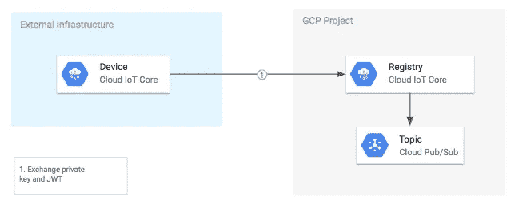
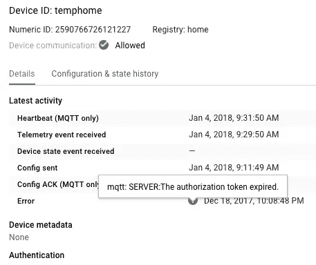

# 刷新谷歌云物联网核心中的 JSON Web 令牌(jwt)

> 原文：<https://medium.com/google-cloud/refreshing-json-web-tokens-jwts-for-google-cloud-iot-core-897318df3836?source=collection_archive---------1----------------------->

要向 Google Cloud IoT Core 认证并从设备发送消息，每个设备必须在建立 MQTT 或 HTTP 连接之前创建一个 JWT。jwt 是一种安全的签名方法，在设备和云物联网核心主题之间验证和发送数据。



云物联网核心 JWT 和密钥认证

默认情况下，在[快速入门示例](https://github.com/GoogleCloudPlatform/python-docs-samples/blob/master/iot/api-client/mqtt_example/cloudiot_mqtt_example.py)中，JWT exp(“expiration”)的最大生命周期为 60 分钟或 3600 秒:

```
token = {            
# The time that the token was issued at            
'iat': datetime.datetime.utcnow(),            
# The time the token expires.            
'exp': datetime.datetime.utcnow() + datetime.timedelta(minutes=60),            # The audience field should always be set to the GCP project id.                       'aud': project_id    
}
```

如果您不刷新 JWT，您可能会在 Cloud IoT Core 中看到如下错误(mqtt: SERVER:授权令牌过期)。这将延迟设备发布，并为需要维护可靠数据流的传感器带来问题。



设备未刷新 JWT 令牌，运行不畅

查看 [python 物联网核心 MQTT 示例](https://github.com/GoogleCloudPlatform/python-docs-samples/blob/master/iot/api-client/mqtt_example/cloudiot_mqtt_example.py)的第[222–233](https://github.com/GoogleCloudPlatform/python-docs-samples/blob/adaa3678af4ed30f458ecbf8c1ac19d3e81dafc8/iot/api-client/mqtt_example/cloudiot_mqtt_example.py#L223)行，了解如何在脚本中插入 JWT 刷新的代码。更多详细信息，请访问[云物联网核心文档页面](https://cloud.google.com/iot/docs/how-tos/credentials/jwts)。

```
seconds_since_issue = (datetime.datetime.utcnow() - jwt_iat).seconds
if seconds_since_issue > 60 * jwt_exp_mins:
    print('Refreshing token after {}s').format(seconds_since_issue)
    client.loop_stop()
    jwt_iat = datetime.datetime.utcnow()
    client = get_client(
        args.project_id, args.cloud_region,
        args.registry_id, args.device_id, args.private_key_file,
        args.algorithm, args.ca_certs, args.mqtt_bridge_hostname,
        args.mqtt_bridge_port)
```

此外，查看我的 github 问题[这里](https://github.com/GoogleCloudPlatform/python-docs-samples/issues/1264)更多关于 JWT 刷新和 [JWT.io](https://jwt.io/) 几乎每种语言的助手库。

感谢 [Gus Class](https://medium.com/u/282bfd5a4236?source=post_page-----897318df3836--------------------------------) 的代码辅助和 [@noerog](https://github.com/noerog) 让 GCP 文档每天都变得更好。

[Paolo](https://github.com/teifip) 联系我，让我了解他创建的助手，该助手在 node 中创建物联网核心 MQTT 客户端。这对于偶尔断开连接的弱连接设备来说非常好。谢谢保罗。你可以在这里查看[。](https://github.com/teifip/gcic-mqtt-client)

更新:自 2018 年 4 月起，您可以使用更长的过期时间，从发布时间+偏移时间起 24 小时[。这可以使您不必在受约束的设备上重新生成令牌。](https://cloud.google.com/iot/docs/how-tos/credentials/jwts#jwt_claims)