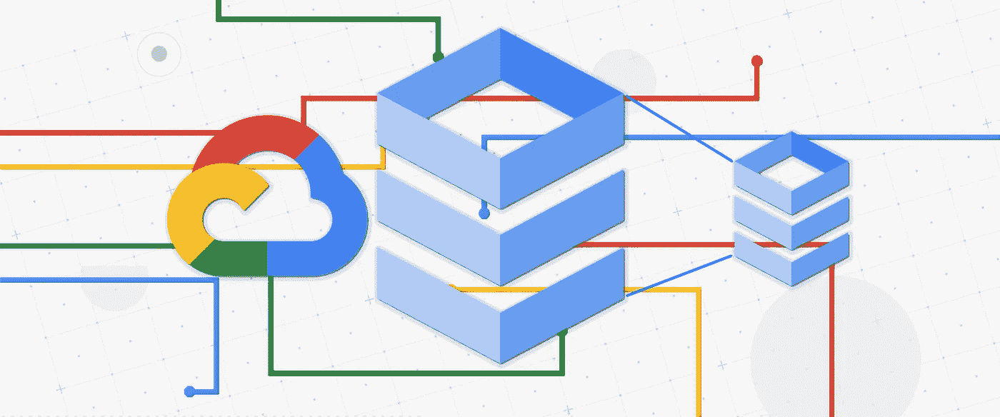
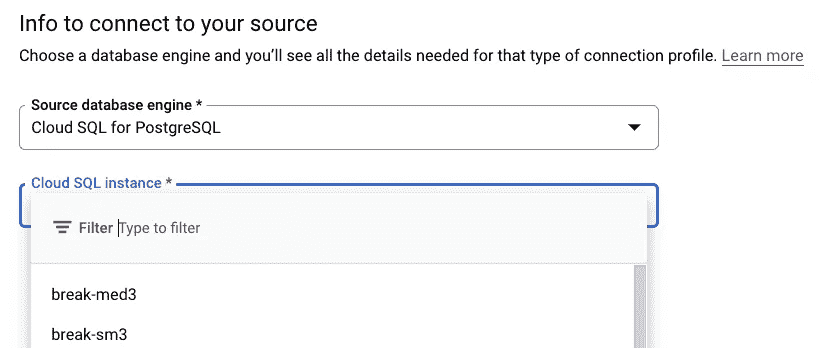
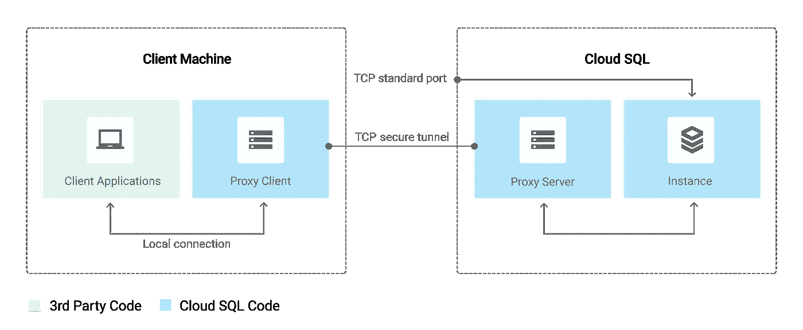
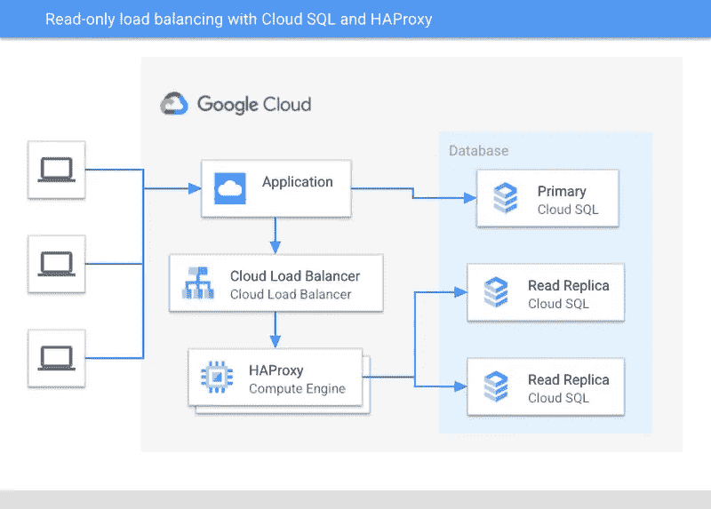

# 使用数据库迁移服务重新获得云 SQL 磁盘空间

> 原文：<https://medium.com/google-cloud/regain-cloud-sql-disk-space-with-database-migration-service-edabc708b1b0?source=collection_archive---------0----------------------->

因此，您犯了一个错误，您推动了一个应用程序更改，意外地导致大量数据冲击了您的数据库。现在，您的实例已经很好地利用了当您接近磁盘空间不足时自动扩展存储的特性。大多数情况下，这是一个救命的特性，可以防止由于逐渐增加的数据库空间不足而导致的停机。但这一次，一个错误导致你的存储峰值比平时高得多。谢天谢地，你现在已经修复了应用程序的错误，你的数据库也不会再溢出了，但是损害已经造成了，现在你的磁盘比它需要的要大得多。虽然“储物空间很便宜”这句谚语可能是对的，但如果你是租用它，你应该确保你没有为太多你没有使用的空间付费。

(目前)还没有一种简单地缩小云 SQL 实例的磁盘大小的好方法。数据块存储虽然能提供我们想要的性能，但遗憾的是缩小规模会更具挑战性。如果您看看有什么技术可以做到这一点，建议通常是导出您的数据，创建新的实例，然后用适当大小的磁盘将数据导入实例。或者稍微偷偷摸摸，设置一个*外部*副本(与常规副本不同，它的磁盘大小可以比主副本小)，然后在所有东西同步后升级。

这样做没有错。这些方法确实是做这件事的正确方法。但是，在保持生产系统运行的基础上建立基础架构来做这件事，并且所有这些都至少涉及一些停机时间，这可能是一种成本效益分析，其结果是不去管磁盘，称它足够好。

最终，这个过程类似于一次迁移，从不必要地增长的现有实例迁移到大小合适的实例。为了让迁移不那么令人畏惧，我们构建了[数据库迁移服务](https://www.youtube.com/watch?v=Wh7koygb1ZE)。谷歌的托管迁移服务让这一切变得美好而简单。您只需要为想要减少磁盘的云 SQL 源实例定义一个[连接配置文件](https://console.cloud.google.com/dbmigration/connection-profiles)，DMS 会指导您创建目标实例，您可以在其中指定较小的磁盘。

有一些事情要考虑，可以使这变得容易一点。首先，您需要为迁移准备好实例，根据您的设置，这可能需要重启数据库。如果你从未迁移过数据库，我们有几篇关于 MySQL 和 PostgreSQL 的好博文。

其次，您的应用程序使用的 IP 地址将会改变，因为一旦它被提升，您将需要指向新的实例。现在，有一件事是，使用 DMS，当您设置迁移时，您可以将其设置为流式迁移。因此，不必担心您通常可能需要做的出口/进口追赶。这将一直持续到您将新实例提升为主实例。这意味着您可以花时间准备应用程序和其他工具，以及在移交之前测试新实例。

解决这一问题的一种方法是，在切换所有应用程序时，可以将目标实例保留为副本。这样，当您的应用程序使用新的 IP 地址时，您可以保留两个实例。这导致了最少的停机时间，但是根据应用程序如何使用数据库中的数据，可能会有复杂性。

如果你还没有这样做，那么让你的应用程序使用[云 SQL 身份验证代理](https://cloud.google.com/sql/docs/mysql/sql-proxy)，这是一个未来证明的好方法。

当然，如果您有一个已建立的实例，这将导致停机，并且应用程序中的逻辑必须更改，以指向您运行代理的位置(最好与应用程序在同一台机器上)，并且您必须切换。这样做的好处是，当您关闭指向旧实例的代理并重新启动指向新实例的代理时，重新打印应用程序会导致最短的停机时间。

做类似事情的其他方法是在实例前面放置一个负载平衡器或 HTTP 代理，以便您的应用程序都有一个一致的 IP 地址可以连接，这样您就可以在它后面的数据库之间进行交换，而不必更改应用程序代码和重新部署。将基础设施变更与应用程序代码隔离开来。这些可以是复杂的，也可以是简单的。例如，在下图中，您可以看到负载平衡器如何与高可用性代理配对，以分散读取操作。

如果您对以各种方式代理您的云 SQL 实例感兴趣，这里有一篇很棒的文章[供您查阅。](https://cloud.google.com/blog/products/databases/using-haproxy-to-scale-read-only-workloads-on-cloud-sql-for-postgresql)

所以你有它！当出现问题时，您需要为您的云 SQL 实例回收一些磁盘空间，我希望这篇文章能有所帮助。感谢阅读！如果您有任何反馈或问题，请在这里发表评论，或通过 [Twitter](https://twitter.com/GabeWeiss_) 联系我，我的 DMs 是开放的！