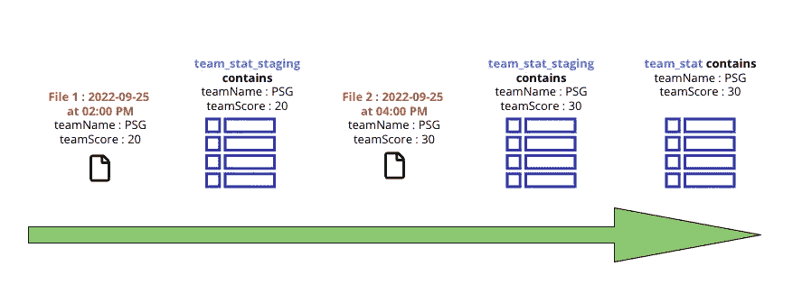
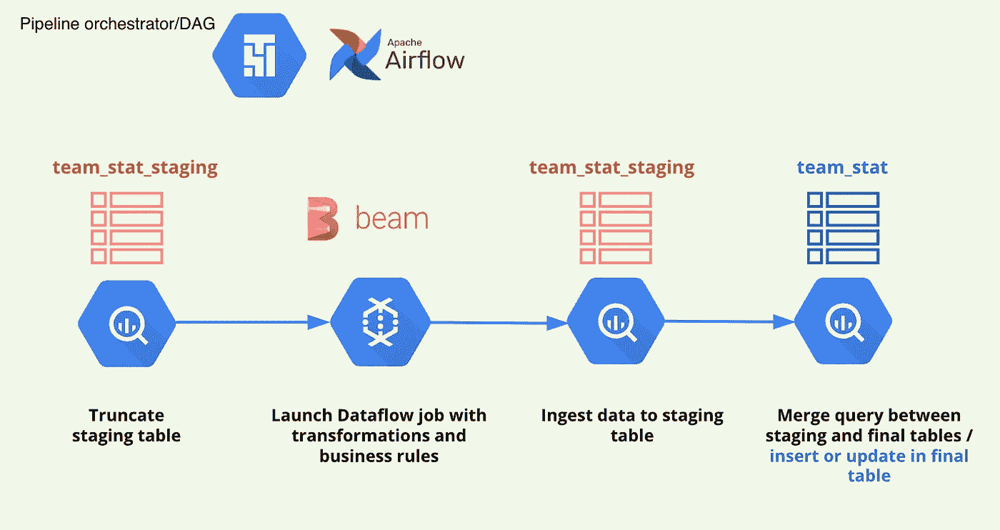
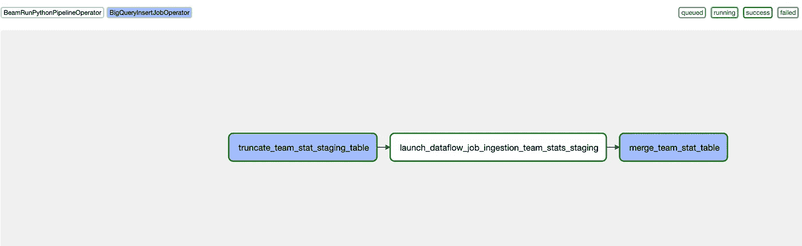
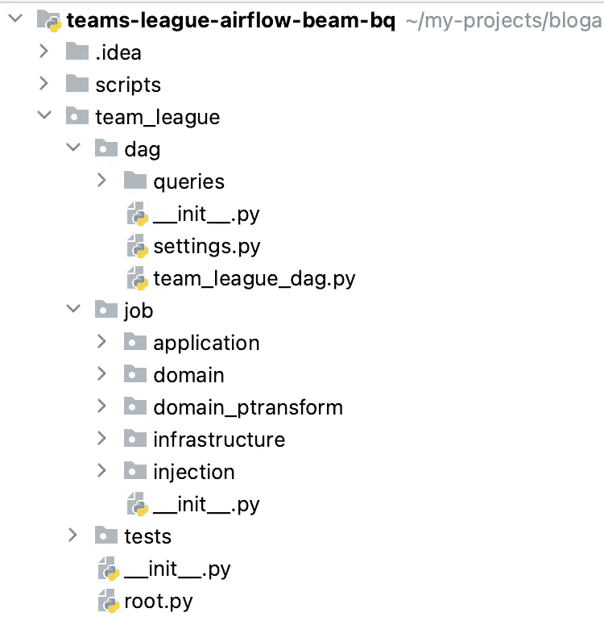
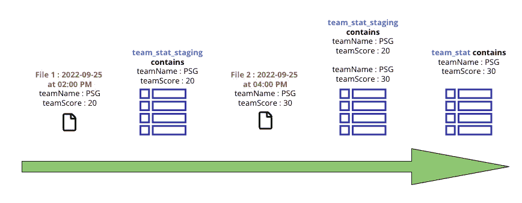
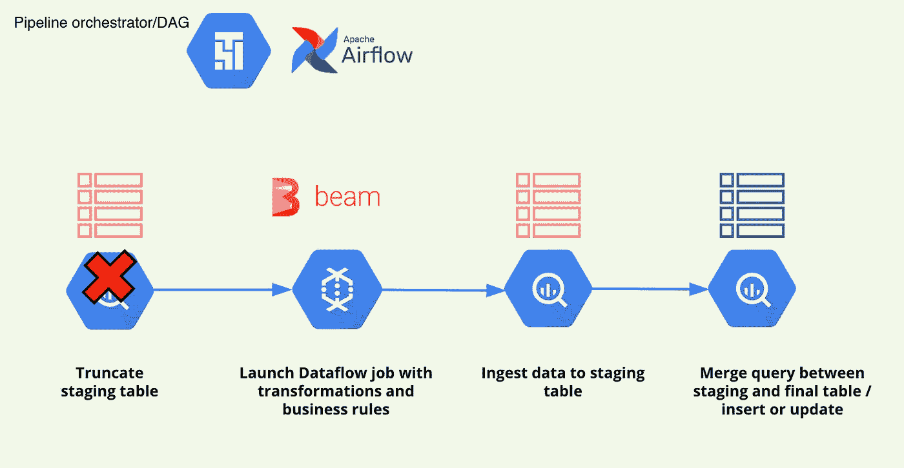

# 使用气流和数据流删除 Bigquery 批处理管道中的重复项

> 原文：<https://medium.com/google-cloud/remove-duplicates-in-bigquery-batch-pipeline-with-airflow-and-dataflow-2e7da5772c4d?source=collection_archive---------0----------------------->

本文的目的是展示一个应用程序，它具有一个由`Cloud Composer 2/Airflow`和`Apache Beam/Cloud Dataflow`作业编排的批处理管道，在`Bigquery`中无重复地接收数据。

`datawarehouse`中的一个常见问题是重复的处理，很多时候我们希望保留一个对象的最后状态。

> **本例使用的版本有:**

*   云作曲:`composer-2.0.27-airflow-2.2.5`
*   阿帕奇气流:`2.2.5`
*   阿帕奇波束提供商阿帕奇波束:`4.0.0`
*   阿帕奇光束:`2.41.0`

# **1。当地环境**

在本例中使用了`Pipenv`工具，这里您可以看到用于本项目的`PipFile`:

我们用以下命令创建`subshell`、`virtual env`并在其中安装所有的包:

```
pipenv shell
pipenv install --dev
```

我将写一篇专门的文章来展示如何使用`pipenv`和`IntelliJ`并在本地机器上拥有最舒适的工作环境。

# 2.用于这些示例的应用程序的目标

> 这个项目展示了一个应用程序的例子，它的目标是处理一个足球队联盟。该应用程序使用以下步骤:

*   从`Cloud Storage`读取包含球队联赛统计原始数据的 Json 文件
*   转换并应用业务规则来计算预期的团队联盟统计域数据
*   将结果写入`Bigquery`表

对于这个应用程序，我们希望在新文件带来变化时处理副本并更新行。

**原始数据为:**

**业务转换的域数据和结果:**

> 团队统计的唯一性由`teamName`字段表示

# 3.创建 Bigquery 表

为此示例创建了两个表:

*   `team_stat_staging`
*   `team_stat`

这两个表的`Bigquery`模式是相同的:

我们使用下面的`shell`脚本来创建表格，示例为`team_stat`表格:

> 在`DAY`的`ingestionDate`字段上使用了一个分区

# 4.气流 DAG 和数据流作业

## 4.1 DAG 未将所有事件保存在暂存表中

********

> **一些解释:**

*   **创建两个表:`team_stat_staging`和`team_stat`**
*   **`team_stat_staging`是一个临时表，包含`Dataflow`作业的结果**
*   **`team_stat`是最后一个包含球队状态的表格，没有重复**
*   **`Airflow`在本例中用作`Cloud Composer 2`集群中的`DAG`编排器**
*   **开始的`DAG`是临时表，因为在这个例子中我们不想保留所有的事件**
*   **`DAG`启动一个`Dataflow`作业，它负责应用转换和业务规则**
*   **`Dataflow`作业将结果`team stats domain data`写入`Bigquery`中的暂存表**
*   **`DAG`在暂存表和最终表之间运行一个`merge`查询。如果一行不存在，它将被插入，否则更新(upsert)**

**`DAG`末尾的`merge`查询有助于避免重复并保持团队统计数据的最新状态。**

## **4.2 气流中的 DAG 图**

****

## **4.3DAG 的结构和代码**

****

**我们有一个名为`team_league`的项目根文件夹，在这个文件夹下有两个主文件夹:**

*   **`dag`含`Airflow` `DAG`**
*   **`job`包含`Beam`到`Dataflow`的工作**

*****这里你可以看到***`***DAG***`***:***的代码**

## *****截断查询任务*****

**第一个任务使用`BigQueryInsertJobOperator`执行对 staging 表的`truncate`查询**

**目标是通过这个`truncate`查询清空`team_stat_staging`表:**

**参数`project_id` `dataset` `team_stat_staging_table`由带有`Jinja2`模板的`DAG`传递。**

**`truncate`将清空整个表，因为在这种情况下，不需要保存所有事件，而只需要保存数据的最后状态。**

## *****启动光束/数据流作业任务*****

**第二个任务使用`BeamRunPythonPipelineOperator`通过`Dataflow` runner 执行`Beam`任务。管道选项作为`Dict`传递给操作员。结果被接收到暂存表中。**

## **合并查询任务**

**最后一个任务还使用了一个`BigQueryInsertJobOperator`来执行 staging 和 final 表之间的最后一个`merge`查询。**

**在暂存表和最终表之间进行匹配:**

*   **如果临时表中的行存在于最终表中，则更新该行:`WHEN MATCHED THEN`子句**
*   **否则，插入该行:`WHEN NOT MATCHED THEN`子句**

**⚠️匹配条件`ON T.teamName = S.teamName`必须只匹配两个表中的一行。最终表不能包含重复项，因为我们防止了这种情况，但是如果输入文件和临时表包含重复项或具有相同`teamName`的多行，查询将失败，并显示以下错误:**

```
google.api_core.exceptions.BadRequest: 400 UPDATE/MERGE must match at most one source row for each target row
```

**我们将修改我们的`merge`查询，从 staging 表中删除重复项:**

**通过`ROW_NUMBER() OVER (PARTITION BY teamName ORDER BY ingestionDate DESC) AS rn`和子查询，我们从临时表中删除了重复项。**

**因此，在这种情况下，没有使`merge`查询失败的风险。**

**您可以查看官方文档以了解关于`merge`查询的更多信息:**

**[](https://cloud.google.com/bigquery/docs/reference/standard-sql/dml-syntax?hl=en#merge_statement) [## Google 标准 SQL | BigQuery | Google Cloud 中的数据操作语言(DML)语句

### 无论您的企业正处于数字化转型的早期阶段，谷歌云都可以帮助您解决…

cloud.google.com](https://cloud.google.com/bigquery/docs/reference/standard-sql/dml-syntax?hl=en#merge_statement) 

## 4.4 相同的 DAG，但将所有事件保存在暂存表中

***在第二个例子中，我们展示了将所有事件保存在暂存表*** 中的情况



任务`truncate`被删除，因为我们不想清理暂存表。

我们还必须适应`merge`查询。

在这种情况下，随着时间的推移，临时表可能包含大量数据，我们希望避免处理所有表且成本很高的`merge`查询。解决方案是使用我们的表上的分区，由`ingestionDate`列表示:

下面的子句`WHERE date(ingestionDate) = CURRENT_DATE()`使用了`DAY`分区。

其余的`DAG`不变。

> 值得注意的是，这种技术允许降低暂存表的成本，但不幸的是没有解决方案来使用最终表的分区。
> `*Bigquery*`需要处理整个最终表，以查找两个表之间的`*teamName*`是否匹配。
> 
> `*Clustering*` on `*teamName*`可以提高搜索性能和成本，因为数据是并置的。我们不打算在这里详述这个概念，因为这不是本文的主题。

## 4.5 光束/数据流作业的结构和代码

`Beam`的代码遵循我在奥斯汀`BeamSummit`会议上展示的相同架构。

你可以观看演讲的幻灯片和视频:

该架构基于`Hexagonal Architecture` `Domain Driven Design`和`dependency injection`以及`Python`:

*   `domain`文件夹包含所有带有纯`Python`代码的业务规则
*   `domain_ptransform`包含 IOs 和业务`PTransform`的连接器接口，组成了`Beam`世界中的所有业务转换
*   `infrastructure`包含了所有的`adapters`和技术代码
*   `injection`集中配置所有`dependency injection`部件

`Dataflow`一个`python`工作的启动必须尊重以下条件:

*   运行程序将实例化`Dataflow`作业。在这种情况下，运行者是`Cloud Composer`，他必须包含实例化作业所需的所有`Python`包。
*   在执行阶段，`Dataflow`工作者使用给定的`setup.py`文件或定制的`Docker`图像。`setup.py`或`Docker`图像必须包含与奔跑者相同的`Python`包装。
*   您可以使用`Composer`桶中的`setup.py`文件:`gs://{composer_bucket}/dags/setup.py`

在本例中，`Dataflow`作业在管道选项中使用了一个定制的`Docker`图像。我准备就这个话题写一篇专门的文章。

与`setup.py`文件相比，使用自定义映像的优势在于可以从`GCP Artifact Registry`下载内部`Python`包

*   `Dataflow`用于`setup.py`的选项:

```
--setup_file: {composer_dag_folder}/setup.py
```

`DAG`文件夹路径可以通过环境变量从`Airflow` `Python`代码中获取:

```
DAGS_FOLDER = os.getenv("DAGS_FOLDER")
```

*   `Dataflow`自定义选项`Docker image`

```
--experiments: "use_runner_v2" \
--sdk_container_image: eu.gcr.io/{my-gcp-project}/beam_custom:2.41.0
```

您也可以查看该器件的官方文档:

[https://cloud . Google . com/data flow/docs/guides/using-custom-containers？hl=en](https://cloud.google.com/dataflow/docs/guides/using-custom-containers?hl=en)

# 5.Google 云中 DAG 和 job 的部署

使用以下命令可以将`Airflow` `DAG`和`Dataflow`作业部署到`Cloud Composer`铲斗中:

*   `team_league`是包含`DAG`和`job`的项目中的`Python`根文件夹
*   `environment`是`Composer`的实例名
*   `location`是`Composer`集群的位置
*   `project`是`GCP`项目

所有代码示例和项目都可以在我的个人`Github`存储库中访问:

[](https://github.com/tosun-si/teams-league-airflow-beam-bq) [## GitHub-tosun-si/teams-league-air flow-beam-bq

### 通过在 GitHub 上创建账号，为 tosun-si/teams-league-air flow-beam-bq 开发做贡献。

github.com](https://github.com/tosun-si/teams-league-airflow-beam-bq) 

我希望你学到了一些东西，并喜欢阅读这篇文章。

> 如果你喜欢我的文章，想看我的帖子，请关注我:
> 
> - [中](/@mazlum.tosun)
> - [推特](https://twitter.com/MazlumTosun3)-
> -[LinkedIn](https://www.linkedin.com/in/mazlum-tosun-900b1812)**