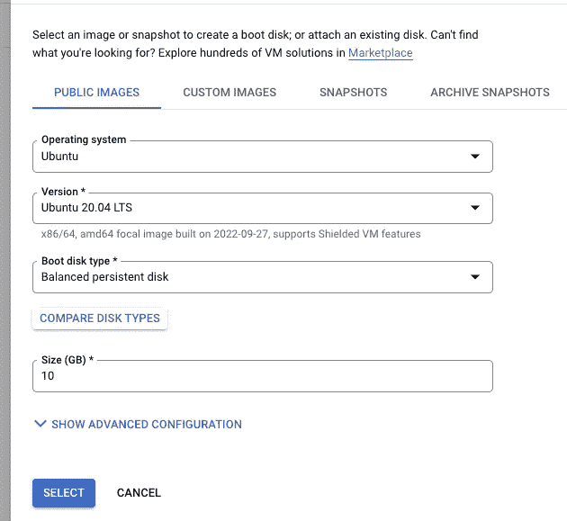

# 使用数据流将 MSSQL Server 复制到 Google Big Query

> 原文：<https://medium.com/google-cloud/replicating-mssql-server-to-google-big-query-using-dataflow-a946f2a4fd5a?source=collection_archive---------0----------------------->

要将 MSSQL 数据复制到大型查询中，我们有多种选择，例如，如果您想使用 CDC 方法，您可以使用— [this](https://cloud.google.com/data-fusion/docs/tutorials/replicating-data/sqlserver-to-bigquery) 。

在这篇博客中，我们将看看如何使用数据流将 MSSQL 连接到 BQ。数据流是谷歌的无服务器产品，支持流媒体和批处理。让我们开始吧！

1.  创建一个 MSSQL server 实例——您可以在云 SQL 上创建它，或者在 GCE 上安装一个。我做到了后者。

创建一个 CE 实例，您可以使用 Google cloud 建议的默认值，只需将引导映像更改为以下内容(您也可以使用其他风格，对于这个演示，我们将使用 Ubuntu，以便其他人可以轻松复制这些步骤)

一旦实例启动，您应该能够看到新创建的实例

将源机器网络上的端口 1433 开放给传入连接，这是我们将连接到 sql server 的地方。

2) SSH 进入机器，使用[这个](https://learn.microsoft.com/en-us/sql/linux/quickstart-install-connect-ubuntu?view=sql-server-ver15)安装 MSSQL

3)让我们创建一些将在 BQ 中复制的源数据

连接到实例

> sqlcmd -S localhost -U sa -P<your_password></your_password>
> 
> 创建表格
> 
> 创建数据库测试；
> 
> 使用测试；
> 
> 创建表 test_rep (id INT，name NVARCHAR(50)，quantity INT)；
> 
> 插入到 test_rep 值(1，'香蕉'，150)；
> 
> 插入到 test_rep 值(2，'橙色'，154)；
> 
> 去

此外，您可以创建一个新用户，数据流将通过该用户连接到 sql server，对于此演示，我们可以只重用 superadmin 用户。

4)我们已经完成了源系统设置，现在让我们创建一个数据流作业来同步这些数据

4.1)创建一个 BQ 目标表，它应该具有与源相同的模式

4.2)创建一个测试桶，数据流作业将在其中保存临时数据和驱动程序

4.3)下载 [JDBC](https://www.microsoft.com/en-us/download/details.aspx?id=54671) 驱动程序，提取 jar 文件并将其放在上面创建的驱动程序文件夹下，这是数据流能够与 MSSQL 对话所必需的

4.4)让我们最终创建数据流作业。转到数据流服务，并选择从模板创建作业

数据流有许多现成的模板可以重复使用，这里我们将使用 JDBC 到 BQ 模板

如下填写所需的管道选项

JDBC 连接— jdbc:sqlserver:// <your instance="" ip="">:1433</your>

驱动程序类名-com . Microsoft . SQL server . JDBC . SQL server driver

driverJars —给出我们在步骤 4.3 中保存在 bucket 中的驱动程序的路径，例如-GS://sl-test-bucket-12/driver/sqljdbc 42 . jar

完成后，点击底部的显示可选参数

并按照下面截图中的指示添加新参数

JDBC 连接属性—数据库=测试；encrypt = truetrustServerCertificate = true

完成这些参数后，单击底部的运行作业

5)现在一切就绪。一旦作业完成，您应该能够看到下图

我们可以看到，从 JDBC (MSSQL DB)读取和写入 BQ 的步骤都是成功的

6)转到 BQ，确认数据是否已经复制到它上面

**总之**我们已经一步一步地使用 JDBC 到 BQ 模板将数据从 MSSQL 复制到 BQ，类似的模板或步骤可以用于从任何源数据库复制，只要它支持 JDBC 连接。