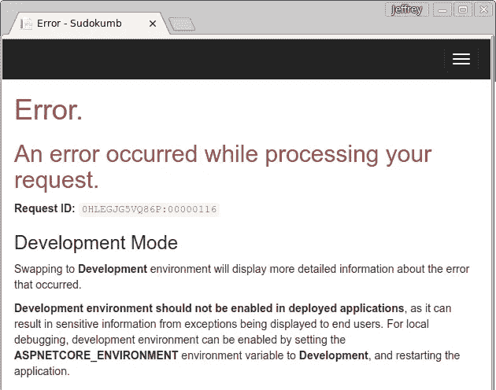
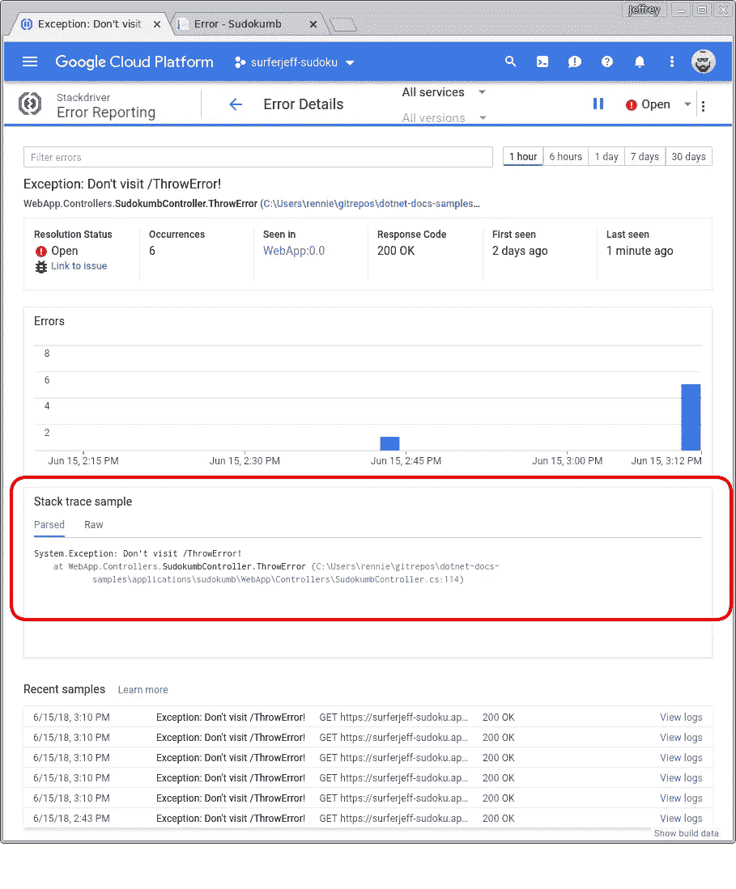
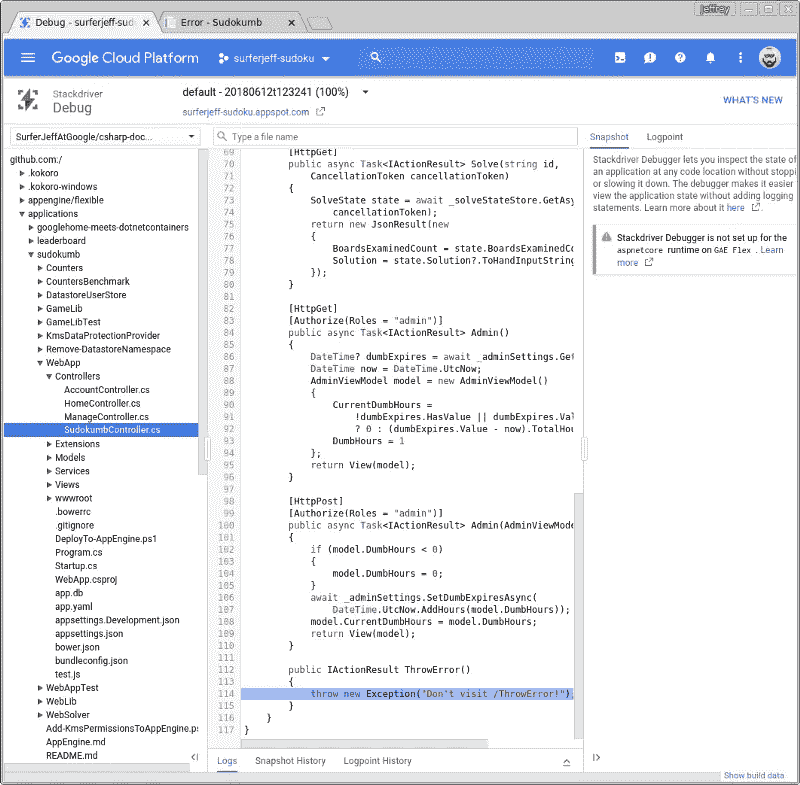

# 在 ASP 中报告异常。网

> 原文：<https://medium.com/google-cloud/reporting-exceptions-in-asp-net-d1c0d448d822?source=collection_archive---------1----------------------->

我适度成功的秘诀是掌握调试工具。我在调试器中逐句通过我写的每一行新代码。我写 Win32 应用的时候，背了几十个 [windbg](https://docs.microsoft.com/en-us/windows-hardware/drivers/debugger/debugger-download-tools) 命令，用了 [BoundsChecker](https://en.wikipedia.org/wiki/BoundsChecker) 和[应用验证器](https://docs.microsoft.com/en-us/windows-hardware/drivers/debugger/application-verifier)。我喜欢检查垃圾场。我知道这很奇怪，但我很喜欢，雇主也觉得这很有价值。

我的技术栈已经更改为在 [Docker](https://www.docker.com/) 容器中运行的[ASP.NET](https://www.asp.net/)应用程序，所以我的调试工具也相应地更改了。几乎不可能单步调试运行在实际生产的 ASP.NET 应用程序中的代码，因此需要一套不同的调试工具。

当我开始编写 ASP.NET 应用程序时，我需要解决的第一个问题是如何调试未捕获的异常。

## 在 ASP 中捕获未捕获的异常。网

默认情况下，当一个异常被抛出并且没有在[ASP.NET](https://docs.microsoft.com/en-us/aspnet/core/?view=aspnetcore-2.1)应用程序中被捕获时，用户会看到这样一个页面。

作为一名开发人员，当我看到这个错误消息时，很容易将`ASPNETCORE_ENVIRONMENT`标志切换到`Development`，然后重新部署应用程序，只需几分钟，这样我就可以看到堆栈跟踪，然后在`Production`模式下再次重新部署应用程序。

但是在`Development`模式下临时重新部署应用程序是一个**坏主意**，至少有两个原因:

1.  一个`Development`模式的应用程序也会向恶意用户显示你的堆栈跟踪。他们可以利用这些信息来攻击你。风险是真实存在的。
2.  您永远不会看到用户没有向您报告的错误。很少有用户经历过实际报告错误的麻烦。更有可能的是，他们会停止使用你的网络应用，而你永远不知道为什么。

## 更好的方法

有更好的方法来查看堆栈跟踪，并且它们使用起来很简单。我最喜欢的是 [Stackdriver 错误报告](https://cloud.google.com/error-reporting/)。Stackdriver 错误报告可以显示应用程序没有捕捉到的每个异常的堆栈跟踪。

当抛出异常时，Stackdriver 错误报告会显示如下:

如上所示，Stackdriver 错误报告显示了一个图表，显示了这个错误发生的频率，它还显示了错误的堆栈跟踪，我用红色圈出了这个错误。在这种情况下，堆栈跟踪只有一级深，因为控制器代码非常简单。有多简单？我单击堆栈跟踪中的蓝色链接来查看源代码:

看代码，难怪会抛出异常！

## 将 Stackdriver 错误报告与 ASP.NET 核心应用程序集成

将[堆栈驱动错误报告](https://cloud.google.com/error-reporting/)与 ASP.NET 核心应用程序集成需要添加[一个 nuget 包](https://www.nuget.org/packages/Google.Cloud.Diagnostics.AspNetCore/):

并将 8 行代码添加到`Startup.cs`:

就是这样！现在我的应用程序将向 Stackdriver 报告错误，无论它在哪里运行。

## 堆栈驱动程序

Stackdriver 是一套[应用性能管理(APM)](https://en.wikipedia.org/wiki/Application_performance_management) 工具，支持 7 种编程语言。Stackdriver 的工具适用于应用程序运行的任何地方:AWS、Azure、Google 云平台或企业网络。Stackdriver 错误报告是套件中最简单的工具，老实说，我无法想象开发一个没有它的 Web 应用程序。

Stackdriver 错误报告的完整文档[保存在这里](https://cloud.google.com/error-reporting/docs/)。