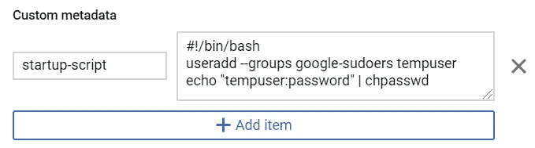

# 解决被计算引擎锁定的问题

> 原文：<https://medium.com/google-cloud/resolving-getting-locked-out-of-a-compute-engine-85800251890b?source=collection_archive---------0----------------------->


想象一下，您因为犯了某种管理错误而被“锁定”在 Linux 计算引擎之外，比如在机器上本地禁用 SSH 或通过防火墙阻止 SSH(例如 ufw 的 iptables)。如何登录以进行调查和修复？因为我们通常使用 SSH 登录，并且我们的前提是 SSH 不可用，所以我们似乎被卡住了。

一种解决方案是使用串行控制台的概念。在物理 Linux 机器上，我们将能够在控制台登录。在这里，我们将看到友好的“登录:”提示。历史上，Unix 机器有通过串行电缆连接的终端阵列。与每个终端相关联，将有一个名为 [getty](https://en.wikipedia.org/wiki/Getty_(Unix)) 的 Unix 进程为每个终端运行。正是这个过程负责生成允许我们登录的登录。

由于计算引擎是一个物理上的远程虚拟机，显然没有我们可以使用的附加终端，但是 GCP 提供了一个逻辑上的等效物，称为串行控制台。我们可以通过云控制台访问计算引擎的串行控制台。默认情况下，它向我们显示系统启动期间生成的日志，但阻止我们与之交互。换句话说，它是只读的。我们可以启用它来输入允许我们登录。为此，我们可以将`serial-port-enable`元数据设置为`1`的值。默认值(即使省略，也是值`0`)。

启用后，我们会看到一个登录提示，在这里我们可以输入登录用户 id/密码对。但是我们可以使用什么凭证登录呢？默认情况下，我们没有可用的登录凭据。我们需要做的是显式地定义一个用户和相关的密码，我们可以用它来登录。然而，我们有一个自举问题。假设我们被锁定在计算引擎之外，我们无法登录来添加允许我们登录的用户 id/密码。

解决方案是创建一个添加用户 id/密码对的启动脚本。如果我们定义此脚本，然后重新启动我们的计算引擎，在引导过程的后期，启动脚本将运行，它可以创建我们的身份，然后我们可以使用该身份登录。一旦启动脚本完成并且 VM 实例启动，我们就可以通过串行端口登录。

这里是这些步骤的演练，假设在开始时我们被锁定。我们假设机器能够正确启动。

我们创建了一个 Ubuntu 计算引擎实例并运行:

```
sudo iptables -A INPUT -p tcp --destination-port 22 -j DROP
```

这阻塞了端口 22。这是一个被“锁在外面”的模拟。

我们通过将计算引擎实例元数据`serial-port-enable`设置为`1`来启用串行端口登录。在云控制台中，有一个复选框区域使这变得简单:


接下来，我们关闭计算引擎实例。

一旦关闭，我们可以通过添加自定义元数据来定义我们的启动脚本，元数据的关键字为`startup-script`，值为:

```
#!/bin/bash
useradd --groups google-sudoers tempuser
echo "tempuser:password" | chpasswd
```



现在，我们重新启动计算引擎。这将导致启动脚本执行，这将添加我们的临时用户。当计算引擎启动时，我们将在控制台中看到一个按钮，显示实例的详细信息。


我们必须在出现的窗口中按一次 enter 键，以显示登录提示:


我们现在可以输入我们的用户标识和密码(如临时用户/密码)。我们将以临时用户的身份登录。我们现在可以使用以下命令切换到根用户 shell:

```
sudo bash
```

在这一点上，我们现在在机器中拥有我们可能需要的所有权限。我们可以进行调查和修复。当我们对环境已经修复感到满意时，我们应该关闭虚拟机实例并删除创建临时用户 id 的启动脚本，我们还应该取消选中启用串行端口登录的复选框。


我们应该再次重启虚拟机，使用 SSH 登录，并明确删除我们的临时用户:

```
deluser tempuser
```

食谱到此结束。我们展示了使用云控制台管理界面调整我们的 VM 实例配置，但是我们也可以使用`gcloud`命令行界面执行相同的任务。

另请参见:

*   [如何使用串行控制台对谷歌计算引擎实例进行故障排除](https://www.youtube.com/watch?v=GSksIUqBJPo)