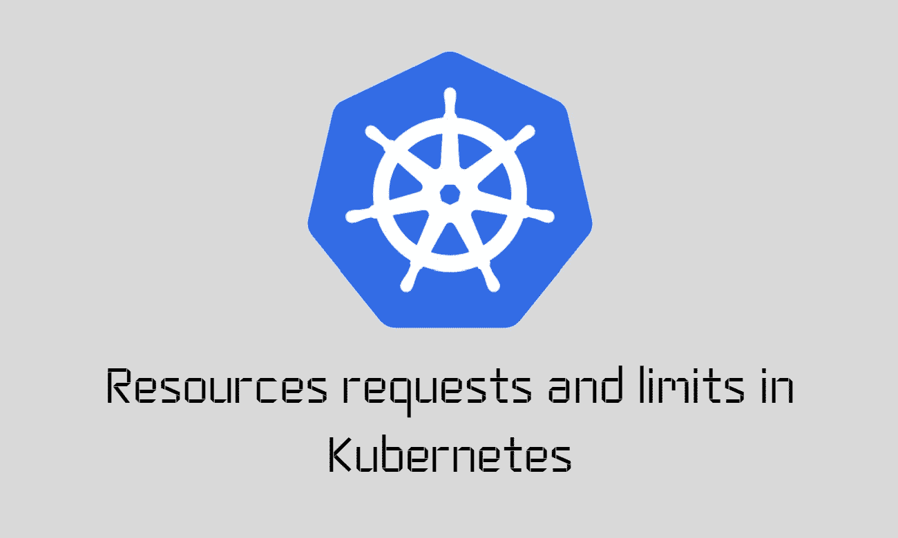

# Kubernetes 的资源需求

> 原文：<https://medium.com/google-cloud/resource-requirements-in-kubernetes-86290cb43c48?source=collection_archive---------0----------------------->

如何指定 Pods 在 Kubernetes 中运行所需的资源？？

## 介绍🚩🚩

各位读者好👋我已经写了一段时间关于 Kubernetes 及其对象的基础知识。我觉得基础知识已经讲得很好了，现在是时候转向更高级的 Kubernetes 主题了。
其中一个话题是关于 ***在 Kubernetes 的资源需求和限制。***

***所以在本文中，我们将试着了解一下*** :

*   Kubernetes 中的资源请求和限制是什么？？
*   我们如何在 Kubernetes 中设置 Pod 的资源请求和限制？？
*   当 pod 试图超出其指定限制的资源时会发生什么？？

> **这将是一篇非常短小精悍的文章。
> 所以不要再拖延了，让我们开始吧:)**

## Kubernetes 中的资源请求和限制是什么？？🤔🤔



如果你经常阅读我的文章，你一定会注意到我在上一篇文章中谈到了 Kubernetes 中的 ***调度。***

[](/google-cloud/scheduling-in-kubernetes-9bc96c9008d8) [## kubernetes 的日程安排

### Kubernetes 中的调度流程是如何工作的？？

medium.com](/google-cloud/scheduling-in-kubernetes-9bc96c9008d8) 

在那篇文章中，我谈到了在 K8s 集群中的一个节点上调度一个 Pod 的所有方法。

但是我们没有谈的是“ ***一个 Pod*** 的资源需求&限制”。比如，这些是如何指定的，因为它在将 Pod 调度到特定节点的过程中起着重要作用。
当且仅当一个 Pod 的资源需求被一个节点满足时，那么只有该节点可以在其上调度该 Pod。否则没机会:((

让我们试着从以下几点来理解整个概念

*   假设有一个两个节点的 Kubernetes 集群。
*   每个节点都分配有一些资源(CPU、内存)。
*   现在，当我们创建 Pod 时，每个 Pod 都需要在其中运行容器化的应用程序。
*   这些容器化的应用程序需要一些资源(CPU、内存)才能正常运行。
*   现在 Kubernetes 调度程序的任务是找到一个能够满足 Pod 资源需求的节点。
*   满足这些要求的节点将获得为它们安排的 Pod。

> 因此，简单来说，“资源需求”只不过是一个 Pod 向节点请求的计算资源，以运行其内部的应用程序。
> 另一方面，“资源限制只不过是一个节点可以给予特定 Pod 的最大计算资源。

## 我们如何在 Kubernetes 中设置 Pod 的资源请求和限制？？🤓🤓


Photo by [愚木混株 cdd20](https://unsplash.com/@cdd20?utm_source=medium&utm_medium=referral) on [Unsplash](https://unsplash.com?utm_source=medium&utm_medium=referral)

> *** *注意:**默认情况下，Kubernetes 假设 pod 或 pod 中的容器需要`0.5` CPU 和`256Mi`内存。

如果 pod 中的应用程序需要的资源多于默认资源，您需要以下面的方式在 pod 定义文件中设置它们。
参见下面 yaml 文件中`*spec*`部分下的`*resources*`部分。

```
apiVersion: v1
kind: Pod
metadata:
  name: simple-app
  labels:
    name: simple-app
spec:
 containers:
 - name: simple-app
   image: simple-app
   ports:
    - containerPort:  8080
   resources:
     requests:
      memory: "1Gi"
      cpu: "1"
```

> *** *注意:**默认情况下，Kubernetes 将资源限制设置为 1 个 CPU 和 512Mi 内存

如果您需要更改 pod 中应用程序的资源限制。然后，您需要按照以下方式在 pod 定义文件中设置它们。
参见下面 yaml 文件中`*spec*`部分下的`*resources*`部分。

```
apiVersion: v1
kind: Pod
metadata:
  name: simple-app
  labels:
    name: simple-app
spec:
 containers:
 - name: simple-app
   image: simple-app
   ports:
    - containerPort:  8080
   resources:
     requests:
      memory: "1Gi"
      cpu: "1"
     limits:
       memory: "2Gi"
       cpu: "2"
```

> 万岁！！ **🥳🎉🎊**我想现在应该很清楚了，在 Kubernetes 中为一个 Pod 设置资源请求和限制是多么容易。

## 当 pod 试图超出其指定限制的资源时会发生什么？？🤯 🤯


照片由 [Sam Xu](https://unsplash.com/es/@ric3b0wl?utm_source=medium&utm_medium=referral) 在 [Unsplash](https://unsplash.com?utm_source=medium&utm_medium=referral) 上拍摄

1.  如果 Pod 试图超过为它定义的 ***CPU 限制*** ，Kubernetes 集群不允许它这样做。因此，当在一个节点上执行时，一个 Pod 超过它为自己定义的 CPU 限制是不可能的。
2.  如果 Pod 试图超过为它定义的 ***内存限制*** ，Kubernetes 集群允许它这样做。因此，当在一个节点上执行时，一个 Pod 可能会超过它为自己定义的内存限制。 ***但是集群不会让这种情况持续很长一段时间。当它检测到它已经超过它的存储器限制一段较长的时间*** 时，它将 ***终止 Pod👀***

## 接下来呢？👀 👀


> 非常感谢你来到这里！这是本文的结尾。
> 但我们只是触及了 K8s 生态系统的表面:)
> 还有很多，这将是一次有趣的旅程，我们将一起学习许多很酷的东西。
> 
> 鼓掌，跟我来🙈如果你喜欢我的作品，并希望在未来更多地阅读我的作品:)

如果你对这篇文章有任何疑问，或者想聊聊天，请随时联系我的社交媒体账号

*推特—*[https://twitter.com/ChindaVibhor](https://twitter.com/ChindaVibhor)

*领英—*[*https://www.linkedin.com/in/vibhor-chinda-465927169/*](https://www.linkedin.com/in/vibhor-chinda-465927169/)

## 相关文章

[](/google-cloud/daemon-sets-static-pods-bf43b10efe97) [## 守护进程集和静态豆荚☸☸

### Kubernetes 中关于守护进程集和静态 Pods 的一切

medium.com](/google-cloud/daemon-sets-static-pods-bf43b10efe97) [](/google-cloud/deploying-a-local-kubernetes-cluster-using-minikube-abe94a2c7583) [## 使用 Minikube 部署本地 Kubernetes 集群🚢 🚢

### 如何使用 Minikube 设置本地 Kubernetes 集群？？

medium.com](/google-cloud/deploying-a-local-kubernetes-cluster-using-minikube-abe94a2c7583) 

我仍然会继续发表新的文章，涵盖我正在探索的一系列主题。

那都是乡亲们！！涂鸦:))