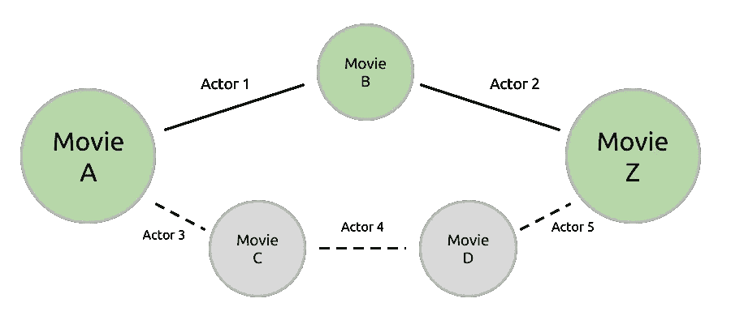
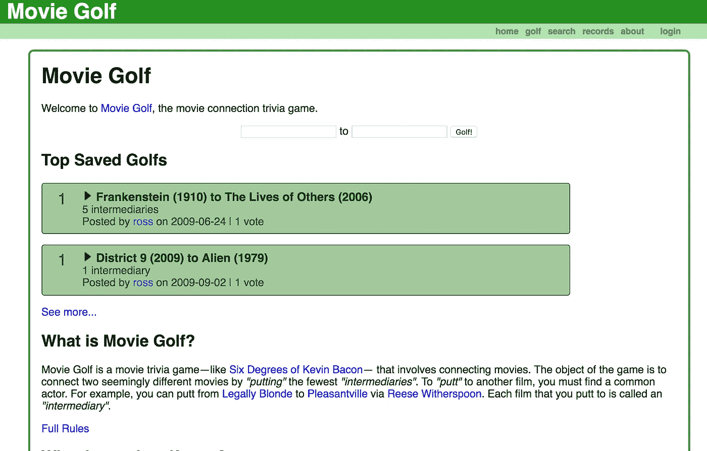
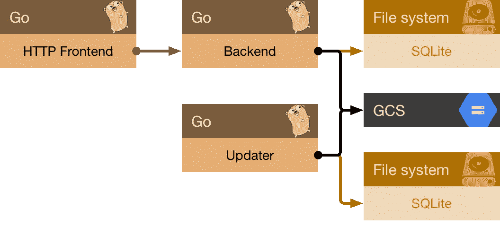

# 重写 moviegolf.com

> 原文：<https://medium.com/google-cloud/rewriting-moviegolf-com-e5c01fd396dc?source=collection_archive---------1----------------------->

## 反思 8 年的编程经验

今年 4 月，我重新启动了 moviegolf.com 网站，这个网站我从 2009 年就开始运营了。因为这是我写过的最精彩的程序之一，当然也是持续时间最长的程序之一，所以我想讲述一下它的历史。在这中间的几年里，我的编程风格确实发生了变化。

# 什么是电影高尔夫？

来自网站的[关于页面](https://www.moviegolf.com/about):

> 电影高尔夫是一个电影琐事游戏——就像[的凯文·贝肯六度游戏](http://en.wikipedia.org/wiki/Six_Degrees_of_Kevin_Bacon)——涉及到连接电影。这个游戏的目标是通过最少的中介把两部看似不同的电影联系起来。要投入到另一部电影中，你必须找到一个共同的演员。例如，你可以通过瑞茜·威瑟斯彭从《律政俏佳人》进入《欢乐谷》。

这是我爸爸(杰夫·莱特)和他在 OSU 的朋友们多年前开发的一个游戏，但它归结为一个基本的 CS 图问题:在两个电影节点之间找到最佳路径，每个边都是一个演员。

连接电影 A 和电影 z 的无向图。最佳路径穿过电影 B，演员 1 连接电影 A 和电影 B，演员 2 连接电影 B 和电影 z。为了在两部电影之间存在边，演员必须在两部电影中都出现过。底部显示了一条次优路径，从电影 A 到电影 C 到电影 D 再到电影 z。通常有许多方法可以在两部电影之间遍历。

# 版本 1.0

我最初在 2009 年初为这个游戏写了一个 Python 解算器。当时，我非常迷恋 Freebase，并注意到我可以下载一个中等大小的文件(不会超过几十兆字节)并获得大约 60，000 部电影的信息。这包括演员名单、导演和摄影师。一切。想起我爸爸教我的这个游戏，我编写了一个 hacky 命令行解算器，它将整个转储读取到一个哈希映射中，然后找到两部给定电影之间的路径。我把这个给我的朋友们看，他们很兴奋，但可以理解的是，他们想要一个更容易上手的游戏方式。因为当时我正处于一个[应用引擎](https://cloud.google.com/appengine/) + [Django](https://www.djangoproject.com/) 的阶段，一个网站似乎是一个不错的选择。

对于那些没有使用过 App Engine 的人来说，它会根据你使用的流量来启动虚拟服务器实例，并在你不使用它们时关闭它们。当时，每个实例“启动时从磁盘读取整个数兆字节文件”的成本对我来说似乎不是一个好主意。如今，我连眼睛都不会眨一下，但在那时，我对事物的相对速度没有把握。所以我决定“嘿，我应该把这个放在数据库里”。这是一个好主意；这是我在新版本中所做的。令人不快的想法(事后看来)是我对数据库的选择:我使用了[云数据库](https://cloud.google.com/datastore/)。不要误解我的意思:数据存储是一个很好的存储系统，但它不是[关系型的](https://en.wikipedia.org/wiki/Relational_model)，这正是电影《高尔夫》这样的问题所需要的。为了找到相邻的电影，我对电影中的每个演员进行了查询。从这个角度来看，假设平均每部电影有:(都是手写的，但大致真实)3 个演员，连接到 90 部其他电影，重叠系数为 50%。用两个中介连接一对电影需要通过网络查询数据存储 12423 次！即使每个查询是 1 毫秒，这也将超过 12 秒的挂钟时间。相比之下，我的新系统只发出一小部分查询，都在内存中。

虽然我现在很容易挑剔自己，但做出这些决定是因为我不了解我所使用的底层系统。直到很多年以后，我才知道 [SQL 加入了](https://en.wikipedia.org/wiki/Join_(SQL))。当我放弃使用 App Engine 时，我编写了一个小型的磁盘 B 树索引，可以直接存储相邻的电影。我不知道，这正是 SQL 数据库在幕后做的事情。

大约在 2013 年，moviegolf.com 登录页面的屏幕截图。非常简约。顶部的搜索表单是你输入两部电影的地方。我还试图提供一个登录体验，在那里你可以保存和投票，但我是唯一一个这样做的人。

该网站运行良好，支持各种与电影相关的查询。然而，它有一个关键的缺点:数据从来不是最新的。您可以搜索特定的电影，然后单击按钮来刷新该电影。这根本无法扩展，需要最终用户手动操作。当你试图在高尔夫搜索中建立联系时，你希望你没有要求更新的电影。随着时间的推移，电影变得更加紧密，因为新电影将以新的方式将演员聚集在一起。但至少有一些数据。

作为一个新手，我很满意。

# 8 年后…

2010 年，谷歌收购了 Freebase。五年后，Freebase 被关闭。moviegolf.com 不再有任何数据。看看我的网站，叶不可一世，绝望了！

凭借一个正式的计算机科学学位和 4 年的工作经验，我决定要取代这个废弃的网站。我的首要任务是研究 Go on Google 云平台的体验，并将任何持续的维护工作保持在最低限度。我的空闲时间很宝贵，所以一切都应该简单，只写一次，易于调试。

## 数据摄取

到目前为止，获取数据是整个工作中最复杂的部分，也是让我远离这次重写的主要因素。我必须找到一个新的数据源，这一次，我希望它尽可能地活。不再需要手动更新和托管用户生成的内容。让别人做主持人。IMDB 是显而易见的候选者，他们确实发布数据转储，但是我不清楚他们的许可条款是否适合我的用例。找律师联系电影看起来很荒谬。当 Freebase 关闭后，他们的数据被转移到维基数据。这看起来很完美:一个我已经理解了每周转储的数据模型，一个获取最近变化的 API，和一个 [CC0 许可的](https://www.wikidata.org/wiki/Wikidata:Database_download/en#License)语料库。

由于大多数其他有趣的部分(实际上是打高尔夫球，通过 HTML 显示数据)需要数据，并且使用真实数据比假数据更能测试系统，所以我花了一周时间首先构建了这个。Wikidata 转储以压缩的 JSON 记录的形式出现，每行一个。未压缩的语料库是 17 亿个实体，占用 111 千兆字节！虽然这听起来很大，但我只想要其中的一小部分:只是电影和演员。虽然电影的记录在流中有明显的指标，但维基数据没有为演员提供指标。为了确定哪些实体是演员，您必须保留一个运行列表，列出在每部电影的演员阵容中出现的记录 id。因此，我的导入程序需要遍历数据一次，以找出应该保留哪些记录，然后再次遍历数据，将这些记录收集到数据库中。一旦测试并构建了代码，下载和解压转储文件大约需要一个小时，然后运行导入程序需要一个半小时。其中大部分是磁盘限制的，所以我可以从我的桌面上的高速磁盘中受益。这对于最初的开发来说已经足够好了:一个 40 兆字节的真实数据语料库。

## 更新数据

然而，由于时间和空间的限制，每周下载转储文件显然是不切实际的。我将不得不支付比我实际需要的多得多的云存储，并且数据将会非常陈旧。此外，单个概念操作进行的时间越长，某个东西就越有可能在中间扼杀这个工作。耶墨菲定律！相反，正如我上面提到的，我编写了另一个服务(updater ),它查询 Wikidata 最近更改 API 来查看自上次导入以来修改的实体，然后直接从网站而不是转储中读取更改。在我的笔记本电脑上的小规模测试中，我注意到处理 500 个实体更改大约需要 1 分钟(其中绝大多数甚至与电影无关)。我测量了 24 小时内发生的更改数量，发现大约为 160，000 次，也就是说每小时大约有 7，000 次更改。我希望每次导入运行不超过 10 分钟，所以我决定每 30 分钟运行一次更新程序作业。

您可能会注意到这里的一个问题:如果更新程序开始滞后怎么办？假设更新程序在一次或多次运行时崩溃。然后，它可能开始承担比正常情况下更大的工作负载，从而导致它因为仍在运行而错过下一次计划的运行。此外，当我从最初的转储导入切换时，我如何弥补导入转储时错过的大约 3 个小时？为了解决这些问题，我指定了任何一个导入可以操作的最大时间跨度。我选择了一个稍微超过运行频率的值:45 分钟。这样，系统将有一个更加可预测的负载，即使是在追赶的时候。只要它没有运行超过 30 天(维基数据最近更改的限制)，那么它就没问题。

做完这些，我开始考虑托管。

## 价格驱动的架构

GCP 清单中最令人惊讶的有用工具之一是[定价计算器](https://cloud.google.com/products/calculator/)。它可以让你插入你的预测使用量，并了解你的账单将如何增加。在某些方面，扩展比其他方面更昂贵。负载平衡是最昂贵的，其次是 CPU 和 RAM。存储便宜。如果没有计算器，如果没有几个月的反复试验和重新设计，我就不会有做出这些决定的祈祷。

定价也迫使我简化最初的设计。最初，我认为我会使用 Cloud PostgreSQL，但即使运行一个不符合 SLA 的共享实例也比我想要的更昂贵。为了避免云 PostgreSQL 实例，我决定将 SQLite 数据库存储在云存储中。实时服务流量只需要从数据库中读取，因此不存在写争用。这样，我可以在本地开发期间使用生产数据。这也简化了我的集成测试，因为我不需要建立一个完整的 SQL server，只需要一个文件。

在谷歌工作多年后，我已经习惯了[“N+2”冗余](https://landing.google.com/sre/book/chapters/service-best-practices.html):总是部署比运行服务所需多 2 个的实例。这允许您处理计划内的实例中断(升级您的服务)和计划外的中断(某些东西死亡)。如果您需要高可用性并且能够负担得起这些资源，这很好。但是 moviegolf.com 不需要高可用性。moviegolf.com 的预算是自付的(即“越低越好”)。虽然我希望以 99%的可靠性运行 moviegolf.com，但更合理的[服务水平目标](https://landing.google.com/sre/book/chapters/service-level-objectives.html)应该是 90%。N = 1 就是了。

作为一个 GCP 爱好者，我得到的经验是:您希望运行尽可能少的实例，即使您在一个实例中装入的东西稍微多一些。这排除了 Google 容器引擎，因为它运行在多个节点上。我还为我的项目排除了 App Engine (Flex 或 Standard ),因为我想把功能分成多个 Docker 映像。我的理由是:如果我想在未来扩大规模，我不想排除容器引擎。尽管定价在某些方面限制了我，但它迫使我检查我的解决方案的重要权衡。尽管我现在的潜在负载很小，但我有一个扩展计划。

考虑到这些限制，除了上面概述的更新程序之外，我还开发了两个 Go 服务器。这些都在一个 Google 计算引擎实例上的独立 Docker 容器中运行。

三个 Go 服务(HTTP 前端、后端和更新程序)。后端和更新程序都从 Google 云存储中获取 SQLite 数据库。

## 前端和后端

一旦我从 dump importer 获得了 SQL 可查询形式的数据，后端服务器就很容易编写了。这是一个 RPC 服务，它从云存储中下载 SQLite 文件，然后运行查询来查找电影之间的最佳高尔夫。它使用简单的广度优先搜索。将其拆分为单独的二进制文件的好处是便于集成测试，也便于扩展。你可以想象，当我扩大规模时，我可以开始为后端服务提供更多的 CPU 内核，同时继续为前端提供最少的资源。前端同样简单:获取 HTTP 请求，将其转换为后端请求，然后呈现 HTML。一旦有了数据，剩下的就容易了。

为了调试，我将这两个服务器与 Stackdriver 日志和 Stackdriver 跟踪集成在一起。Stackdriver 日志度量足够好，可以作为白盒监控源，因此我可以监控 500 级 HTTP 错误响应的增加。这些开箱即用的工具让 GCP 摇滚起来。

## DevOps 时间！

为了部署它，我直接使用了谷歌计算引擎。我使用了新的容器优化操作系统，所以我可以运行我的无状态 Docker 作业——注意 Google 云存储是唯一一个具有可变状态的服务。前端、后端和更新程序只有数据库的本地缓存，所以它们完全是可处理的。我可以通过创建一个新实例并删除旧实例来更新站点，尽管实际上，我只是更新 systemd 单元并重启服务。同样，如果我可以使用负载平衡器，这将更容易。

使用 Google Compute Engine 的一个不幸的副作用是，由您(DevOp)来决定是否将日志放入 Stackdriver 日志。虽然确实存在日志代理，但它旨在用于非 Dockerized 环境。为了解决这个问题，我最终创建了一个 systemd 单元，它将把 journalctl 输出通过管道传输到 FIFO，另一个 systemd 单元将通过 stdin 把管道的数据发送到 google-fluentd Docker 容器，然后使用 google-fluentd 配置把 stdin 发送到 Stackdriver。google-fluentd 配置(最难的部分)如下所示:

但正如一位朋友向我指出的那样，我可能应该把 google-fluentd 去掉，在 Go 中编写一个自定义的日志转发任务。改天的任务！如果我在一个更受支持的配置中运行，这将会更容易。照现在的情况，在 GCP 运行这个相对容易。

# 经验教训

简而言之，我的经验告诉我，设计时要时刻注意权衡——无论是简单性、可靠性、价格、资源使用还是速度。随着时间的推移，我考虑的权衡范围已经扩大。新版的电影《高尔夫》有更多的部分，但每个部分在概念上都做一件可以测试的事情，并且可以独立失败。对数据存储系统如何工作的理解无疑有助于指导我进行更好的设计。但是有趣的是，我的最后一种方法与我的第一种方法非常接近:将一个文件加载到内存中并运行高尔夫查询。对我来说，这是我学到的最重要的一课:只增加必要的复杂性。