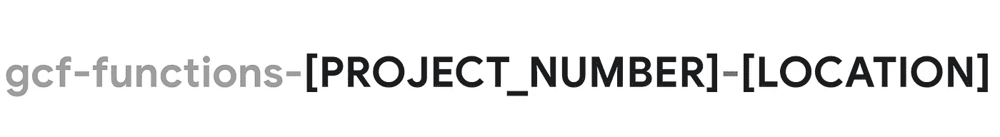

# 将你的谷歌云功能恢复到之前的版本

> 原文：<https://medium.com/google-cloud/rollback-your-google-cloud-function-to-its-previous-version-76db870744c6?source=collection_archive---------2----------------------->


照片由 [Testalize.me](https://unsplash.com/@testalizeme?utm_source=unsplash&utm_medium=referral&utm_content=creditCopyText) 在 [Unsplash](https://unsplash.com/?utm_source=unsplash&utm_medium=referral&utm_content=creditCopyText) 上拍摄

谷歌[云功能](https://cloud.google.com/functions)是一个无服务器的执行环境，允许用户用 7 种不同的语言运行他们的代码，有多个版本的语言运行时。它灵活、可扩展、可靠，可用于多种任务，包括运行生产工作流程步骤、开发运维任务、安全验证等。与其他提供商一样，它实施“按需付费”原则，没有隐藏成本(尊重其他一些云提供商，他们提供额外服务并向您收取费用)。

它几乎是完美的(是的，我为谷歌工作，热爱谷歌云)，几乎没有什么小缺点。我最近遇到的一个是能够快速回滚到先前部署的版本，而不需要经历[部署过程](https://cloud.google.com/functions/docs/deploy)。经过搜索，我在 stack overflow[找到了一个答案，它利用了云功能存储其部署工件的方式。首先，快速回顾一下这个方法。](https://stackoverflow.com/questions/46797662/retrieving-an-old-version-of-a-google-cloud-function-source)

当部署云函数时，工件被压缩到归档文件中，归档文件被存储到部署函数实例的同一个项目中的一个专门的云存储桶中。桶可以通过它的名字找到。对于第 1 代云函数，其名称如下



对于第二代来说，将会是这样


其中,[PROJECT_NUMBER]表示部署该功能的唯一 Google Cloud [项目编号](https://cloud.google.com/resource-manager/docs/creating-managing-projects#identifying_projects),[ LOCATION]是部署该功能的地区。

在 bucket 中，您可以找到包含函数工件的文件夹，对于第 1 代函数，文件夹的名称以函数名称开头，后面跟随着函数资源的唯一 id(GUID 格式),对于第 2 代函数，文件夹的名称就是函数的名称。

[监视流程](https://stackoverflow.com/questions/46797662/retrieving-an-old-version-of-a-google-cloud-function-source)上的解决方案描述了**第 1 代**功能的回滚。以下 bash 脚本使用 Google CLI 来完成同样的工作:

```
FUNCTION_NAME="place-your-function-name-here"
PROJECT_ID="place-your-project-id-here"
PROJECT_NUM=$(gcloud projects describe $PROJECT_ID \
  --format="value(project_number)")
VERSION_NUM=$(gcloud functions describe --project=leoy-toolbox \
  $FUNCTION_NAME --format="value(version_id)")
BUILD_NUM=$(gcloud functions describe --project=leoy-toolbox \
  $FUNCTION_NAME --format="value(build_id)")
LOCATION=$(gcloud functions describe --project=leoy-toolbox \
  $FUNCTION_NAME --format="value(name)") | awk -F/ '{ print $4 }')
SOURCE=$(gsutil --p=$PROJECT_ID ls \
  gs://gcf-sources-$PROJECT_NUM-$LOCATION/$FUNCTION_NAME* \
  | grep -v "version-$VERSION_NUM" | tail -1)
gcloud functions deploy --project=$PROJECT_ID $FUNCTION_NAME \
  --source=$SOURCE/function-source.zip \
  --region=$LOCATION
```

该脚本使用已知的项目 id 和函数名来检索其他信息，比如项目号、函数的位置、最新版本以及到先前版本工件的路径。然后它使用工件的 URI 来部署它。

> **注:**此处的前一版本仅指从两个文件夹中选择一个，其名称不以当前部署版本的版本 id 结尾。

然而，这将有一个重要的限制。如果发生以下部署序列，回滚工件将包含无效的部署代码/配置，而不是“当前成功部署之前的最后工作版本”。


这是因为第 1 代云函数工件似乎只存储了*和*两个*最后一个*版本，而不管成功状态如何。

第二代云功能的情况要好得多。对于他们来说，具有该功能名称的文件夹存储了启用了[历史特征](https://cloud.google.com/storage/docs/object-versioning)的`function-source.zip`文件。因此，从理论上讲，您可以回滚到“最后好的”版本。然而，由于没有任何迹象表明哪个以前的版本是“好的”，这可能是一件棘手的事情。

**总结**，可以在不运行 vs 源代码管理系统的情况下回滚之前部署的云功能版本。然而，该特性利用了未记录的存储云函数工件的方法，还不能用于生产工作流。

**剧透**:第二代云功能支持此功能的“工作正在进行中”。虽然没有做出承诺，但在 23 英尺的 H1 期待它是合理的🤞