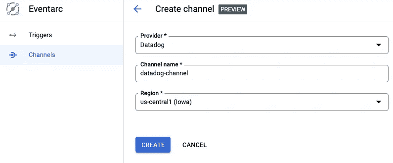
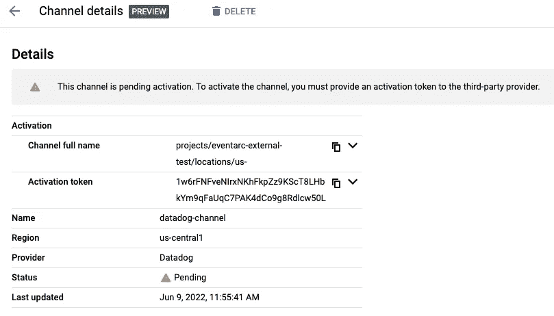
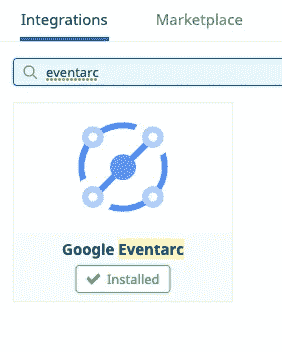
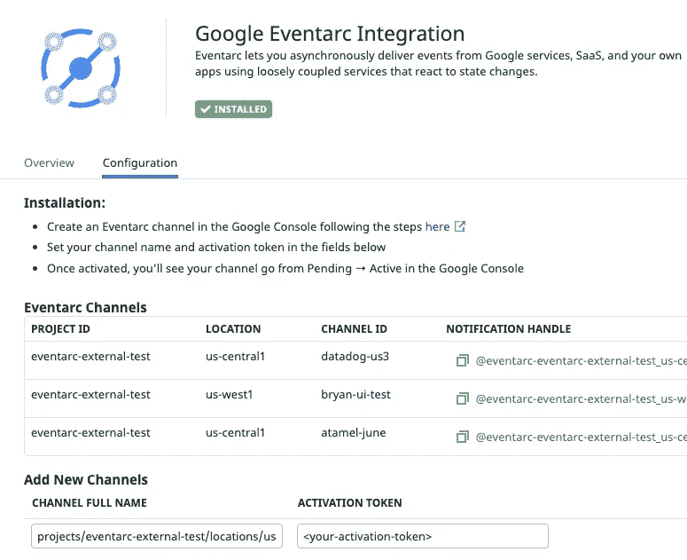
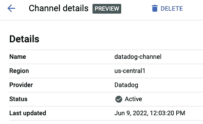
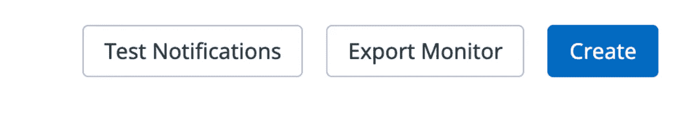
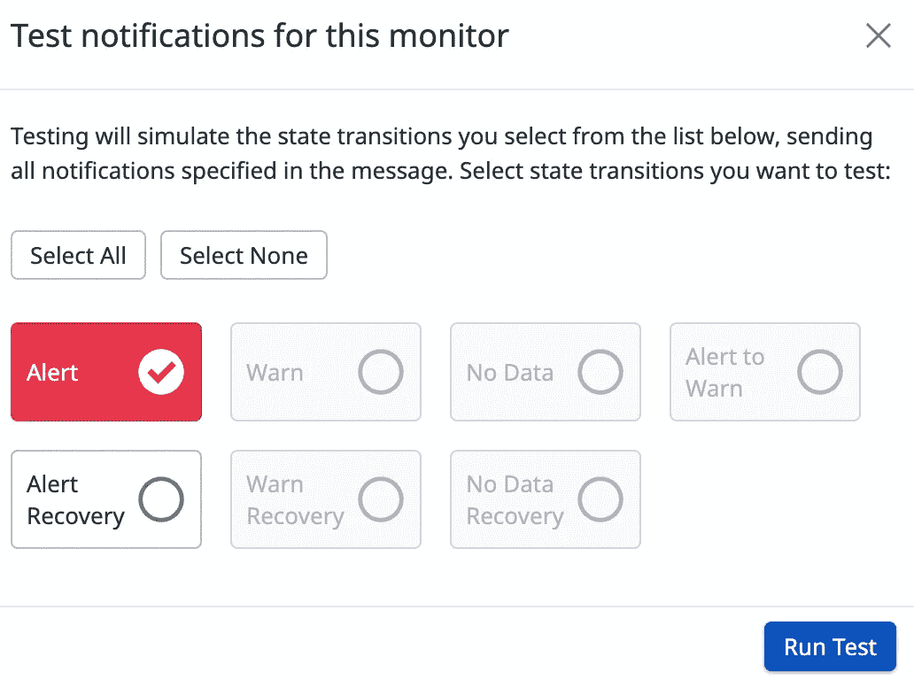
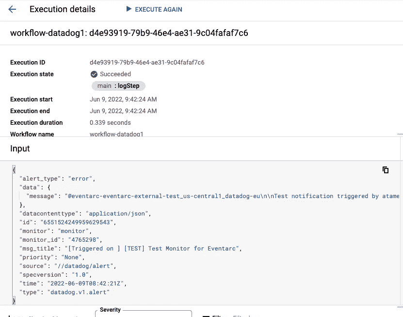

# 使用 Eventarc 将 Datadog 监控警报路由到 Google Cloud

> 原文：<https://medium.com/google-cloud/route-datadog-monitoring-alerts-to-google-cloud-with-eventarc-a6f3bddaa033?source=collection_archive---------0----------------------->

*注:这是我在谷歌云博客*上 [*原创文章*](https://cloud.google.com/blog/topics/developers-practitioners/route-datadog-monitoring-alerts-google-cloud-eventarc) *的转贴*

几周前，我们[宣布了](https://cloud.google.com/blog/products/application-development/eventarc-3rd-party-sources-preview) [Eventarc](https://cloud.google.com/eventarc/docs) 的 [第三方活动来源](https://cloud.google.com/eventarc/docs/third-parties/third-parties-overview)，首批第三方供应商由我们的生态系统合作伙伴提供。这篇博文描述了如何监听来自第三方提供商之一 [Datadog](https://www.datadoghq.com/dg/monitor/google-cloud-platform/?utm_source=Referring+Site%5B%E2%80%A6%5D=ReferringTraffic&utm_campaign=ReferringTraffic-2022codelabs) 的事件，并通过 Eventarc 将它们路由到 Google Cloud 中的一个服务。

[Datadog](https://www.datadoghq.com/dg/monitor/google-cloud-platform/?utm_source=Referring+Site%5B%E2%80%A6%5D=ReferringTraffic&utm_campaign=ReferringTraffic-2022codelabs) 是云应用的监控平台。它将端到端的跟踪、指标和日志结合在一起，使您的应用程序和基础设施变得可观察。在 Datadog 中，您可以[创建监视器](https://docs.datadoghq.com/monitors/create/)来跟踪指标、事件、日志、集成可用性和网络端点，并且您可以在这些监视器上设置[警报阈值](https://docs.datadoghq.com/monitors/)。一旦达到这些阈值，Datadog 会通过电子邮件、Slack 通知您的团队或服务，现在还会通过 Eventarc 通知 Google 云服务。

让我们来看看如何设置一个监视器，并在达到阈值时通知 Google 云服务。

# 发现 Datadog 提供者

Eventarc 提供者是一种服务或实体，可以直接向 Google Cloud 发出事件；这些事件随后被路由到您的项目。第三方提供商，如 Datadog，是通过 Eventarc 与 Google Cloud 集成的非 Google Cloud 提供商。

您可以在 Google Cloud Console 中的某个区域或使用`gcloud`查看所有 Google Cloud 提供商(以及 Datadog 提供商):

```
gcloud eventarc providers list --location us-central1NAME                             LOCATION
pubsub.googleapis.com            us-central1
cloudaudit.googleapis.com        us-central1
firebasedatabase.googleapis.com  us-central1
storage.googleapis.com           us-central1
datadog                          us-central1
```

# 创建一个频道

要从提供者接收事件，您需要[建立一个通道](https://cloud.google.com/eventarc/docs/third-parties/create-channels)。该过程包括创建和激活与提供商的通道:

您可以从 Google Cloud Console 的 Eventarc 部分创建 Datadog 通道:



在您向 Datadog 发送激活令牌之前，通道将处于挂起状态:



登录 Datadog，转到 integrations 页面，确保安装了 Google Eventarc 集成:



在 Google Eventarc 集成的配置部分，输入完整的通道名称和激活令牌:



几秒钟后，您应该会在 Google Cloud 控制台中看到该频道处于活动状态:



现在，您已经准备好使用通道了。

# 创建工作流

您需要 Google Cloud 中的一个目的地来接收来自 Datadog 的事件。Eventarc 支持许多事件目的地，包括云运行、工作流和 Kubernetes 服务。在这种情况下，部署一个工作流来简单地记录收到的事件。

```
main:
  params: [event]
  steps:
  - logStep:
      call: sys.log
      args:
        data: ${event}
```

请注意，工作流正在接收一个事件作为参数。该事件将通过 Eventarc 来自 Datadog 监控。一旦接收到事件，工作流只记录接收到的事件。

# 创建 Eventarc 触发器

现在，您可以使用 Eventarc 触发器将 Datadog 提供程序中的事件连接到工作流了。

使用数据狗通道、事件类型和工作流目标创建触发器:

```
gcloud eventarc triggers create datadog-trigger1 \
  --location $REGION \
  --destination-workflow $WORKFLOW_NAME \
  --destination-workflow-location $REGION \
  --channel $CHANNEL_NAME \
  --event-filters type=datadog.v1.alert \
  --service-account $[PROJECT_NUMBER-compute@developer.gserviceaccount.com](mailto:PROJECT_NUMBER-compute@developer.gserviceaccount.com)
```

# 创建一个数据狗监视器

现在您已经准备好创建一个 Datadog 监视器并将其连接到 Eventarc。在本例中，它是一个简单的 Hello-World 类型的监视器，具有默认值。您将手动触发它来生成监控警报，这又会在 Google Cloud 中生成 Eventarc 事件。

要在 Datadog 中创建监视器，首先登录 Datadog。然后将指针停留在主菜单中的`Monitors`上，点击`New Monitor`。显示器有多种类型。选择`Metric monitor`类型。

在`New Monitor`页面中，保留步骤 1 和 2 的默认值。

*   在步骤 3 中，将警报阈值设置为 1
*   在步骤 4 中，将`Test monitor for Eventarc`设置为监视器名称，并将`Notify your team`设置为`@eventarc_<your-project-id>_<your-region>_<your-channel-name>`

# 测试 Datadog 和 Eventarc 集成

要测试 Datadog 监视器和 Eventarc 触发器，您可以手动触发监视器。

在显示器创建页面的底部，点击`Test Notifications`按钮:



然后，点击`Run Test`按钮:



这应该模拟监视器中的状态转换并触发 Eventarc 事件。在工作流中，您应该看到有一个新的执行。在该执行的详细信息中，您应该可以在工作流输入和日志中看到由监控警报生成的 Datadog 事件类型`datadog.v1.alert`:



# 后续步骤

这篇文章讲述了如何使用 Eventarc 将 Datadog 监控警报发送到 Google Cloud。如果你想在你自己的项目中运行这些步骤，我们有一个[代码实验室](https://codelabs.developers.google.com/codelabs/cloud-route-datadog-eventarc-part-one)，你可以试试。

只有当您能够对警报采取行动时，监听警报才有用。在这个[第二代码实验室](https://codelabs.developers.google.com/codelabs/cloud-route-datadog-eventarc-part-two#0)中，您将学习如何通过工作流响应 Datadog 监控警报。更具体地说，您将创建两个计算引擎虚拟机，并使用 Datadog 监视器来监视它们。一旦其中一个虚拟机被删除，您将通过 Eventarc 收到来自 Datadog 的工作流警报。反过来，工作流将重新创建已删除的虚拟机，以使正在运行的虚拟机数量恢复到两个。这只是一个简单的例子，说明如何在 Google Cloud 中使用服务自动响应 Datadog 警报。

如有任何问题或反馈，请随时通过 Twitter [@meteatamel](https://twitter.com/meteatamel) 联系我。