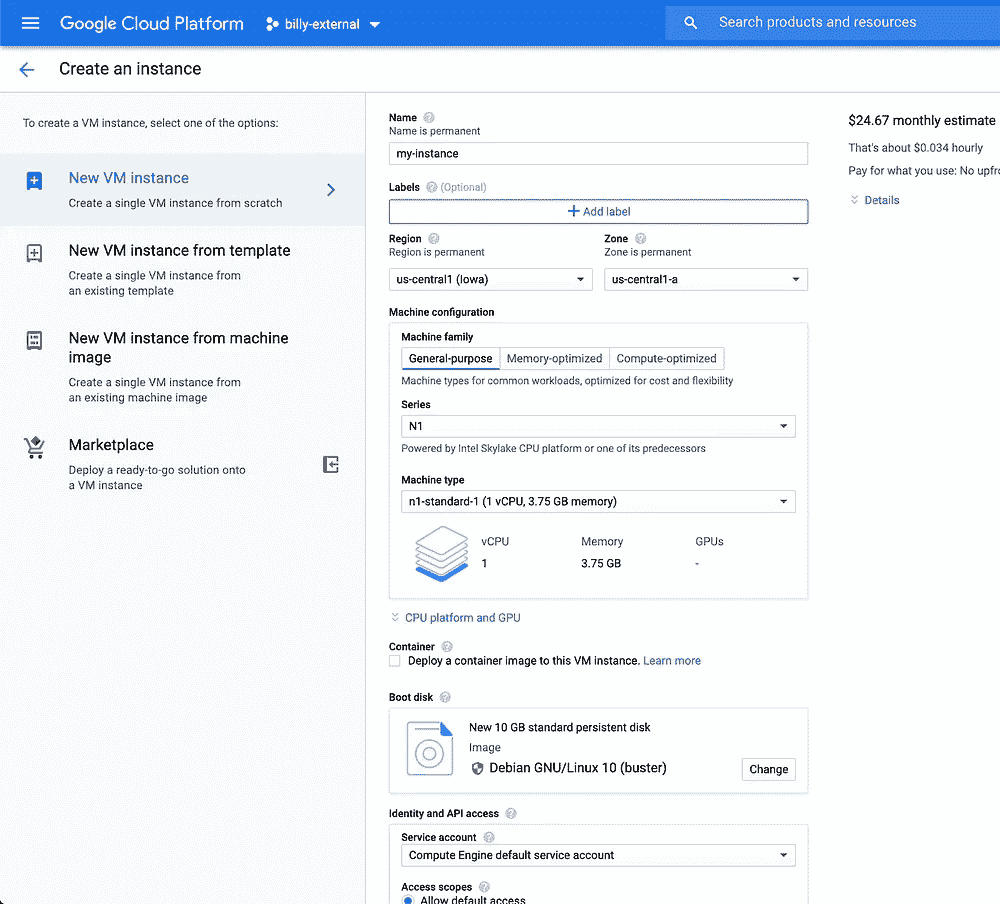
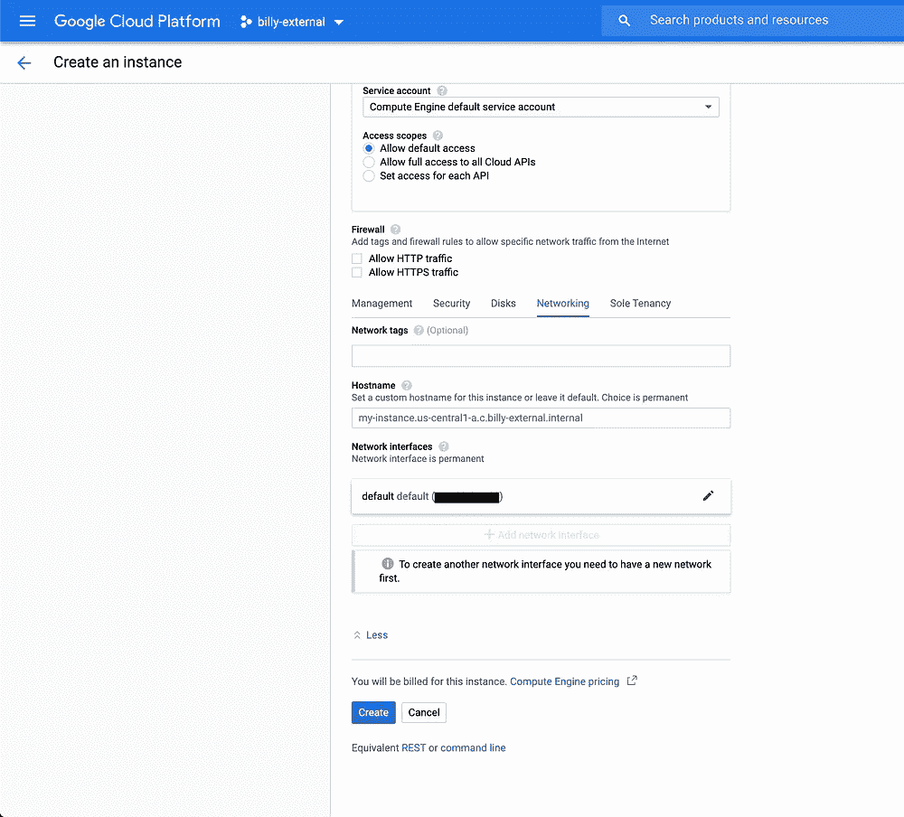
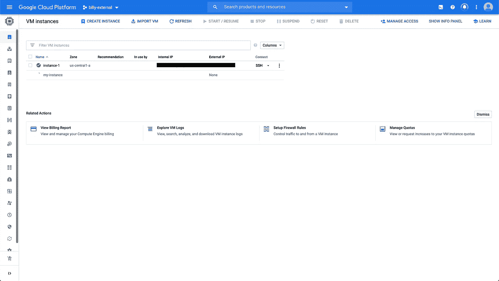
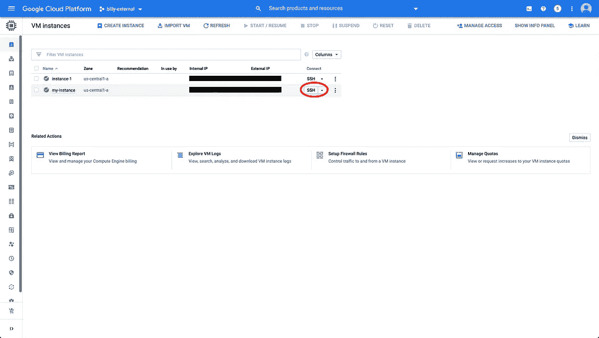
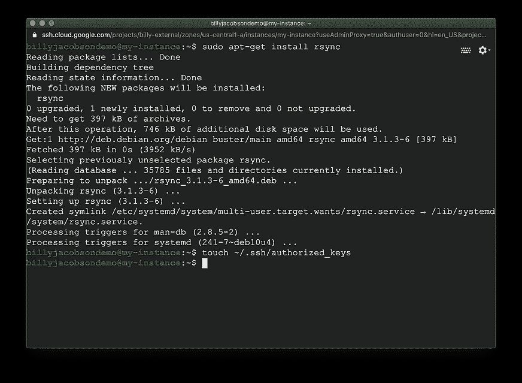
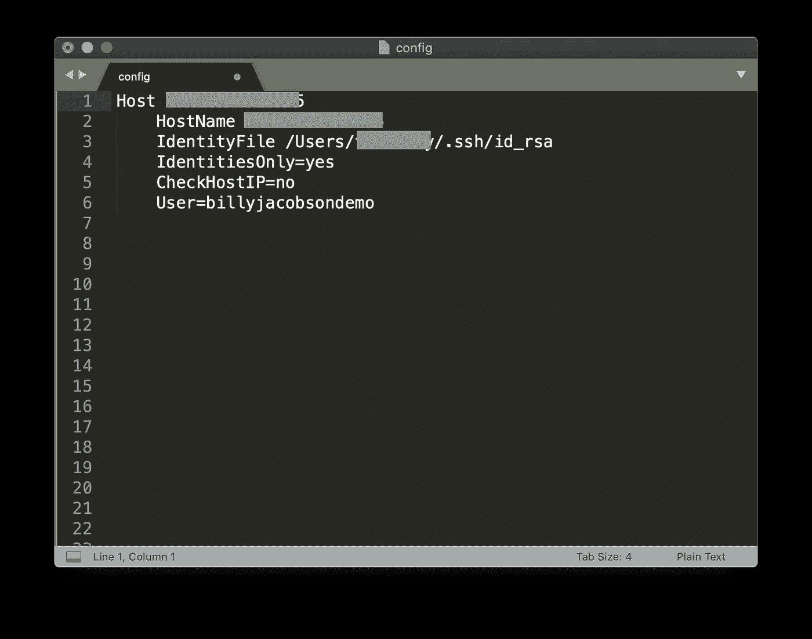
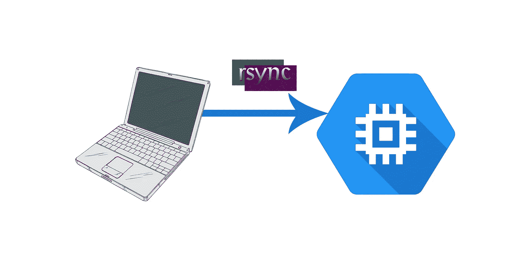

# GCP 计算引擎上的 Rsync:当你不能在本地运行你的代码时(网络问题)

> 原文：<https://medium.com/google-cloud/rsync-on-gcp-compute-engine-when-you-cant-run-your-code-locally-network-issues-cb2ff2c9c176?source=collection_archive---------1----------------------->

在我寻求学习一些新技术的过程中，由于网络问题，我遇到了从本地机器连接到我的服务器/实例/数据库的问题。解决这个问题的方法是在同一个网络上的虚拟机上运行我的代码，但是在我发现 Rsync 之前，把我的代码放到机器上似乎是一个令人沮丧的过程。Rsync 是一个命令行应用程序，允许您轻松地在计算机或虚拟机之间传输和同步文件。

# 创建虚拟机

为此，我将使用谷歌云平台，但这种技术应该适用于任何虚拟机。我将创建一个虚拟机，重要的主要设置是网络。您会希望这个网络与其他资源所在的网络相同。这很可能只是违约。



我点击 create 并等待实例化。



# 安装 rsync 并设置 SSH

通过云控制台将 SSH 连接到您的虚拟机，以执行接下来的步骤。



通过运行以下命令，在 Ubuntu 虚拟机上安装 rsync:

```
sudo apt-get install rsync
```

将您将要用来连接虚拟机的[公钥](https://git-scm.com/book/en/v2/Git-on-the-Server-Generating-Your-SSH-Public-Key)(我使用的是`~/.ssh/id_rsa.pub`)添加到虚拟机的`~/.ssh/authorized_keys`文件中。如果你愿意，你可以为你的代码创建一个新的目录。

```
touch ~/.ssh/authorized_keys
vi ~/.ssh/authorized_keys # paste the key from your local machine in here
mkdir code_goes_here
```

# 用 rsync 设置您的本地计算机

现在，回到您的本地机器。在这上面也安装 rsync。我在苹果电脑上，所以我用自制软件，但用你喜欢的命令行安装程序。

```
brew install rsync
```

现在，您可以进入代码目录，运行 rsync 将代码从本地计算机下载到 VM。

```
cd my_code
rsync -a $PWD/ [YOUR_IP_ADDRESS]:code_goes_here/
```



如果您遇到权限或公钥被拒绝的问题，请尝试连接到 VM 以确保一切正常。您可以将特定的公钥和用户名添加到 SSH 命令中，看看是否有帮助。如果这样做了，将它们添加到您的`~/.ssh/config`文件中，这样 rsync 将在连接时自动使用它们。



# 运行您的代码

最后，检查你的虚拟机，你的代码应该在那里！运行代码，如果你需要修改，编辑你的本地文件，rsync 并返回你的虚拟机。

```
cd code_goes_here
ls # Check that your code is there.
mvn compile exec:java
```