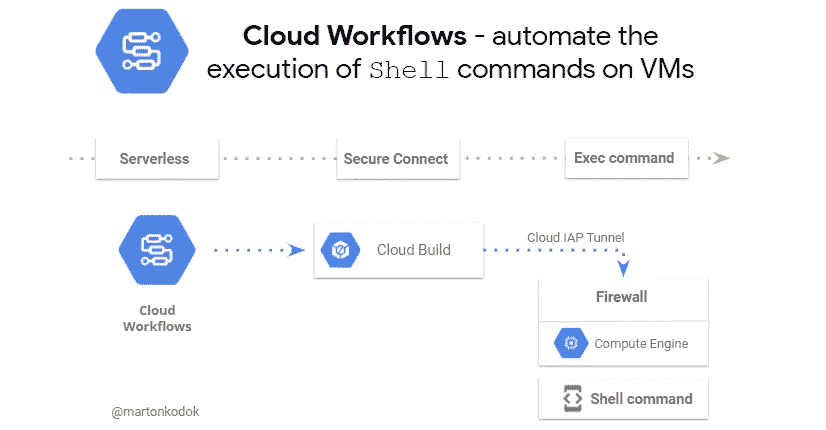

# 运行 shell 命令并将计算引擎虚拟机与云工作流相协调

> 原文：<https://medium.com/google-cloud/run-shell-commands-and-orchestrate-compute-engine-vms-with-cloud-workflows-e345e616a24?source=collection_archive---------1----------------------->

**自动执行* ***shell 命令*** *完全无服务器且安全，无需管理私钥。与云架构师一起工作是一件多么愉快的事情。**

**

*云工作流—在虚拟机上自动执行 shell 命令*

*有时，作为工作流流程的一部分，有必要连接到虚拟机以执行不同的任务。我们将讨论连接到 Linux 虚拟机并执行…*