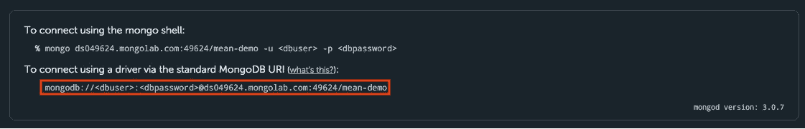

# 使用 App Engine 和 MongoLab 在 Google 云平台上运行平均堆栈

> 原文：<https://medium.com/google-cloud/running-a-mean-stack-on-google-cloud-platform-with-app-engine-and-mongolab-4bbd2040ea75?source=collection_archive---------0----------------------->


在我之前的两篇文章中，我谈到了用 Docker 运行一个 [MEAN stack，然后通过使用 Kubernetes](http://blog.sandeepdinesh.com/2015/07/running-mean-web-application-in-docker.html) 的[使它更加健壮。](/google-cloud/running-a-mean-stack-on-google-cloud-platform-with-kubernetes-149ca81c2b5d)

在这篇文章中，我将偏离主题，采取不同的方法。假设您不关心所有这些复杂的东西，您只想让您的应用程序运行和扩展，而不用担心虚拟机、pod、Docker 等等…

要做到这一点，使用平台即服务(PaaS)是有意义的，这是一种有趣的说法，即您编写代码，我们运行代码。不需要服务器或数据库管理，这让您可以专注于构建一个伟大的产品！

## 工具

谷歌的 PaaS 被称为[应用引擎](https://cloud.google.com/appengine/)。App Engine 可以[运行 Node.js](https://cloud.google.com/nodejs/getting-started/hello-world) 并处理所有的扩展和维护，所以你不必这么做。

对于数据库，我将使用 [MongoLab](https://mongolab.com/google/) 。它是你所知道和喜爱的 MongoDB，但你不需要担心托管它。

# 步骤 1:创建数据库

[报名 MongoLab](https://mlab.com/google/) 。


点击橙色按钮！

创建帐户后，您应该会看到一个控制面板。


点击“新建”。

我在使用谷歌云平台的免费计划。

此外，确保**数据库名称为*mean-demo*，因为这是我们的示例应用程序所期望的。**

您的配置应该如下所示:


单击“创建新的 MongoDB 部署”后，您应该会看到新的数据库启动并运行:


单击数据库，并注意连接 URI。



现在，创建一个用户，以便应用程序可以连接到数据库:


完成了。

# 第二步:获取代码

前往[console.developers.google.com](http://console.developers.google.com)并选择(或创建)您的项目。对于本教程的其余部分，我将使用[云外壳](https://www.youtube.com/watch?v=hBMcAKzGt3w)，它基本上是浏览器中的命令行，已经安装了您需要的所有工具。真的很酷！


激活你的云壳

现在，引入示例代码:

```
$ git clone [https://github.com/thesandlord/mean-demo.git](https://github.com/thesandlord/mean-demo) app
$ cd app
```

并修复配置，以便可以连接到 MongoLab 实例:

```
$ URI=<dbuser>:<dbpassword>@XXXXX.mongolab.com
$ DBPORT=####
$ sed -i -- "s/localhost:27017/$URI:$DBPORT/g" app.js
```

将 *< dbuser >* 和 *< dbpassword >* 替换为您在步骤 1 中指定的内容。

用您的数据库 ID 替换 XXXXX(在我的例子中，是 *ds049624* )。

用您的数据库端口替换####(在我的例子中，是 *49624* )。

您在这里所做的只是将 MongoDB 客户端更改为使用您的 MongoLab 实例。

# 步骤 3:测试代码

使用 Cloud Shell，您可以轻松地测试您的代码，就像它在本地机器上运行一样。

```
$ npm install$ npm start
```

您应该看到这个:


现在，启动 Web 预览(单击云外壳上的小按钮):


哒哒，成功了！


如果您添加一些数据，它会将其添加到您的 MongoLab 数据库中。试试看！

# 步骤 4:部署代码

虽然云壳非常适合测试，但它不能托管您的应用程序！是时候部署到生产环境了！

在代码中，有一个名为 **app.yaml，**的文件包含了所有的部署细节。让我们来看看:

```
runtime: nodejs
vm: true
```

不言自明。 ***vm: true*** 选项让 App Engine 知道它应该使用[托管 vm 运行时](https://cloud.google.com/appengine/docs/managed-vms/)(即 Docker)。

要部署，请运行:

```
$ gcloud preview app deploy app.yaml --promote
```

或者你可以使用简写(感谢 **package.json** 文件):

```
$ npm run deploy
```

部署将开始。

*gcloud* 会从云壳环境和你的 **app.yaml** 文件中拉取项目配置。

App Engine 将复制您的代码，创建 Docker 容器，启动虚拟机和负载平衡器，并启动您的代码。你只要坐下来放松。

一旦你看到这个:

```
$ Deployed module [default] to [https://XXXX.appspot.com]
```

你完了。去网址看看你的意思是应用程序运行！


就是这样！现在，您不需要担心服务器崩溃或数据库管理。当然，你失去了一些灵活性，因为你不是吹毛求疵每一个小细节，但对大多数应用程序来说，应用引擎工作得很好！

更多信息，请查看 [Node.js 入门指南](https://cloud.google.com/nodejs/)和 [MongoLab 文档](http://docs.mongolab.com/)。