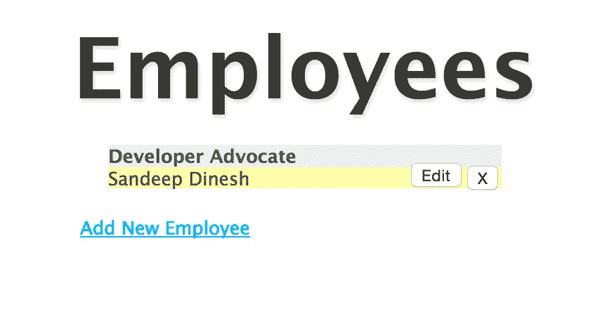

# 使用 Kubernetes 在 Google 云平台上运行平均堆栈

> 原文：<https://medium.com/google-cloud/running-a-mean-stack-on-google-cloud-platform-with-kubernetes-149ca81c2b5d?source=collection_archive---------0----------------------->


在我最近的一篇文章中，我谈到了用 T2 的 Docker 容器运行一个普通的堆栈。

手动部署容器很好，但是相当脆弱和笨拙。如果应用崩溃了会怎么样？app 怎么更新？回滚？

**这篇文章将对容器世界进行更深入的探讨。我假设你已经阅读/完成了第一部分** **。有很多内容，但如果你只是浏览一下，所有步骤应该只需要 15 分钟左右！**

幸运的是，我们可以使用一个名为 [Kubernetes](http://kubernetes.io/) 的系统来管理集群环境中的容器。更好的是，Google 有一个名为 [Google Container Engine](https://cloud.google.com/container-engine/) 的 Kubernetes 托管版本，因此您可以在几分钟内启动并运行。

## 背景:

在谷歌，很少有人真正登录生产机器来执行更新。有了数百万台服务器，你可以看到这是如何变得不可能的。手动登录服务器也为人为错误留下了空间。

相反，我们使用一个叫做 [Borg](http://static.googleusercontent.com/media/research.google.com/en//pubs/archive/43438.pdf) 的系统来为我们进行管理。

简而言之，你告诉博格运行 X 份你的工作，博格就会去做。乔布斯死了？博格将开始一个新的。健康检查失败？博格会停止这项工作并开始一项新的工作。

我们吸取了 Borg 的经验教训，并开发了一个名为 Kubernetes 的开源项目。Kubernetes 允许您管理一个机器集群，并在其上运行容器。相当酷的东西，它刚刚达到 1.0 版本！

## 使用 Kubernetes 的基础

在我们开始讨论之前，了解一下 Kubernetes 的一些基本知识是很重要的。

*   **容器:**这些是 Docker、rtk、AppC 或者任何你正在运行的容器。你可以把这些想象成亚原子粒子。一切都是由它们组成的，但你很少(如果有的话)与它们直接互动。
*   **豆荚:**豆荚是库伯内特斯的基本成分。它们是一组容器，被安排在一起，一起生活，一起死亡。

为什么您想要一组容器，而不仅仅是一个容器？假设您有一个日志处理器、一个网络服务器和一个数据库。如果您不能使用 pod，那么您必须将日志处理器捆绑在 web 服务器和数据库容器中，并且每次更新其中一个时，您都必须更新另一个。有了 pod，您可以为 web 服务器和数据库重用相同的日志处理器。

*   **复制控制器:**这是 Kubernetes 的管理组件，非常酷。您给它一套 pod，告诉它“我想要三份拷贝”，它会在您的集群上创建这些拷贝。它会尽最大努力保持这些副本始终运行，所以如果一个崩溃了，它就会启动另一个。
*   **服务:**这是复制控制器的另一面。服务是一组 pod 的单一联系点。例如，假设您有一个复制控制器，它创建了一个 web 服务器窗格的四个副本。一项服务将把流量分成四份。服务是“永久的”，而它们背后的吊舱可以来去自如，所以使用服务是一个好主意。

## 第 1 步:创建容器

在我之前的文章中，我使用现成的容器来保持简单。

我有一个库存 MongoDB 容器和一个库存 Node.js 容器。Mongo 容器在没有任何修改的情况下运行良好。然而，我不得不手动输入 Node 容器来提取和运行代码。显然，这在 Kubernetes 的土地上并不理想，因为你不应该登录你的服务器！

相反，您必须构建一个自定义容器，其中已经包含代码并自动运行。

为此，您需要使用更多的 Docker。确保在本教程的剩余部分安装了最新版本。

**获取代码:**

开始之前，让我们运行一些代码。您可以在您的个人机器上或云中的 Linux 虚拟机上继续。我建议使用 Linux 或 Linux 虚拟机；在 Mac 和 Windows 上运行 Docker 不在本教程的范围内。

```
$ git clone [https://github.com/ijason/NodeJS-Sample-App.git](https://github.com/ijason/NodeJS-Sample-App.git) app
$ mv app/EmployeeDB/* app/
$ sed -i -- 's/localhost/mongo/g' ./app/app.js
```

这是我们之前运行的同一个示例应用程序。第二行只是将 EmployeeDB 子文件夹中的所有内容移到应用程序文件夹中，以便于访问。第三行再次用 *mongo* 代理替换了硬编码的 *localhost* 。

**打造码头工人形象:**

首先，您需要一个*文件*。这基本上是 Docker 用来构建容器图像的指令列表。

以下是网络服务器的文件目录:

```
FROM node:0.10.40RUN mkdir -p /usr/src/app
WORKDIR /usr/src/app
COPY ./app/ ./
RUN npm installCMD ["node", "app.js"]
```

Dockerfiles 非常不言自明，这个非常简单。

首先，它使用官方的 Node.js 图像作为基础图像。

然后，它创建一个文件夹来存储代码，将代码复制到该目录中，并使用 npm 安装依赖项。

最后，它指定了容器启动时应该运行的命令 Docker，也就是启动应用程序。

## 第 2 步:构建我们的容器

现在，该目录应该如下所示:

```
$ ls
Dockerfile app
```

让我们建造。

```
$ docker build -t myapp .
```

这将为你的应用程序建立一个新的 Docker 映像。这可能需要几分钟时间，因为它正在下载和构建所有内容。

**补充说明:**在图像名称前面放一个用户 id 是一个好习惯，例如:

```
$ docker build -t my-user-id/myapp .
```

但在本教程中，我将忽略这种做法。

完成后，进行测试:

```
$ docker run myapp
```

此时，您应该有一个运行在 http://localhost:3000 上的服务器(如果您在 Mac 或 Windows 上，这就不会那么简单了)。由于没有数据库运行，网站会出错，但我们知道它是有效的！


## 第三步:推动我们的容器

现在你有了一个定制的 Docker 映像，你必须从云中访问它。

由于我们将通过谷歌容器引擎使用图像，推送图像的最佳地点是[谷歌容器注册中心](https://cloud.google.com/tools/container-registry/)。容器注册表建立在[谷歌云存储](https://cloud.google.com/storage/)之上，所以你可以从容器引擎获得可扩展存储和快速访问的优势。

首先，确保你已经安装了最新版本的[Google Cloud SDK](https://cloud.google.com/sdk/)。

[Windows 用户点击此处。](https://dl.google.com/dl/cloudsdk/release/GoogleCloudSDKInstaller.exe)

对于 Linux/Mac:

```
$ curl https://sdk.cloud.google.com | bash
```

然后，确保您**登录并更新**。

```
$ gcloud auth login
$ gcloud components update
```

现在你可以推集装箱了。我们需要我们的谷歌云项目 ID(我们在[第一部分](http://blog.sandeepdinesh.com/2015/07/running-mean-web-application-in-docker.html)做了一个)。

```
$ docker tag myapp gcr.io/<YOUR-PROJECT-ID>/myapp
$ gcloud docker -- push gcr.io/<YOUR-PROJECT-ID>/myapp
```

过一段时间，就结束了。您可以检查控制台，以查看容器是否已被推高。


## 步骤 4:创建集群

现在您有了自定义容器，让我们创建一个集群来运行它。

目前，一个集群可以小到一台机器，大到 100 台机器。您可以选择任何想要的机器类型，因此您可以拥有一个包含单个 f1-micro 实例、100 个 n1-standard-32 实例(3，200 个内核！)，以及介于两者之间的任何东西。

在本教程中，我将使用以下内容:

*   创建一个名为"**均值-聚类**的聚类
*   给它一个大小为 **2** 的节点
*   机器类型将为“**n1-标准-1**
*   区域将是"**美国中部-1f** "(使用靠近您的区域)

创建该集群有两种方法。你挑吧。

*   命令行:

```
$ gcloud container \
  --project "temporal-loop-94520" \
  clusters create "mean-cluster" \
  --zone "us-central1-f" \
  --machine-type "n1-standard-1" \
  --num-nodes "2" \
  --network "default"
```

*   图形用户界面:


几分钟后，您应该会在控制台中看到这个。


## 步骤 5:创建数据库服务

需要创造三样东西:

*   存储数据的持久磁盘(pod 是短暂的，所以我们不应该在本地保存数据)
*   运行 MongoDB 的复制控制器
*   映射到复制控制器服务

要创建磁盘，请运行以下命令:

```
$ gcloud compute disks create \
  --project "temporal-loop-94520" \
  --zone "us-central1-f" \
  --size 200GB \
  mongo-disk
```

非常简单，只需选择与您的集群相同的区域以及适合您的应用程序的磁盘大小。

现在，我们需要创建一个**复制控制器**来运行数据库。我使用的是复制控制器，而不是 Pod，因为如果一个独立的 Pod 死掉了，它不会自动重启。

```
# db-controller.yml
apiVersion: v1
kind: ReplicationController
metadata:
  labels:
    name: mongo
  name: mongo-controller
spec:
  replicas: 1
  template:
    metadata:
      labels:
        name: mongo
    spec:
      containers:
      - image: mongo
        name: mongo
        ports:
        - name: mongo
          containerPort: 27017
          hostPort: 27017
        volumeMounts:
            - name: mongo-persistent-storage
              mountPath: /data/db
      volumes:
        - name: mongo-persistent-storage
          gcePersistentDisk:
            pdName: mongo-disk
            fsType: ext4
```

很简单的东西。我们调用控制器 *mongo-controller，*指定一个副本，*并打开适当的端口。图像是 *mongo* ，这是现成的 MongoDB 图像。*

volumes 部分创建供 Kubernetes 使用的卷。有一个特定于 Google 容器引擎的 gcePersistentDisk 部分，它将我们制作的磁盘映射到 Kubernetes 卷中，我们将该卷挂载到/data/db 目录中(如 MongoDB Docker 文档中所述)

现在我们有了控制器，让我们创建**服务**

```
#db-service.yml
apiVersion: v1
kind: Service
metadata:
  labels:
    name: mongo
  name: mongo
spec:
  ports:
    - port: 27017
      targetPort: 27017
  selector:
    name: mongo
```

同样，非常简单的东西。我们“选择”要服务的 mongo 控制器，打开端口，并调用服务 *mongo* 。

这就像我在上一篇文章中使用 Docker 的“link”命令行选项一样。我们没有连接到 *localhost* ，而是连接到 *mongo，*Kubernetes 将流量重定向到 mongo 服务！

此时，本地目录如下所示

```
$ ls
Dockerfile app db-controller.yml db-service.yml
```

## 步骤 6:运行数据库

首先，让我们“登录”到集群

```
$ gcloud container clusters get-credentials mean-cluster
```

现在创建控制器。

```
$ kubectl create -f db-controller.yml
```

还有服务。

```
$ kubectl create -f db-service.yml
```

kubectl 是 Kubernetes 命令行工具(随 Google Cloud SDK 自动安装)。我们只是在创建文件中指定的资源。

此时，数据库正在加速运转！您可以使用以下命令检查进度:

```
$ kubectl get pods
```

一旦你看到 mongo pod 处于运行状态，我们就可以开始了！

```
$ kubectl get pods
NAME                    READY  REASON   RESTARTS AGE
mongo-controller-xxxx   1/1    Running  0        3m
```

## 步骤 7:创建 Web 服务器

现在数据库正在运行，让我们启动 web 服务器。

我们需要两样东西:

*   用于加速和减速 web 服务器盒的复制控制器
*   向互联网展示我们网站的服务

让我们看看**复制控制器**的配置

```
# web-controller.yml
apiVersion: v1
kind: ReplicationController
metadata:
  labels:
    name: web
  name: web-controller
spec:
  replicas: 2
  template:
    metadata:
      labels:
        name: web
    spec:
      containers:
      - image: gcr.io/<YOUR-PROJECT-ID>/myapp
        name: web
        ports:
        - containerPort: 3000
          name: http-server
```

这里，我们创建一个名为 *web 控制器*的控制器，并告诉它创建两个副本。你要求的复制品？你可能会注意到*模板*部分看起来就像一个 Pod 配置，这是因为它确实如此。我们正在使用自定义 Node.js 容器创建一个 Pod，并公开端口 3000。

现在为**服务**

```
# web-service.yml
apiVersion: v1
kind: Service
metadata:
  name: web
  labels:
    name: web
spec:
  type: LoadBalancer
  ports:
    - port: 80
      targetPort: 3000
      protocol: TCP
  selector:
    name: web
```

注意这里的两件事:

*   型号为*负载平衡器*。这是一个很酷的功能，将使谷歌云平台为这项服务自动创建一个外部网络负载平衡器！
*   我们将外部端口 80 映射到内部端口 3000，这样我们就可以在不干扰防火墙的情况下提供 HTTP 流量。

此时，本地目录如下所示

```
$ ls
Dockerfile app db-pod.yml db-service.yml web-service.yml
web-controller.yml
```

## 步骤 8:运行 Web 服务器

创建控制器。

```
$ kubectl create -f web-controller.yml
```

还有服务。

```
$ kubectl create -f web-service.yml
```

并检查状态。

```
$ kubectl get pods
```

一旦您看到 web pods 处于运行状态，我们就可以开始了！

```
$ kubectl get pods
NAME                   READY     REASON    RESTARTS   AGE
mongo-controller-xxxx  1/1       Running   0          4m
web-controller-xxxx    1/1       Running   0          1m
web-controller-xxxx    1/1       Running   0          1m
```

## 步骤 9:访问应用程序

此时，一切都已启动并运行。架构看起来像这样:


默认情况下，负载平衡器上的端口 80 应该是打开的。为了找到我们的应用程序的 IP 地址，运行以下命令:

```
$ gcloud compute forwarding-rules list
NAME     REGION        IP_ADDRESS       IP_PROTOCOL TARGET
abcdef   us-central1   104.197.XXX.XXX  TCP         us-xxxx
```

如果你去的 IP 地址列出，你应该看到应用程序启动和运行！


数据库工作正常！



## 最后的想法

通过使用 Container Engine 和 Kubernetes，我们有了一个非常健壮的、基于容器的 MEAN stack 在生产中运行。

在我的下一篇文章中，我将介绍如何设置 MongoDB 副本集。这对于生产中的运行非常重要。

希望我可以发布更多关于 Kubernetes 高级主题的帖子，比如更改集群大小和 Node.js web 服务器副本的数量，在同一个集群上使用不同的环境(dev、staging、prod ),以及进行滚动更新。