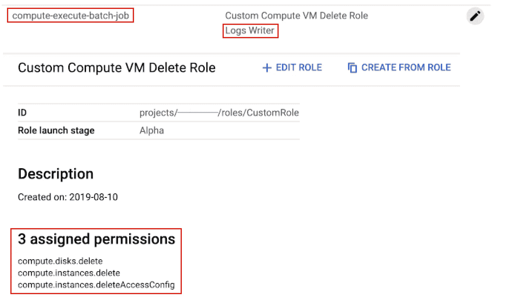

# 使用云调度程序、云功能和计算引擎在 GCP 上运行无服务器批处理工作负载

> 原文：<https://medium.com/google-cloud/running-a-serverless-batch-workload-on-gcp-with-cloud-scheduler-cloud-functions-and-compute-86c2bd573f25?source=collection_archive---------0----------------------->

本快速入门指南是一个系列的一部分，展示了如何利用 Google 云平台组件以更简单的方式运行批处理工作负载。熟悉 AWS 的人，有一个很棒的工具叫做 [AWS Batch](https://aws.amazon.com/batch/) ，但是看看 GCP 的产品，我们如何能够以类似的方式运行批处理作业呢？
让我们深入研究 GCP 文档: [aws-comparison](https://cloud.google.com/docs/compare/aws/)

图一。AWS 和 GCP 服务比较

更深入地看文档…GCP 推荐的完成这个用例的方法是:[可靠-任务-调度-计算-引擎](https://cloud.google.com/solutions/reliable-task-scheduling-compute-engine)
快速总结:**云调度器- >发布/订阅- >启动虚拟机**

文档中引用了一个启动和停止虚拟机的示例:[按计划启动和停止计算引擎实例](https://cloud.google.com/scheduler/docs/start-and-stop-compute-engine-instances-on-a-schedule)

但是这种方法有一个缺陷，在批处理工作负载完成后，虚拟机不会被删除，因此我们要支付存储成本。我们如何才能让它更高效，变成一个更加**无服务器**的解决方案？

图二。有人举手提问

等等，你怎么能在同一个句子里谈论 VM 和 serverless 呢？有些东西闻起来有鱼腥味…

的确如此，但这些问题很快就会得到解答，所以请继续关注我…

图 3。吃爆米花的家伙

首先，让我介绍一下我们将使用的解决方案，它使用 **GCP** 组件，使批处理执行更加**无服务器化**:

图 4。预定批处理体系结构

> *顺便说一下，将在本解决方案中使用的所有****GCP****组件都有一个自由层=)*

# 1 —云调度程序

这是我们批处理过程的起点:

*“云调度器是一款完全托管的企业级 cron 作业调度器。它允许您安排几乎任何作业，包括批处理、大数据作业、云基础架构操作等。您可以自动化一切，包括失败时的重试，以减少人工劳动和干预。Cloud Scheduler 甚至可以作为单一平台，让您从一个位置管理所有自动化任务。”*

进入[页面](https://console.cloud.google.com/cloudschedule)开始你的云调度配置。

要配置我们的起点，我们需要开始创建云计划程序作业，这非常简单:

图 5。创建云计划程序作业

这里的重要字段有**名称、频率、时区、目标、**和**主题**。现在，我们不需要担心有效负载，只需要在那里留下一个空的 JSON，因为这个字段是必需的。

注意**时区**和**频率**的 cron 表达式，这就是你的**目标**将被执行的时间。

作为**目标，**我们将使用 **Pub/Sub** 和当我们按 **Create** 、**T21 时，我们将看到我们的调度作业信息:**

图 6。已创建云计划程序

借助云计划程序，您甚至可以使用*“立即运行”*选项手动触发 **Target** 执行，但立即运行将返回错误。**执行-批处理**主题还不存在，我们来修正一下……

# 2 —发布/订阅

我们将通过创建 Pub/Sub 主题来修复该错误，它将作为我们的中介:

图 7。Pub/Sub 主题充当中间人

*“Cloud Pub/Sub 是一个完全管理的实时消息服务，允许您在独立应用程序之间发送和接收消息。”*

转到[此页面](https://console.cloud.google.com/cloudpubsub)启动 Pub/Sub 配置。

创建 Pub/Sub 主题就像填写主题名称一样简单！

图 8。创建发布/子主题

当我们按下 **Create Topic** 时，我们的 Pub/Sub 协调器已经准备好为下一个组件提供支持。

# 3 —执行

## 云功能将是一个达到 Pub/Sub 的手！

*“Google Cloud Functions 是一款轻量级计算解决方案，可让开发人员创建响应 Cloud 事件的单一用途独立函数，而无需管理服务器或运行时环境。”*

所以，我们来修改一下……一旦**云调度器**被触发，它就会向 **Pub/Sub** 主题发布一条消息，启动**云功能**。

最后，我们的**云功能**将创建一个**计算引擎虚拟机**，负责运行我们的批处理工作负载。

图 9。给我看看代码迷因

这是我们将用于运行 Cloud Function 的代码。

注意，我们使用的是`@google-cloud/compute`客户端库，这是我们执行引擎的核心，方法`createInstance`负责启动运行我们批处理进程的机器。`vmConfig`属性将包含我们虚拟机工作负载的所有指令，让我们深入研究一下…

## 计算引擎

对于我们的 VM 工作负载，我们选择了一个非常简单的用例，它向 Stackdriver Logging 发送“Hello World”消息。

*“stack driver Logging 允许您存储、搜索、分析、监控和警告来自 Google Cloud Platform 和 Amazon Web Services (AWS)的日志数据和事件。我们的 API 还允许从任何来源获取任何定制日志数据。Stackdriver 日志记录是一项完全托管的服务，可大规模执行，并可从数千个虚拟机接收应用程序和系统日志数据。更好的是，您可以实时分析所有日志数据。”*

让我们看看虚拟机将要执行的代码:

基本上，我们在这里做 3 件事…

第 1 行:向 Stackdriver Logging 发送我们的“Hello World”消息，并告诉它写入`batch-execution`键，以便我们稍后可以跟踪它。

第 2 行:从内部元数据端点检索下一行需要的`gcp_zone`。

> 要了解更多关于**检索实例元数据**的信息，请访问官方[文档](https://cloud.google.com/compute/docs/storing-retrieving-metadata)。

第 3 行:

> 知道虚拟机执行完毕的最佳演员是谁？那就是虚拟机本身！

这里，我们在完成批处理工作负载后删除虚拟机。这就是我们如何使它成为无服务器的，或者尽可能接近的。

图 10。一个激动人心的时刻

听起来不错，但是我们如何将该脚本放入虚拟机中，然后在我们的云功能上配置它呢？

转到[此页面](https://console.cloud.google.com/compute)启动您的计算引擎配置。

转到用户界面，我们将输入以下字段:

图 11。计算引擎配置第 1 部分

> 注意:记住使用一个 **f1 微实例**，因为它有一个空闲层。

在上图中，一切都保留默认值，我们将选择一个名为**Compute-execute-batch-job**的预配置服务帐户，这很重要，因为默认服务帐户没有删除计算引擎虚拟机的正确权限。

看看服务帐户是如何配置的，最佳做法是仅添加这种工作负载所需的角色:

图 12。具有自定义角色的服务帐户

这就是如何使用 **gcloud** 命令行创建服务帐户，您也可以使用[云控制台](https://console.cloud.google.com)来完成此操作。

> 要了解更多关于**服务账户**和**角色**的信息，请访问官方[文档](https://cloud.google.com/compute/docs/access/service-accounts)。

在服务帐户之后，向下滚动我们的计算引擎 UI，我们有一个启动脚本字段，我们将在其中粘贴我们的工作负载脚本:

图 13。计算引擎配置第 2 部分

记住一件事，是**云函数**要创建我们的虚拟机，所以我们不会点击创建命令，而是点击上面图片中的 **REST** 选项。

通过这样做，它将向我们展示可以在 API 调用中使用的完整 JSON:

图 14。计算引擎等效剩余命令

现在我们已经有了用 VM 配置包装云函数所需的东西，让我们回过头来用 REST 调用中的 JSON 更新它:

> *注意:JSON 中的一些字段可以被删除以使用默认值，所以它变得更小了，但是我想展示它是多么简单，你只需复制和粘贴即可。*

记住从 JSON 属性的键中去掉双引号，并确保在属性`vmConfig`中使用的区域值与第 5 行中的`const zone`相同。同样，替换`const projectId`来使用你的项目。

我们快到了！我们现在只需要部署我们的**云函数**并将其连接到**发布/订阅**主题，让我们使用 UI 来完成。

进入[本页面](https://console.cloud.google.com/functions)开始您的云功能配置。

查看用户界面:

图 15。云功能 UI

我们主要有 3 个重要的字段:Trigger、Index.js 和要执行的函数。

触发器:这里我们可以选择选项来调用云函数，我们将选择我们的 Pub/Sub 主题`execute-batch-process`。

Index.js tab:这个字段包含了调用云函数时将要执行的代码，所以在这里粘贴`create_instance_function`代码。

要执行的函数:使用云函数运行时将被调用的方法的名称，`createInstance`。

一件有时被遗忘的小事，因为 Google Cloud 通过云功能为我们管理一切，我们还需要像标准 NodeJS 应用程序一样提供`package.json`,因为我们在这种情况下使用 javascript。

代码如下:

我们将它添加到 **package.json** 选项卡中:

为了成为好公民，我们将再次遵循最佳实践，并使用仅具有所需权限的服务帐户:

图 17。显示选定的服务帐户

服务帐户`function-create-vm`配置了一个**服务帐户用户角色**和一个**自定义角色**，包含以下权限:

*   计算.磁盘.创建
*   compute . instances . addaccess config
*   compute.instances.attachDisk
*   计算.实例.创建
*   compute.instances.setMetadata
*   compute . instances . setserviceaccount
*   compute.subnetworks.use
*   compute . subnetworks . useexternalip

好了，现在我们可以按**创建**😄，我们准备一起测试一切！

我们会看到这样的情况:

图 18。成功创建云功能

我喜欢看到✔️的图标！

如果我们现在回到我们的[云调度作业](https://console.cloud.google.com/cloudscheduler)，并手动触发它，我们可以看到一切都在一起工作。

图 19。引擎运行

几秒钟后转到计算引擎[页面](https://console.cloud.google.com/compute)，你会看到一个新的虚拟机正在运行，前缀为**批处理-作业-执行器**，后跟执行时间，这是一个小技巧，所以我们总是有一个唯一的名称，如果我们以后需要跟踪问题。

图 20。正在创建虚拟机

几秒钟后，您会看到虚拟机名称前的图标发生了变化，这是因为虚拟机正在被删除，一旦删除完成，虚拟机将从实例页面中消失。

图 21。正在删除的虚拟机

最后，为了确保它确实做了一些事情，我们将堆栈驱动日志[页面](https://console.cloud.google.com/logs)，当我们过滤`batch-execution`键时，我们可以看到我们的 **Hello World** 消息！👌🏻

图 22。Stackdriver 日志显示 Hello World 消息

> 请记住，该批处理工作负载将根据以 Chould scheduler**频率**编程的 cron 表达式按计划运行。

# 今天就到这里吧！

这是展示如何使用 Google 云平台以更简单的方式运行批量工作负载的系列文章的第一篇。需要指出的是，我们在这里使用了计算引擎，但您也可以使用其他组件运行批处理，如带任务队列的应用引擎、GKE 和 GCP 计算家族云运行的最新成员。

在这篇文章中，我们展示了一个非常简单的批处理工作负载来帮助您开始，为了使它无服务器，我们确保在它完成执行后删除了虚拟机。想想看，我们使用了其他无服务器组件，如云调度程序、发布/订阅和云功能，唯一的区别是 GCP 在管理资源，并为我们创建和删除这些资源……引用我一个朋友的话:*“无服务器解决方案永远不会是无服务器的。幕后总有一个服务器……”*

感谢您的宝贵时间！请继续关注下一篇文章，我们将展示一个更复杂的工作负载，向这个解决方案添加 Docker 和容器注册表。干杯！

[更新]第 2 部分已发布:

[将 Docker 和集装箱注册添加到组合中](/google-cloud/serverless-batch-workload-on-gcp-adding-docker-and-container-registry-to-the-mix-558f925e1de1)

[更新]谷歌宣布[无服务器工作流程](https://cloud.google.com/workflows)

# 参考

*   **面向 AWS 专业人员的谷歌云平台**:[https://cloud.google.com/docs/compare/aws/](https://cloud.google.com/docs/compare/aws/)
*   **具有云调度器的计算引擎上的可靠任务调度**:[https://Cloud . Google . com/solutions/Reliable-task-scheduling-Compute-Engine](https://cloud.google.com/solutions/reliable-task-scheduling-compute-engine)
*   **谷歌云平台免费层**:[https://cloud.google.com/free/](https://cloud.google.com/free/)
*   **云调度快速入门**:[https://cloud.google.com/scheduler/docs/quickstart](https://cloud.google.com/scheduler/docs/quickstart)
*   **发布/订阅文档**:[https://cloud.google.com/pubsub/docs/](https://cloud.google.com/pubsub/docs/)
*   **云函数文档**:[https://cloud.google.com/functions/](https://cloud.google.com/functions/)
*   **计算引擎文档**:【https://cloud.google.com/compute/ 
*   https://cloud.google.com/logging/**堆栈驱动测井文件**: