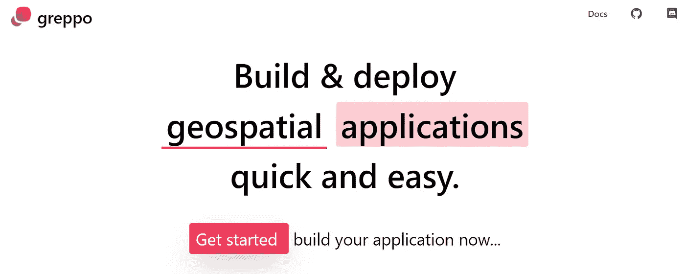
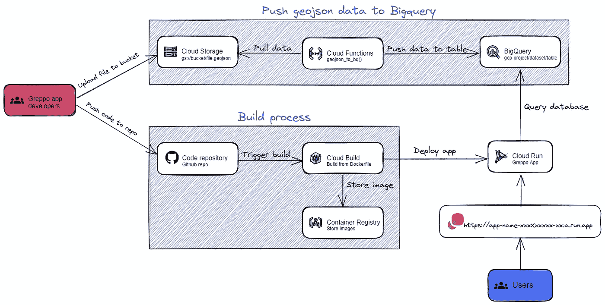
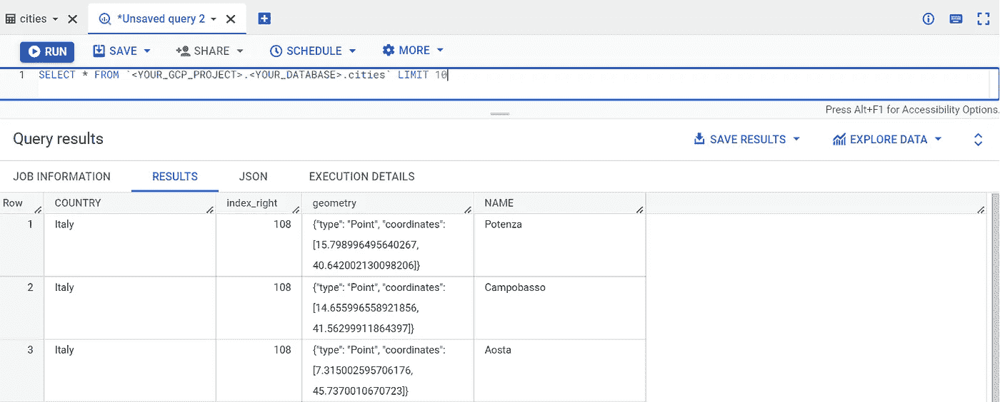
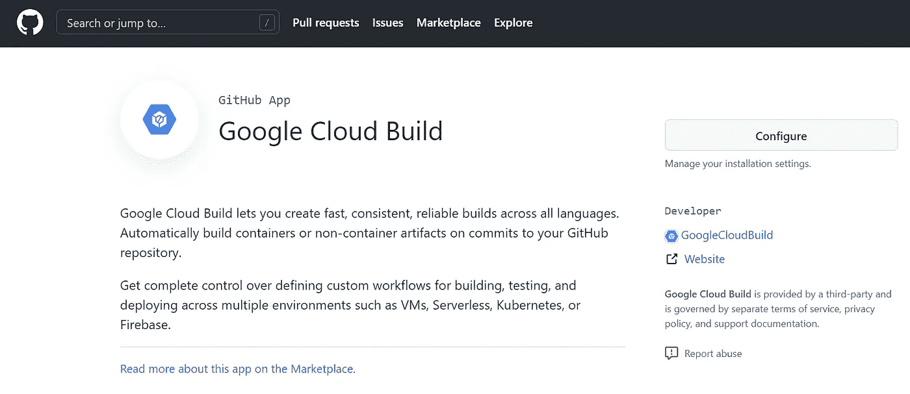
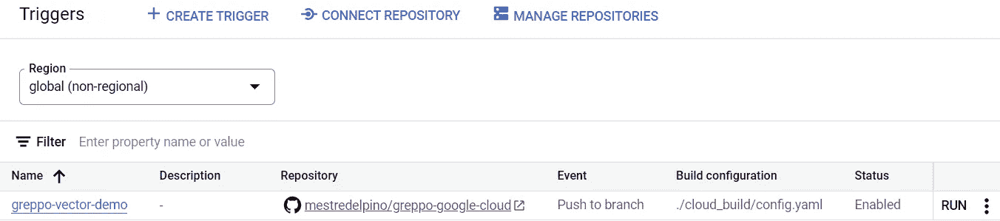
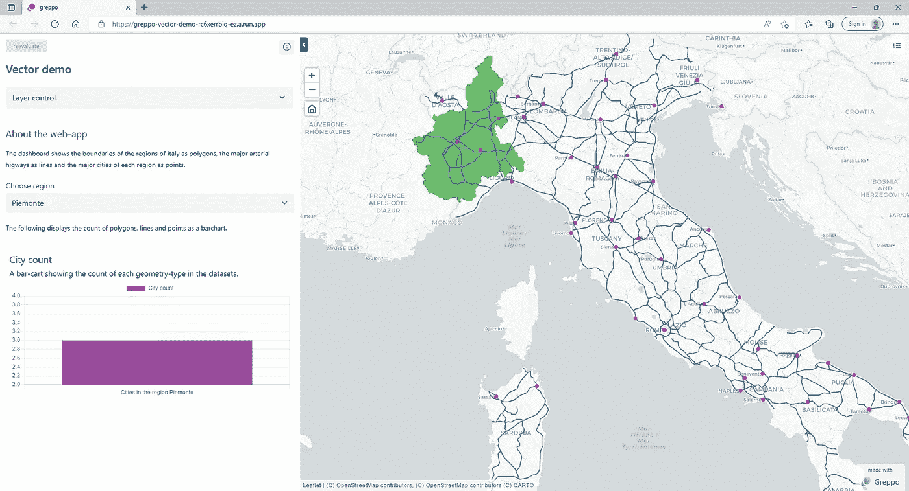

# 在谷歌云中运行无服务器的地理空间 python 应用

> 原文：<https://medium.com/google-cloud/running-a-serverless-geospatial-python-app-in-google-cloud-9d9d9c284c4d?source=collection_archive---------0----------------------->

作为一名地理空间科学家，您可能想知道定制的应用程序和可视化门户如何变成运行在云中的 web 应用程序。警告:这可能会让你掉进一个很深的兔子洞，最终你只能从事云计算工作。

几个月前，我偶然发现了 [Greppo](https://greppo.io/) 一个用于构建 GIS 应用程序的开源数据科学框架，它是我在代尔夫特大学的一个老同事正在构建的。很多人可能不知道，但我是通过地理信息系统以及随之而来的所有数据准备/分析/展示进入这个领域的。我当时不知道的是，如何设计和部署我的 GIS 应用程序，使其作为分布式应用程序在云中运行。但是我也不能说我已经有了所有的答案。这就是为什么我认为自己正在弥合数据科学和 IT 运营之间的知识差距，这将我带到了应用程序开发。

作为对 GCP 专业[云开发工程师](https://cloud.google.com/certification/cloud-devops-engineer)和 [GCP 专业云开发人员](https://cloud.google.com/certification/cloud-developer)的准备，我决定采用一个 Greppo 示例应用程序，并在谷歌云中自动部署它。我通常在 Kubernetes 上花很多时间，但这次我想了解谷歌云如何通过云运行和云功能利用无服务器计算的力量，这是受到 Wietse Venema 的书[用谷歌云运行构建无服务器应用](https://wietsevenema.eu/cloud-run-book/)的启发。

## 格雷波

Greppo 是一个 python 框架，用于快速创建地理空间应用程序和可视化门户。它使用了 [geopandas](https://geopandas.org/en/stable/) ，这是一个流行的开源项目，简化了使用 python 处理地理空间数据的工作。Geopandas 本身扩展了著名的 [pandas](https://pandas.pydata.org/) 库中的数据类型，以允许对几何类型进行空间操作(由 [shapely](https://shapely.readthedocs.io/en/stable/manual.html) 执行，并用 [matplotlib](https://matplotlib.org/) 绘制)。



## 一个 Greppo 应用程序的例子是什么样的？

让我们看看关于部署 Greppo 应用程序的官方文档，并将我们的注意力转移到 [greppo-demo](https://github.com/greppo-io/greppo-demo/blob/main/Dockerfile) 中提供的 Dockerfile:

```
# syntax=docker/dockerfile:1
FROM python:3.9-slim-buster
WORKDIR /src
COPY /vector-demo .
RUN pip3 install -r requirements.txt
CMD [“greppo”, “serve”, “app.py”, “ — host=0.0.0.0”] # Will serve on port 8080 of the container
```

Dockerfile 相当简单，它所做的只是将应用程序代码复制到容器中，安装所需的 python 包(使用 pip ),最后提供应用程序，在**app.py**上定义。到目前为止一切顺利，对吧？现在让我们看一下应用程序代码，重点看它是如何导入数据的:

```
regions = gpd.read_file("./regions.geojson")
# Display a layer in the map "the Greppo way"
app.vector_layer(
    data=regions,
    name="Regions of Italy",
    description="Polygons showing the boundaries of regions of Italy.",
    style={"fillColor": "#4daf4a"},
)
```

我们可以看到数据包含在 geojson 文件中，这些文件是从 app.py 所在的同一个目录中加载的。虽然这对于在笔记本电脑上运行的开发来说可能没问题，但在容器化应用程序的环境中，这无疑是一种糟糕的做法。这是为什么呢？容器的寿命并不长，这意味着当它们停止运行时，存储在其中的任何数据都会丢失。像 Kubernetes 这样的容器编排器用持久卷来处理这个问题，持久卷在容器启动时被附加到容器上，尽管将数据保存在 Kubernetes 集群之外通常是个好主意。无论如何，今天我不是来写 Kubernetes 的。因为我们只是运行一个简单的 python 应用程序，所以我们不需要整个 Kubernetes 集群；我们可以在 Google Cloud Run 中部署它。

# 在谷歌云中运行应用程序

在这个练习中，我们将在 Cloud Run 中部署一个**简单的 python 应用**，这是 Google Cloud 中一个完全托管的无服务器平台，与 [knative](https://knative.dev/docs/) 兼容。但是，在此之前，我们将在云存储桶中保存 geojson 文件，这将允许您将数据导入到您的应用程序中。我还将更进一步，展示如何**将数据推送到 BigQuery** ，以便您可以在应用程序中包含一些高级空间查询(类似于 geopandas，但在您的数据库中进行处理)。

为了构建我们的应用程序，我们将使用这些完全托管的服务和无服务器运行时，所有这些都包含在[自由层](https://cloud.google.com/free)中:

— **云存储:** *对象存储*。模仿典型的文件系统，非常适合存储我们的 geojson 文件。可以把它想象成一个全局文件夹，通过 HTTP 为你的文件提供服务。
— **大查询:** *无服务器数据仓库*。在我们的应用程序中包含高级地理空间查询。
— **云功能:** *事件驱动的无服务器运行时*。通过 HTTP 调用将 geojson 数据从云存储推送到 BigQuery。
— **云构建:** *无服务器 CI/CD 管道引擎*。以在每次新代码被推送到我们的 Github 库时触发应用程序的部署。
— **集装箱注册:** *集装箱注册*。我们的容器图像将存储在哪里。
— **云运行:** *无服务器运行时*。运行我们的 Greppo 应用程序。

现在让我们看看如何配置这些服务，以便为我们的自动化部署提供一个**可扩展、高度可用的架构**:



谷歌云中的 Greppo 架构

我们将采取以下步骤来部署我们的 Greppo 应用程序:

1.  **将 geojson 文件存储在云存储桶中:**以便可以在您的 Google Cloud 项目中访问它们。
2.  **创建一个大查询数据集**。
3.  **创建一个服务帐户:**该帐户将被分配给云功能，以便它可以从云存储中提取数据并将其推送到 BigQuery。
4.  **创建一个云函数来推送数据:**它将根据(HTTP)请求将数据从一个存储桶推送到 BigQuery。
5.  **将数据推送到 BigQuery** 。
6.  **在你的 Github repo** 里安装云跑 App。
7.  **通过云构建**自动化应用构建&部署流程。

## 第一步:存储。云存储桶中的 geojson 文件

Greppo 的矢量示例显示了意大利的整个道路网络、城市和地区。每个地理数据框架包含在不同的 geojson 文件中，该文件必须上传到云存储桶。您可以从 Greppo-Demo Github repo 下载它们:

```
# Make a directory to store the files
mkdir greppo-demo-data
# Copy the files from the original greppo-demo repo to your cloud console's disk in the newly created directory
curl https://raw.githubusercontent.com/greppo-io/greppo-demo/main/vector-demo/cities.geojson -o ./greppo-demo-data/cities.geojson
curl https://raw.githubusercontent.com/greppo-io/greppo-demo/main/vector-demo/roads.geojson -o ./greppo-demo-data/roads.geojson
curl https://raw.githubusercontent.com/greppo-io/greppo-demo/main/vector-demo/regions.geojson -o ./greppo-demo-data/regions.geojson
```

创建存储桶并将文件复制到其中:

```
gsutil mb -l <YOUR_GCP_REGION> gs://<YOUR_BUCKET_NAME>
gsutil cp -r greppo-demo-data/. gs://<YOUR_BUCKET_NAME>/
```

就这样，你的。geojson 文件现在位于您新创建的存储桶中。您可以从云控制台磁盘中删除这些文件，因为您不再需要它们。

```
rm -rf greppo-demo-data/
```

如果您想保持简单，并且**从 bucket** 导入您的数据，您可以这样做:

> 将文件加载到应用程序中(示例)

```
# Get filesystem from Google Cloud project
gcs_file_system = gcsfs.GCSFileSystem(project="<YOUR_GCP_PROJECT_NAME>")
# Define file location(s)
file_location = "gs:/bucket/example_file.geojson"
# Read files as json
with gcs_file_system.open(file_location) as file:
  file_json = json.load(file)
geodataframe = gpd.GeoDataFrame.from_features(file_json["features"])
```

恭喜你！现在，您已经减少了对容器本地文件系统的依赖，这无疑是构建云原生应用程序的一个步骤。虽然您现在可以重新编写代码，并使用 pandas/geopandas 进行其余的数据和地理空间处理，但建议将数据推送到数据库引擎，以执行更高级的空间查询，同时将一些处理任务卸载给它。

## 步骤 2:创建一个大查询数据集

虽然您可以创建一个云 SQL 并部署一个 Postgres 数据库实例(使用 PostGIS ),但是您需要为配置该数据库所分配的资源付费。有了 BigQuery，你只需为你使用的东西付费，它还可以执行[地理空间分析](https://cloud.google.com/bigquery/docs/geospatial-intro)！

创建大查询数据集:

```
bq mk -d <YOUR_DATASET_NAME> \
  --location=<YOUR_GCP_REGION> \
  --description=”<DATASET_DESCRIPTION>”
```

## 步骤 3:创建服务帐户

由于您的云功能需要进行身份验证，以从云存储中读取文件并将它们推送到 BigQuery，因此您需要创建一个服务帐户:

```
gcloud iam service-accounts create greppo-bq-data-pusher \
  --description=”DESCRIPTION” \
  --display-name=”Greppo BigQuery Data Pusher”
```

将服务帐户绑定到云存储对象查看器角色，以便它可以读取。桶中的 geojson 文件:

```
gcloud projects add-iam-policy-binding <YOUR_PROJECT_NAME> \
  --member=”serviceAccount:greppo-bq-data-pusher@<YOUR_PROJECT_NAME>.iam.gserviceaccount.com” \
  --role=”roles/storage.objectViewer”
```

也将其绑定到 BigQuery 数据所有者角色，以便它可以创建表并将数据推送到这些表:

```
gcloud projects add-iam-policy-binding <YOUR_PROJECT_NAME> \
  --member=”serviceAccount:greppo-bq-data-pusher@<YOUR_PROJECT_NAME>.iam.gserviceaccount.com” \
  --role=”roles/bigquery.dataOwner”
```

## 步骤 4:创建一个云函数来推送数据

克隆我的 Github repo，它包含完成这个练习所需的所有代码。

```
git clone [https://github.com/mestredelpino/greppo-google-cloud](https://github.com/mestredelpino/greppo-google-cloud)
```

你可以通过运行"*cat GRE PPO-Google-cloud/functions/bucket _ geo JSON _ to _ bq/bucket _ geo JSON _ to _ bq . py "*或者在 Github 中点击[这里](https://github.com/mestredelpino/greppo-google-cloud/blob/main/functions/bucket_geojson_to_bq/bucket_geojson_to_bq.py)来查看功能。

部署功能:

```
gcloud functions deploy geojson-to-bq \
 --gen2 \
 --runtime=python39 \
 --region=<YOUR_GCP_REGION> \
 --source=greppo-google-cloud/functions/bucket_geojson_to_bq/ \
 --entry-point=geojson_to_bq \
 --trigger-http \
 --service-account=greppo-bq-data-pusher@<YOUR_PROJECT_NAME>.iam.gserviceaccount.com
```

该函数将从 HTTP 请求中获取以下参数:

— Google Cloud 项目名
—桶名
—文件路径(在桶内)
—数据集名
—表名(创建数据并将其推送到)

## 步骤 5:将数据推送到 BigQuery

通过运行以下命令将数据推送到 BigQuery:

```
curl -m 70 -X POST <SERVICE_URL> \
 -H “Authorization:bearer $(gcloud auth print-identity-token)” \
 -H “Content-Type:application/json” \
 -d ‘{“PROJECT”:”<YOUR_PROJECT_NAME>”,
 “DATASET”:”<DATASET_NAME>”, 
 “TABLE”:”<NEW_TABLE_NAME>”, 
 “BUCKET”:”<YOUR_BUCKET_NAME>”, 
 “PATH_TO_FILE”:”<YOUR_FILE.geojson>”}’
```

*在 BigQuery 的交互控制台中进行测试查询(示例)*

通过对新创建的表之一运行查询，导航到 BigQuery 数据库，确认数据已成功上传:

```
SELECT * FROM table `<YOUR_GCP_PROJECT>.<YOUR_DATASET>.cities` LIMIT 10
```



查询示例

> *从 BigQuery 加载数据(示例)*

我们可以将 BigQuery 中的数据加载到 python 脚本中，如下所示:

```
import google.cloud.bigquery as bq

def get_geodataframe(table,columns):
    sql_query = f"""
        SELECT ST_GeogFrom(geometry) as geometry, {columns}
        FROM {table}
    """
    geodataframe = bigquery_client.query(sql_query).to_geodataframe()
    return geodataframe

cities_df = get_geodataframe(f"<YOUR_GCP_PROJECT>.<DATASET_NAME>.<TABLE_NAME>","<COLUMNS_TO_DISPLAY>")
```

get_geodataframe()函数提取整个表并返回一个 geodataframe 对象。

> *更多示例查询*

我另外创建了另外两个 python 函数来查询 BigQuery 数据集。在这种情况下，一个是仅通过名称选择地理要素，另一个是显示给定面内包含的所有点(例如，查看特定区域内有多少个城市)

```
def choose_feature(table,columns,feature_name):
    sql_query = f"""
        SELECT ST_GeogFrom(geometry) as geometry, {columns} FROM {table} WHERE reg_name = '{feature_name}'
    """
    geodataframe = bigquery_client.query(sql_query).to_geodataframe()
    return geodataframe

def point_in_polygon(columns,points_table_id,polygons_table_id,polygons_key,polygons_value):
    sql_query = f"""
        SELECT {columns} FROM {points_table_id} as points 
        JOIN {polygons_table_id} as polygons 
        ON ST_Within(ST_GeogFrom(points.geometry), ST_GeogFrom(polygons.geometry)) 
        WHERE polygons.{polygons_key} = '{polygons_value}'
    """
    geodataframe = bigquery_client.query(sql_query).to_geodataframe()
    return geodataframe
```

## 步骤 6:在你的 Github repo 中安装云构建应用

Cloud Build 是一项在 Google Cloud 上执行容器构建的服务。它通过从不同来源(云存储、云资源仓库、Github……)导入源代码来工作。要使 Cloud Build 能够使用 Github 作为源代码库自动构建容器，您必须在 repo 中安装 Cloud Build 应用程序。(别忘了分叉[我的回购](https://github.com/mestredelpino/greppo-google-cloud)，也就是你要安装云跑 app 的地方)

不幸的是，没有办法使用 gcloud 或 git CLIs 来执行安装，所以您必须使用 Github 的用户界面。

点击[此处](https://github.com/marketplace/google-cloud-build)在你的 Github repo 中安装云构建应用。



Github 市场中的谷歌云构建应用

## 步骤 7:通过云构建自动化应用构建和部署流程

我们现在将创建一个云构建触发器，每当有新的推送到回购的“主”分支时，它将部署我们应用程序的新版本。你也可以创建更多指向其他分支的触发器，以便在把它们推到“主”分支之前测试你的应用程序的新特性。我写了一个相对简单的[构建配置文件](https://github.com/mestredelpino/greppo-google-cloud/blob/main/cloud_build/config.yaml)，它将执行这三个步骤:

1.从源代码
2 构建容器的新版本。将其推至容器注册表
3。将其作为应用程序的新版本部署到云运行

现在让我们创建触发器:

```
gcloud beta builds triggers create github \
    --name greppo-italy \
    --branch-pattern="^main$" \
    --repo-name=greppo-google-cloud \
    --repo-owner=<YOUR_GITHUB_USERNAME> \
    --build-config="./cloud_build/config.yaml" \
    --substitutions _PROJECT=<PROJECT_NAME>,_DATASET=<DATASET_NAME>,_DEPLOY_REGION=<YOUR_GCP_REGION>,_SERVICE_NAME=<YOUR_SERVICE_NAME>,_MAX_INSTANCES=<MAX_INSTANCES>
```

现在，您可以在云构建中看到新创建的触发器:



如果您现在不想对应用程序进行任何更改，您可以点击 **RUN** 并手动触发构建。

如果您希望通过 Internet 访问您的应用程序，请通过运行以下命令来允许未经身份验证的用户:

```
gcloud run services add-iam-policy-binding <YOUR_SERVICE_NAME> \
    --member="allUsers" \
    --role="roles/run.invoker" \
    --region=<YOUR_GCP_REGION>
```

现在，您可以转到云运行菜单中的应用程序，并单击外部链接，这将在新的浏览器选项卡上显示您正在运行的应用程序:



# 临终遗言

记住这一点很重要，您可以使用这种方法来部署许多不同的应用程序。我们的代码只是从 BigQuery 加载数据，并使用 Greppo 将其呈现在地图中(以及侧栏)。

和我的许多博客一样，这对我来说既是一个学习的过程，也是一个分享我在一个特定主题上所学到的东西的机会。如果你有关于如何更好地实现的建议，请在下面的评论中告诉我。