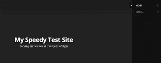

# 在 Google 云存储上与 Hugo 一起运行一个静态网站

> 原文：<https://medium.com/google-cloud/running-a-static-website-with-hugo-on-google-cloud-storage-f84320f6ab35?source=collection_archive---------0----------------------->

我和雨果打过一些交道，这是一个用格朗语编写的静态网站生成器，最近得到了很多好评。在我的同事沃伦·润克的建议下，我还尝试将 Hugo 生成的静态文件托管在[谷歌云存储](https://cloud.google.com/storage/) (GCS)上。这样就不需要启动任何服务于这些文件的实例。当然，您也可以通过使用 AWS S3 来实现这一点。

你首先需要注册一个谷歌云平台(GCP)账户。您可以使用新帐户获得 30 天的免费试用。一旦你登录到 Google Cloud [控制台](https://console.cloud.google.com/)，你需要创建一个新项目。姑且称之为 **my-gcs-hugo-project** 。

还需要在 GCS 中创建一个桶。如果要从该存储桶中自动为站点提供服务，则需要为该存储桶指定与站点相同的名称。让我们假设你称水桶为 hugotest.mydomain.com。你必须验证你是否拥有 mydomain.com，方法是在 DNS 区域文件中为指向 google.com 的 mydomain.com 创建一个特殊的 CNAME，或者在 hugotest.mydomain.com 提供的 HTML 文件中添加一个特殊的 META 标记(你可以通过临时将 hugottest CNAME 绑定到[www.mydomain.com](http://www.mydomain.com)并将 HEAD 标记添加到 www 的主页来实现后者)。

如果需要自动部署到 GCS，最好创建一个 GCP **服务帐户**。单击 GCP 控制台左上方的“汉堡包”菜单，然后依次转至“权限”和“服务帐户”。创建一个新的服务帐户并下载 JSON 格式的私钥(该密钥将被称为类似于**my-GCS-Hugo-project-a37b 5 ACD 7 BC 5 . JSON**的东西。

假设您的服务帐户称为**my-GCP-service-account 1**。该账户将自动分配类似于**my-GCP-service-account 1 @ my-GCS-Hugo-project . iam . gserviceaccount . com**的电子邮件地址。

我希望能够使用 Jenkins 将 Hugo 生成的静态文件部署到 GCS。因此，我在 Jenkins 服务器上作为运行 Jenkins 进程的用户(在我的例子中为用户 Jenkins):

1)遵循这些步骤安装了 Google Cloud SDK

```
$ wget [https://dl.google.com/dl/cloudsdk/channels/rapid/google-cloud-sdk.tar.gz](https://dl.google.com/dl/cloudsdk/channels/rapid/google-cloud-sdk.tar.gz)$ tar xvfz google-cloud-sdk.tar.gz$ cd google-cloud-sdk/$ ./install.sh- source .bashrc**$ which gcloud**
 **/var/lib/jenkins/google-cloud-sdk/bin/gcloud**
```

2)将服务帐户的私钥**my-GCS-Hugo-project-a 37 b5 ACD 7 BC 5 . JSON**复制到。jenkins 用户的 ssh 目录。

3)使用 **gcloud** 命令行实用程序激活服务帐户(仍然作为用户 jenkins)

```
**$ gcloud auth activate-service-account — key-file .ssh/my-gcs-hugo-project-a37b5acd7bc5.json**Activated service account credentials for: [my-gcp-service-account1@my-gcs-hugo-project.iam.gserviceaccount.com]
```

4)将当前 GCP 项目设置为 **my-gcs-hugo-project**

```
**$ gcloud config set project my-gcs-hugo-project****$ gcloud config list**Your active configuration is: [default][core]account = my-gcp-service-account1@my-gcs-hugo-project.iam.gserviceaccount.comdisable_usage_reporting = Trueproject = my-gcs-hugo-project
```

5)通过 **gsutil** 命令行实用程序配置 GCS(这实际上可能是多余的，因为我们已经用 gcloud 配置了项目，但我把它留在这里，以防您在只使用 gcloud 时遇到问题)

```
**$ gsutil config -e**It looks like you are trying to run “/var/lib/jenkins/google-cloud-sdk/bin/bootstrapping/gsutil.py config”.The “config” command is no longer needed with the Cloud SDK.To authenticate, run: gcloud auth loginReally run this command? (y/N) yBacking up existing config file “/var/lib/jenkins/.boto” to “/var/lib/jenkins/.boto.bak”…This command will create a boto config file at /var/lib/jenkins/.boto containing your credentials, based on your responses to the following questions.What is the full path to your private key file? **/var/lib/jenkins/.ssh/my-gcs-hugo-project-a37b5acd7bc5.json**Please navigate your browser to [https://cloud.google.com/console#/project,](https://cloud.google.com/console#/project,)then find the project you will use, and copy the Project ID string from the second column. Older projects do not have Project ID strings. For such projects, click the project and then copy the Project Number listed under that project.What is your project-id? **my-gcs-hugo-project**Boto config file “/var/lib/jenkins/.boto” created. If you need to use a proxy to access the Internet please see the instructions in thatfile.
```

6)将上面创建的服务帐户添加为铲斗**hugotest.mydomain.com**的所有者

7)从 jenkins 服务器的本地文件系统复制一个测试文件到桶**hugotest.mydomain.com**(仍然以用户 Jenkins 登录)，然后列出桶中的所有文件，然后移除测试文件

```
**$ gsutil cp test.go gs://hugotest.mydomain.com/**Copying file://test.go [Content-Type=application/octet-stream]…Uploading gs://hugotest.mydomain.com/test.go: 951 B/951 B**$ gsutil ls gs://hugotest.mydomain.com/**gs://hugotest.mydomain.com/test.go**$ gsutil rm gs://hugotest.mydomain.com/test.go**Removing gs://hugotest.mydomain.com/test.go…
```

8)创建了一个 Jenkins 作业，用于将给定网站的所有静态文件上传到 GCS

假设所有这些静态文件都签入到 GitHub 中，Jenkins 作业将首先签出它们，然后执行如下操作(其中 TARGET 是从 Jenkins 多项选择下拉列表中为此作业选择的值):

```
BUCKETNAME=$TARGET# upload all filee and disable caching (for testing purposes)**gsutil -h “Cache-Control:private” cp -r * gs://$BUCKETNAME/**# set read permissions for allUsersfor file in `find . -type f`; do # remove first dot from file name file=${file#”.”} **gsutil acl ch -u allUsers:R gs://${BUCKETNAME}${file}**done
```

第一个 gsutil 命令将所有文件递归复制(cp -r *)到 bucket。这将保留网站的目录结构。出于测试目的，gsutil 命令还将所有文件的 Cache-Control 头设置为 private，这告诉浏览器不要缓存文件。

对 bucket 中的每个对象执行第二个 gsutil 命令，它在该对象上设置 ACL，以便该对象对所有用户都具有 Read (R)权限(默认情况下，只有所有者和其他特别指定的用户具有 Read 权限)。这是因为我们想为一个公共网站提供我们的 GCS 服务。

此时，您应该能够在浏览器中点击 hugotest.mydomain.com，看到您的静态站点的辉煌。

# Hugo 设置说明

我只是在过去的几周里涉猎了雨果，所以这些是非常入门的笔记。

**在 OSX 安装 Hugo 并创建新的 Hugo 站点**

```
$ brew update && brew install hugo$ mkdir hugo-sites$ cd hugo-sites$ **hugo new site hugotest.mydomain.com**$ git clone — recursive [https://github.com/spf13/hugoThemes](https://github.com/spf13/hugoThemes) themes$ cd hugotest.mydomain.com$ ln -s ../themes .
```

至此，Hugo 已经在 hugotest.mydomain.com 目录下创建了一个框架目录结构(通过 hugo new site 命令):

```
$ lsarchetypes config.toml content data layouts static themes
```

(注意，为了避免重复，我们将主题目录符号链接到了 hugotest.mydomain.com 目录中)

**配置您的 Hugo 网站并选择主题**

您需要特别注意的一个文件是站点配置文件 config.toml。该文件的默认内容看似简单:

```
$ cat config.tomlbaseurl = “http://replace-this-with-your-hugo-site.com/"languageCode = “en-us”title = “My New Hugo Site”
```

在你做任何事情之前，你需要为你的网站确定一个主题。浏览 [Hugo 主题](http://themes.gohugo.io/)页面，找到你喜欢的东西。让我们假设你选择了[卡斯珀](http://themes.gohugo.io/casper/)主题。您将需要熟悉主题提供的定制。下面是我在 config.toml 中做的一些定制，参照了 Casper 主题网页上的例子:

```
$ cat config.toml**baseurl = “http://hugotest.mydomain.com/"****languageCode = “en-us”****title = “My Speedy Test Site”****newContentEditor = “vim”****theme = “casper”**canonifyurls = true[params]description = “Serving static sites at the speed of light”cover = “images/header.jpg”logo = “images/mylogo.png”# set true if you are not proud of using Hugo (true will hide the footer note “Proudly published with HUGO…..”)hideHUGOSupport = false# author = “Valère JEANTET”# authorlocation = “Paris, France”# authorwebsite = “http://vjeantet.fr"# bio= “my bio”# googleAnalyticsUserID = “UA-79101–12”# # Optional RSS-Link, if not provided it defaults to the standard index.xml# RSSLink = “http://feeds.feedburner.com/..."# githubName = “vjeantet”# twitterName = “vjeantet”# facebookName = “”# linkedinName = “”
```

我把大部分 Casper 特有的选项都注释掉了，只指定了一个封面图片、一个徽标和一个描述。

**创建新页面**

如果您希望博客风格的帖子出现在您的主页上，请使用 Hugo 在一个名为 post 的目录下创建一个新页面(有些主题希望这个目录命名为 post，有些主题希望它是 posts，所以请检查主题期望的内容)。

让我们假设你想要创建一个名为 hello-world.md 的页面(到目前为止我还没有提到这个，但是 Hugo 默认处理 [Markdown](https://daringfireball.net/projects/markdown/) 页面，所以你需要稍微复习一下我们的 Markdown 技巧)。你会跑:

```
$ hugo new post/hello-world.md
```

这将在 content 目录下创建 post 目录，在 content/post 中创建一个名为 hello-world.md 的文件，并在您指定为 config.toml 中的 newContentEditor 值的编辑器(在我的例子中是 vim)中打开该文件进行编辑。md 文件的默认内容特定于您使用的主题。对于 Casper，下面是我默认得到的结果:

```
+++author = “”comments = truedate = “2016–02–12T11:54:32–08:00”draft = falseimage = “”menu = “”share = trueslug = “post-title”tags = [“tag1”, “tag2”]title = “hello world”+++
```

现在向该文件添加一些内容并保存它。请注意，Casper 主题将 draft 属性设置为 false。其他主题设置为 true，这种情况下 Hugo 默认不会发布。默认情况下，Casper 将 slug 属性设置为“post-title”。我把它改成了“hello-world”。我还修改了标签列表，只包含一个我称为“博客”的标签。

此时，您可以单独运行 hugo 命令，它将获取 content、static 及其其他子目录下找到的文件，将它们转换为 html/js/css/font 文件，并保存在名为 public 的目录中:

```
**$ hugo**0 draft content0 future content1 pages created3 paginator pages created1 tags created0 categories createdin 55 ms**$ find public**publicpublic/404.htmlpublic/csspublic/css/nav.csspublic/css/screen.csspublic/fontspublic/fonts/example.htmlpublic/fonts/genericons.csspublic/fonts/Genericons.eotpublic/fonts/Genericons.svgpublic/fonts/Genericons.ttfpublic/fonts/Genericons.woffpublic/index.htmlpublic/index.xmlpublic/jspublic/js/index.jspublic/js/jquery.fitvids.jspublic/js/jquery.jspublic/pagepublic/page/1public/page/1/index.htmlpublic/postpublic/post/hello-worldpublic/post/hello-world/index.htmlpublic/post/index.htmlpublic/post/index.xmlpublic/post/pagepublic/post/page/1public/post/page/1/index.htmlpublic/sitemap.xmlpublic/tagspublic/tags/blogpublic/tags/blog/index.htmlpublic/tags/blog/index.xmlpublic/tags/blog/pagepublic/tags/blog/page/1public/tags/blog/page/1/index.html
```

hugo 创建了相当多的文件和目录。大部分是来自主题的样板。我们的 hello-world.md 文件被转到 public/post 下的一个名为 hello-world 的目录中，其中放入了一个 index.html 文件。注意，Casper 主题以 hello-world.md 文件中的 slug 属性命名 hello-world 目录。

**与 Hugo 一起为网站提供本地服务**

Hugo 使得在本地检查你的网站变得非常容易。只需运行:

```
 **$ hugo server**
 0 draft content
 0 future content
 1 pages created
 3 paginator pages created
 1 tags created
 0 categories created
 in 35 ms
 Watching for changes in /Users/grig.gheorghiu/mycode/hugo-sites/hugotest.mydomain.com/{data,content,layouts,static,themes}
 Serving pages from memory
 Web Server is available at [http://localhost:1313/](http://localhost:1313/) (bind address 127.0.0.1)
 Press Ctrl+C to stop 
```

现在，如果您浏览到 [http://localhost:1313](http://localhost:1313) ，您应该会看到与此类似的内容:


对于几分钟的工作来说还不错。

对于其他类型的内容，如主页上未显示的静态页面，您可以在 pages 目录中创建 Markdown 文件:

```
 **$ hugo new pages/static1.md**
 +++
 author = “”
 comments = true
 date = “2016–02–12T12:24:26–08:00”
 draft = false
 image = “”
 menu = “main”
 share = true
 slug = “static1”
 tags = [“tag1”, “tag2”]
 title = “static1”

 +++

 Static page 1. 
```

请注意，在这种情况下，菜单属性值是“main”。这告诉 Casper 主题在主页上的主下拉菜单中创建一个到这个页面的链接。

如果你再次运行 hugo server，你应该会在右上角的菜单中看到一些东西，当你点击菜单时会看到一个到 static1 的链接:



要将您的站点部署到 GCS、S3 或常规服务器，您需要上传 public 目录下的文件和目录。就这么简单。

我的雨果笔记就讲到这里。DigitalOcean 有一个很棒的关于[在 Ubuntu 14.04](https://www.digitalocean.com/community/tutorials/how-to-install-and-use-hugo-a-static-site-generator-on-ubuntu-14-04) 上安装运行 Hugo 的教程。

*原载于 2016 年 2 月 12 日*[*agiletesting.blogspot.com*](http://agiletesting.blogspot.com/2016/02/running-static-website-with-hugo-on.html)*。*