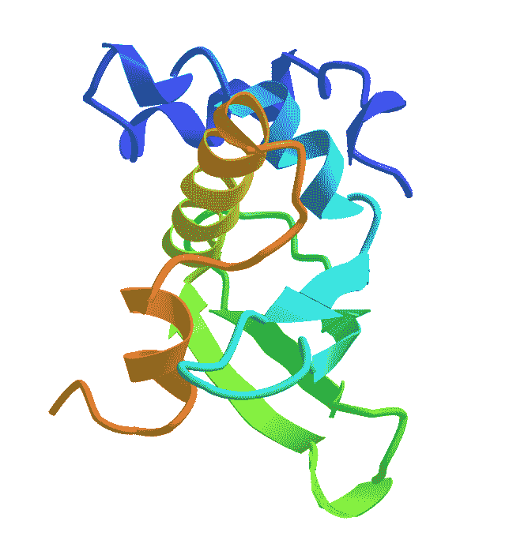

# 在谷歌云计算引擎上运行 Alphafold

> 原文：<https://medium.com/google-cloud/running-alphafold-on-google-cloud-compute-engine-86e4eb1bbeed?source=collection_archive---------1----------------------->

当 Deepmind 向更广泛的科学界开源 Alphafold 时，希望你和我一样兴奋。[https://github.com/deepmind/alphafold](https://github.com/deepmind/alphafold)

在它发布后，我迫不及待地想尝试一下，紧紧跟随他们回购协议中提供的安装步骤。我在 Google cloud 上运行了这个程序，并记录了运行过程中的步骤。在这里分享它们，以防对其他人有用。

Deepmind alphafold [repo](https://github.com/deepmind/alphafold) 中的指令应该很容易在 GCE 实例上设置和运行。希望这里的小补充和说明也能有所帮助。

声明:帖子中的说明和观点是我自己的，并不反映 Deepmind 或谷歌云的观点。

所以现在开始…

首先，描绘出你想要做的事情总是好的。也许以我自己过于复杂的方式:)。我们所做的只是在云上旋转一台机器，安装 alphafold 并下载运行它所需的参考数据。

你需要访问谷歌云来完成这项工作，他们也提供一些免费的积分，你可以为新用户使用。在设置你的账户方面有很多帮助。

*   从您的 Google cloud 控制台，导航到您的项目->计算引擎来创建一个虚拟机。如果您的项目还没有启用计算引擎 API，您必须启用它。
*   使用 Debian OS、**一个 100 GB 引导磁盘**、一个 **3 TB 磁盘**持久性磁盘，使用 spec **e2-standard-8** (8 个 vCPUs，32 GB 内存)运行一个计算引擎实例(创建实例)，用于您选择的区域中的参考数据。

*   将默认引导磁盘大小从 10GB 更改为 100GB

*   确保为永久磁盘选择“保留磁盘”，这将允许您在以后删除虚拟机和切换机器时保留参考数据。我还选择用 gsutil 命令将引用数据复制到 GCS bucket 中。

*   这些指令使用不附带 GPU 的计算引擎。尝试将您的永久磁盘定位在 GPU 可用的区域/地带，以便将来使用加速器进行可能的实验。
*   如果您可以使用外部 IP 创建计算引擎，请跳过创建 NAT 网关的后续步骤。但是，如果您的 GCP 帐户有政策限制，或者您想避免外部 IP，那么 NAT 网关会有所帮助。
*   您可能还希望创建防火墙规则 [TCP 转发到 IAP](https://cloud.google.com/iap/docs/using-tcp-forwarding)ssh 到服务器和 NAT 网关，以允许互联网流量(如果您没有为虚拟机使用外部 IP，则将 git 存储库和数据下载到虚拟机&)。如果你仍然遇到 ssh 问题，请参考这个[页面](https://cloud.google.com/compute/docs/troubleshooting/troubleshooting-ssh)
*   基本上，我们试图实现的是有一个计算引擎虚拟机，你可以 ssh 到，它可以从互联网上下载库+数据。
*   由于引用文件所需的数据至少需要 2.2TB 的未压缩格式，我们需要确保将所需的[磁盘空间](https://cloud.google.com/compute/docs/disks/add-persistent-disk)挂载到 VM(3TB 持久磁盘)。
*   按照以下说明将持久性磁盘挂载到您的 linux 虚拟机。

*SSH 到您的虚拟机，使用下面的 cmd 检查连接的存储，它通常列为/dev/sdb*

*lsblk*

格式化磁盘 ext4，有助于我们以后调整大小

*sudo mkfs . ext 4-m0-E lazy _ ritable _ init = 0，lazy_journal_init=0，discard /dev/sdb*

创建目录以挂载磁盘

*sudo mkdir-p/mnt/disks/data*

安装磁盘

*sudo mount -o discard，defaults/dev/sdb/mnt/disks/data*

确保对磁盘有写权限

*sudo chmod a+w/mnt/disks/data*

通过运行检查

*df -h*

您新挂载的磁盘应该可以在下找到

*cd /mnt/disks/data*

如果您想在重新启动虚拟机后自动挂载磁盘，请将下面一行添加到/etc/fstab

/dev/sdb /mnt/disks/data ext4 rw，丢弃，默认值为 0 0

*   现在说说有趣的部分。我们将对我们的虚拟机进行 alphafold 开源回购的克隆。repo 包含 docker 构建、运行和下载参考数据的脚本。(如果 vm 没有 git，您可能必须运行 sudo apt-get update & sudo apt-get install git)

*git 克隆*[*https://github.com/deepmind/alphafold.git*](https://github.com/deepmind/alphafold.git)

*   安装 **rsync** 和 **aria2** ，因为它们是从多个站点(https、ftp、rsync)下载参考数据所需的库。

*sudo apt-get 安装同步*

*sudo apt-get 安装 aria2*

*   导航到下载的 alphafold git repo 文件夹。运行以下脚本，将引用序列数据下载到您的永久磁盘挂载位置。该脚本应该可以在 **/alphafold/scripts** 下找到。这可能需要几个小时，具体取决于您是使用完整卷还是使用缩减 dbs 标记。下载需要几个小时才能完成。

*。/download _ all _ data . sh/mnt/disks/data&*

*   使用 Docker 命令，运行下面的命令来构建 alphafold 容器映像。如果虚拟机上没有 [docker](https://docs.docker.com/engine/install/debian/) ，安装它，并以非根身份运行 docker

*docker build-f docker/docker file-t alpha fold。*

*   使用引用数据的路径(这将是我们的下载脚本存储所有引用文件的挂载持久磁盘)和需要预先创建的输出目录下存储输出文件的有效路径来更新下载目录的 **docker/run_docker.py** 中的参数
*   使用您最喜欢的编辑器更新 python 脚本/alpha fold/docker/run _ docker . py 中的参数

*vi docker/run_docker.py*

:wq！要保存您的更改

创建输出文件夹

*mkdir/mnt/disks/data/output*

*   当您运行 alphafold 时，您将需要一个 fasta 文件序列作为输入参数 *— fasta_paths* 。用下面的内容创建一个文件 T1029.fasta。如果你不熟悉 FASTA 格式，请看这里的。

*> T1029 EbsA，蓝藻，125 残留物|*

*mridelvpadpravslytpyysqanrrrylpyalslyqgssiegsraveggapisvatwtvtplpadmtrchlqfndaeltyeillpnhefleylidmlmgyqrmqktdfpgafyrrllgyds*

*   我们将在 GPU 标志设置为 false 的情况下执行 alpha fold(—use _ GPU = False)。这将允许我们只使用 CPU 运行 alphafold(这是我们的虚拟机所拥有的)。

创建 mgy_clusters_2018_08.fa 的符号链接，因为这里有一个问题:[https://github.com/deepmind/alphafold/issues/54](https://github.com/deepmind/alphafold/issues/54)

*CD/mnt/disks/data/mgn ify*

*ln-s mgy _ clusters _ 2018 _ 12 . fa mgy _ clusters _ 2018 _ 08 . fa*

另外*安装 alphafold 运行*所需的所有其他库

*pip install-r docker/requirements . txt*

*   我们需要一个输入序列传递给 alphafold 来运行。这是通过用 run 命令传递 FASTA_DIR 来完成的。这个参数需要是一个绝对路径，指向你在 16 中讨论的创建或下载 fasta 文件的地方。

*FASTA_DIR=/home/ <你的用户 home 路径> /* T1029.fasta

*   现在是运行 Alphafold 的时候了。使用以下命令运行

> *python 3 docker/run _ docker . py**—FASTA _ paths = $ { FASTA _ DIR }/t 1029 . FASTA—max _ template _ date = 2020–05–14—use _ GPU = False*

您应该会看到类似这样的输出:

> *I 0724 23:29:46.616896 139835467216704 run _ alpha fold . py:130】跑步模型 model_2*
> 
> *I 0724 23:29:48.999432 140445071447872 run _ docker . py:193]I 0724 23:29:48.998316 139835467216704 model . py:132]用 shape(feat) = {'aatype': (4，125)，' residue_index': (4，125)，' seq _ seq atom37_atom_exists': (4，125，37)，' extra_msa': (4，1024，125)，' extra_msa_mask': (4，1024)，' extra_msa_row_mask': (4，1024)，' bert_mask': (4，508，125)，' true_msa': (4，508，125)，' extra_has_deletion': (4，1024，125)，*
> 
> *…。*
> 
> *t 1029 的最终计时:{'features': 2304.6203739643097，' process _ features _ model _ 1 ':5.570271968841553，' predict _ and _ compile _ model _ 1 ':1880.1474549770355，' relax _ model _ 1 ':21.63088834，' process _ features _ model _ 2 ':2.131*

*   **结果/成功:**一旦运行完成，模型应该将预测输出到您的输出目录，如下所示。在 CPU 上运行往往比在 GPU 上运行慢

输出目录/mnt/disks/data/output/T1029 中的预测结构和其他文件。

pkl

features.pkl

〜结果模型 5

物理数据库

排名 _0.pdb 〜排名 _4.pdb

轻松 _ 模型 _1.pdb 〜轻松 _ 模型 _5.pdb

〜未解除 _ 模型 _5.pdb

json

ranking_debug.json

Timings.json

其他人

管理事务协议/

bfd_uniclust_hits.a3m

mgnify_hits.sto

uniref90_hits.sto

*   **查看输出的 PDB 文件:**输出的 PDB 文件为文本格式，主要由原子坐标记录组成。如果你不熟悉 PDB 原子坐标记录，请看这里。[https://pdb 101 . rcsb . org/learn/guide-to-understanding-PD b-data/dealing-with-coordinates](https://pdb101.rcsb.org/learn/guide-to-understanding-pdb-data/dealing-with-coordinates)
*   有多个在线门户网站可以让你可视化你的蛋白质结构(输出 PDB 文件)。链接到 NCBI 门户网站。您还可以在本地安装和运行一些库来可视化结构。
    PDB 观众:

[https://www.ncbi.nlm.nih.gov/Structure/icn3d/full.html?mmdbid=1TUP](https://www.ncbi.nlm.nih.gov/Structure/icn3d/full.html?mmdbid=1TUP)

[https://www.rcsb.org/3d-view](https://www.rcsb.org/3d-view)

[https://molstar.org/viewer/](https://molstar.org/viewer/)

alphafold 预测的结构

**希望**对你有帮助，对你有用！！！:)