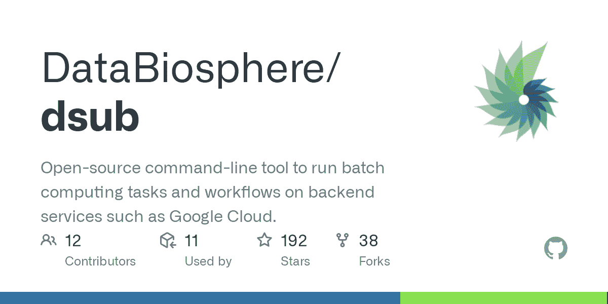
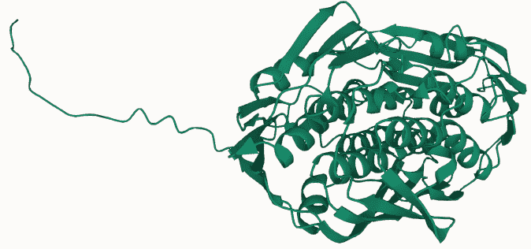

# 使用谷歌云生命科学运行 AlphaFold

> 原文：<https://medium.com/google-cloud/running-alphafold-with-google-cloud-life-sciences-7219db6ca99e?source=collection_archive---------2----------------------->


# 阿尔法折叠

AlphaFold 是 DeepMind 开发的一个人工智能模型，用于预测蛋白质的三维结构。第一个 AlphaFold(版本 1)于 2018 年发布，随后是 2020 年的版本 2。作为一项创新发明，它吸引了全世界的关注，据说它解决了生物学中一个 50 年的重大挑战。DeepMind 也于 2021 年在 GitHub 上发布了 AlphaFold。预计这将使每个人手头都有 AlphaFold，在不久的将来，它将有可能阐明未知蛋白质的功能，加速新药的开发，并治疗许多人的疾病。

AlphaFold 在 GitHub 上发布后，研究机构和许多个人立即在他们的博客上发布了在云和本地服务器上运行 AlphaFold 的步骤。然而，要运行 AlphaFold，你需要从互联网上下载 2.2 TB+的数据库文件，并将其存储在服务器的磁盘上。它还需要一定的 CPU、内存或 GPU，因此构建和配置一个云服务器来使用 AlphaFold 并保持它长时间运行是不舒服的。

在这篇文章中，我将解释在不设置虚拟服务器(计算引擎 VM 实例)的情况下在 Google Cloud 上运行 AlphaFold 的步骤。

***免责声明*** *:本文假设你对 Linux OS、Docker、Google Cloud 有一定的背景知识。请注意，这篇文章不是一个完整的操作手册，一些步骤已经被省略。*

# 仅第一次准备

为首次准备创建一个虚拟机实例。这是因为您需要首先临时使用 VM 实例来创建磁盘映像。

准备步骤如下。

1.  创建一个 AlphaFold 容器映像，并在容器注册表中注册它
2.  下载数据库文件并将磁盘转换为映像
3.  启用云生命科学 API
4.  安装 dsub
5.  创建一个在容器内部运行的脚本

以上步骤最多需要 2 个虚拟机实例。后续步骤假设在云壳上操作。

那么，让我们按顺序办理手续。

## 1.创建一个 AlphaFold 容器映像，并在容器注册表中注册它

[创建一个计算引擎虚拟机实例](https://cloud.google.com/compute/docs/instances/create-start-instance)。[将一个 2.2 TB 或更大的磁盘](https://cloud.google.com/compute/docs/disks/add-persistent-disk)连接到这个虚拟机，并将其挂载到虚拟机实例上。以下是在命令行上的 us-central1-a 区域中创建虚拟机实例的命令示例。请注意，引导磁盘大小为 100 GB，并创建一个 3000 GB 的非引导磁盘。虚拟机启动后，您需要格式化并挂载非引导磁盘。详见[文件](https://cloud.google.com/compute/docs/disks/add-persistent-disk#format_and_mount_linux)。

```
gcloud compute instances create <INSTANCE_NAME> \
 --zone=us-central1-a \
 --machine-type=e2-standard-8 \
 --boot-disk-size=100GB \
 --create-disk=mode=rw,size=3000,type=projects/<PROJECT_ID>/zones/us-central1-a/diskTypes/pd-balanced,name=alphafold-data,device-name=alphafold-data
```

你也可以从谷歌云控制台做同样的事情。

在 Google Cloud 中，“[图片是全局资源](https://cloud.google.com/compute/docs/regions-zones/global-regional-zonal-resources)”。您只需在一个地方创建一个映像，就可以在世界上的任何地区使用该映像。因此，您可以在任何区域创建 VM 实例。

SSH 登录到您创建的 VM 实例，从 GitHub 克隆 AlphaFold，构建一个容器映像并[将其推送到容器注册表](https://cloud.google.com/container-registry/docs/pushing-and-pulling)。执行以下命令。

```
# install git
sudo apt-get update
sudo apt-get install git# install docker
sudo apt-get install \
    apt-transport-https \
    ca-certificates \
    curl \
    gnupg \
    lsb-releasecurl -fsSL https://download.docker.com/linux/debian/gpg | sudo gpg --dearmor -o /usr/share/keyrings/docker-archive-keyring.gpgecho \
  "deb [arch=$(dpkg --print-architecture) signed-by=/usr/share/keyrings/docker-archive-keyring.gpg] https://download.docker.com/linux/debian \
  $(lsb_release -cs) stable" | sudo tee /etc/apt/sources.list.d/docker.list > /dev/null
sudo apt-get update
sudo apt-get install docker-ce docker-ce-cli containerd.io# make docker available with general user privilege
sudo gpasswd -a $(whoami) docker# docker build, tag and push
git clone [https://github.com/deepmind/alphafold.git](https://github.com/deepmind/alphafold.git)
cd alphafold
docker build -f docker/Dockerfile -t alphafold .
docker tag alphafold gcr.io/<PROJECT_ID>/alphafold
docker push gcr.io/<PROJECT_ID>/alphafold
```

## 2.下载数据库文件，将磁盘转换成图像

运行脚本以下载数据库文件，指定挂接磁盘的路径。MOUNT_POINT 指定装载 3000GB 磁盘的路径。见[此处](https://cloud.google.com/compute/docs/disks/add-persistent-disk#format_and_mount_linux)了解如何挂载额外的非引导磁盘。

```
sudo apt-get install rsync
sudo apt-get install aria2
cd scripts
./download_all_data.sh <MOUNT_POINT>
```

下载需要 2-3 个小时才能完成。下载后，磁盘上的结构如下。

```
/                             # Total: ~ 2.2 TB (download:438GB)
  bfd/                                   #~1.7TB (download:271.6GB)
        # 6 files.
  mgnify/                                # ~64GB (download:32.9GB)
        mgy_clusters_2018_12.fa
  params/                                # ~3.5GB (download:3.5GB)
        # 5 CASP14 models,
        # 5 pTM models,
        # LICENSE,
        # = 11 files.
  pdb70/                                 # ~56GB (download:19.5GB)
        # 9 files.
  pdb_mmcif/                             # ~206GB (download:46GB)
        mmcif_files/
            # About 180,000 .cif files.
        obsolete.dat
  small_bfd/                             # ~17GB (download:9.6GB)
        bfd-first_non_consensus_sequences.fasta
  uniclust30/                            # ~86GB (download:24.9GB)
        uniclust30_2018_08/
            # 13 files.
  uniref90/                              # ~58GB (download:29.7 GB)
        uniref90.fasta
```

下载完成后，您可以[分离磁盘](https://cloud.google.com/sdk/gcloud/reference/compute/instances/detach-disk)，然后[从磁盘](https://cloud.google.com/compute/docs/images/create-delete-deprecate-private-images#create_image)创建一个映像。您可以在 Google Cloud 控制台或命令行上创建图像。

如果您使用命令行运行它:

```
gcloud compute images create <IMAGE_NAME> --source-disk <DISK_NAME>
```

一旦创建了映像，就不再需要 VM 实例了，所以删除它。[删除一个虚拟机实例](https://cloud.google.com/compute/docs/instances/deleting-instance)也非常容易。如果使用命令行删除实例:

```
gcloud compute instances delete <INSTANCE_NAME>
```

您可以在云壳上执行以下操作。如何使用云壳，请参考以下文档。

[https://cloud.google.com/shell/docs/launching-cloud-shell](https://cloud.google.com/shell/docs/launching-cloud-shell)

## 3.启用云生命科学 API


云生命科学

谷歌云生命科学是一套用于管理、处理和转换生命科学数据的服务和工具。以下步骤中使用的“dsub”调用 Google Cloud Life Sciences API，所以让我们在这里[启用 API](https://cloud.google.com/endpoints/docs/openapi/enable-api) 。您可以从 Google Cloud 控制台或命令行启用 API。

如果您使用命令行运行它:

```
gcloud services enable lifesciences.googleapis.com
```

## 4.安装 dsub



dsub 是 Google 开发的命令行工具，用于运行各种生物信息学软件。dsub 可以从指定的映像创建一个容器，并执行其中的任何命令或脚本。

此外，dsub 还具有诸如挂载磁盘以便可以从容器中访问它，将放置在 Google Cloud Storage (GCS)中的文件放入容器中，并将容器中处理的结果带出到 GCS 中的功能。

很多生物信息学工具都是容器化的，需要读写大量数据，所以 dsub 这样的工具非常有用。

dsub 可以很容易地用 pip 安装。要使用 Python 的 venv 进行安装，请遵循以下步骤。

```
python3 -m venv env
source env/bin/activate
pip install dsub
```

有关 dsub 的更多信息，请参见 GitHub。

【https://github.com/DataBiosphere/dsub 

## 5.创建要在容器内部执行的脚本

创建一个要在容器内部执行的脚本文件。用文件名“ **alphafold.sh** ”保存以下内容。可以看到很多参数，但只是运行“/app/run_alphafold.sh”。${}中包含的变量是从后面描述的 dsub 命令的参数中传递的。

```
cd /app/alphafold/app/run_alphafold.sh \
 --fasta_paths=${FASTA} \
 --uniref90_database_path=${DB}/uniref90/uniref90.fasta \
 --mgnify_database_path=${DB}/mgnify/mgy_clusters_2018_12.fa \
 --pdb70_database_path=${DB}/pdb70/pdb70 \
 --data_dir=${DB} \
 --template_mmcif_dir=${DB}/pdb_mmcif/mmcif_files \
 --obsolete_pdbs_path=${DB}/pdb_mmcif/obsolete.dat \
 --uniclust30_database_path=${DB}/uniclust30/uniclust30_2018_08/uniclust30_2018_08 \
 --bfd_database_path=${DB}/bfd/bfd_metaclust_clu_complete_id30_c90_final_seq.sorted_opt \
 --output_dir=${OUT_PATH} \
 --model_names=model_1,model_2,model_3,model_4,model_5 \
 --max_template_date=2020–05–14 \
 --preset=full_dbs \
 --benchmark=False \
 --logtostderr
```

现在，您只需完成第一次所需的准备工作。

到目前为止，工作应该已经创建了以下资源。

```
・ The container image is registered in the container registry.
・ The disk image is created.
```

# 运行 AlphaFold

现在你可以运行 AlphaFold 了。到目前为止的准备工作只在开始时做一次。之后，您可以通过以下简单的步骤运行 AlphaFold 任意次。

1.  将氨基酸序列(FASTA 文件)保存在 GCS 中
2.  执行 AlphaFold

让我们看一下每个程序。

## 1.将氨基酸序列(FASTA 文件)保存在 GCS 中

准备将作为 AlphaFold 输入数据的氨基酸序列。氨基酸序列数据通常是字母文本的形式。创建一个样本文件，并将其复制到 GCS。用文件名“ **all0174.fasta** ”保存以下数据。以第一个“>”开头的行是注释行，氨基酸序列在下一行之后描述。

```
>all0174
MTEADSSVLQIWGGHPLQGHVKISGAKNSALVIMAGALLCSGDCRIRNVPLLADVERMGEVISALGVRLTRQADIIDINASEIKTSKAPYELVTQLRASFFAIGAILARLGVAQMPLPGGCAIGARPVDLHVRGLQAMGAEVQIEHGICNAYVPGSGGRLKGAKIYLDTPSVGATETLMMAATLADGETILENAAREPEVVDLANFCKAMGANIQGAGTSTITIVGVPKLHSVDYSIIPDRIEAGTFLVAGAITRSEITLSSVVPEHLIPLIAKLRDIGVTIIEESPDCLRILPAEILKATDIDTLPHPGFPTDMQAPFMALLTLAEGDSIINESVFENRLRHASELNRLGADIRVKGNTAFVRGVPLLSGAPVIGTDLRASAALVIAGLAAEGKTTIQGLHHLDRGYDQIDVKLQQLGAKILRVREEPANAEVAVNNNVSPASIST
```

首先，你要创建一个 GCS 桶。如果您使用命令行:

```
gsutil mb gs://<PROJECT_ID>-alphafold
```

将您创建的 FASTA 文件复制到 GCS bucket 下的输入文件夹中。您可以使用命令行来执行它:

```
gsutil cp all0174.fasta gs://<PROJECT_ID>-alphafold/input/
```

## 2.运行 AlphaFold

使用下面的 dsub 命令执行 AlphaFold。

```
dsub --provider google-cls-v2 \
 --project <PROJECT_ID> \
 --zones <ZONE_NAME> \
 --logging gs://<PROJECT_ID>-alphafold/logs \
 --image=gcr.io/<PROJECT_ID>/alphafold:latest \
 --script=alphafold.sh \
 --input FASTA=gs://<PROJECT_ID>-alphafold/input/all0174.fasta \
 --mount DB="<IMAGE_URL> 3000" \
 --output-recursive OUT_PATH=gs://<PROJECT_ID>-alphafold/output \
 --machine-type n1-standard-8 \
 --boot-disk-size 100 \
 --subnetwork <SUBNET_NAME>
```

参数描述:

```
--provider google-cls-v2: Google Cloud Life Sicences API (v2)
--project: PROJECT ID
--zones: ZONE NAME (wildcard "*" is possible. e.g. "us-central1-*")
--logging: Log output destination folder
--image: AlphaFold Container Image URL on GCR
--script: Script file name created earlier
--input: Path of the FASTA file uploaded to GCS
--mount: URL of the created disk image (*1)
--output-recursive: Path of GCS where the artifacts are output
--machine-type: n1-standard-8
--boot-disk-size: 100 GB
--subnetwork: Subnetwork name if it’s not "default"*1:
URL of the disk image can be found with the following command.
gcloud compute images list --no-standard-images --uri
```

当提交 dsub 命令时，可以看到作业 id。您可以使用此作业 id，通过以下命令来检查正在运行的作业的状态。

```
dstat --provider google-cls-v2 --project <PROJECT_ID> --jobs <JOB_ID>
```

您也可以使用 ddel 命令取消作业。该命令如下所示:

```
ddel --provider google-cls-v2 --project <PROJECT_ID> --jobs <JOB_ID>
```

该命令仅使用 CPU，但也可以使用 GPU 高速处理。例如，如果您使用一个 NVIDIA K80，请使用以下参数运行 dsub 命令:

```
--accelerator-type nvidia-tesla-k80
--accelerator-count 1
```

您可以在以下 URL 查看 GPU 可以使用的区域和 GPU 类型。

[https://cloud . Google . com/compute/docs/GPU/GPU-regions-zones](https://cloud.google.com/compute/docs/gpus/gpu-regions-zones)

此外，[可抢占的虚拟机](https://cloud.google.com/compute/docs/instances/preemptible)降低了成本。可抢占的虚拟机是寿命短、价格合理的计算引擎虚拟机实例。如果您想使用一个可抢占的 VM，添加以下参数并运行 dsub。

```
--preemptible
```

# 可视化预测的 3D 结构

AlphaFold 可能需要几十分钟到几个小时才能完成。当该命令完成时，包含作为 AlphaFold 预测结果的蛋白质结构的文件(PDB 文件)被输出到 dsub 的 output-recursive 参数指定的文件夹下。
下载一个。pdb 文件并将其可视化。
有很多处理 PDB 文件的软件，也有几个网站，你只需上传文件就可以轻松地看到 3D 结构。例如，有以下网站。

```
[https://www.rcsb.org/3d-view](https://www.rcsb.org/3d-view)
[https://molstar.org/viewer/](https://molstar.org/viewer/)
[https://www.ncbi.nlm.nih.gov/Structure/icn3d/full.html?mmdbid=1TUP](https://www.ncbi.nlm.nih.gov/Structure/icn3d/full.html?mmdbid=1TUP)
```

你可以想象任何一个有类似操作的网站。从“打开文件”菜单中选择 PDB 文件，然后单击“应用”查看 3D 结构，如下所示。



# 结论

使用这里介绍的 dsub 命令运行 AlphaFold 的成本很低，因为您不必让虚拟服务器一直运行。如果将 GPU+preemptable 作为一个集合使用，那么在加快进程的同时，能够以较低的成本执行。

而我这次用的是 dsub，同样的事情不用 dsub 单独用云生命科学也能实现。

谷歌云提供了多种支持生命科学的解决方案。详情请参考以下文件。

[https://cloud.google.com/life-sciences/docs/how-tos](https://cloud.google.com/life-sciences/docs/how-tos)