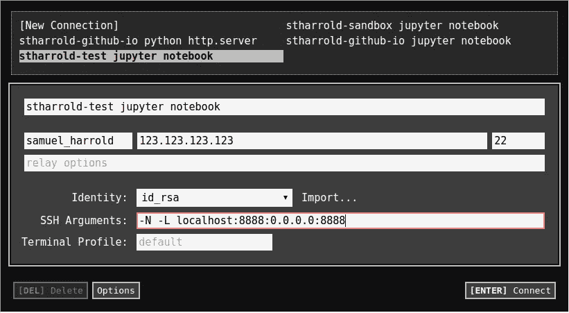

# 在 Chrome 的谷歌计算引擎上运行 IPython 笔记本

> 原文：<https://medium.com/google-cloud/running-an-ipython-notebook-on-google-compute-engine-from-chrome-b57f10cf6c1e?source=collection_archive---------3----------------------->

Chrome 安全外壳设置。

作为一名数据科学家，我使用 IPython 笔记本、Google 计算引擎、Cloud9 和 SSH 端口转发从 Chromebook 进行开发。下面是我如何迁移到云端的:
[https://sth arrold . github . io/2015 12 08-ipynb-on-GCE-from-chrome . html](https://stharrold.github.io/20151208-ipynb-on-gce-from-chrome.html)