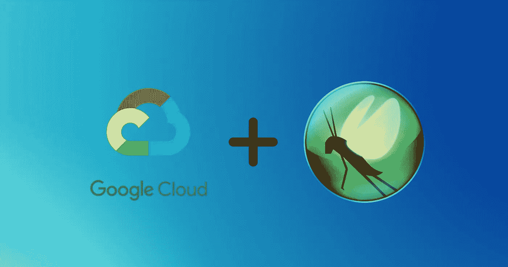
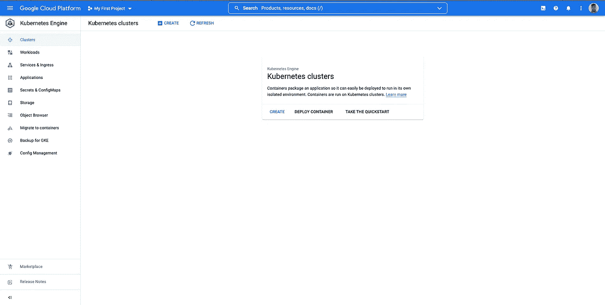
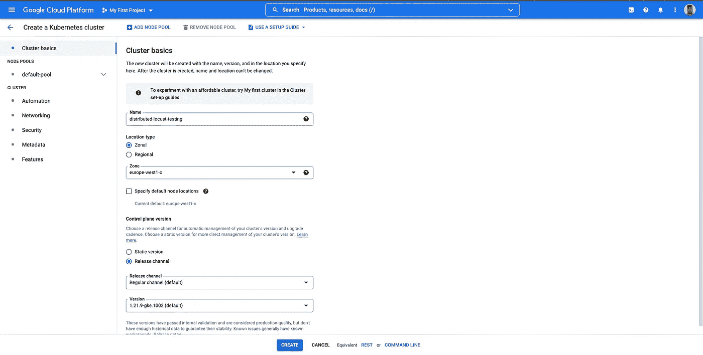
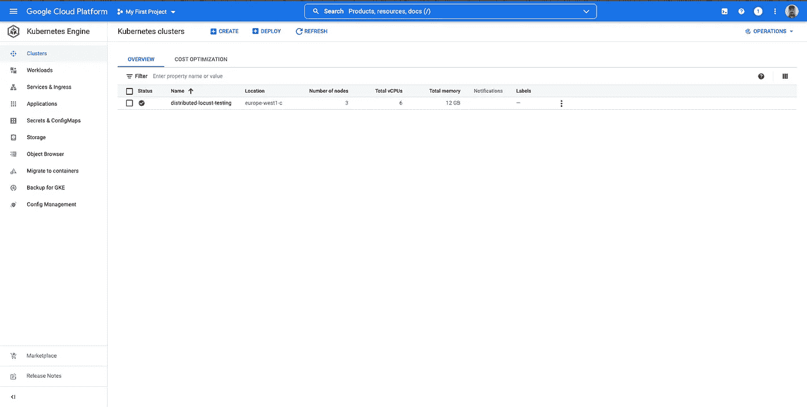
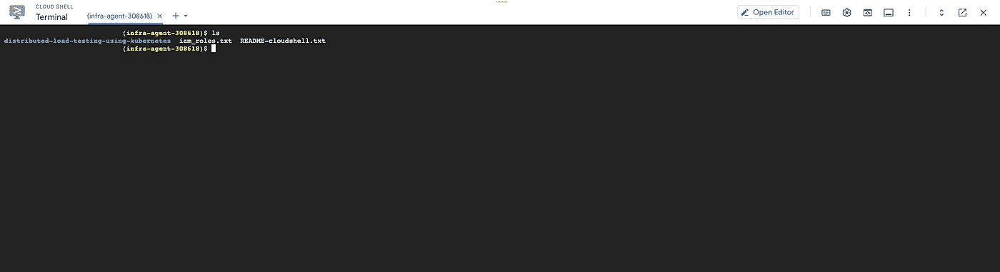
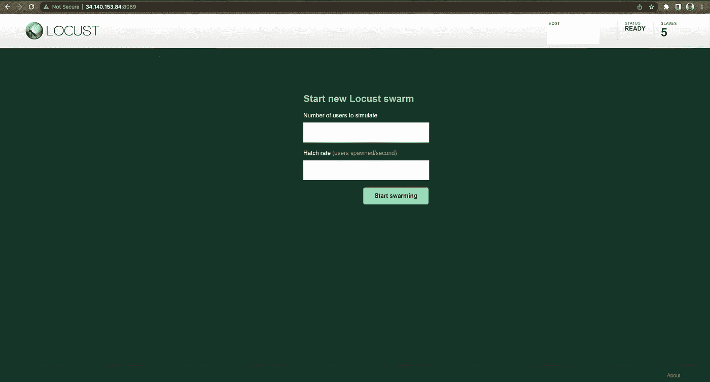

# Google Kubernetes 引擎(GKE)上的分布式蝗虫测试

> 原文：<https://medium.com/google-cloud/running-distributed-locust-tests-on-kubernetes-9b981797930?source=collection_archive---------0----------------------->

在 Google Kubernetes 引擎(GKE)上运行分布式蝗虫测试的完整指南。



谷歌云平台+蝗虫

## 介绍

Locust.io 是一个开源工具，可以让你对应用程序进行性能测试。Locust 的优势之一是，它使您能够将性能测试分布在多台机器上，这样您就可以在应用程序上生成更大的负载。

在本教程中，我们将看看如何将 Locust 部署到 Google Kubernetes 引擎(GKE ),以便使用主配置和工作配置来分配负载生成。

## 要求

*   你所需要做的就是进入谷歌云平台(GCP)账户。我们将使用谷歌 Kubernetes 引擎和其他一些 GCP 服务作为本指南的一部分。

## 创建您的 Kubernetes 集群

首先，我们需要设置一个 Kubernetes 集群。您需要登录您的 Google 云平台帐户，并导航到控制台的 Kubernetes 引擎部分，如下所示。



进入此页面后，您需要:

*   选择**“创建”按钮**。
*   点击“GKE 标准”选项旁边的**“配置”按钮**。
*   **为您的集群选择一个名称**，例如“分布式蝗虫测试”。
*   **为您的集群选择最合适的区域**，例如“欧洲-西方 1-c”。
*   点击屏幕底部的**“创建”按钮**。



您不需要配置任何其他设置，如自动化、网络、安全等。几分钟后，您的 Kubernetes 集群应该已经完成构建，并将在您的控制台中可见。



然后，您需要:

*   **点击“名称”栏下的集群名称**。
*   在此页面上选择**连接按钮**。
*   然后点击**“在云壳中运行”按钮**。

然后，您将在窗口中使用类似以下的命令打开云 Shell:

```
$ gcloud container clusters get-credentials distributed-locust-testing --zone europe-west1-c --project infra-agent-999999
```

点击“Enter”后，您将连接到您的 Kubernetes 集群。

## 将 Locust 部署到集群

现在，我建议您设置一些环境变量，我们将需要这些变量来运行这些命令。

```
$ PROJECT=$(gcloud config get-value project)
$ REGION=europe-west1
$ ZONE=${REGION}-c
$ CLUSTER=distributed-locust-testing
$ TARGET=${PROJECT}.appspot.com
$ gcloud config set compute/region $REGION 
$ gcloud config set compute/zone $ZONE
```

我们还应该启用所有必需的 API，使用:

```
$ gcloud services enable \
    cloudbuild.googleapis.com \
    compute.googleapis.com \
    container.googleapis.com \
    containeranalysis.googleapis.com \
    containerregistry.googleapis.com
```

接下来，您需要运行以下命令来克隆后续步骤所需的文件。

```
$ git clone [https://github.com/GoogleCloudPlatform/distributed-load-testing-using-kubernetes](https://github.com/GoogleCloudPlatform/distributed-load-testing-using-kubernetes)
```



如果你列出你的目录中的文件，你会看到你现在有一些新的。现在我们需要构建一个 Docker 映像，并将其推送到 Google 容器注册中心。我们可以通过运行以下命令来实现这一点:

```
$ pushd distributed-load-testing-using-kubernetes/ $ gcloud builds submit --tag gcr.io/$PROJECT/locust-tasks:latest docker-image/.
```

完成 order 文件中的每个步骤大约需要一分钟。如果成功完成，您应该会收到如下所示的消息:

```
CREATE_TIME: 2022–03–20T18:56:13+00:00
DURATION: 1M3S
SOURCE: gs://infra-agent-999999_cloudbuild/source/1647802572.889189–59f5e6f8582a45978bef34343012cbc4.tgz
IMAGES: gcr.io/infra-agent-999999/locust-tasks (+1 more)
STATUS: SUCCESS
```

现在，我们可以通过运行以下命令将示例 web 应用程序部署到集群中:

```
$ gcloud app deploy sample-webapp/app.yaml --project=$PROJECT
```

这将部署一个从 GitHub 存储库克隆到 App Engine 的示例 web 应用程序。这可能需要几分钟时间。

接下来，我们需要替换 Kubernetes 配置中的[TARGET_HOST]和[PROJECT_ID]。我们将用之前设置的环境变量替换它们。这是通过运行以下命令完成的:

```
$ sed -i -e “s/\[TARGET_HOST\]/$TARGET/g” kubernetes-config/locust-master-controller.yaml$ sed -i -e “s/\[TARGET_HOST\]/$TARGET/g” kubernetes-config/locust-worker-controller.yaml$ sed -i -e “s/\[PROJECT_ID\]/$PROJECT/g” kubernetes-config/locust-master-controller.yaml$ sed -i -e “s/\[PROJECT_ID\]/$PROJECT/g” kubernetes-config/locust-worker-controller.yaml
```

替换这些组件后，我们现在可以将每个组件部署到集群中。这包括主部署、工作部署和服务。这是通过运行以下命令完成的:

```
$ kubectl apply -f kubernetes-config/locust-master-controller.yaml $ kubectl apply -f kubernetes-config/locust-master-service.yaml $ kubectl apply -f kubernetes-config/locust-worker-controller.yaml
```

现在，如果您看一下您的 pod，您会看到在您的集群中有一个主节点和五个工作节点在运行。您可以通过输入以下命令来查看:

```
$ kubectl get podsNAME                             READY   STATUS    RESTARTS   AGE
locust-master-67bd6b669b-wlbc6   1/1     Running   0          20m
locust-worker-656b94465c-5s8cj   1/1     Running   0          20m
locust-worker-656b94465c-mc92z   1/1     Running   0          20m
locust-worker-656b94465c-qw6v6   1/1     Running   0          20m
locust-worker-656b94465c-thgjv   1/1     Running   0          20m
locust-worker-656b94465c-zxbsb   1/1     Running   0          20m
```

恭喜，您已经成功地将蝗虫部署到您的集群！

## 执行分布式负载测试

现在，我们想开始对之前部署到集群中的示例 web 应用程序运行一些分布式负载/性能测试。首先，我们需要获取 Locust 主机的外部 IP 地址，并通过运行以下命令将其设置为环境变量:

```
$ EXTERNAL_IP=$(kubectl get svc locust-master -o yaml | grep ip | awk -F”:” ‘{print $NF}’)$ echo $EXTERNAL_IP
```

这将把外部 IP 打印到云壳。现在，您应该能够通过在 Web 浏览器中打开以下地址来访问 Locust Web UI:

```
http://$EXTERNAL_IP:8089For example: [http://34.140.153.84:8089](http://34.140.153.84:8089)
```

这将使您能够访问 Locust Web UI，如下图所示。



蝗虫网络用户界面

接下来你需要做的就是输入你想要模拟的用户数量，输入你想要使用的孵化率，你就可以开始了！如果您需要增加工作人员的数量来模拟更多的用户，您可以通过扩大您的工作人员部署来实现，例如:

```
$ kubectl scale deployment/locust-worker --replicas=20
```

## 重要注意事项

请记住，向外部系统生成大量流量可能会被视为分布式拒绝服务(DDoS)攻击。请务必阅读谷歌云平台的可接受使用政策和服务条款，以确保您没有违反它！

同样重要的是要知道，如果你长时间持续运行你的 Google Kubernetes 引擎(GKE)集群，你很快就会欠下一大笔账单。记住终止作为本教程一部分使用的所有资源，以避免产生任何意外成本。完成此操作的步骤如下。

```
Delete your Google Kubernetes Engine (GKE) cluster$ gcloud container clusters delete $CLUSTER --zone $ZONE
```

然后，您还应该在控制台中转到 Google Container Registry，删除带有我们之前创建的图像的 locust-tasks 文件夹。那应该包括一切！

## 参考

[使用 GKE 的分布式负载测试](https://github.com/GoogleCloudPlatform/distributed-load-testing-using-kubernetes):这是 Google Cloud 的 GitHub 库，用于运行这些分布式负载测试。本指南中的一些步骤和信息摘自该存储库，因此如果您遇到问题，也请以此为基础。我尽了最大努力，使用这个库中的步骤创建了一个更详细的指南，以便更容易遵循。

如果您有任何问题，欢迎在这里评论或在 LinkedIn 上给我发消息，我会尽力帮助您！