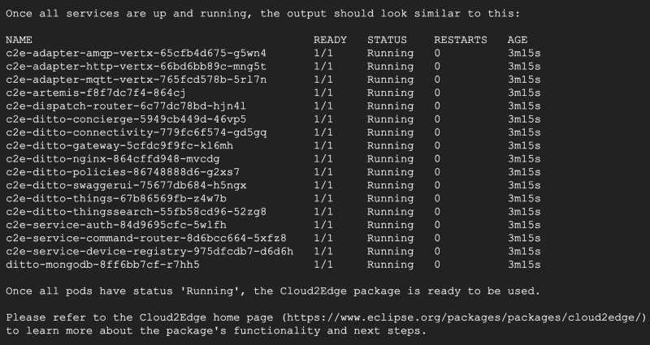

# 在谷歌云上运行 Eclipse HONO 和 Ditto)

> 原文：<https://medium.com/google-cloud/running-eclipse-hono-and-ditto-on-google-cloud-1-d47504fecc7?source=collection_archive---------2----------------------->

Eclipse [HONO](https://www.eclipse.org/hono/) 是一个开源的物联网后端，它将大量的物联网设备连接到后端。Eclipse [Ditto](https://www.eclipse.org/ditto/) 是一个开源的数字双胞胎服务。将 Eclipse HONO 和 Ditto 连接在一起有助于为物联网应用提供端到端的设备云通信。

这个博客系列是为了记录我在配置和运行 Eclipse HONO 和 Google Cloud 时的心得。最终目标是

*   让一个设备模拟器向 Eclipse HONO 发送遥测数据，并通过简单的配置将它们接收到 Google 云服务中。
*   允许设备从云中接收命令并做出响应。
*   研究如何安全地集成 Eclipse Ditto 和 Google Cloud。

这篇博客假设你有一个计费启用谷歌云项目，并熟悉云壳。以下命令在云壳中执行。

# 创建一个 VPC 网络

首先创建一个自动模式的 VPC 网络来运行我们的 Eclipse 集群。我还创建了默认的防火墙规则，允许来自外部的 SSH/ICMP 流量进行测试。

```
export PROJECT_ID=<YOUR PROJECT ID>
export VPC_NAME=eclipse-vpc
gcloud compute networks create $VPC_NAME — project=$PROJECT_ID — subnet-mode=auto — mtu=1460 — bgp-routing-mode=regionalgcloud compute firewall-rules create ${VPC_NAME}-allow-custom \
--project=${PROJECT_ID} \
--network=projects/${PROJECT_ID}/global/networks/${VPC_NAME} \
--direction=INGRESS — priority=65534 \
--source-ranges=10.128.0.0/9 — action=ALLOW — rules=allgcloud compute firewall-rules create ${VPC_NAME}-allow-icmp \
--project=${PROJECT_ID} \
--network=projects/${PROJECT_ID}/global/networks/${VPC_NAME} \
--direction=INGRESS — priority=65534 \
--source-ranges=0.0.0.0/0 — action=ALLOW — rules=icmpgcloud compute firewall-rules create ${VPC_NAME}-allow-ssh \
--project=${PROJECT_ID} \
--network=projects/${PROJECT_ID}/global/networks/${VPC_NAME} \
--direction=INGRESS — priority=65534 \
--source-ranges=0.0.0.0/0 — action=ALLOW — rules=tcp:22
```

我将创建一个私有的 GKE 集群，为了允许集群与互联网对话，以便它可以从 DockerHub 等外部容器注册表中提取映像，我需要在 VPC 创建一个云 NAT 和云路由器。

```
export ROUTER_NAME=eclipse-router
export NAT_NAME=eclipse-nat
export VPC_NAME=eclipse-vpcgcloud compute routers create ${ROUTER_NAME} \
--project=${PROJECT_ID} — region=asia-east1 \
--network=${VPC_NAME}gcloud compute routers nats create ${NAT_NAME} \
--router=${ROUTER_NAME} \
--auto-allocate-nat-external-ips \
--nat-all-subnet-ip-ranges \
--enable-logging — region asia-east1 — project ${PROJECT_ID}
```

# 创建 GKE 集群

在这里，我启用了集群自动扩展和节点自动配置，以允许 GKE 集群在需要时进行横向扩展。

```
gcloud beta container — project ${PROJECT_ID} clusters create “eclipse-cluster” \
--zone “asia-east1-a” \
--machine-type “e2-standard-4” \
--image-type “COS_CONTAINERD” \
--disk-type “pd-standard” — disk-size “500” \
--scopes "https://www.googleapis.com/auth/cloud-platform" \
--logging=SYSTEM,WORKLOAD — monitoring=SYSTEM \
--enable-private-nodes \
--master-ipv4-cidr “172.16.200.0/28” \
--enable-master-global-access \
--enable-ip-alias --network “projects/${PROJECT_ID}/global/networks/${VPC_NAME}” \
--subnetwork “projects/${PROJECT_ID}/regions/asia-east1/subnetworks/${VPC_NAME}” \
--no-enable-master-authorized-networks \
--addons HorizontalPodAutoscaling,HttpLoadBalancing,GcePersistentDiskCsiDriver \
--enable-autoprovisioning \
--min-cpu 1 — max-cpu 64 \
--min-memory 1 — max-memory 512 \
--autoprovisioning-scopes=https://www.googleapis.com/auth/cloud-platform \
--enable-autoprovisioning-autorepair \
--enable-autoprovisioning-autoupgrade — autoprovisioning-max-surge-upgrade 1 — autoprovisioning-max-unavailable-upgrade 0 \
--enable-vertical-pod-autoscaling \
--enable-shielded-nodes \
--tags “http-server”,”https-server” \
--node-locations “asia-east1-a”
```

# 设置 Eclipse HONO 和同上

既然我们已经准备好并运行了 GKE，我们可以安装并设置 Eclipse HONO 和同上。

首先连接到新创建的 GKE 集群。

```
gcloud container clusters get-credentials eclipse-cluster — zone asia-east1-a — project ${PROJECT_ID}
```

按照[本安装指南](https://www.eclipse.org/packages/packages/cloud2edge/installation/)安装 HONO，同上

```
NS=cloud2edge
RELEASE=c2e
kubectl create namespace $NShelm install -n $NS --wait --timeout 15m --set hono.useLoadBalancer=true --set ditto.nginx.service.type=LoadBalancer \
$RELEASE eclipse-iot/cloud2edge
```

等待安装完成，您应该会看到类似的输出。



现在我们已经准备好了 GKE 集群，在下一集里，我将在 HONO 和 Ditto 之间建立连接，并在一个 HONO 租户中创建一个设备来验证 HONO 和 Ditto 之间的集成。

[第二部分](/google-cloud/running-eclipse-hono-and-ditto-on-google-cloud-2-3e8ad69efeb7)