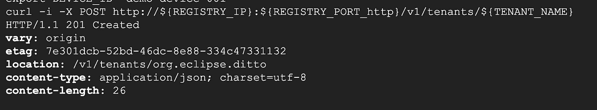
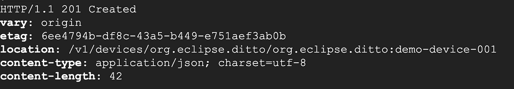
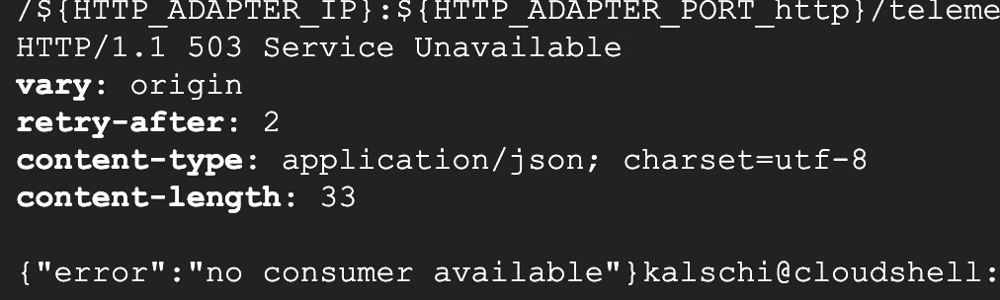

# 在谷歌云上运行 Eclipse HONO 和 Ditto)

> 原文：<https://medium.com/google-cloud/running-eclipse-hono-and-ditto-on-google-cloud-2-3e8ad69efeb7?source=collection_archive---------3----------------------->

这是博客系列的第二部分。在这篇博客中，我将配置 Eclipse HONO 和 Eclipse Ditto，以便两者集成在一起。然后，我将创建一个设备来验证端到端连通性。

将 setCloud2EdgeEnv.sh 文件下载到 Cloud Shell，确保您仍然连接到我们在之前的博客文章中创建的 GKE 集群。

```
chmod +777 setCloud2EdgeEnv.sh
RELEASE=c2e
NS=cloud2edge
./setCloud2EdgeEnv.sh $RELEASE $NS
```

这将为您提供所需的环境变量，复制脚本输出并将其粘贴到云 Shell 控制台，然后按 Enter 键执行它们。

```
export AMQP_NETWORK_IP=”xx.xx.xx.xx"
export AMQP_NETWORK_PORT_amqp=”15672"
export AMQP_NETWORK_PORT_amqps=”15671"
export REGISTRY_IP=”35.194.207.149"
export REGISTRY_PORT_http=”28080"
export REGISTRY_PORT_https=”28443"
export AMQP_ADAPTER_IP=”xx.xx.xx.xx"
export AMQP_ADAPTER_PORT_amqp=”5672"
export AMQP_ADAPTER_PORT_amqps=”5671"
export HTTP_ADAPTER_IP=”xx.xx.xx.xx"
export HTTP_ADAPTER_PORT_http=”8080"
export HTTP_ADAPTER_PORT_https=”8443"
export MQTT_ADAPTER_IP=”34.81.137.23"
export MQTT_ADAPTER_PORT_mqtt=”1883"
export MQTT_ADAPTER_PORT_secure-mqtt=”8883"
export DITTO_API_IP=”xx.xx.xx.xx"
export DITTO_API_PORT_http=”8080"
# Run this command to populate environment variables
# with the NodePorts of Hono’s and Ditto’s API endpoints:
# eval “$(./setCloud2EdgeEnv.sh RELEASE_NAME [NAMESPACE])”
# with NAMESPACE being the Kubernetes name space that you installed Hono to
# if no name space is given, the default name space is used
```

请注意，*MQTT _ ADAPTER _ PORT _ secure-MQTT*的变量名无效，因为它包含一个连字符，请用下划线替换它，以便脚本可以正确执行。

# 在 Eclipse HONO 设置一个设备

Eclipse HONO 提供了 REST API 端点供我们与之交互。为了创建一个连接到 Eclipse HONO 的设备，首先我们创建一个将托管我们的设备的租户。

```
export TENANT_NAME=”org.eclipse.ditto"
export DEVICE_ID=”demo-device-001"curl -i -X POST http://${REGISTRY_IP}:${REGISTRY_PORT_http}/v1/tenants/${TENANT_NAME}
```

这创建了一个名为 *org.eclipse.ditto* 的新租户。您应该会看到类似的输出。



在新租户下创建设备

```
curl -u ditto:ditto -i -X POST [http://${REGISTRY_IP}:${](http://${REGISTRY_IP}:${REGISTRY_PORT_HTTP}/v1/devices/${TENANT_NAME}/${TENANT_NAME}:${DEVICE_ID})REGISTRY_PORT_http[}/v1/devices/${TENANT_NAME}/${TENANT_NAME}:${DEVICE_ID}](http://${REGISTRY_IP}:${REGISTRY_PORT_HTTP}/v1/devices/${TENANT_NAME}/${TENANT_NAME}:${DEVICE_ID})
```

您应该有一个 HTTP 201 响应代码，表明设备已成功创建。



请注意，创建新设备时，在 API 端点中指定${TENANT_NAME}:${DEVICE_ID}而不仅仅是${DEVICE_ID}来标识设备。

现在我们已经创建了设备，我们需要为设备分配凭证，这样它就可以实际连接到 Eclipse HONO。

```
curl -i -X PUT -H "Content-Type: application/json" --data '[{
"type": "hashed-password",
"auth-id": "demo-device-001-auth",
"secrets": [{"pwd-plain": "my-password"}]}]' http://${REGISTRY_IP}:${REGISTRY_PORT_http}/v1/credentials/${TENANT_NAME}/${TENANT_NAME}:${DEVICE_ID}
```

请注意，这里我们使用一个名为 *auth-id* 的新 id，其值为 *${DEVICE_ID}-auth* ，我们为设备分配一个纯文本密码。

至此，我们已经成功地在*org . eclipse . ditto*tenant 下创建了一个名为 *demo-device-001* 的新设备。

现在让我们验证一下我们是否能把设备连接到 Eclipse HONO 并开始发送遥测数据。

```
curl -X POST -i -u ${DEVICE_ID}-auth@${TENANT_NAME}:my-password -H ‘Content-Type: application/json’ -d ‘{“temp”: 23.07}’ [http://${HTTP_ADAPTER_IP}:${](/${HTTP_ADAPTER_IP}:${HTTP_ADAPTER_PORT_HTTP}/telemetry)HTTP_ADAPTER_PORT_http[}/telemetry](/${HTTP_ADAPTER_IP}:${HTTP_ADAPTER_PORT_HTTP}/telemetry)
```

您应该看到一个 HTTP 503 错误，说明*没有可用的消费者*。这是因为尽管我们已经准备好了设备，但是在 Eclipse HONO 中，没有用户监听传入的遥测数据。



至此，我们已经成功地创建了一个 Eclipse HONO 租户，在该租户下创建了一个设备，并让该设备成功地向 Eclipse HONO 发送了遥测数据。在下一篇博文中，我们将开始配置 Eclipse Ditto，以便它接收来自 Eclipse HONO 的遥测数据。

[第三部分](/google-cloud/running-eclipse-hono-and-ditto-on-google-cloud-3-4a8919460c60)