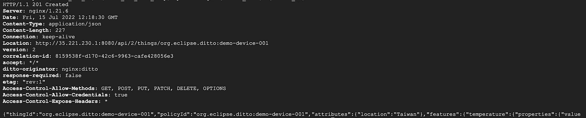

# 在谷歌云上运行 Eclipse HONO 和 Ditto)

> 原文：<https://medium.com/google-cloud/running-eclipse-hono-and-ditto-on-google-cloud-3-4a8919460c60?source=collection_archive---------1----------------------->

Eclipse Ditto 是一种数字双胞胎服务，它允许您在云中创建一个双胞胎，并通过双胞胎与设备进行通信。

# 设置 Eclipse 同上

为了让 Eclipse Ditto 与 Eclipse HONO 进行对话，首先我们在 Eclipse Ditto 中创建一个数字孪生兄弟。

在这里，我们创建一个数字孪生，代表具有温度和湿度两个属性的设备，稍后我们的设备将发送遥测数据来更新这些属性。

注意，当调用 Eclipse 的 REST API 时，您指定一个用户名和密码作为凭证。Eclipse Ditto 自带其认证和授权机制，详细内容请参考 [Eclipse Ditto 文档](https://www.eclipse.org/ditto/basic-auth.html)。

```
curl -X PUT -i -u ditto:ditto -H ‘Content-Type: application/json’ -d '{
“attributes”: {
“location”: “Taiwan”
},
“features”: {
“temperature”: {
“properties”: {
“value”: null
}
},
“humidity”: {
“properties”: {
“value”: null
}}}}' [http://${DITTO_API_IP}:${DITTO_API_PORT_http}/api/2/things/${TENANT_NAME}:${DEVICE_ID}](http://${DITTO_API_IP}:${DITTO_API_PORT_HTTP}/api/2/things/${TENANT_NAME}:${DEVICE_ID})
```

您应该会看到下面的消息，表明数字孪生已成功创建。



你可以做一个 HTTP GET 来获得数字孪生配置。

```
curl -i -u ditto:ditto [http://${DITTO_API_IP}:${DITTO_API_PORT_http}/api/2/things/${TENANT_NAME}:${DEVICE_ID}](http://${DITTO_API_IP}:${DITTO_API_PORT_HTTP}/api/2/things/${TENANT_NAME}:${DEVICE_ID})
```

# 创建一个连接来连接 Eclipse HONO 和 Eclipse 同上

下一步，我想让 Eclipse HONO 与 Eclipse Ditto 连接。Eclipse Ditto 提供了[连接 API](https://www.eclipse.org/ditto/connectivity-overview.html) 来与外部系统集成。但是在我创建连接来集成双方之前，让我们先看看 Eclipse Ditto 和 HONO 是如何处理传入消息的。

当一个设备通过 MQTT 协议向 Eclipse HONO 发送遥测数据时，它会转到 Eclipse HONO MQTT 适配器，根据安装步骤，消息随后会被发送到 [AMQP 网络或 Kafka](https://www.eclipse.org/hono/docs/getting-started) 进行进一步路由。在我们的例子中，我们将把这些遥测路由到 Eclipse Ditto，它接受 Eclipse Ditto 协议消息格式。

因此，在我们将遥测路由到 Eclipse Ditto 之前，我们首先需要定义一个映射，将来自设备的遥测映射到 Ditto 协议。为了简单起见，我假设设备总是以下面的格式发送 JSON 消息

```
{ “temp”: 20.5, “hum”:50}
```

在 Eclipse Ditto 中，可以定义一个 JavaScript 函数来映射消息。下面是简单的 JavaScript 函数。

```
function mapToDittoProtocolMsg(
   headers, 
   textPayload, 
   bytePayload, 
   contentType) 
{
   if (contentType !== "application/json") { return null; }
   var jsonData = JSON.parse(textPayload);
   var temperature = jsonData.temp;
   var humidity = jsonData.hum;
   var path;
   var value;

   if (temperature != null && humidity != null) {
      path = "/features";
      value = {
         temperature: 
            { 
               properties: { value: temperature } 
            }, 
         humidity: { properties: { value: humidity } }
      };
   } else if (temperature != null) {
      path = "/features/temperature/properties/value";
      value = temperature;
   } else if (humidity != null) {
      path = "/features/humidity/properties/value";
      value = humidity;
   }
   if (!path || !value) {
      return null;
   } return Ditto.buildDittoProtocolMsg(
            "org.eclipse.ditto2",
            headers["device_id"].split(":")[1],
            "things",
            "twin",
            "commands",
            "modify",
            path,
            headers,
            value
   );
}
```

让我们仔细看看这些代码。

首先，代码检查内容类型是否是*应用程序/json。*在我们的例子中，我们只处理 JSON 消息，所以如果内容类型不是 JSON 消息，我们就简单地丢弃它。注意，这也意味着在我们的设备代码中，我们需要指定内容类型头。

然后，一旦我们有了消息体，我们就开始解析消息并获取所需的信息，在本例中， *temp* 和 *hum。*

```
var jsonData = JSON.parse(textPayload);
var temperature = jsonData.temp;
var humidity = jsonData.hum;
```

然后我们指定*路径*值，该路径与我们之前创建的数字孪生属性一致。

```
 } else if (temperature != null) {
      path = "/features/temperature/properties/value";
      value = temperature;
   } else if (humidity != null) {
      path = "/features/humidity/properties/value";
      value = humidity;
```

最后，我们创建 Ditto 协议消息，注意第二个参数是 Eclipse Ditto 中的设备 id，在我们的例子中是 *demo-device-001* 。当遥测数据从设备发送到 Eclipse HONO 时，设备 id 采用*$ {租户名称}:$ {设备 ID}* 格式，因此我们在这里进行字符串拆分以提取设备 ID。

```
return Ditto.buildDittoProtocolMsg(
            "org.eclipse.ditto2",
            headers["device_id"].split(":")[1],
            "things",
            "twin",
            "commands",
            "modify",
            path,
            headers,
            value
   );
```

为了给 Connection 添加映射函数，我们对它做了一个 JSON.stringify()，所以值变成了这个。

```
“function mapToDittoProtocolMsg(\n headers,\n textPayload,\n bytePayload,\n contentType\n) {\n\n if (contentType !== \”application/json\”) {\n return null;\n }\n\n var jsonData = JSON.parse(textPayload);\n var temperature = jsonData.temp;\n var humidity = jsonData.hum;\n \n var path;\n var value;\n if (temperature != null && humidity != null) {\n path = \”/features\”;\n value = {\n temperature: {\n properties: {\n value: temperature\n }\n },\n humidity: {\n properties: {\n value: humidity\n }\n }\n };\n } else if (temperature != null) {\n path = \”/features/temperature/properties/value\”;\n value = temperature;\n } else if (humidity != null) {\n path = \”/features/humidity/properties/value\”;\n value = humidity;\n }\n \n if (!path || !value) {\n return null;\n }\n\n return Ditto.buildDittoProtocolMsg(\n \”org.eclipse.ditto2\”,\n headers[\”device_id\”].split(\”:\”)[1],\n \”things\”,\n \”twin\”,\n \”commands\”,\n \”modify\”,\n path,\n headers,\n value\n );\n}”
```

现在我们有了映射函数，让我们创建连接来连接 Eclipse HONO 和 Eclipse Ditto。

注意到

*   调用 create connection 时，我们使用 devops:devopsPw1！作为凭证。
*   连接监听 AMQP 网络，网络的 URL 在*“uri”中指定。*
*   连接 id， *hono-sandbox-connection，*将被用作 MQTT 客户机 Id 的一部分，记下这个 Id，我们将在以后使用它。

```
curl -X POST -i -u devops:devopsPw1! -H 'Content-Type: application/json' -d '{
"targetActorSelection": "/system/sharding/connection",
"headers": {
"aggregate": false
},
"piggybackCommand": {
"type": "connectivity.commands:createConnection",
"connection": {
"id": "hono-sandbox-connection",
"connectionType": "amqp-10",
"connectionStatus": "open",
"uri": "amqp://consumer%40HONO:verysecret@'${AMQP_NETWORK_IP}:${AMQP_NETWORK_PORT_amqp}'",
"failoverEnabled": true,
"sources": [{
"addresses": [
"telemetry/org.eclipse.ditto",
"event/org.eclipse.ditto"
],
"authorizationContext": ["nginx:ditto"]
}],
"mappingContext": {
"mappingEngine": "JavaScript",
"options": {
"incomingScript": "function mapToDittoProtocolMsg(\n    headers,\n    textPayload,\n    bytePayload,\n    contentType\n) {\n\n    if (contentType !== \"application/json\") {\n        return null;\n    }\n\n    var jsonData = JSON.parse(textPayload);\n    var temperature = jsonData.temp;\n    var humidity = jsonData.hum;\n    \n    var path;\n    var value;\n    if (temperature != null && humidity != null) {\n        path = \"/features\";\n        value = {\n                temperature: {\n                    properties: {\n                        value: temperature\n                    }\n                },\n                humidity: {\n                    properties: {\n                        value: humidity\n                    }\n                }\n            };\n    } else if (temperature != null) {\n        path = \"/features/temperature/properties/value\";\n        value = temperature;\n    } else if (humidity != null) {\n        path = \"/features/humidity/properties/value\";\n        value = humidity;\n    }\n    \n    if (!path || !value) {\n        return null;\n    }\n\n    return Ditto.buildDittoProtocolMsg(\n        \"org.eclipse.ditto2\",\n        headers[\"device_id\"].split(\":\")[1],\n        \"things\",\n        \"twin\",\n        \"commands\",\n        \"modify\",\n        path,\n        headers,\n        value\n    );\n}"}}}}}' http://${DITTO_API_IP}:${DITTO_API_PORT_http}/devops/piggyback/connectivity?timeout=8s
```

要验证连接是否成功创建，您需要执行一个检索连接 API 调用。

```
curl -X POST -i -u devops:devopsPw1! -H ‘Content-Type: application/json’ -d '{
“targetActorSelection”: “/system/sharding/connection”,
“headers”: {},
“piggybackCommand”: {
“type”: “connectivity.commands:retrieveConnection”,
“connectionId”: “hono-sandbox-connection”
}
}'
[http://${DITTO_API_IP}:${DITTO_API_PORT_http}/devops/piggyback/connectivity?timeout=8s](http://${DITTO_API_IP}:${DITTO_API_PORT_http}/devops/piggyback/connectivity?timeout=8s)
```

要验证连接是否正常运行，请运行 HTTP 客户端提交遥测数据。

```
curl -X POST -i -u ${DEVICE_ID}-auth@${TENANT_NAME}:my-password -H ‘Content-Type: application/json’ -d ‘{“temp”: 33.07}’ [http://${HTTP_ADAPTER_IP}:${HTTP_ADAPTER_PORT_http}/telemetry](/${HTTP_ADAPTER_IP}:${HTTP_ADAPTER_PORT_HTTP}/telemetry)
```

您获取连接度量来检查遥测是否被路由到 Eclipse Ditto。

```
curl -X POST -i -u devops:devopsPw1! -H ‘Content-Type: application/json’ -d ‘{
“targetActorSelection”: “/system/sharding/connection”,
“headers”: {},
“piggybackCommand”: {
“type”: “connectivity.commands:retrieveConnectionMetrics”,
“connectionId”: “hono-sandbox-connection”
}
}’
[http://${DITTO_API_IP}:${DITTO_API_PORT_http}/devops/piggyback/connectivity?timeout=8s](http://${DITTO_API_IP}:${DITTO_API_PORT_http}/devops/piggyback/connectivity?timeout=8s)
```

至此，我们已经成功地集成了 Eclipse HONO 和 Eclipse Ditto。在下一篇博客中，我将集成 Eclipse Ditto 和 Google Cloud 功能。

[第四部分](/google-cloud/running-eclipse-hono-and-ditto-on-google-cloud-4-308c61735d47)