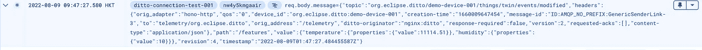

# 在谷歌云上运行 Eclipse HONO 和 Ditto)

> 原文：<https://medium.com/google-cloud/running-eclipse-hono-and-ditto-on-google-cloud-4-308c61735d47?source=collection_archive---------5----------------------->

这是演示在 Google Cloud 上运行 Eclipse HONO 和 Eclipse Ditto 的博客系列的第 4 部分。

在这一集中，我将把 Eclipse Ditto 与 Google Cloud 函数连接起来，并创建一个通过 MQTT 协议发布遥测数据的设备模拟器。当一切都正确配置后，从设备模拟器发送的遥测数据将被转发到谷歌云功能。

# 创建云函数

为了简化测试，Cloud 函数只是为了验证 Google Cloud 接收到 Eclipse Ditto 转发的遥测数据。稍后我们将增强它来模拟更真实的用例，但是现在它已经足够好来回应它接收到的任何东西。

转到谷歌云控制台，用下面的代码创建一个新的云函数。这个云函数什么也不做，只是记录来自 Eclipse Ditto 的请求。

```
exports.process = (req, res) => {
   console.log(`process invoked`);
   console.log(`req.query=${JSON.stringify(req.query)}`);
   let message = req.query.message || req.body.message || 'ok!';
   console.log(`received message: ${message}`);
   res.status(200).send(message);
};
```

部署云功能别忘了把入口点改成`process`

现在我们已经准备好了代码，当设备向 Eclipse HONO 发布遥测数据时，它将通过我们在前一篇文章中配置的连接转发给 Eclipse Ditto。然后，Eclipse Ditto Connectivity service 将调用 HTTP 端点(云函数)并将遥测数据发送到云函数。

由于我们不希望云函数被其他任何人调用，通常我们应该配置云函数权限，以允许特定用户作为云函数调用方。

Eclipse Ditto 确实支持 OAuth 2.0 client_credentials 授权，但是在撰写本文时，Google Cloud 目前还不支持这种授权。为了保护我们的云功能，我们必须实现自己的认证机制。但是现在，我们只想验证 Eclipse Ditto 和 Google Cloud 之间的联系，我们只是授予`allUsers`作为云函数 Invoker 以允许匿名调用。将您的云功能暴露给互联网是不安全的，但现在我们只想验证连接性，所以让我们暂时离开它，我们稍后将回到这一点。

# 为 Eclipse 和云功能创建连接

我们有一个云函数，它提供了一个接受遥测数据的 HTTP 端点，现在我们想在 Eclipse 和云函数之间创建一个连接，这样每当遥测数据流向 Eclipse HONO 时，它将被 Eclipse Ditto 拾取，然后转发给云函数。

我们使用相同的 REST API 创建另一个连接，其中

*   <your functions="" url="">是云功能的 HTTP 网址</your>
*   <your entry="" point="">是云函数路径</your>

例如，如果您的云函数端点是[https://myfunctions.cloudfunctions.net/receiveTelemetry,](https://myfunctions.cloudfunctions.net/receiveTelemetry,)，那么<函数 URL >应该是[https://myfunctions.cloudfunctions.net](https://myfunctions.cloudfunctions.net/receiveTelemetry,)，而<入口点>应该是[/接收遥测](https://myfunctions.cloudfunctions.net/receiveTelemetry,)

```
curl -X POST -i -u devops:devopsPw1! -H 'Content-Type: application/json' -d '{
"targetActorSelection": "/system/sharding/connection",
"headers": {},
"piggybackCommand": {
"type": "connectivity.commands:createConnection",
"connection": {
"id": "gcp-connection-org-eclipse-ditto",
"connectionType": "http-push",
"connectionStatus": "open",
"failoverEnabled": true,
"specificConfig": {
"parallelism": "2"
},
"uri": "https://<YOUR FUNCTIONS URL>:443",
"sources": [],
"targets": [
{
"address": "POST:/<YOUR ENTRY POINT>",
"topics": ["_/_/things/twin/events", "_/_/things/live/messages",
"_/_/things/live/events", "_/_/things/live/commands",
"_/_/policies/announcements", "_/_/connections/announcements"],
"authorizationContext": ["nginx:ditto"],
"headerMapping": {
"content-type": "application/json"
}
}
]
}
}
}' http://${DITTO_API_IP}:${DITTO_API_PORT_http}/devops/piggyback/connectivity?timeout=8s
```

# 验证连通性

做一个 HTTP post 发布遥测，验证云功能调用是否正确。

```
curl -X POST -i -u ${DEVICE_ID}-auth@${TENANT_NAME}:my-password -H 'Content-Type: application/json' -d '{"temp": 11114.51, "hum":10}' http://${HTTP_ADAPTER_IP}:${HTTP_ADAPTER_PORT_http}/telemetry
```

等待几秒钟，您应该会在云日志中看到日志条目。



至此，我们已经验证了从设备到 Eclipse HONO 和 Eclipse Ditto 以及 Google Cloud 的连接性。

[第五部分](/google-cloud/running-eclipse-hono-and-ditto-on-google-cloud-5-8c4ad80a8c6e)