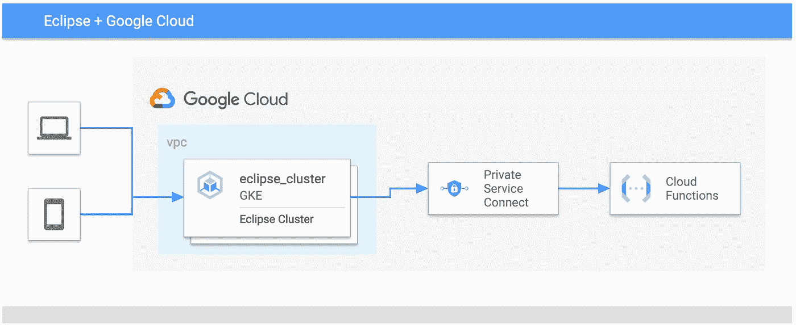

# 在谷歌云上运行 Eclipse HONO 和 Ditto)

> 原文：<https://medium.com/google-cloud/running-eclipse-hono-and-ditto-on-google-cloud-5-8c4ad80a8c6e?source=collection_archive---------6----------------------->

在撰写本文时，Eclipse Ditto 为 HTTP 推送连接提供了几个[认证机制](https://www.eclipse.org/ditto/connectivity-protocol-bindings-http.html)。

*   [客户端证书认证](https://www.eclipse.org/ditto/connectivity-protocol-bindings-http.html#client-certificate-authentication)
*   [HMAC 请求签约](https://www.eclipse.org/ditto/connectivity-protocol-bindings-http.html#hmac-request-signing)
*   [OAuth 2 客户端凭证授予](https://www.eclipse.org/ditto/connectivity-protocol-bindings-http.html#oauth2-client-credentials-flow)

遗憾的是，在撰写本文时，Google Cloud 不支持上述认证机制。为了保护云功能，有几种选择。

*   通过网络隔离保护云功能。
*   通过支持上述认证机制的其他服务来保护云功能。
*   通过自定义代码保护云功能。
*   结合上述不同的选择。

通过自定义代码和另一个支持 OAuth 或 HMAC 签名的服务来保护云功能，这里暂时不讨论。我将设置一个网络隔离，以便云功能只接受来自同一个 VPC 网络的连接。

# 通过网络隔离保护云功能

VPC 中的云资源可以通过私有服务连接从 VPC 调用云功能。为此，您需要创建一个私有服务连接器，并将云功能配置为使用该连接器。下图所示的高级架构图。



高级专用服务连接架构

*   创建专用服务连接器

```
export VPC_SUBNET_NAME=<YOUR VPC SUBNET NAME>gcloud services enable vpcaccess.googleapis.com
gcloud compute networks vpc-access connectors create my-psc-connector \
--region asia-east1 \
--subnet $VPC_SUBNET_NAME
```

*   按照本说明[更新云功能以使用私有服务连接器。](https://cloud.google.com/vpc/docs/configure-serverless-vpc-access#functions)

配置完成后，您的云功能只接受来自同一 VPC 或同一 VPC 服务控制范围内的请求。你可以通过在 VPC 外运行 curl 来验证这一点。

```
curl -m 70 -X POST https://$YOUR_FUNCTION_URL \
-H "Authorization:bearer $(gcloud auth print-identity-token)" \
-H "Content-Type:application/json" \
-d '{}'
```

您应该会得到一个 HTTP 403 错误。

现在让我们验证您的 Eclipse 集群是否能够将遥测数据转发给云功能。

```
curl -X POST -i -u ${DEVICE_ID}-auth@${TENANT_NAME}:my-password \
-H ‘Content-Type: application/json’ \
-d ‘{“hum”: 12.17}’ [http://${HTTP_ADAPTER_IP}:${HTTP_ADAPTER_PORT_http}/telemetry](/${HTTP_ADAPTER_IP}:${HTTP_ADAPTER_PORT_http}/telemetry)
```

您应该在云日志中看到一个日志条目。

[第六部分](/google-cloud/running-eclipse-hono-and-ditto-on-google-cloud-6-a715c59a5d05)