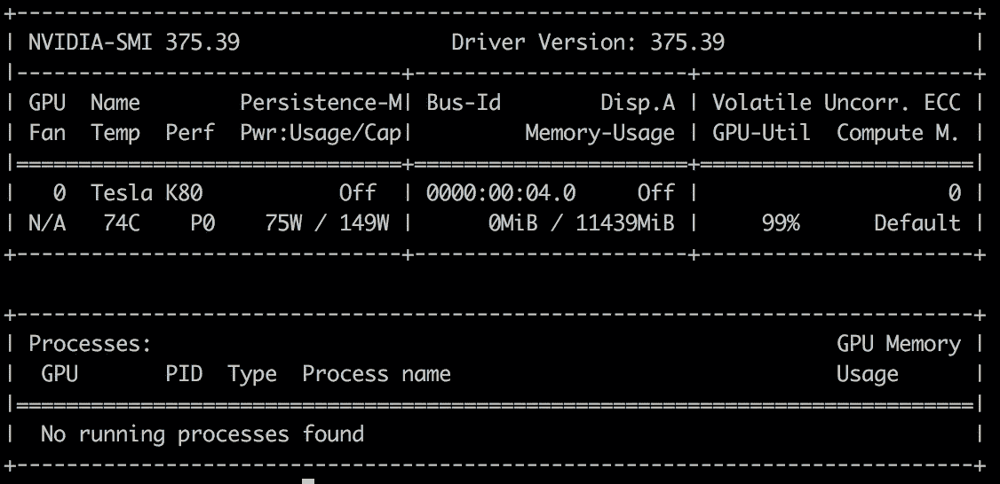
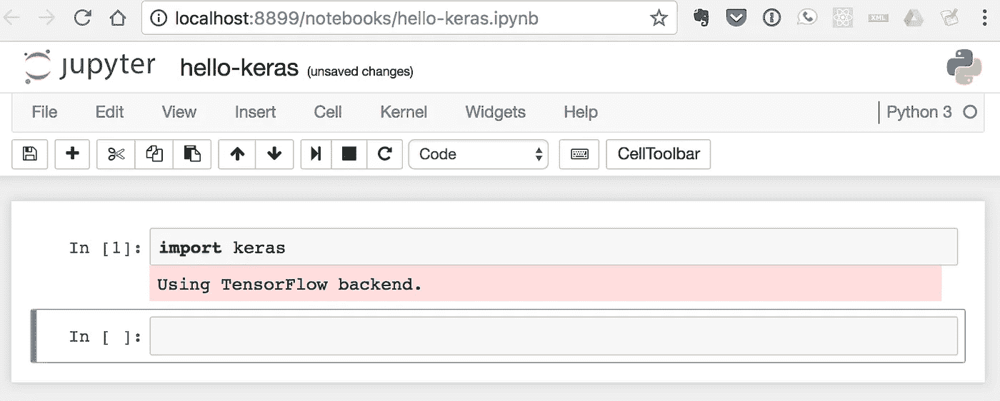
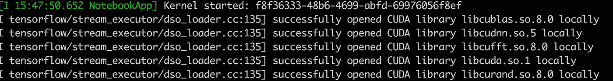

# 在谷歌云的 GPU 上运行 Jupyter 笔记本

> 原文：<https://medium.com/google-cloud/running-jupyter-notebooks-on-gpu-on-google-cloud-d44f57d22dbd?source=collection_archive---------0----------------------->

这篇帖子显然是受到了@fchollet 的这条推文的启发。

令人惊讶的是，我没有在谷歌云上找到类似的设置说明。他们的云数据实验室产品目前似乎不能直接在支持 GPU 的机器上运行。希望这种情况能尽快改变。

以下是我遵循的步骤。这些步骤假设您已经更新了`gcloud`工具(或者您可以使用 Cloud Shell)。

```
$ gcloud components update && gcloud components install beta
```

**第一步:确认你的 GPU 配额和区域**

并非所有 GCP 区域目前都支持 GPU。此外，您可能需要请求增加您的 GPU 限制。

根据[https://cloud.google.com/compute/docs/gpus/](https://cloud.google.com/compute/docs/gpus/)，目前这些区域支持 GPU — *美国-西方 1-b、美国-东方 1-d、欧洲-西方 1-b、亚洲-东方 1-a* 。

```
$ gcloud beta compute regions describe us-east1- limit: 1.0
  metric: NVIDIA_K80_GPUS
  usage: 0.0
```

如果`limit`是< 1.0，那么请在[https://console.cloud.google.com/compute/quotas](https://console.cloud.google.com/compute/quotas)请求增加限制。根据我的经验，谷歌会立即批准请求。

**步骤 2:创建启用 GPU 的实例**

```
$ gcloud beta compute instances create **gpu-deep-learner** --machine-type n1-standard-2 --zone **us-east1-d** --accelerator type=**nvidia-tesla-k80,count=1** --image-family ubuntu-1604-lts --image-project ubuntu-os-cloud --boot-disk-size 50GB --maintenance-policy TERMINATE --restart-on-failure
```

这将在`us-east1-d`区域中创建一个名为`gpu-deep-learner`的实例，使用 1 个 GPU 和 Ubuntu 16.04(持久磁盘大小为 50GB)。

**第三步:安装 CUDA**

对实例的 ssh(例如使用`gcloud`)

```
$ gcloud compute ssh gpu-deep-learner --zone us-east1-d
```

安装 CUDA 8.0 驱动程序和工具包:

```
~$ curl -O [http://developer.download.nvidia.com/compute/cuda/repos/ubuntu1604/x86_64/cuda-repo-ubuntu1604_8.0.61-1_amd64.deb](http://developer.download.nvidia.com/compute/cuda/repos/ubuntu1604/x86_64/cuda-repo-ubuntu1604_8.0.61-1_amd64.deb)~$ sudo dpkg -i cuda-repo-ubuntu1604_8.0.61-1_amd64.deb
~$ sudo apt-get update
~$ rm cuda-repo-ubuntu1604_8.0.61-1_amd64.deb~$ sudo apt-get install cuda -y
```

确认:

```
~$ nvidia-smi
```



设置环境变量:

```
~$ echo 'export CUDA_HOME=/usr/local/cuda' >> ~/.bashrc
~$ echo 'export PATH=$PATH:$CUDA_HOME/bin' >> ~/.bashrc
~$ echo 'export LD_LIBRARY_PATH=$LD_LIBRARY_PATH:$CUDA_HOME/lib64' >> ~/.bashrc~$ source ~/.bashrc
```

**第四步:安装 cuDNN**

在[https://developer.nvidia.com/cudnn](https://developer.nvidia.com/cudnn)注册并下载 cuDNN。然后，将文件 scp 到您的新实例中。例如

```
$ scp -i .ssh/google_compute_engine cudnn-8.0-linux-x64-v5.1.tgz <external-IP-of-GPU-instance>:
```

现在，回到远程实例，解压缩并复制这些文件:

```
~$ cd
~$ tar xzvf cudnn-8.0-linux-x64-v5.1.tgz
~$ sudo cp cuda/lib64/* /usr/local/cuda/lib64/
~$ sudo cp cuda/include/cudnn.h /usr/local/cuda/include/~$ rm -rf ~/cuda
~$ rm cudnn-8.0-linux-x64-v5.1.tgz
```

至此，所有的 NVIDIA/CUDA 设置都已完成。可以选择自己喜欢的方式安装 Python 和任何使用 GPU 的深度学习库。蟒蛇是一种流行的方式。

**第五步:安装 Anaconda 和你喜欢的深度学习框架**

```
~$ curl -O [https://repo.continuum.io/archive/Anaconda3-4.3.1-Linux-x86_64.sh](https://repo.continuum.io/archive/Anaconda3-4.3.1-Linux-x86_64.sh)
~$ bash Anaconda3-4.3.1-Linux-x86_64.sh
```

按照提示操作。我也选择了“是”而不是“将 anacoda 添加到您的路径中”。最好退出并重新登录。

使用`conda`或`pip`安装您的库。(`pip`对 TensorFlow 效果更好):

```
~$ pip install **tensorflow-gpu**
~$ pip install keras
```

**第六步:配置 Jupyter**

```
~$ jupyter notebook --generate-configWriting default config to: /home/ubuntu/.jupyter/jupyter_notebook_config.py
```

编辑`/home/ubuntu/.jupyter/jupyter_notebook_config.py`以在顶部包含以下内容:

~ `/.jupyter/jupyter_notebook_config.py`

**第七步:SSH 隧道转发**

从本地机器建立一个隧道，通过 ssh 访问 Jupyter。

```
~ ssh -i .ssh/ubuntu_gcp -L **8899**:localhost:8888 ubuntu@**<IP-address-of-your-GPU-instance>**
```

然后，在服务器上，启动 Jupyter。

```
~$ mkdir notebooks
~$ cd notebooks~/notebooks$ jupyter notebook
```

**第八步:在本地浏览器上开始使用 Jupyter**

导航到 [http://localhost:8899/](http://localhost:8899/) 并创建一个新笔记本。通过导入 keras 或 tensorflow 进行验证。远程日志还将确认您是否正在使用 GPU/Cuda 库。



利润！



GPU 所有的东西！

一旦完成，请 ***记得停止你的实例*** 以节省成本。这些 GPU 实例并不便宜。享受吧。

**备注:**

1.  会帮你安排 PyTorch。
2.  `pip install keras`还装了 Theano 0.9。然而，这个版本的 Theano 可能会对迁移到新的`gpuarray`后端发出不赞成的警告。你可以安装 *libgpuarray* 来解决这个问题。