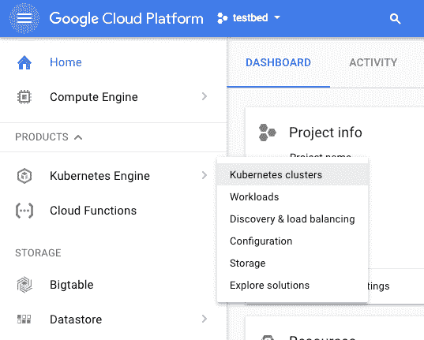
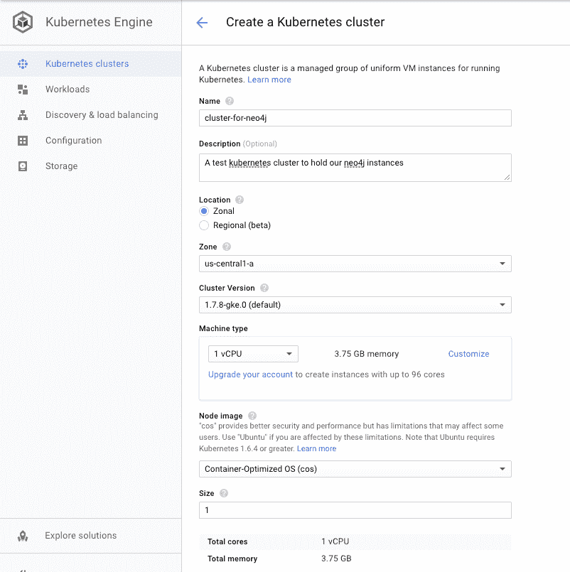
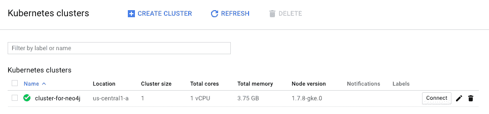
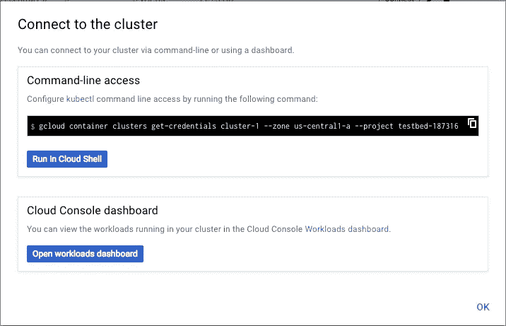
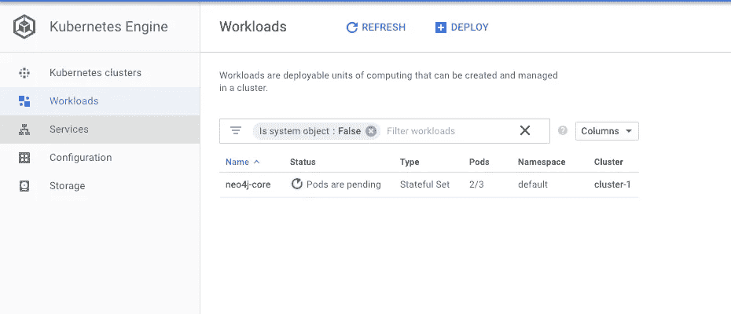

# 在 Google Cloud 中使用托管的 Kubernetes 运行 Neo4j

> 原文：<https://medium.com/google-cloud/running-neo4j-with-hosted-kubernetes-in-google-cloud-b479e87b74c0?source=collection_archive---------1----------------------->

**更新**:自从这篇文章最初被写出来，Google 在 GCP 市场上发布了 Kubernetes 应用程序。如果你对点击式方法特别感兴趣，[请看看我的另一篇关于如何启动那个](/@david.allen_3172/launching-neo4j-on-googles-kubernetes-marketplace-97c23c94e960)的帖子。这篇文章仍然包含准确的信息，但重点是基于头盔的部署。

# 介绍

自从 Neo4j 发布了 [docker images](https://hub.docker.com/_/neo4j/) 之后，对于如何部署它有了大量的选择。因为 neo4j 可以作为集群数据库运行，所以使用容器编排工具是有帮助的，比如 docker-compose 这样的轻量级工具，或者 kubernetes 这样更健壮的工具。

Kubernetes 是一个开源平台，用于跨主机集群自动部署、扩展和操作容器。所以本质上，它只是那种在维护从 docker 容器派生的 neo4j 实例集群时有用的工具。谷歌的 GCP 提供了一个[托管的 kubernetes 引擎选项](https://cloud.google.com/kubernetes-engine/)，所以建立一个 Kubernetes 集群并向其部署应用程序是非常容易的，这就是我们今天要做的。

# 先决条件

gcloud 实用程序是一套允许命令行与谷歌云交互的软件。它相当于亚马逊的 aws 包装实用程序。

你会需要它，[所以先去那个页面安装它](https://cloud.google.com/sdk/gcloud/)！

您还需要一个名为 kubectl 的实用程序来控制 kubernetes 集群，您可以从 kubernetes 页面获得这个实用程序，它适用于几乎任何操作系统。

# 在 GCP 上创建托管的 Kubernetes 集群

在 google cloud 控制台中，转到 Kubernetes 集群页面，导航方式如下:



接下来，我们将配置一个 kubernetes 集群，在本例中只有一个节点(“Size”参数)，因为我们不需要为这个测试实例提供太多额外的容量。请记住，成本与您需要的节点数量和提供给它们的资源成比例。但这是一个关键的设置；在本教程的后面部分，我们将在单个节点上部署 3 个 neo4j pods。显然，这只是出于演示目的，因为这种类型的部署拓扑在生产环境中没有意义，在生产环境中，如果任何一个节点出现故障，您都需要节点中的冗余来保持集群运行。

配置新群集有许多选项；出于我们的目的，我采用了大部分默认设置，并点击底部的“创建”,但是当然可以从 Google 获得完整的文档。

**确保您的集群至少有 3 个节点**。在部署因果集群时，我们将向 kubernetes 集群部署至少 3 个不同的容器。(或者更多，如果您最终添加了读取副本)



集群启动后，您应该会看到如下所示的屏幕，这让我们知道一切正常:



# 连接到集群

现在，我们只需点击“Connect”按钮，google 就会给我们一些命令，我们可以使用这些命令来执行我们的主机操作系统和 kubectl 程序，以便控制和部署到这个 kubernetes 集群。



*kubectl proxy* 命令设置了一个本地 HTTP 代理，这样你就可以和你的 google 集群对话，就像它是本地的一样，运行在你的机器上。

以下步骤将假设您执行了这个 *gcloud* 命令和 *kubectl 代理*命令。

# 将 Neo4j 部署到集群

接下来，我们需要将 neo4j 配置应用到我们的 kubernetes 集群。Kubernetes 在 YAML 文件中这样做。

幸运的是，通过 [kubernetes-neo4j 回购](https://github.com/neo4j-contrib/kubernetes-neo4j)，我们有了可以应用的基本默认值。除了这些代码，neo4j 的网站上还有一篇文章[描述了如何部署到本地运行的 kubernetes】。](https://neo4j.com/blog/kubernetes-deploy-neo4j-clusters/)

不过，开门见山地说，这些命令是必要的:

```
$ git clone [https://github.com/neo4j-contrib/kubernetes-neo4j.git](https://github.com/neo4j-contrib/kubernetes-neo4j.git)
$ cd kubernetes-neo4j
$ kubectl apply -f cores
service “neo4j” created
statefulset “neo4j-core” created
```

这个 git repo 提供了一组脚本，其中包含了部署 neo4j 集群所需的一切。这里的 kubectl 命令简单地应用了开箱即用的配置，这是一组有状态的 3 个核心节点，它们可以发现彼此和一个 DNS 服务。

启动一两分钟后，在您的本地主机上，您应该能够看到您的部署。



# 验证事情看起来不错

您可以查看日志以确保各种 pod 运行正常。

```
$ kubectl logs -f neo4j-core-0
(lots of output snipped)2017-12-21 20:46:46.209+0000 INFO  Discovering cluster with initial members: [neo4j.default.svc.cluster.local:5000]
2017-12-21 20:46:46.209+0000 INFO  Attempting to connect to the other cluster members before continuing...
2017-12-21 20:47:48.650+0000 INFO  Started.
2017-12-21 20:47:49.448+0000 INFO  Mounted REST API at: /db/manage
2017-12-21 20:47:51.857+0000 INFO  Remote interface available at http://neo4j-core-0.neo4j.default.svc.cluster.local:7474/
```

看起来不错！

# 按需扩展

从这里开始，您可以[按照 github 存储库](https://github.com/neo4j-contrib/kubernetes-neo4j)上的说明，通过添加读取副本或添加新节点来扩展您的集群。大部分工作可以通过应用 github repo 提供的其他模板来完成。

# 这一切是如何运作的？

kubernetes 配置只是一组环境变量和一些包装在官方 neo4j docker 映像周围的 shell 脚本。您可以在 [statefulset.yaml](https://github.com/neo4j-contrib/kubernetes-neo4j/blob/master/cores/statefulset.yaml) 文件中看到该配置。特定于 kubernetes 的位处理节点如何发现彼此的细节，以及默认集群的拓扑是什么(在本例中是 3 个核心节点)。neo4j docker 映像本身已经提供了许多配置项，比如能够通过环境变量将一系列配置选项直接传递给数据库。

# 用它！

使用 kubectl，您已经可以像这样直接对单个 pod 执行命令。这样做不需要设置任何额外的网络或端口权限。

```
$ kubectl exec neo4j-core-0 -- bin/cypher-shell --format verbose "MATCH (n) RETURN count(n);"+----------+
| count(n) |
+----------+
| 0        |
+----------+1 row available after 374 ms, consumed after another 4 ms
```

# 从这里去哪里

您需要为位于 github repo 的 cores 目录中的 neo4j 配置和定制部署模板。特别是，在撰写本文时，默认部署指定了一个无集群 IP，[意味着部署是无头的](https://kubernetes.io/docs/concepts/services-networking/service/)，不能从外部访问。这是一个初始的明智设置，因为为了便于设置，设置还会禁用身份验证。请务必仔细阅读 neo4j 和 kubernetes 配置，以确保您知道您将得到什么！

这些配置选项很重要，对生产性能和安全性有很大影响。请咨询您当地的 kubernetes 专家，以便做出适合您的部署的选择。