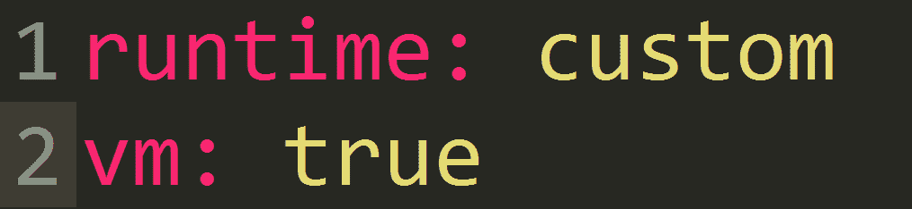
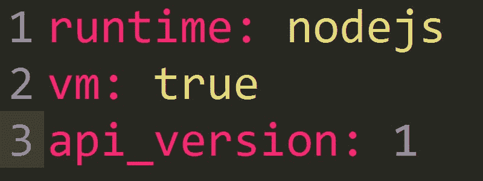
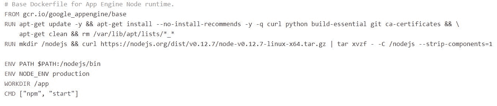

# 在应用程序引擎上运行 Node.js

> 原文：<https://medium.com/google-cloud/running-node-js-on-app-engine-e49e9bb31d3b?source=collection_archive---------1----------------------->

这本指南可能有点过时了。现在，App Engine 在其标准环境中支持 Node。

请看这里:[https://cloud.google.com/appengine/docs/nodejs/](https://cloud.google.com/appengine/docs/nodejs/)选择更适合你和你的项目的方式。如果你喜欢灵活的环境，这个指南可能对你有用。

当然，任何开发了在**应用引擎**(谷歌的 PaaS)上运行的项目的人都会发现这样的情况:

*   **站台**很有意思。
*   提供的**服务和库**解决了许多常见问题。
*   所需的**配置**是**最少的**，其余的由谷歌完成。
*   它**缩放**的方式很棒。它允许任何请求都不会被忽略，不管请求的数量有多少。
*   以及该产品的许多其他**大优点**。

**但是**他/她肯定会发现或想知道如何解决以下任何一个问题:

*   使用 4 种可能语言(Python、Java、Go、PHP)中的一种**语言**。
*   安装一个不可用的库。
*   使用不支持的**框架**。

在这两种情况下，解决方案都称为:**托管虚拟机**。

在本文中，我将介绍**托管虚拟机**，然后向您展示如何在 App Engine 上使用 **Node.js 的示例。**

## 那么，什么是托管虚拟机呢？

托管虚拟机是谷歌云服务的一个组成部分，它允许您使用可配置的**计算引擎虚拟机**在**应用引擎**上运行应用。

## 我们实现了什么？

基本上，我们**保留了**App Engine 的所有优势，并增加了**Compute Engine 提供的灵活性**。

我们避免了沙盒环境的限制。我们也可以只配置我们应用程序的一些**模块**来使用受管理的虚拟机，一切都与**容器**技术一起工作。

## 如何配置应用程序以使用托管虚拟机？

在 **app.yaml** 文件(描述我们的 App Engine 配置的文件)中，我们必须修改**运行时**参数并添加 **vm** 参数，如下所示:

**vm** 参数很简单，表示我们将在 App Engine 中使用自己的实例。

**运行时**参数有点复杂。我们可以使用一个**标准的**运行时(基于 Google 提供的可以修改和扩展的环境)，或者一个**定制的**运行时，基于一个完全由用户定义的环境。

现在的问题很明显，

## 我们如何定义一个环境？

这里就是我之前提到的**容器**出现的地方。

Google Cloud 采用的容器技术是 [**Docker**](https://www.docker.com/) 。Docker 可以通过从**docker 文件**中读取指令来自动构建**图像**。Dockerfile 是一个文本文档，它包含用户可以在命令行上调用的所有命令来组合一个图像。

因此，当我们使用一个**定制运行时**时，App Engine 将搜索一个 **Dockerfile** ，在这里我们指定了定义我们环境的所有必要步骤。安装**库**、**框架**、**依赖项**，运行我们的应用程序所需的一切。

## 把所有的放在一起。最后在 App Engine 上运行 Node.js。

为了**说明**使用托管虚拟机执行应用程序，我提议使用 hashtag 查询最近的 tweets，并使用 **Node.js** 作为服务器技术将它们显示在屏幕上。

我不会深入研究应用程序代码，因为这超出了本文的目的。这是一个基本的节点应用程序，有一些依赖关系。

我要解释的是 app.yaml 文件内容。

**app . YAML**

在这种情况下，运行时是自定义的，但由 Google 提供。Google 为几个栈提供了**基本映像**，其中一个是 Node.js，在这里查看:[https://cloud . Google . com/app engine/docs/managed-VMs/custom-runtimes # base _ images](https://cloud.google.com/appengine/docs/managed-vms/custom-runtimes#base_images)

***Dockerfile***

基本上，使用 google 提供的一个运行时，我们就不需要编写 dockerfile。假设我们的运行时是 **nodejs** ，我们使用一个**预组装 dockerfile** 用于执行以下任务的节点:

*   **扩展**一个 App 引擎基础镜像。
*   **安装**一些依赖项。
*   **安装**节点。
*   **设置**环境变量。
*   **运行** npm 启动。

你可以在这里查看:

 [## Google cloud platform/nodejs-docker

### nodejs 的 docker - Docker 图像

github.com](https://github.com/GoogleCloudPlatform/nodejs-docker) 

或者在这里看:

nodejs 运行时 Dockerfile

通过 app.yaml 文件中的唯一更改，我们将 App Engine 的标准环境更改为支持 Node.js 的环境

## 结论

**托管虚拟机**允许我们修改在 App Engine 上运行的应用的**基础技术堆栈**，而不会失去在 App Engine 考虑需求时创建新的不可变实例的可能性。(例如，当它需要扩展时)。

您可以在下面的资源库中看到完整的应用程序代码:

 [## 利奥皮泰利/诺丹金

### 在 GitHub 上创建一个帐户，为 nodengine 开发做贡献。

github.com](https://github.com/leopittelli/nodengine) 

有任何问题、反馈或改进，请联系我。

 [## 莱昂纳多·皮泰利(@利奥皮泰利)|推特

### 莱昂纳多·皮泰利的最新推文(@利奥皮泰利)。软件工程师。全栈开发者。谷歌开发者…

twitter.com](http://twitter.com/leopittelli) 

莱昂纳多·皮泰利。