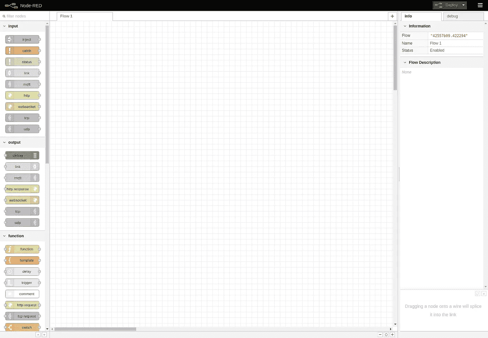
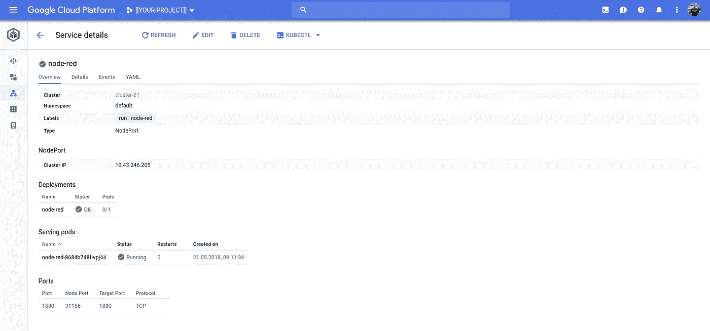
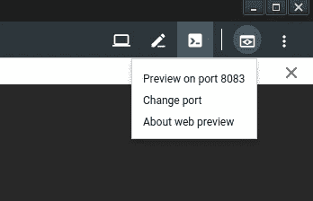
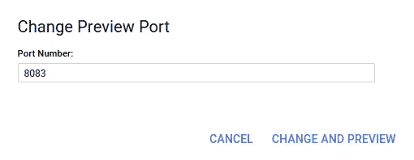
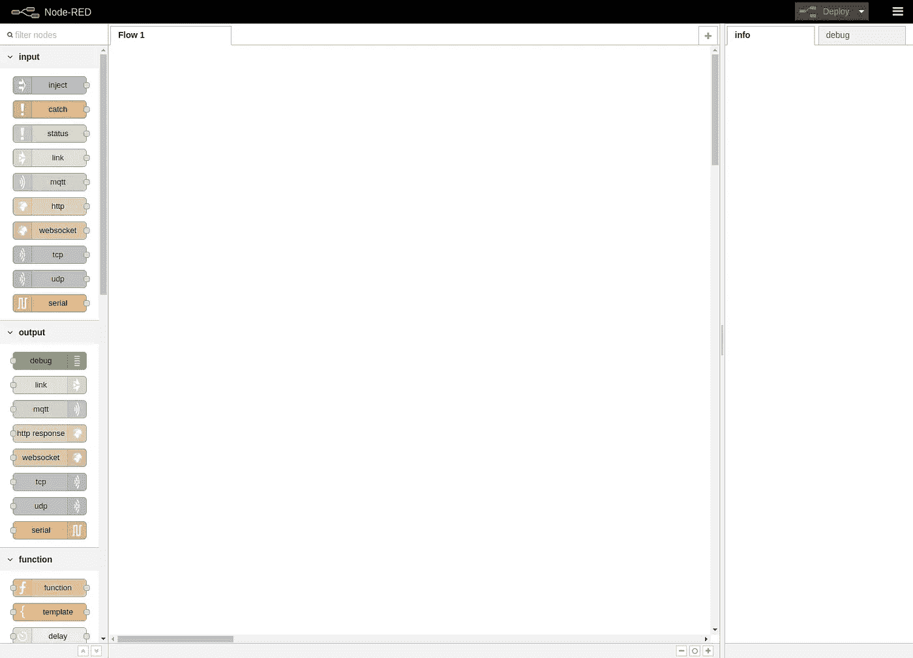
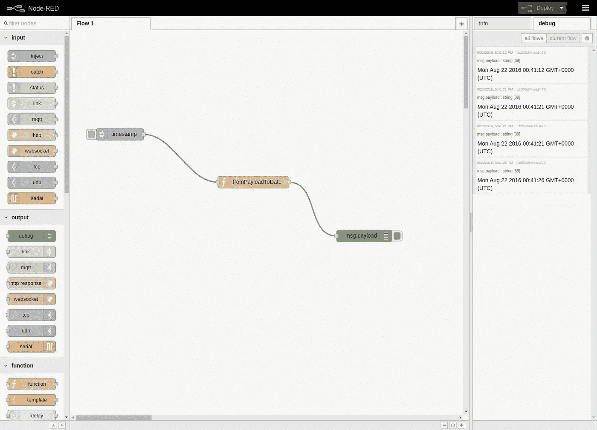

# 谷歌云平台上的 Node-RED

> 原文：<https://medium.com/google-cloud/running-node-red-on-google-cloud-platform-under-docker-3d4185e97f28?source=collection_archive---------0----------------------->

[Node-RED](http://nodered.org/) 很有意思。Node-RED [文档](http://nodered.org/docs/)不包含在[谷歌云平台](https://cloud.google.com) (GCP)上运行 Node-RED 的说明。如果你没有用过 GCP，还有免费的选项。

## 更新时间:18–05–20

自从我两年前写这篇文章以来，GCP 发生了(许多)变化。作为对 [Shiv Kodam](https://medium.com/u/41619cbdee8d?source=post_page-----3d4185e97f28--------------------------------) 的回应，这里有一个更新，它将帮助你让 Node-RED 在(a) [容器优化的 OS](https://cloud.google.com/container-optimized-os/) 镜像上运行(`container-vm`已被否决)；(b) [Kubernetes 发动机](https://cloud.google.com/kubernetes-engine/)。

## 容器优化的操作系统

容器优化的操作系统使用 [cloud-init](https://cloudinit.readthedocs.org/en/latest/index.html) 进行配置。下面是一个经过调整的 cloud-init 文件，它运行一个节点红色的容器:

使用上面的`cloud-init`文件创建容器优化的 OS VM:

```
gcloud compute instances create ${NODE} \
--image-family=cos-stable \
--image-project=cos-cloud \
--metadata-from-file=user-data=./cloud-init.yaml \
--machine-type=f1-micro \
--zone=${ZONE} \
--preemptible \
--project=${PROJECT}
```

> 这是一个廉价的虚拟机`[f1-micro](https://cloud.google.com/compute/docs/machine-types#f1-micro)`，它是`[preemptible](https://cloud.google.com/compute/docs/instances/preemptible)`。如果你想要更大的马力，选择一个更强大的虚拟机。

给映像一点时间来稳定，下载 Node-RED 并运行容器。您可以通过 ssh 进入虚拟机，然后运行 `— command`，或者像这里一样，一起运行它们:

```
gcloud compute ssh ${NODE} \
--project=${PROJECT} \
--command="sudo journalctl --unit=node-red --follow"
```

对于成功启动的`node-red-docker`容器，您希望看到类似如下的内容:

```
20 May 19:54:31 - [info] Server now running at [http://127.0.0.1:1880/](http://127.0.0.1:1880/)
20 May 19:54:31 - [info] Starting flows
20 May 19:54:31 - [info] Started flows
```

一旦容器开始运行，您就可以远程`curl`Node-RED 端点:

```
gcloud compute ssh ${NODE} \
--project=${PROJECT} \
--command="curl localhost:1880"
```

您应该会看到以下形式的输出:

```
<!DOCTYPE html>
<html>
...
<head>
<title>Node-RED</title>
...
</head>
...
```

如果您不想创建防火墙规则，您可以使用`gcloud`创建一个从 VM 的端口`1880`到本地机器的端口`1880`的 ssh 端口转发:

```
gcloud compute ssh ${NODE} \
--ssh-flag="-L 1880:localhost:1880" \
--project=${PROJECT}
```

然后，从您的浏览器中:

```
google-chrome http://localhost:1880
```



完成后，不要忘记清除虚拟机:

```
gcloud compute instances delete ${NODE} \
--project=${PROJECT}
```

## 库伯内特发动机

将 Node-RED 作为单个 Pod |服务部署到 Kubernetes(引擎)非常简单。假设您有一个通过身份验证的集群:

```
NAMESPACE=node-redkubectl create namespace ${NAMESPACE}
kubectl apply --filename=node-red.yaml --namespace=${NAMESPACE}
deployment.extensions "node-red" created
service "node-red" created
```



然后，您可以使用此快捷方式获取 Kubernetes 的一个节点，确定 Node-Red 服务的 NodePort(在上面的控制台截图中，您可以看到在我的例子中这是`31156`),然后使用 gcloud 将端口转发到该节点上的这个 NodePort:

```
NODE=$(\
  kubectl get nodes \
  --output=jsonpath="{.items[0].metadata.name}")PORT=$(\
  kubectl get services/node-red \
  --namespace=${NAMESPACE} \
  --output=jsonpath="{.spec.ports[0].nodePort}")echo ${PORT}gcloud compute ssh ${HOST} \
--ssh-flag="-L ${PORT}:localhost:${PORT}" \
--project=${PROJECT}
```

然后，您可以像以前一样评估 Node-RED，但是使用 NodePort ( `${PORT}`而不是`1880`):

```
google-chrome http://${HOST}:${PORT}
```

## 旁白:Chromebook

昨天我在用 Chromebook 修改这个帖子。由于出色的[云外壳](https://cloud.google.com/shell/)，使用 Chromebook 时仍然可以运行 port-forward。

使用 Cloud Shell，您可以运行上面的命令。唯一的区别是 Cloud Shell 有一组受约束的端口(`8080–8084`)。因此，当涉及到`gcloud`端口转发时，请使用这些值中的一个来代替`1880`，为了便于讨论，我们使用`8083`:

```
gcloud compute ${NODE} \
--ssh-flag="-L 8083:localhost:1880"
```

然后，如果尚未更改，请单击“更改端口”:



并将其设置为`8083`:



并且，您应该像以前一样看到红色的节点控制台。

仅此而已！

## 原创内容

在 GCP 上运行 Node-RED 非常容易。

如果你之前没有用过谷歌云平台，从这里的开始[。否则，假设您有一个项目[[PROJECT-ID]]，并且安装了](https://cloud.google.com/free-trial/) [Cloud SDK](https://cloud.google.com/sdk/) ，让我们从定义一些环境变量开始:

```
PROJECT=[[PROJECT-ID]]
NODE=[[NODE-NAME]]                     # e.g. "node-red"
ZONE=[[ZONE]]                          # e.g. "us-east1-d"
CONTAINER_FILE=[[CONTAINER-FILENAME]]  # e.g. "node_red.yaml"
```

为了简单起见，我们将在虚拟机上的 Docker 中运行 Node-RED。我们向 GCP 提供了一个配置文件和创建虚拟机的命令。

创建一个名为[CONTAINER_FILE]]的文件，并使用以下文本作为其内容。这告诉 GCP 在哪里可以找到 Node-RED 的 Docker 映像，并在端口 1880 上运行它:

```
apiVersion: v1
kind: Pod
metadata:
  name: node-red
spec:
  containers:
    - name: node-red
      image: nodered/node-red-docker:latest
      imagePullPolicy: Always
      ports:
        - containerPort: 1880
          hostPort: 1880
```

现在，要创建一个运行 Docker 的虚拟机，并使用[[CONTAINER_FILE]]安装和配置 Node-RED，请使用以下命令:

```
gcloud compute instances create $NODE \
--image=container-vm \
--metadata-from-file=google-container-manifest=$CONTAINER_FILE \
--machine-type=custom-1-2048 \
--zone=$ZONE \
--project=$PROJECT \
--tags=node-red
```

该命令完成并创建虚拟机后，它将总结虚拟机的详细信息，包括 EXTERNAL_IP 地址。记录下这个 EXTERNAL_IP 地址，因为它是您将用来浏览 Node-RED 的 IP 地址。您还可以使用以下命令找到您的节点的 EXTERNAL_IP:

```
gcloud compute instances list \
--filter=NAME=$NODE \
--format='table[no-heading](EXTERNAL_IP)' \
--project=$PROJECT
```

为了从其他机器访问节点红色虚拟机，您必须打开端口 1880 的防火墙。使用此命令:

```
gcloud compute firewall-rules create allow-node-red \
--project=$PROJECT \
--allow tcp:1880 \
--network=default \
--source-ranges=0.0.0.0/0 \
--target-tags=node-red
```

就是这样！

现在，您应该能够使用以下 URL 访问 Node-RED。用您之前确定的 IP 地址替换 EXTERNAL_IP:

```
http://[[EXTERNAL_IP]]:1880
```



节点红色—随时可用！

然后，使用“[第一个流](http://nodered.org/docs/getting-started/first-flow)展开:



# 拆毁

要删除虚拟机和防火墙，请使用以下命令:

```
gcloud compute instances delete $NODE \
--project=$PROJECT \
--quietgcloud compute firewall-rules delete allow-node-red \
--project=$PROJECT \
--quiet
```

# 结论

在 Google 云平台的 VM 上的容器中运行 Node-RED 非常容易。玩得开心！