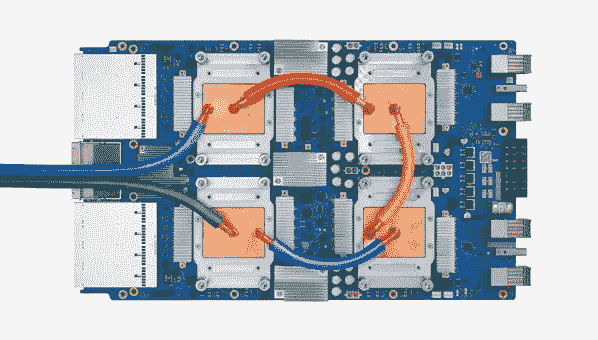

# 在 GCP 人工智能平台上用 TPUs 运行 PyTorch 培训

> 原文：<https://medium.com/google-cloud/running-pytorch-with-tpus-on-gcp-ai-platform-training-4dacc0134b6?source=collection_archive---------1----------------------->



> 目前人工智能平台培训只为 CPU 和 GPU 提供了[预构建的 Pytorch 环境](https://cloud.google.com/ai-platform/training/docs/getting-started-pytorch)，因此当在人工智能平台培训上使用 Pytorch 和 TPUs 时，您需要构建一个自定义容器。你基本上需要构建一个支持 PyTorch 的 XLA 版本的容器，正如在 [XLA PyTorch 文档](https://github.com/pytorch/xla)中所解释的。按照 XLA 文档中的步骤构建容器非常容易，但是您应该注意，在初始化 XLA TPU 库之前，必须将 TPU 的地址导出到名为$ TPU IP 地址的流程环境中。当我们试图在 AI 平台训练中部署容器时，这将产生一个困难，因为 TPU 的地址事先并不知道。
> 
> 这个问题的解决方法很简单。我们可以简单地修改 XLA PyTorch 容器的入口点，使其指向一个启动器“片段”,它将首先从环境中检索 TPU 地址，然后在调用模型代码之前将其导出到$ TPU IP 地址环境变量中。AI 平台训练以 Tensorflow 可以理解的格式提供 TPU 的“坐标”，但不提供环境中 TPU 的实际 IP 地址和端口。这个问题的一个简单解决方案是调用 Tensorflow 代码片段，该代码片段将使用 tpu 聚类解析器从 AI 平台训练环境中提取实际的 IP 地址和端口:

*TPU _ 聚类 _ 解析器= TF . distribute . cluster _ 解析器。TPUClusterResolver(tpu 名称，区域名称，项目)*

> 这个片段将返回 TPU 的实际 IP 地址和端口。我们现在可以在$ TPU IP 地址变量中导出这些信息，一切都正常了！这个解决方案很简单，但是它涉及到很多步骤，所以我们在下面提供了一个逐步的例子。

# 在 TPUs 上启动 PyTorch jobs 进行人工智能培训:循序渐进

在这条学习道路上有三个基本步骤:

1.  通过 GCP 培训了解如何在 CPU/GPU 上使用 PyTorch
2.  了解如何在 TPUs 上运行 PyTorch
3.  通过 GCP 培训了解如何在 TPUs 上使用 PyTorch

# 了解如何在 GCP 培训中使用客户容器(CPU/GPU 上的 PyTorch)

首先，了解如何在 CPU 或 GPU 上运行 PyTorch，并按照下面的教程在 GCP 培训中使用自定义容器:

*   [https://cloud . Google . com/ai-platform/training/docs/custom-containers-training](https://cloud.google.com/ai-platform/training/docs/custom-containers-training)

需要理解的一个重要方面是所使用的 docker 文件，它使用 PyTorch 构建映像，将示例模型复制到容器中，并定义 GCP 培训用来启动容器的 docker 入口点。Dockerfile 文件复制如下:

```
# Dockerfile
FROM python:2.7.15-jessie
WORKDIR /root# Installs pytorch and torchvision.
RUN pip install torch==1.0.0 torchvision==0.2.1# Installs cloudml-hypertune for hyperparameter tuning.
# It’s not needed if you don’t want to do hyperparameter tuning.
RUN pip install cloudml-hypertune# Installs google cloud sdk, this is mostly for using gsutil to export model.
RUN wget -nv \
https://dl.google.com/dl/cloudsdk/release/google-cloud-sdk.tar.gz && \
mkdir /root/tools && \
tar xvzf google-cloud-sdk.tar.gz -C /root/tools && \
rm google-cloud-sdk.tar.gz && \
/root/tools/google-cloud-sdk/install.sh --usage-reporting=false \
--path-update=false --bash-completion=false \
--disable-installation-options && \
rm -rf /root/.config/* && \
ln -s /root/.config /config && \# Remove the backup directory that gcloud creates
rm -rf /root/tools/google-cloud-sdk/.install/.backup# Path configuration
ENV PATH $PATH:/root/tools/google-cloud-sdk/bin# Make sure gsutil will use the default service account
RUN echo '[GoogleCompute]\nservice_account = default' > /etc/boto.cfg# Copies the trainer code
RUN mkdir /root/trainer
COPY trainer/mnist.py /root/trainer/mnist.py# Sets up the entry point to invoke the trainer.
ENTRYPOINT ["python", "trainer/mnist.py"]
```

# 了解如何在 TPUs 上运行 PyTorch

要在 TPUs 上运行 PyTorch，最好的方法是使用谷歌 XLA 团队提供的容器映像(XLA =加速线性代数)。这是 PyTorch 针对 GPU 的优化版本。该教程可从以下网站获得:

*   [https://github.com/pytorch/xla](https://github.com/pytorch/xla)

阅读本教程时，您已经在单个 TPU 上部署了 mnist 示例。本教程还解释了如何使用多个 TPU。对于多个 TPU，您可以选择使用一个虚拟机实例组，如教程中所述，也可以选择使用 GCP 培训，该培训将自动为您调配所有环境，如下一节所述。

# 了解如何在 GCP 培训的 TPUs 上运行 PyTorch

现在，让我们一起学习这两个教程。我们基本上想用 TPU 部署前面的示例，但这次是在 GCP 培训中使用定制容器。我们可以简单地通过使用不同的 docker 文件来构建容器来实现这一点。在这个 docker 文件中，我们需要做一些事情:

1.  基础图像应该是我们在上一个教程中使用的 XLA PyTorch 图像
2.  我们复制一小段代码(启动器脚本),解析 TPU 工作者的地址，然后调用前面描述的模型。
3.  我们将容器的入口点改为指向启动器脚本

我们成功地使用了下面的 dockerfile 文件:

```
# Dockerfile
#use the latest version of XLA enabled Pytorch
FROM gcr.io/tpu-pytorch/xla:nightly
WORKDIR /root# Installs Tensorflow to resolve the TPU name to IP Address
RUN pip install tensorflow# Installs cloudml-hypertune for hyperparameter tuning.
# It’s not needed if you don’t want to do hyperparameter tuning.
RUN pip install cloudml-hypertune# Installs google cloud sdk, this is mostly for using gsutil to    
# export the model.
RUN wget -nv \
https://dl.google.com/dl/cloudsdk/release/google-cloud-sdk.tar.gz && \
mkdir /root/tools && \
tar xvzf google-cloud-sdk.tar.gz -C /root/tools && \
rm google-cloud-sdk.tar.gz && \
/root/tools/google-cloud-sdk/install.sh --usage-reporting=false \
--path-update=false --bash-completion=false \
--disable-installation-options && \
rm -rf /root/.config/* && \
ln -s /root/.config /config && \# Remove the backup directory that gcloud creates
rm -rf /root/tools/google-cloud-sdk/.install/.backup# Path configuration
ENV PATH $PATH:/root/tools/google-cloud-sdk/bin# Make sure gsutil will use the default service account
RUN echo '[GoogleCompute]\nservice_account = default' > /etc/boto.cfg# Copies the trainer code and launcher
RUN mkdir /root/launcher
COPY launcher/launcher.sh /root/launcher/launcher.sh
COPY launcher/launcher.py /root/launcher/launcher.py# Sets up the entry point to invoke the trainer.
ENTRYPOINT ["sh", "launcher/launcher.sh"]
```

现在让我们解释一下我们对入口点做了什么。现在，新映像将从 launcher.sh 命令开始。这样做的原因是，我们需要从 GCP 培训设置的环境变量中获取 TPU 名称。然后，我们将该名称转换为 TPU IP 地址和端口，以便像以前一样调用 PyTorch。下面是实现这一点的 launcher.sh 文件:

```
# dump all the environment variables so that we can see them in the
# execution log
export# use an auxiliary python script to get the IP Address and Port of
# the TPU VM 
tpu_address=`python /root/launcher/launcher.py`
echo "tpu_address is $tpu_address"# export the TPU address and port
export XRT_TPU_CONFIG="tpu_worker;0;$tpu_address"# invoke the trainer code
python /pytorch/xla/test/test_train_mnist.py
```

launcher.sh 脚本使用 launcher.py 脚本通过 CAIP 培训提供的环境变量解析 TPU 的名称:

```
import json
import os
import tensorflow.compat.v1 as tftf_config_str = os.environ.get('TF_CONFIG')
tf_config_dict  = json.loads(tf_config_str)#print(json.dumps(tf_config_dict, indent=2))tpu_config_str = os.environ.get('TPU_CONFIG')
tpu_config_dict  = json.loads(tpu_config_str)#print(json.dumps(tpu_config_dict, indent=2))tpu_name = tpu_config_dict["tpu_node_name"]
project_name = tpu_config_dict["project"]
zone_name = tpu_config_dict["zone"]tpu_cluster_resolver = tf.distribute.cluster_resolver.TPUClusterResolver(
tpu_name,
zone=zone_name,
project=project_name)#print(tpu_cluster_resolver.cluster_spec())
worker_list=tpu_cluster_resolver.cluster_spec()#print(vars(worker_list))print(worker_list._cluster_spec["worker"][0])
```

如您所见，有两个重要的环境变量:TF_CONFIG 和 TPU_CONFIG。这里我们只使用 TPU 配置。我们使用 os.environ.get 从环境中获取它，然后读取它是一个 json 对象，然后获取 TPU 名称、项目和区域。然后，这三个参数被传递给 TPUClusterResolver 类，以解析成一个 worker 定义，在本例中，它具有 TPU IP 地址和端口。以下是 GCP 培训工作开始时这些环境变量的情况:

```
export TF_CONFIG='{"cluster":{"master":["127.0.0.1:2222"]},"environment":"cloud","task":{"type":"master","index":0},"job":"{\n \"scale_tier\": \"CUSTOM\",\n \"master_type\": \"n1-highcpu-16\",\n \"worker_type\": \"cloud_tpu\",\n \"worker_count\": \"1\",\n \"region\": \"us-central1\",\n \"master_config\": {\n \"image_uri\": \"gcr.io/ml-3d-segmentation/mnist_pytorch_custom_container:mnist_pytorch_tpu\"\n },\n \"worker_config\": {\n \"accelerator_config\": {\n \"count\": \"8\",\n \"type\": \"TPU_V3\"\n },\n \"tpu_tf_version\": \"1.15\"\n }\n}"}export TPU_CONFIG='{"project": "j79edad251b5e3ba2-ml", "zone": "us-central1-b", "tpu_node_name": "cmle-training-14556593641811293930-tpu"}'
```

# 构建和测试 docker 映像

我们现在准备构建 docker 映像。创建一个工作目录(我们使用路径“/work”来说明)。然后将 dockerfile 文件复制到其中。使其成为活动目录。

> cd /work

为启动器文件创建一个目录

> mkdir 发射器

将 launcher.sh 和 launcher.py 复制到/launcher 目录

现在可以运行 docker build 命令了。如果您尚未这样做，请执行上一个示例中的步骤，以使用 GCP 凭据启用 docker:

```
sudo usermod -a -G docker ${USER}
gcloud auth configure-docker
```

然后给图像一个名称和标签:

```
export PROJECT_ID=$(gcloud config list project --format "value(core.project)"
export IMAGE_REPO_NAME=mnist_pytorch_custom_container
export IMAGE_TAG=mnist_pytorch_cpu
export IMAGE_URI=gcr.io/$PROJECT_ID/$IMAGE_REPO_NAME:$IMAGE_TAG
```

然后执行 docker 构建:`docker build -f Dockerfile -t $IMAGE_URI ./`

# 用本地项目测试 Docker 映像

您现在可以运行 docker 文件来测试它。但是要小心！我们已经更改了启动器脚本的入口点，该脚本希望环境像 GCP 培训那样设置。因此，要测试它，请在交互模式下启动它，并将入口点覆盖为“sh”模式:

`docker run -it — shm-size 16G — entrypoint=sh $IMAGE_URI`

您现在可以导出启动器所期望的变量(没有错误检查！).设置 TF_CONFIG 和 TPU_CONFIG。在上一个教程中，您已经在项目中创建了一个 TPU 虚拟机。更改下面的 TPU 配置语句，以反映您项目中的项目、区域和 TPU 名称:

```
TF_CONFIG='{"cluster":{"master":["127.0.0.1:2222"]},"environment":"cloud","task":{"type":"master","index":0},"job":"{\n \"scale_tier\": \"CUSTOM\",\n \"master_type\": \"n1-highcpu-16\",\n \"worker_type\": \"cloud_tpu\",\n \"worker_count\": \"1\",\n \"region\": \"us-central1\",\n \"master_config\": {\n \"image_uri\": \"gcr.io/ml-3d-segmentation/mnist_pytorch_custom_container:mnist_pytorch_tpu\"\n },\n \"worker_config\": {\n \"accelerator_config\": {\n \"count\": \"8\",\n \"type\": \"TPU_V3\"\n },\n \"tpu_tf_version\": \"1.15\"\n }\n}"}export TPU_CONFIG='{"project": "YOUR_PROJECT_NAME", "zone": "YOUR_ZONE", "tpu_node_name": "YOUR_TPU_NAME"}'
```

现在，您可以使用 cd 转到/root/launcher 目录，并执行 launcher.sh。这应该会使用正确的 TPU 地址调用培训。

# 在 GCP 培训中检验码头工人形象

首先，将经过测试的 docker 映像推送到映像注册中心:

`docker push $IMAGE_URI`

我们现在可以使用 docker 图像通过 CAIP 培训开始培训。我们将使用一个简单的配置，包括一个主节点和一个 TPU 节点。以下 yaml 文件具有正确的配置，请注意，您必须更改 imageUri 字段以指向您已经上传到云注册表的容器:

```
jobId: tpu_test_3
labels:
type: prod
owner: novaes
trainingInput:
scaleTier: CUSTOM
masterType: n1-highcpu-16
masterConfig:imageUri: gcr.io/YOUR_IMAGE_PATH_HERE:mnist_pytorch_tpuworkerType: cloud_tpu
workerCount: 1
workerConfig:
acceleratorConfig:
type: TPU_V3
count: 8
tpuTfVersion: "1.15"
```

确保将 ImageUri 字段更改为指向您的 docker 图像。将 yaml 保存为 py torch _ TPU _ 配置. yaml。现在可以使用以下命令提交作业:

```
gcloud beta ai-platform jobs submit training your_job_name_here \ 
— config=pytorch_tpu_config.yaml — region us-central1
```

瞧啊。您现在可以使用 GCP AI 平台培训运行 TPU 启用的 PyTorch 作业。