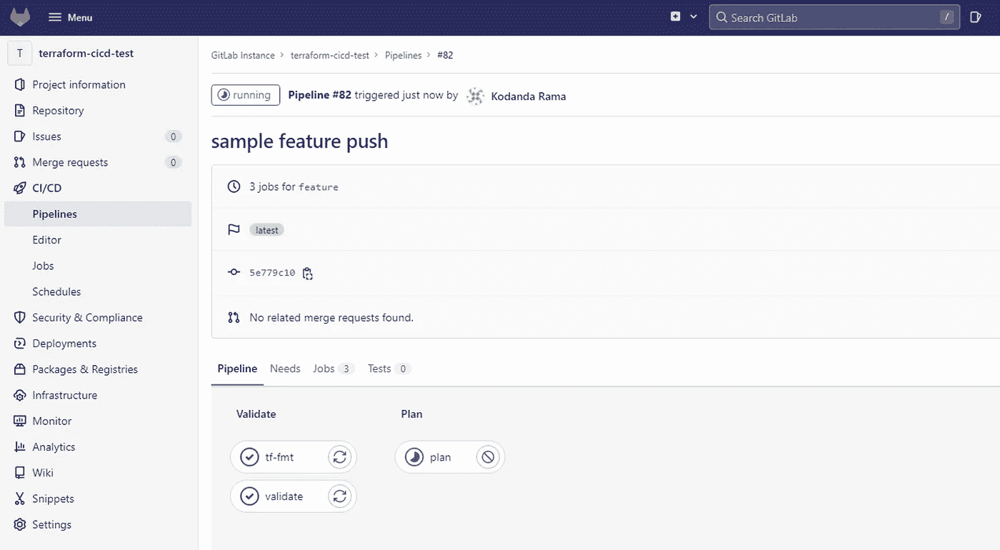
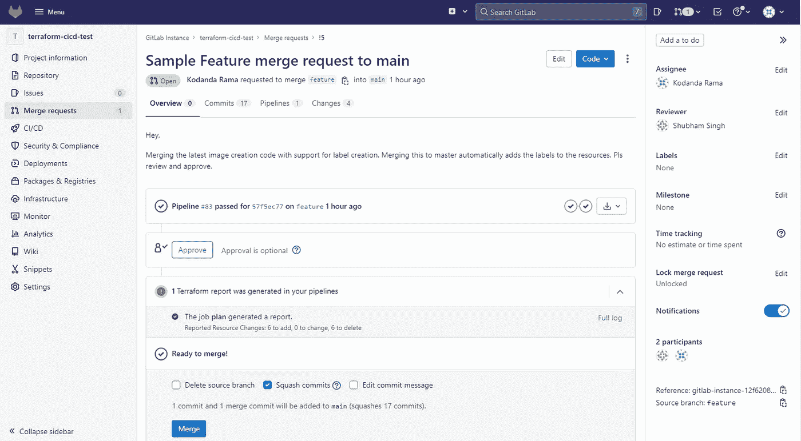
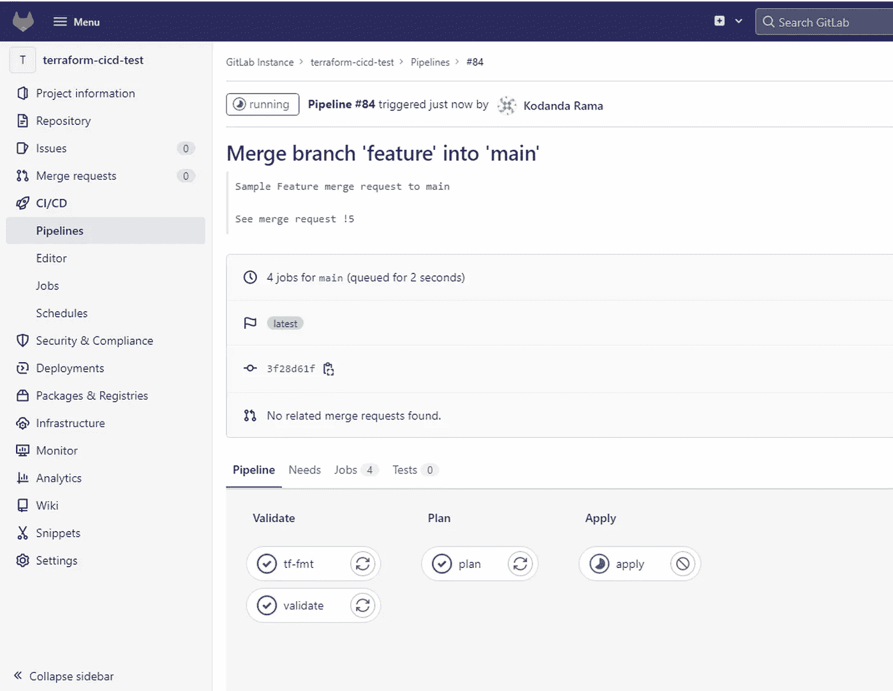

# 使用 Gitlab 运行 GCP 的 Terraform CICD 管道

> 原文：<https://medium.com/google-cloud/running-terraform-cicd-pipelines-on-gcp-with-gitlab-5611d3a87a46?source=collection_archive---------0----------------------->

基础设施即代码已经迅速成为在云上调配和管理资源的默认流程。它快速、一致、易于复制并与 GitOps 结合，易于控制、跟踪和审计从源代码库中做出的更改。越来越多的团队开始使用 IaC 和 CICD 作为他们的基础设施。

在本文中，让我们看看如何利用 GitOps 和 terraform 来自动化 Google 云平台上的资源部署和管理。

# 先决条件

1.  对 IaC、基本地形概念和命令有基本的了解
2.  Git 和一般 CICD 机制的知识
3.  有权创建实例的 GCP 项目和用户帐户以及服务帐户
4.  企业或 SaaS Gitlab 帐户，有权创建存储库和管道

# 设置

1.  在计算引擎实例上运行的 Gitlab 实例。但是，这同样适用于公共 Gitlab 和内部托管版本(在网络方面做了一些改动)
2.  包含 terraform 代码的 Gitlab 存储库
3.  一个 Gitlab runner 托管在 docker 上的一个计算引擎实例中。它将被配置为与支持 CICD 的存储库一起工作。这个 runner 实例应该具有到 Gitlab 实例的网络连接
4.  Terraform 代码将在此 runner 上执行，因此建议将其托管在 GCP 计算引擎实例上。这允许使用与实例相关联的基础服务帐户在 GCP 授权和创建资源。该实例应该启用了所需的 API 范围，并且具有必要的权限
5.  如果运行者不在 GCP 上，则需要创建一个服务帐户密钥，并将其作为一个秘密变量传递给管道，以对 terraform 进行身份验证，这并不理想。在这种情况下，我们必须维护和旋转密钥

# 地形代码

[代码库链接](https://github.com/kkram01/terraform-gitlab-cicd)

在本例中，我们将使用快照从永久磁盘创建计算映像。这是克隆迁移过程中经常出现的一个用例。

作为一个最佳实践，terraform 状态在 GCS bucket 上作为远程后端进行管理，支持开箱即用的状态锁定。

# 工作流程和管道概述

下面的例子为 CICD 工作流使用了 Github 分支策略。更多关于这个和各种 git 分支策略的详细信息[在这里](https://www.flagship.io/git-branching-strategies/)。

简而言之，Github 流有两个分支。主分支和基于主分支的特征分支。任何代码更改都会提交到本地特性分支，并推送到其远程特性分支。一旦工作准备好被部署，对主分支的合并请求(也称为拉请求)就被打开。审批通过后将被审核并合并到总分行。Terraform apply 仅在通过合并请求合并到主分支时执行。为了防止直接的代码推送，主分支应该是受保护的分支。

Gitlab 管道作业触发器定义了管道的执行顺序和阶段，在*中声明。gitlab-ci.yaml* 配置文件，它位于存储库的根目录下。

下面是一个示例配置文件

```
# Workflow image
image:
  name: hashicorp/terraform:0.13.2
  entrypoint:
    - "/usr/bin/env"
    - "PATH=/usr/local/sbin:/usr/local/bin:/usr/sbin:/usr/bin:/sbin:/bin"

# Workflow variables. They can be overwritten by passing pipeline Variables in Gitlab repository
variables:     
  TF_ROOT: $CI_PROJECT_DIR/image-creation
  TF_LOG: WARN
  TF_TIMEOUT: "-lock-timeout=600s"
  TF_PLAN_NAME: plan.tfplan
  TF_PLAN_JSON: plan.json
  REFRESH: -refresh=true
  ENVIRONMENT_NAME: "prod" 

# Provides the Terraform version and reconfigures the backend state during init
# Note: The leading dot (.) ignores this as a "job" while the ampersand (&) is an Anchor declaring the script as a variable to use elsewhere
.terraform-ver-init: &terraform-ver-init
  - cd $TF_ROOT
  - terraform version
  - terraform init --upgrade=True

#terraform init is run before any stage jobs
before_script:
  - *terraform-ver-init

# Cache files between jobs
cache:
  key: "$CI_COMMIT_SHA"
  # Globally caches the .terraform folder across each job in this workflow
  paths:
    - $TF_ROOT/.terraform

# Provides a list of stages for this GitLab workflow
stages:
  - validate
  - plan
  - apply

#Job: tf-fmt | Stage: validate
#Purpose: check the format (fmt) as a sort of linting test
tf-fmt:
  stage: validate
  script:
    - terraform fmt -recursive -check
  only:
    changes:
      - "*.tf"
      - "**/*.tf"

# Job: Validate | Stage: Validate
# Purpose: Syntax Validation for the Terraform configuration files
validate:
  stage: validate
  script:
    - terraform validate
  only:
    changes:
      - "*.tf"
      - "**/*.tf"
      - "**/*.tfvars"

#Job: plan | Stage: Plan
#Runs terraform plan and outputs the plan and a json summary to 
#local files which are later made available as artifacts.
plan: 
  stage: plan
  dependencies:
    - validate
  before_script:
    - *terraform-ver-init
    - apk --no-cache add jq
    - alias convert_report="jq -r '([.resource_changes[]?.change.actions?]|flatten)|{\"create\":(map(select(.==\"create\"))|length),\"update\":(map(select(.==\"update\"))|length),\"delete\":(map(select(.==\"delete\"))|length)}'"
  script:
    - cd $TF_ROOT
    - terraform plan -out=$TF_PLAN_NAME $REFRESH
    - terraform show --json $TF_PLAN_NAME | convert_report > $TF_PLAN_JSON

  only:
    changes:
      - "*.tf"
      - "**/*.tf"
      - "**/*.tfvars"

  artifacts:
    reports:
      terraform: ${TF_ROOT}/$TF_PLAN_JSON
    paths:
      - ${TF_ROOT}/$TF_PLAN_NAME
      - ${TF_ROOT}/$TF_PLAN_JSON
    expire_in: 7 days   #optional. Gitlab stores artifacts of successful pipelines for the most recent commit on each ref. If needed, enable "Keep artifacts from most recent successful jobs"  in CI/CD settings of the repository.

#Stage:apply | job: apply
# purpose: executes the plan from the file created in the plan stage
apply:
  stage: apply
  dependencies:
    - plan
  script:
    - cd $TF_ROOT
    - terraform apply -auto-approve $TF_PLAN_NAME 
  only:
    - main
```

让我们看看上面控制工作流的文件的一些重要组件。

在 before_script 下运行 terraform init 作业可确保它在任何其他阶段定义的作业之前执行。

```
.terraform-ver-init: &terraform-ver-init
  - cd $TF_ROOT
  - terraform version
  - terraform init --upgrade=True

before_script:
  - *terraform-ver-init
```

上面的块定义了只有对以结尾的文件进行更改时才会触发作业。tf，。tfvars 文件。这很有用，因为我们不会为不相关的变更(如文档更新)触发管道。

```
only:
    changes:
      - "*.tf"
      - "**/*.tf"
      - "**/*.tfvars"
```

terraform 计划输出及其简化的 json 摘要可以作为报告和工件进行访问。

```
artifacts:
    reports:
      terraform: ${TF_ROOT}/$TF_PLAN_JSON
    paths:
      - ${TF_ROOT}/$TF_PLAN_NAME
      - ${TF_ROOT}/$TF_PLAN_JSON
    expire_in: 7 days
```

详细解释配置文件支持的关键字是[这里是](https://docs.gitlab.com/ee/ci/yaml/)

# 履行

上述配置文件的典型端到端工作流如下所示:

1.  对代码库的更改被提交到功能分支
2.  管道在推送至要素分支时触发，并在语法验证和格式检查后运行 terraform init 和 plan



功能分支上的管道运行验证和计划阶段

3.一旦计划输出被验证并准备好被部署，一个合并请求被提交到主分支。包含计划文件和 json 摘要的计划执行输出和工件显示在合并请求上



Terraform 计划日志和工件显示在合并请求上

4.一旦合并请求被批准，代码被合并到主分支，管道运行验证、计划，并对生成的计划运行 terraform apply，并创建指定的资源，在这种情况下是来自持久磁盘的快照和映像



触发器在主分支上应用 stage 并创建资源

# 后续步骤

现在我们有了一个工作管道，有一些事情需要考虑，以使它足够健壮，并针对生产环境进行优化。

1.  多环境管道的分支或文件夹结构策略
2.  将地形测试作为管道的一部分
3.  集成静态代码分析工具，如 checkov、SonarQube