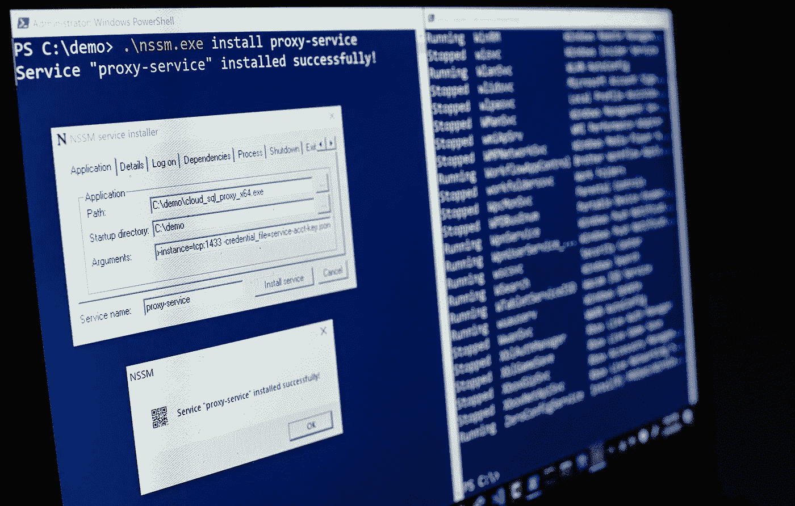
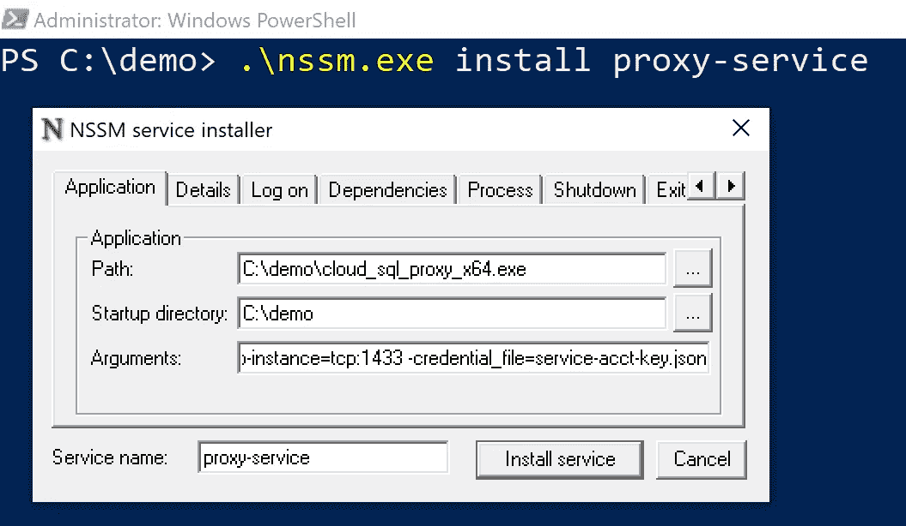
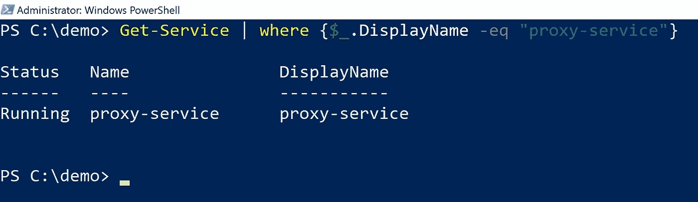
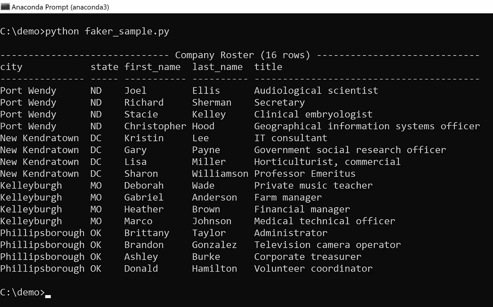
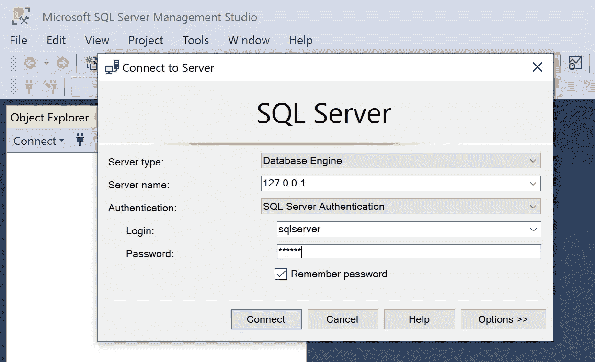
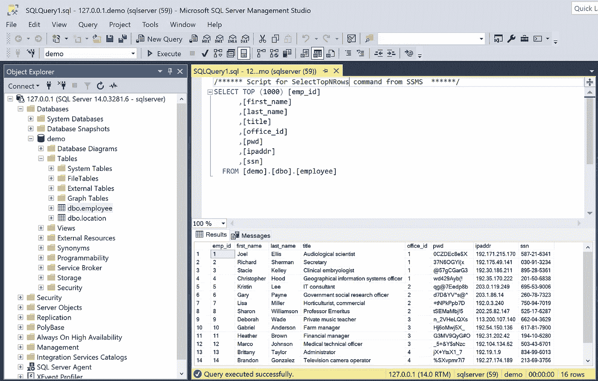

# 将云 SQL 代理作为 Windows 服务运行

> 原文：<https://medium.com/google-cloud/running-the-cloud-sql-proxy-as-a-windows-service-2b7ef22afec8?source=collection_archive---------0----------------------->



云 SQL 代理提供了到云 SQL 数据库实例的快速、安全、加密的连接，无需管理允许的 IP 地址或 SSL/TLS 配置细节。这是一个小型的自包含可执行文件，你可以[免费下载](https://cloud.google.com/sql/docs/mysql/sql-proxy#install)，它使用 IAM 认证进行简单的基于角色的访问管理。该代理非常适合本地开发和测试，因为一旦它运行，您的所有代码和客户端工具都可以连接到`127.0.0.1`来访问您的数据库实例。

但是，如果您做过很多云 SQL 开发，您会知道很容易忘记“只需要让它运行起来”这一点如果您忘记在本地测试之前启动代理，您的代码最终会超时，并显示来自 SQL 驱动程序的错误消息。确切的错误可能因驱动程序而异，误导性的错误消息会导致更多的时间浪费。

如果你可以让代理作为后台服务一直运行，监听`127.0.0.1`并为新的连接做好准备，这不是很好吗？更好的是，如果该服务能够在出错或重启时优雅地重启，那不是很好吗？

你*可以*让代理以这种方式工作，在这篇文章中，我将向你展示设置它是多么容易。如果您正在 Windows 机器上进行云 SQL 开发，这是一个很好的方法——您可以调用代理一次，它会一直运行并管理连接，直到您使用`net stop`命令明确停止它。这种方法结合了完全托管服务的优点和本地数据库的便利性。

# 入门指南

如果您想按照本文中的示例进行操作，请按照我的 [Cloud SQL Setup](/@dmahugh_70618/cloud-sql-setup-4fc72d3f33db) 帖子中的说明创建一个数据库实例和服务帐户。请务必下载那里介绍的 JSON 凭证文件，因为您将需要它来进行代理认证。

对于这个例子，我将使用一个用于 SQL Server 的[云 SQL 实例，尽管核心原则适用于其他云 SQL 数据库实例类型，如 MySQL 或 PostgreSQL。](https://cloud.google.com/sql/docs/sqlserver/)

如果您已经有一个 SQL Server 数据库，您可以将它迁移到云 SQL，并通过代理进行连接，如下所述。参见[将您的 Microsoft SQL Server 工作负载迁移到 Google Cloud](https://cloud.google.com/blog/products/databases/migrate-your-microsoft-sql-server-workloads-to-google-cloud) ，了解如何从内部服务或其他云服务迁移的简单分步说明。

# 将代理作为服务安装

云 SQL 代理可执行文件目前不提供作为 Windows 服务运行的本机支持，但这不是问题，因为有各种开源服务管理器可以用来安装任何 Windows 可执行文件作为服务。

我最喜欢的是 [NSSM](http://nssm.cc/) ，“非吸服务经理。”与大多数第三方服务管理器不同，NSSM 可以监控正在运行的服务，并在服务停止响应时自动重启。它还提供了一个简单的配置 GUI，以及用于自动配置的[命令行选项](http://nssm.cc/commands)。

你可以在这里下载 NSSM [，文档可以在这里](http://nssm.cc/download)获得[。将`nssm.exe`可执行文件与云 SQL 代理可执行文件和您的服务帐户的 JSON 凭证文件放在一个文件夹中，您就可以开始了。](http://nssm.cc/usage)

创建和管理 Windows 服务需要管理员访问权限，因此右键单击开始按钮并选择**Windows PowerShell(Admin)**。然后使用此命令创建一个新服务:

```
.\nssm.exe install <servicename>
```

将会打开一个图形用户界面，引导您完成新服务的配置。有几个带有各种选项的选项卡，但是对于安装云 SQL 代理，您只需要在应用程序选项卡上输入路径、启动目录和参数选项。



将云 SQL 代理配置为 Windows 服务

arguments 选项设置为代理的命令行参数:数据库实例的名称、端口号(在本例中为 1433，因为这是 SQL Server 的默认值)和凭证文件的名称。下面是语法:

```
-instances=<instance-name>=tcp:1433 -credential_file=<filename>.json
```

注意，我们在这里假设凭证文件与代理可执行文件在同一个文件夹中。如果它在不同的文件夹中，您需要在`credential_file`参数中指定它的完整路径。

选择 Install service，您应该会收到一条消息，提示服务安装成功。

# 正在启动服务

该服务现在*已安装*，但尚未启动。作为最后的设置步骤，在管理员提示符下使用以下命令启动服务:

```
net start <service-name>
```

这就是全部了！代理现在正在运行并监听连接(在本例中为`127.0.0.1:1433`)。如果需要，它会自动重启，包括重启机器后。

要验证服务是否正在运行，您可以使用 PowerShell 的`Get-Service` cmdlet。输出可能很长，因为它包括了当前运行的每个服务，但是您可以使用一个`where`子句来显示一个命名服务的状态，如下所示。



用 Get-Service 显示服务的状态

# 使用代理服务

一旦代理作为服务运行，您机器上的任何其他程序或进程都可以在`127.0.0.1`与云 SQL 通信。例如，下面的示例将随机名称和位置写入表中，然后运行查询来检索它们:



通过作为 Windows 服务运行的代理连接到云 SQL 的本地代码示例

该示例的连接使用 SQL Server ODBC 驱动程序进行连接，如下所示:

```
CNXN = pyodbc.connect(
    “DRIVER={ODBC Driver 17 for SQL Server};SERVER=127.0.0.1;”+
    f”UID={DB_USER};PWD={DB_PASS}”,
    autocommit=True,
)
CURSOR = CNXN.cursor()
```

您也可以从 SQL Server Management Studio (SSMS)等工具进行连接:



SSMS 连接到作为 Windows 服务在本地运行的代理

如上所示连接后，SSMS 可以运行查询和管理数据库对象:



使用 SSMS 运行 SQL 查询

# 停止并删除服务

要停止代理服务，请在 PowerShell 管理提示符下使用以下命令:

```
net stop <service-name>
```

该服务仍在安装和配置中，因此如果需要，您可以使用`net start`来重启它。

要永久删除该服务，请使用以下 NSSM 命令:

```
.\nssm.exe remove <service-name> confirm
```

最后，提醒一句:代理使用安全加密与您的云 SQL 实例通信，但是在`127.0.0.1`到代理的本地连接是*而不是*加密的。在上述场景中，这不是问题，因为我们在本地的 Windows 机器上工作，但是您应该避免在您不信任的网络上公开代理。要了解从外部应用程序连接时的最佳实践，请参阅关于使用代理服务器从外部应用程序连接的文档。