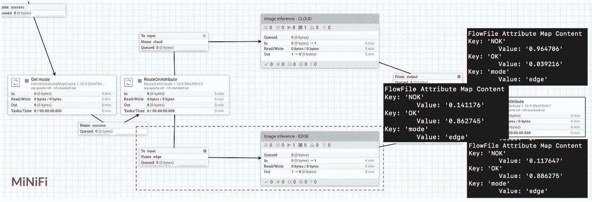

# 使用 Google Cloud 和 Apache NiFi & MiNiFi 在边缘运行视觉质量检查

> 原文：<https://medium.com/google-cloud/running-visual-quality-inspection-at-the-edge-with-google-cloud-and-apache-nifi-minifi-45282ce7af2d?source=collection_archive---------0----------------------->


【2019 年 10 月 23 日，我在柏林 Apache Con 上做了一个关于在边缘运行视觉质量检查的演讲。这个故事描述了这次谈话，并帮助您使用谷歌云和 Apache NiFi & MiNiFi 在边缘连续运行更新的 TensorFlow 模型。

# 语境

想象一下:你在一家生产饼干的工厂里…每天有成千上万的饼干通过你的生产线，你想让你的顾客开心。问题是…一块碎饼干会让顾客不高兴！因此，您需要一种方法，在饼干进入最终包装之前检测出破损的饼干。

这是我选择来支持这个故事的例子，但它也可以是与视觉质量检测相关的任何东西，跨越多个行业，如零售、制造、能源等。你能想到的任何东西都需要一个经过图像数据集训练的 ML 模型。

# 什么是 Apache NiFi & MiNiFi？

[Apache NiFi](https://nifi.apache.org/) 是一个易于使用、功能强大且可靠的数据处理和分发系统。Apache NiFi 支持强大且可伸缩的数据路由、转换和系统中介逻辑的有向图。[MiNiFi](https://nifi.apache.org/minifi/index.html)——Apache NiFi 的子项目——是一种补充性的数据收集方法，补充了 NiFi 在数据流管理方面的核心原则，侧重于在数据创建的源头收集数据。

简而言之，Apache NiFi 和 MiNiFi 提供了工具和功能的强大组合，用于收集和移动数据、处理数据、清理数据并将其与其他系统集成。一旦需要引入数据，您就会希望使用 Apache NiFi。

# 什么是谷歌云愿景？

[Google Cloud Vision](https://cloud.google.com/vision/) 允许您使用 AutoML Vision 从云中或边缘的图像中获得洞察力，或者使用预先训练的 Vision API 模型来检测情绪、理解文本等。

有了 Google Cloud Vision，您有两个选择:

*   **AutoML Vision** :自动训练你自己定制的机器学习模型。使用 [AutoML Vision](https://cloud.google.com/automl/) 易于使用的图形界面，只需上传图像并训练自定义图像模型；针对准确性、延迟和大小优化您的模型；并将它们导出到云中的应用程序或边缘的一系列设备中。
*   **Vision API** :谷歌云的 Vision API 通过 REST 和 RPC APIs 提供了强大的预训练机器学习模型。这些 API 包括:图像分类和标记成数百万个预定义的类别，检测物体和人脸，阅读印刷和手写文本，将有价值的元数据构建到图像目录中，调节内容等。

在这个故事中，我们将使用 **AutoML Vision** 使用我们自己的标签和图像来构建我们自己的定制机器学习模型。

# 目的:连续模型再训练


自定义模型的自动重新训练

目标是拥有一个端到端的系统来检测缺陷，同时用新收集的图像进行连续的模型再训练。主要优势包括:

*   在云中自动训练定制的 ML 模型
*   高效获取图像、标记图像、部署模型和运行推理
*   使用来自生产线的新数据不断刷新模型
*   最少的人类互动
*   ML 模型的准确性随着时间的推移而提高

# 在边缘使用树莓皮

为了从生产线上收集数据，我将使用一个 Raspberry Pi 来运行 Apache MiNiFi。我添加了一个摄像头来拍照，还添加了 led 来显示当前正在处理的内容。


Raspberry Pi 3 用于收集数据

为了使用 Raspberry Pi 从边缘收集数据，我将使用[谷歌物联网核心](https://cloud.google.com/iot-core/)，这是一种完全托管的服务，可以轻松安全地连接、管理和接收来自全球分散设备的数据。

第一步是创建一个设备注册表，它是具有共享属性的设备的容器。创建注册表后，您可以使用设备标识注册您的设备。为此，您需要生成一个公钥/私钥对，设备将使用它来验证 Google IoT 核心(您也可以使用证书颁发机构)。下面是我用来为 Raspberry Pi 生成密钥对的命令。


我的设备已在我的设备注册表中注册

然后，我将使用 MQTT 协议在我的设备和 Google Cloud 之间发送数据，它会自动将数据发布到发布/订阅主题中:


设备和谷歌云物联网核心之间的接口

为了通过 MQTT 与 Google Cloud IoT Core 通信，我将使用 Github 上的 Pull 请求中正在进行代码审查的处理器[。我还将在一个 repo 中使用这个处理器](https://github.com/apache/nifi/pull/3392)[，我创建这个 repo 是为了分享我演讲的代码片段](https://github.com/pvillard31/aceu19)。

# 一个问题，两种架构

当我们从设备中收集到图片后，我们就可以训练我们的定制模型了。那么我们必须在两个选项中做出选择:

*   在 Google Cloud 中部署模型，在云中进行推理。这意味着对于每张图片，带有 Apache MiNiFi 的 Raspberry Pi 将对被服务的模型进行 HTTPS 调用，以获取该图片的标签。虽然这是有效的，并且易于实现和扩展，但这意味着通过互联网进行调用和更长的推断时间。在这个故事中我称之为模式"*"时配置设备。在 ***云*** 模式下，这里是架构的样子:*

**

*“云”模式下的架构*

*   *在 Raspberry Pi 上从 Google Cloud 下载模型，并使用 Apache MiNiFi 在边缘进行推理。Google Cloud 提供了多种选项来下载您的定制模型，这些模型具有不同的准确性和延迟参数。在边缘上运行模型将导致更快的推断时间。在这个故事中，当配置设备时，我将这种模式称为“*”。在 ***边缘*** 模式下，架构看起来是这样的:**

****

**“边缘”模式下的建筑**

**我们还将看到，在 ***edge*** 模式下，使用谷歌的硬件和 Coral Edge TPU，有可能获得更好的推断时间。**

# **收集图片**

**以下是 MiNiFi(在 Raspberry Pi 上)中运行的工作流的外观:**

****

**在 Raspberry Pi 上的 MiNiFi 中运行工作流以收集图像**

**工作流程非常简单:“独立”处理器执行 Python 脚本，使用 Pi 相机以给定的频率拍摄照片。然后图片被取到 MiNiFi 中，通过 MQTT 处理器发送到 Google Cloud 物联网核心。当这个过程发生时，我还会打开/关闭琥珀色 LED，以便在 Pi 上直观地显示正在发生的事情。**

**正如我们所说的，数据将被自动发送到一个发布/订阅主题，并可供消费。在 Google 云平台中，[我运行一个独立的安全 Apache NiFi 实例](/@pierre.villard/nifi-with-oidc-using-terraform-on-the-google-cloud-platform-8686ac247ee9)(参见我之前的帖子，使用 Terraform 进行快速部署),下面的工作流正在其上运行:**

****

**在 GCP NiFi 中运行的摄取图像的工作流**

**这些图片来自我的主题订阅，然后存储在 Google 云存储中，我使用 Google Cloud Vision API 将这些图片添加到我的数据集中(这是我用来训练我的定制模型的图像集合)。**

**我不会讲太多细节，因为[文档是不言自明的](https://cloud.google.com/vision/automl/docs/create-datasets)但是我要做的调用是这样的——它给出了我创建的 CSV 文件的 GCS 路径，列出了我在过去 X 分钟摄取的所有图像的 GCS 路径:**

```
**curl \
  -X POST \
  -H "Authorization: Bearer $(gcloud auth application-default print-access-token)" \
  -H "Content-Type: application/json" \
 [https://automl.googleapis.com/v1beta1/projects/${projectID}/locations/us-central1/datasets/${datasetID}:importData](https://automl.googleapis.com/v1beta1/projects/${projectID}/locations/us-central1/datasets/${datasetID}:importData) \
  -d '{
        "inputConfig": {
          "gcsSource": {
            "inputUris": "gs://${gcs.bucket}/dataset.csv"
          }
        }
      }'**
```

****注 1** :数据集 ID 类似于 ICN4695798657952251904。
**注 2** :在 NiFi 中，我将许多变量(项目 ID、GCS bucket、数据集 ID 等)外部化，我在工作流中重用这些变量，使其更易于使用和配置。**

# **管理您的设备配置**

**一旦您的设备在 Google Cloud IoT Core 的设备注册表中注册，您就可以使用 UI 向您的设备发送配置更新或命令。它看起来是这样的:**

****

**通过 MQTT 更新我的设备配置**

**在 Raspberry Pi 上，在 MiNiFi 中，MQTT 处理器接收配置更新和命令，我处理接收到的数据以更新我的设备的配置:**

****

**接收配置更新和命令**

****

**正在处理配置更新**

**当我收到配置更新时，我会处理 JSON 有效负载以提取模式，如果我应该使用或不使用边缘 TPU，我会将此信息存储到本地缓存中，该缓存也会在设备重启时保存在磁盘上。**

# **培训和服务您的模型**

**我们现在有一个设备，我们能够从任何地方进行配置，它会自动从我们的生产线发送图片，这些图片会自动存储并添加到我们的谷歌云视觉数据集，以训练我们的定制模型。**

**谷歌云视觉的下一步是创建标签，用于对我们的图像进行分类。在本例中，我只创建了两个标签:**

*   ****OK** :饼干看起来不错，可以进包装了**
*   **NOK :饼干碎了，应该拿掉**

**在 UI 中，我可以手动标记图像，每个标签至少需要 10 个图像来开始训练我的定制模型(图像越多，结果越好，这就是为什么我们希望不断接收新图像并随着时间的推移重新训练我们的模型):**

****

**我的数据集，包含我的 cookies 和标签的图片**

**在 GCP 运行的 NiFi 实例中，我创建了一个工作流，用于每天触发模型训练，以便考虑新捕获的图像，并随着时间的推移提高模型的准确性:**

****

**NiFi 每天都会触发模型训练**

**为了开始定制模型训练并等到训练完成，我使用了文档中描述的 REST APIs。但是，在这个阶段，您必须指定您是否想要训练一个将在云中( ***云模式*** )或在边缘( ***边缘模式*** )运行的模型:**

*   **[培训云托管模式](https://cloud.google.com/vision/automl/docs/train)**
*   **[训练边缘可导出模型](https://cloud.google.com/vision/automl/docs/train-edge)**

**当训练要在边缘导出的模型时，您可以指定一个参数，允许您选择是否更喜欢延迟而不是准确性:**

*   **`mobile-low-latency-1`对于低延迟，**
*   **`mobile-versatile-1`用于一般用途，或**
*   **`mobile-high-accuracy-1`为了更高的预测质量。**

**当云托管模型被训练时，Google Cloud Vision 用户界面将如下所示:**

****

**目前正在培训云托管模型**

**一旦模型训练完成，NiFi 将收到一个 JSON 有效载荷，例如:**

****

**模型训练完成时的 JSON 有效负载**

**模型训练完成后，我们可以访问大量关于模型训练及其与提供的数据集相比的准确性的信息:**

****

**关于精度、召回等的定制模型信息**

# **云托管模型**

**一旦模型被训练，我们就可以调用 REST APIs 来部署模型。以下是 NiFi 工作流中负责此工作的部分:**

****

**NiFi 部署云旅馆定制模型**

**一旦部署完成，模型将通过 Google Cloud 中的 REST API 自动公开(您不必担心如何和在哪里，Google 会处理好)。您需要的唯一信息是型号 ID，这是我们通过 ExecuteStreamCommand 处理器使用 Google IoT 核心命令发送给 Raspberry Pi 的信息:**

```
**gcloud iot devices commands send \
    --command-data=ICN147321363982450688
    --region=REGION  \
    --registry=REGISTRY_ID \
    --device=DEVICE_ID**
```

**在 MiNiFi 中，我们接收命令并将型号 ID 存储在缓存中:**

****

**通过 Google IoT 核心 MQTT 命令接收型号 ID**

**现在，我们可以通过对公开的 API 进行 HTTPS 调用来对捕获的每张图片进行推断:**

****

**使用公开的 API 在云中进行推理**

**请注意 RouteOnAttribute 处理器，它将检查设备配置为哪种模式。在这种情况下，设备配置在 ***云*** 模式。**

**图片有效载荷需要进行 base64 编码，并且[要使用的 API](https://cloud.google.com/vision/automl/docs/predict#automl_vision_predict-cli)是:**

```
**curl -X POST \
  -H "Authorization: Bearer $(gcloud auth application-default print-access-token)" \
  -H "Content-Type: application/json" \
https://automl.googleapis.com/v1beta1/projects/${PROJECT_ID}/locations/us-central1/models/${MODEL_ID}:predict \
  -d '{
        "payload" : {
          "image": {
            "imageBytes" : "/9j/4AAQSkZJRgABAQAAAQ … "
          }
        }
      }'**
```

# **Edge 可导出模型**

**在这种模式下，一旦 TensorFlow 模型训练完毕，我们只需要进行一次 API 调用，将训练好的模型导出到 Google 云存储中:**

****

**API 调用将自定义 edge 模型导出到 Google 云存储中**

**要使用的 [API 是:](https://cloud.google.com/vision/automl/docs/export-edge)**

```
**curl \
  -H "Authorization: Bearer $(gcloud auth application-default print-access-token)" \
  -H "Content-Type: application/json" \
  https://${**ENDPOINT**}/v1beta1/projects/${**PROJECT_ID**}/locations/us-central1/models/${**MODEL_ID**}:export \
  -d '{
        "output_config": {
          "model_format": "**tflite**",
          "gcs_destination": {
              "output_uri_prefix": "${**USER_GCS_PATH**}"
          }
        }
      }'**
```

**如果您想导出一个针对 Edge TPU 优化的模型(我们稍后会谈到这一点)，那么[您必须使用](https://cloud.google.com/vision/automl/docs/export-edge#edge-tpu):**

```
**curl \
  -H "Authorization: Bearer $(gcloud auth application-default print-access-token)" \
  -H "Content-Type: application/json" \
  https://${**ENDPOINT**}/v1beta1/projects/${**PROJECT_ID**}/locations/us-central1/models/${**MODEL_ID**}:export \
  -d '{
        "output_config": {
          "model_format": "**edgetpu_tflite**",
          "gcs_destination": {
              "output_uri_prefix": "${**USER_GCS_PATH**}"
          }
        }
      }'**
```

**通过这个 API 调用，NiFi 将收到一个 JSON 有效负载，其中包含表示您的定制模型的 tflite 文件的 GCS 路径。这里，我们再次使用 Google Cloud IoT 核心命令，通过 MQTT 将这些信息发送到我们的设备:**

```
**gcloud iot devices commands send \
    --command-data=gs://.../model.tflite
    --region=REGION  \
    --registry=REGISTRY_ID \
    --device=DEVICE_ID**
```

**在 MiNiFi 上，我们接收这些信息并将模型直接下载到设备上，以便进行本地推断:**

****

**通过 MQTT 接收模型的 GCS 路径，并将模型下载到本地**

**现在我们已经在 Raspberry Pi 上下载了 TensorFlow lite 模型，我们可以对每个捕获的图像执行推理:**

****

**使用下载的 TensorFlow lite 模型在边缘上进行推断**

**为了在本地执行模型，[我正在执行一个 Python 脚本，你可以在这里找到](https://github.com/tensorflow/tensorflow/tree/master/tensorflow/lite/examples/python/)。**

# **使用珊瑚边 TPU 提升您的设备**

**2019 年 10 月 22 日起，[珊瑚现 GA](https://coral.ai/) ！Coral 是一个硬件和软件平台，用于构建具有快速神经网络推理的智能设备。**

**这些设备的核心是 Edge TPU 协处理器。这是一个由谷歌制造的小型 ASIC，专门设计用于高速执行最先进的神经网络，功耗低。Edge TPU 每秒能够执行 4 万亿次运算(万亿次运算)，每个 TOPS 使用 0.5 瓦(每瓦 2 TOPS)。**

****

**谷歌 Edge TPU 基准测试**

**在我的用例中，我使用的是 USB 加速器，我将它直接插入到树莓 Pi 中。**

****

**Coral USB 加速器**

**使用我在谷歌云视觉上训练的定制 ML 模型，我可以轻松地比较使用或不使用边缘 TPU 时的 TensorFlow“调用”时间:**

*   ****不使用边缘 TPU 优化模型时:****

****

**不使用边缘 TPU 时的 TF Lite 调用时间-约 127 毫秒/图像**

*   ****使用边缘 TPU 和优化型号时:****

****

**使用边缘 TPU 时的 TF Lite 调用时间—大约 9 毫秒/图像**

**在不使用 Edge TPU 的情况下，我们大约需要 127 毫秒，而在为我的 cookies 用例生成的低延迟优化模型上使用 Edge TPU 时，我们只需要 9 毫秒。**

# **初步结果**

**到目前为止，我们已经通过 MQTT 发送了图片，并在 MiNiFi 工作流的两个不同分支中执行了分类推断(换句话说:图片摄取和图片推断是并行进行的)。下面是我们得到的结果(处理时间是我们拍照的时刻和我们得到分类的标签和置信度得分的时刻之间的持续时间；推理时间是使用 TensorFlow Lite 模型获取分类的“调用”的持续时间):**

*   *****云模式*** (通过 HTTPS 在云端推理):
    -处理时间:每张图像约 6 秒
    -推理时间:每张图像约 2.5 秒**
*   *****边缘模式*** (无边缘 TPU):
    -处理时间:每幅图像约 750 毫秒
    -推断时间:每幅图像约 127 毫秒**
*   *****边缘模式+ TPU*** (带边缘 TPU):
    -处理时间:每幅图像约 500 毫秒
    -推断时间:每幅图像约 9 毫秒**

# **监控和自动标记**

**到目前为止，我们所做的很好，但是，一旦我们对树莓派做出了推断，我们就采取行动保留或不保留生产线上的饼干(在我的例子中，我打开或关闭红灯或绿灯)，然后我们忘记了推断结果。下一步是在通过 MQTT 发送图片之前执行推理**，这样我们就可以将推理结果和图片一起发送。图片推断和图片摄取是顺序完成的。这有两个主要的好处:****

*   **我们可以收集额外的数据来部署**监控仪表板**，以便获得关于我们的定制模型在我们的设备上表现如何的准确信息**
*   **我们可以引入图像的**自动标记**:如果推断标记的置信分数超过，例如 90%，我们可以在将图像摄取到 Google Cloud Vision 数据集时自动标记图像，以便在标记时需要最少的人工交互:只有代表新类型缺陷的图像可能需要人工标记。**

**我不会详细介绍工作流中所需的更改，但在 MiNiFi 上看起来是这样的:**

****

**通过 MQTT 发送推理结果和图片时的 MiNiFi 工作流**

**一旦我们收到 NiFi 中的所有信息，我们就可以将这些信息添加到 Stackdriver 监控仪表板中，并实时查看我们的定制模型的执行情况:**

****

**云模式与边缘模式的处理时间和分数**

**在上图中，我们可以看到在更新设备配置后，从 ***云*** 模式到 ***边缘*** 模式，处理时间和置信度得分是如何变化的。我们清楚地看到，处理速度快得多，但我们在准确性方面有所损失(尽管仍在 90%以上！).**

**我们还可以在器件配置为 ***边缘*** 模式时，比较使用或不使用边缘 TPU 的结果:**

****

**有和没有边缘 TPU 的边缘模式的处理时间和分数**

**在上面的图片中，我们可以看到一个有趣的结果:当使用边缘 TPU 和边缘 TPU 优化模型时，我们获得了更短的处理时间，同时也获得了更高的推断置信度得分。没有理由不用！**

# **结论**

**首先，感谢您阅读这个非常长的故事…然后，这里是它的结论:感谢 Apache NiFi、MiNiFi、Google 云平台的产品和 Coral 产品，我们实现了一个高效的端到端解决方案，在边缘上运行定制的 ML 模型，同时不断用新数据刷新我们的模型，以随着时间的推移提高模型的准确性，而无需代码和最少的人工交互。我会让您发挥想象力，将所有这些转换成您自己的用例！**

**演讲的幻灯片、录音以及代码片段、定制处理器、工作流程、脚本等将在未来几天内添加到这个 [Github 资源库](https://github.com/pvillard31/aceu19)中。像往常一样，请随意评论/提问。**

**想要更多吗？访问[我的网站](https://pierrevillard.com/) …或[在 Twitter 上关注我](http://twitter.com/pvillard31)！**