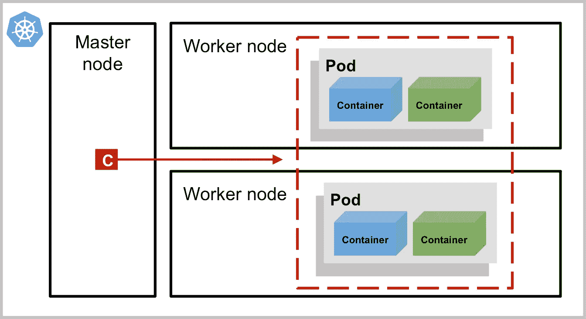

# 在 Kubernetes 中运行工作负载

> 原文：<https://medium.com/google-cloud/running-workloads-in-kubernetes-86194d133593?source=collection_archive---------0----------------------->

柏林 KubeCon Europe 2017

*本帖基于我在 2017 年* [*KubeCon 欧洲*](http://events.linuxfoundation.org/events/cloudnativecon-and-kubecon-europe) *的演讲。本讲的* [*录音*](https://www.youtube.com/watch?v=spHPCc82ACs&list=PLj6h78yzYM2PAavlbv0iZkod4IVh_iGqV&index=79)*[*幻灯片*](https://speakerdeck.com/janetkuo/kubecon-europe-2017-running-workloads-in-kubernetes)*[*演示*](https://github.com/JanetKuo/k8s-demos) *一应俱全。在这次演讲中，我概述了 Kubernetes 中的内置控制器。目标受众是 Kubernetes 初学者。***

**我的 KubeCon 演讲幻灯片:在 Kubernetes 中运行工作负载**

**你可能还记得，上个月发生的 AWS 故障[导致许多流行网站和应用程序](https://techcrunch.com/2017/02/28/amazon-aws-s3-outage-is-breaking-things-for-a-lot-of-websites-and-apps/)瘫痪。事件发生后，[Spire 软件架构副总裁 Rob Scott](https://twitter.com/robertjscott) 分享了 Spire [如何借助 Kubernetes](/spire-labs/mitigating-an-aws-instance-failure-with-the-magic-of-kubernetes-128a44d44c14) 的魔力缓解 AWS 宕机的故事。**

**软件架构副总裁 Rob Scott 描述了 Kubernetes 如何从 AWS 故障中恢复**

**Kubernetes 是一个容器化应用模式的平台。这些模式使得应用程序更容易部署、管理、扩展和从故障中恢复——这就是神奇之处。**

## **Kubernetes 集群中有什么？**

**这是一个简化的 Kubernetes 集群:**

****

**简化的 Kubernetes 集群**

**一个 [*pod*](https://kubernetes.io/docs/concepts/workloads/pods/pod-overview/) 是您在 Kubernetes 中创建或部署的最小和最简单的单元。一个单独的 pod 通常有一个，有时是几个紧密耦合的容器，以及它们共享的资源。一个 pod 代表 Kubernetes 中一个应用程序的单个实例。**

***控制器*是 Kubernetes 中更高层次的抽象。每个控制器代表一个应用程序模式。控制器(上图中的红色方块)为特定的应用程序模式管理 pod 的副本。因此，您不需要直接创建 pod。相反，您创建控制器来以模式运行应用程序。**

**一个 [*节点*](https://kubernetes.io/docs/concepts/nodes/node/) 是一个物理机或者虚拟机。*主节点*做出关于集群的全局决策，而*工作节点*维护 pod 并为它们提供运行环境。控制器在主节点上运行，并管理在工作节点上运行的 pod。**

**在这篇文章中，我将讨论 Kubernetes 中的 4 种通用模式:无状态、有状态、守护进程和批处理。同样，每个模式由一个控制器表示。**

## **无状态模式:部署**

***无状态*意味着您不需要在工作负载中保持状态(持久数据)。无状态模式的控制器称为 [*部署*](https://kubernetes.io/docs/concepts/workloads/controllers/deployment/) 。如果您想要管理和扩展无状态工作负载，比如您的 web 应用程序、移动后端或 API 服务器，部署就是您的控制器。**

**部署倾向于可用性，而不是一致性。部署通过创建同一个 pod 的多个副本来提供可用性。这些豆荚是一次性的——如果它们变得不健康，部署只会产生新的替代品。此外，您可以以可控的速度更新部署，而不会出现服务中断。当像 AWS 中断这样的事件发生时，您的工作负载会自动恢复。**

*   **具体例子: [nginx](https://www.nginx.com/) ， [Tomcat](http://tomcat.apache.org/)**

**下面是部署和滚动更新无状态应用程序的演示。在这个演示中，我使用 Kubernetes CLI 工具`kubectl`与集群进行交互。`kubectl`向控制器发出异步请求，告诉控制器期望的状态是什么，控制器会让它这样做。我还在演示中创建了 [*服务*](https://kubernetes.io/docs/concepts/services-networking/service/) 。服务前端应用。你不直接和 pod 对话，而是和服务对话。服务对正常 pod 的流量进行负载平衡，以便当任何 pod 变得不正常或被终止时，您的服务仍然可用。**

**部署和滚动更新无状态应用程序的演示**

## **状态模式:状态集**

**对于无状态应用程序，扩展和恢复很容易。但是，有些应用程序需要存储数据，如数据库、缓存和消息队列。如果你正在运行分布式有状态工作负载，比如 Zookeeper，你的每个有状态 pod 都需要一个更强的身份概念。**

**部署创建的 pod 在被终止和重新创建后不会有相同的身份，它们也没有唯一的持久存储。因此，我们需要另一个用于有状态模式的控制器:*。与部署不同，StatefulSet 选择*一致性*而不是可用性。StatefulSet 还管理多个 pod，但与部署不同，StatefulSet 的每个 pod 都有稳定、唯一且有粘性的身份和存储。也就是说，每个豆荚都是相似的，只是略有不同。使用 StatefulSet，您可以按顺序部署、缩放和删除 pod。这更安全，并且使您更容易对有状态应用程序进行推理。***

*   **具体例子: [Zookeeper](https://zookeeper.apache.org/) ， [MongoDB](https://www.mongodb.com/) ， [MySQL](https://www.mysql.com/)**

**使用 StatefulSet 运行 Zookeeper 集群的演示**

## **守护模式:DaemonSet**

**有时，您希望在节点上运行类似守护进程的工作负载，例如运行日志收集守护进程或节点监视守护进程。在这种情况下，您使用 [*DaemonSet*](https://kubernetes.io/docs/concepts/workloads/controllers/daemonset/) 。**

**DaemonSet 确保每个节点运行一个 pod 的副本。如果您添加或删除节点，将自动在这些节点上创建或删除窗格。如果您只想在某些节点上运行守护程序，请使用节点标签来控制它—在节点上放置一些标签，并告诉 DaemonSet“嘿，只在具有这些标签的节点上运行 DaemonSet pods”**

*   **具体例子: [fluentd](http://www.fluentd.org/) ， [linkerd](https://linkerd.io/)**

**使用 DaemonSet 在每个节点上运行一个 pod 的演示**

## **批处理模式:作业**

**您可能还需要在集群中运行批处理工作负载。批量工作负载的控制器称为 [*作业*](https://kubernetes.io/docs/concepts/jobs/run-to-completion-finite-workloads/) 。**

**作业创建多个并行运行的 pod。您可以指定此作业中需要完成的 pod 数量。作业是为并行处理独立但相关的工作项目而设计的。这可以是要发送的电子邮件，也可以是要渲染的帧。**

**作业完成后并行运行 pod 的演示**

## **摘要**

**所以这些是 Kubernetes 中唯一支持的模式，对吗？不要！它们只是 Kubernetes 支持的最常见、最通用的模式。总而言之:**

*   **无状态模式:使用提供可用性的部署，以便轻松扩展和恢复**
*   **有状态模式:使用 StatefulSet 实现一致性，给每个 pod 一个惟一的、有粘性的身份和存储，并按顺序部署、伸缩和终止**
*   **守护模式:使用 DaemonSet，默认情况下，它在每个节点上运行一个 pod，也可以使用节点标签进行定制**
*   **批处理模式:使用作业并行运行多个 pod，并运行它们直到完成**

**现在，你可能有一个问题是“这听起来很棒，但是我从哪里开始呢？有没有让我将工作负载转移到 Kubernetes 的例子或工具？”**

**是啊！有很多很棒的工具供你开始，其中之一就是 [Helm](https://helm.sh/) 。Helm 是 Kubernetes 包经理。有了 Helm，你可以下载并安装 [helm charts](https://kubeapps.com/) ，这是经过策划的 Kubernetes-native 应用程序，你可以从那里开始。**

**你可能会问的另一个问题是“如果我需要在 Kubernetes 中运行其他模式怎么办？我怎么定制？”**

**Kubernetes 是可扩展的。它提供了所有基本的原语，所以你可以写你自己的控制器，或者使用别人写的控制器。比如[弹性搜索算子](https://github.com/upmc-enterprises/elasticsearch-operator)和 [etcd 算子](https://github.com/coreos/etcd-operator)。**

**Kubernetes 是开放的。它对建议和反馈是开放的。您可以向 [Kubernetes GitHub repo](https://github.com/kubernetes/kubernetes/) 发送补丁或提交错误报告，或者在 [Slack](http://slack.k8s.io/) 上与我们聊天。也可以在 Twitter [@kubernetesio](https://twitter.com/kubernetesio) 关注最新的 Kubernetes 新闻。如果你有问题或想跟进，也欢迎你在 Twitter 上找到 [me](https://twitter.com/janet_kuo) 。**

**希望你喜欢这个帖子！**

> **1.[https://en.wikipedia.org/wiki/CAP_theorem](https://en.wikipedia.org/wiki/CAP_theorem)**