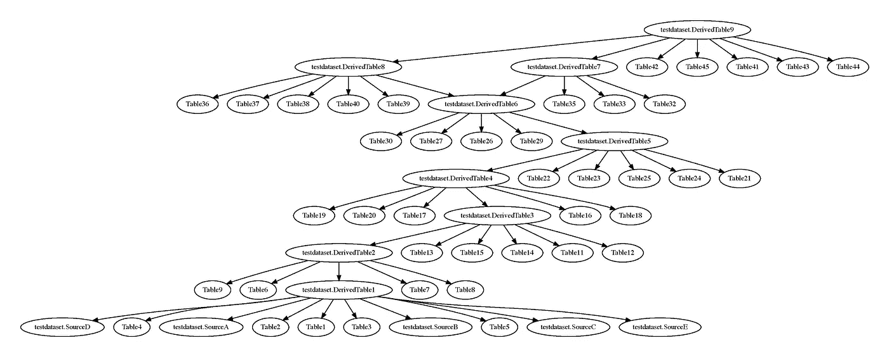

# 示例 SQL 转换器

> 原文：<https://medium.com/google-cloud/sample-sql-translator-fb3ab8876b35?source=collection_archive---------2----------------------->

# 代码

我很高兴宣布一个用 Python 编写的全面的示例 SQL 解析器、翻译器和格式化器。它可以在 https://github.com/google/sample-sql-translator 的[开源获得。](https://github.com/google/sample-sql-translator)

# 概观

其目的是进行以下工作-

*   提供一个 SQL 递归下降解析器的例子。
*   为 SQL 解析器、重写、分析和格式化提供模板。

SQL 的方言主要基于 [BigQuery 标准 SQL](https://cloud.google.com/bigquery/docs/reference/standard-sql) ，增加了一些额外的特性。

# 为什么是递归下降解析器？

经过多年使用 LL 和 LR 解析器——当今使用的常用工具——的多次尝试，我已经转而使用纯手工制作的递归下降解析器。

在[这篇博文](https://blog.reverberate.org/2013/09/ll-and-lr-in-context-why-parsing-tools.html)中可以找到一些关于解析器/词法分析器工具挑战的很好的背景。

同样值得注意的是，GCC 和 clang 都改用了手工制作的递归下降解析器。参见 [gcc](http://gcc.gnu.org/wiki/New_C_Parser) 和[铿锵](http://clang.llvm.org/features.html)。

这提供了一个复杂解析器的例子，我希望它易于阅读、维护和扩展。唯一的状态保存在 [lexer.py](https://github.com/google/sample-sql-translator/blob/master/sql_parser/lexer.py) 中，它提供了查找标识符、字符串和数字的基本方法。

一个很好的起点是查看 [types.py](https://github.com/google/sample-sql-translator/blob/master/sql_parser/types.py) 中的解析类型。

# 潜在的使用案例

扩展这段代码有许多潜在的用例:

*   提供格式化工具作为持续集成的一部分。
*   分析代码中的表依赖和其他有趣的信息。在 AST 上搜索你想要的任何信息。
*   将 SQL(可能是定制的 SQL 方言)翻译成不同的目标方言。

注意，在所有情况下，都需要根据需要扩展解析器和格式化。

# 成分

## sql_parser

sql_parser 是一个纯粹的[递归下降解析器](https://en.wikipedia.org/wiki/Recursive_descent_parser)，它生成 Python 冻结的 dataclass 对象作为 AST。AST 还包含生成 rfmt 格式的 SQL 的方法。

唯一可变的状态包含在 lexer 类中，它是注释列表(用于关联)和当前解析位置。所有其他解析状态都是当前调用栈和执行点。

## sql_rewriter

sql_rewriter 包含为不同的 sql 方言重写 AST 的基本示例。它还包括一些示例依赖性提取算法。

## rfmt

rfmt 是用于输出的格式化库，从[https://github.com/google/rfmt](https://github.com/google/rfmt/tree/master/inst/python/rfmt)复制而来。

这是一个通用格式库。关于其方法的更多信息可以在[的研究论文](https://research.google/pubs/pub44667/)中找到。

# 例子

有 SQL 重写(例如将 CASE 语句转换成 IF)和 SQL 格式化程序的例子。还有一个解析一大组 SQL 的例子——[this SQL](https://github.com/google/sample-sql-translator/tree/master/examples/table_analysis)——并生成最小连接树。这可以使用 [graphviz](https://graphviz.org/) 可视化:

*注意:这个 SQL 是通过以编程方式生成 AST 并使用这个库生成 SQL 而创建的。*

# 结论

希望这个库能对写解析器提供一些启发或者教育。如果你觉得有用，请在 [Git 仓库](https://github.com/google/sample-sql-translator)中给我反馈。