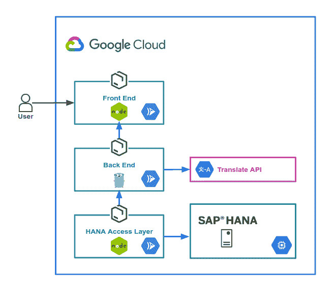

# Google Cloud 上的 SAP:创建 CI/CD 管道(pt。3)

> 原文：<https://medium.com/google-cloud/sap-on-google-cloud-creating-the-ci-cd-pipeline-pt-3-22aa6c64123?source=collection_archive---------0----------------------->


在本帖中，我们将继续我们的 CI/CD 之旅。我们已经探索了主要概念([第 1 部分](/@lucia.subatin/sap-on-google-cloud-when-sap-developers-join-the-cloud-pt-1-5b4e24bf24e8) —包括什么是 CI/CD)和我们的示例应用程序背后的思想，以及涉及 HANA 时的管道设计原则([第 2 部分](/@lucia.subatin/sap-on-google-cloud-hana-hdi-containers-and-ci-cd-pipelines-60cedaddfbc8))。现在，我们将向您展示其中一个微服务管道的管道情况。

上图显示了我们将实施的 CI/CD 流。当应用程序开发人员提交代码时，它将被云构建中的触发器拾取。然后，它将构建、测试和部署我们的应用程序。让我们首先关注单个环境管道，因为稍后将它扩展到多个环境是非常简单的。

# 演示应用概述

在深入管道之前，让我们快速回顾一下我们的应用程序是什么样子的:



正如在第 2 部分中解释的，这个应用程序有四个主要组件:

1.  前端:web 界面，允许用户访问应用程序。
2.  后端:翻译服务
3.  DAL:数据访问层
4.  数据库:SAP HANA —存储我们的数据。

上图显示了这些组件是如何相互作用的。要了解更多细节，请参阅本系列的第 2 部分。

# 我该从何说起呢？

现在你可能会想:太棒了！我们从哪里开始？我如何挑选第一个成为 *CI/CD'ed* 的微服务？(没错，我就是发明了一个词……诗意许可 FTW！！！)

当第一次为现有应用程序启动 CI/CD 管道时，知道如何开始剖析这个庞然大物可能是一个挑战。在服务中寻找以下特征:

*   相当独立，这意味着它不必在同一个应用程序中调用许多其他服务(作为其他服务的依赖是可以的)
*   一个对单元、功能和集成测试有良好测试覆盖的服务(是的——它们都很重要)
*   具有相对较低的整体复杂性

再看一下上面的图表，你认为哪个服务最适合成为第一个？猜猜看！

我们从后端服务开始，因为它是相当孤立的，并且经过了很好的测试。当自动化部署时，总是尝试改进您的测试以确保您的应用程序的可靠性——您未来的自己会感谢您的。

# 构建容器

后端依赖于 Golang 的 Google Translate API SDK 这意味着我们总是需要在构建之前安装带有`go get`的 SDK。我们还想运行`go test`和`go vet`作为我们测试过程的一部分。

云构建中的管道步骤在容器内部运行；这意味着我们可以通过创建一个包含我们需要的所有工具的定制容器来简化我们的构建。让我们继续为后端创建一个构建容器，并将其存储在容器注册表中，供以后在管道中使用。

你会问，为什么要这么麻烦？最终，你会想要一天运行 10 次甚至 100 次构建——所以那几秒钟被放大了。这推动了尽可能快地构建的需求。构建容器允许我们跳过构建依赖项的下载和安装步骤，从而节省时间。

下面是我们的后端构建容器 Dockerfile 的样子:

```
# build stage
FROM golang:alpine
RUN apk — no-cache add build-base git bzr gcc
RUN go get -u cloud.google.com/[go/translate](https://goto.google.com/translate)ENTRYPOINT [ “/bin/ash” ]
```

额外提示:你可以通过实现 [Kaniko 缓存](https://cloud.google.com/cloud-build/docs/kaniko-cache)来进一步减少构建时间。

# 管道配置

现在我们有了环境，让我们检查一下管道是什么样子的:


对于主支行，我们将:

1.  使用`go vet`运行静态测试
2.  运行单元测试`go test`
3.  运行功能测试(也是`go test`
4.  构建容器(`docker`)
5.  将容器推入注册表(`docker`)
6.  将容器部署到环境中(`gcloud`)
7.  运行集成测试(`go test`)

云构建管道通过名为`cloudbuild.yaml`的 YAML 文件进行配置，如下所示:

当然，为了实现其他技术的管道，细节将会改变，但是，总体流程将保持不变。例如，当使用 NodeJS 测试 DAL 层时，命令将是`npm test`而不是`go test`等等。

这里有一些重要的考虑因素:

1.  每个微服务都有一个单独的管道(cloudbuild.yaml)
2.  每个微服务将独立地产生它的人工制品
3.  每个微服务都应该测试与其依赖项的集成。

还记得 Lucia 在第 2 部分中解释的这个图像吗？


仔细查看 cloudbuild.yaml，您会在每个步骤中看到一个指向后端微服务的`dir: translate`,因此它只会在我们对该文件夹进行更改时运行。有许多方法可以做到这一点，所以选择最适合您的发布和开发需求的版本。此外，请注意 cloudbuild.yaml 文件如何位于其相关微服务的文件夹中。


# 创建触发器

创建 YAML 文件后，在云构建中创建触发器非常简单:


请注意，我们将 glob 模式配置为仅匹配在我们的后端 it 为`translate/**`的情况下应用于我们的微服务文件夹内的更改。如果我们在 repo 中的其他文件夹中提交，这可以防止触发此触发器。

还可以看到我们的正则表达式是如何匹配名为`master`的分支的，对于非主分支，您可以选中“反转正则表达式”复选框。最后，云构建配置文件还专门指向我们的微服务管道定义`translate/cloudbuild.yaml`

到目前为止，您已经非常清楚如何为其他微服务创建管道了！

要将管道提交运行到正确文件夹中的存储库，您还可以选择手动运行。可以通过转到控制台并查看构建执行来查看构建日志，如下所示:


# HANA 人工制品的管道


信用/来源:[icanhas.cheezburger.com](https://icanhas.cheezburger.com/)

部署 HANA 产品的管道大部分是相同的，但有所不同……但大部分还是相同的。

正如您在第 2 部分中看到的，这个管道依赖于一个 HDI 容器和一个特殊的带有正确工具的构建容器，以允许我们连接和部署到实例。实际的`cloudbuild.yaml`文件相当简单:


注意它有一个单独的步骤(现在)。它主要依赖于准备好的构建环境和工具，如`hana-cli`和通过环境的 HDI 连接上下文。所有这些都是通过创建一个特定的构建容器(很像我们的后端构建容器)来完成的。

这是构建容器 docker 文件的外观:

顺便提一下，这个 docker 文件没有经过优化，您可能希望在使用之前对它进行一些调整。

请注意我们是如何使用所需的工具来设置容器，以便通过 HDI 连接到 HANA 的。您可以用我们创建后端构建容器的相同方式来构建这个容器。这一步很重要，因为它本质上允许我们准备好通过 HDI 连接和部署我们的 db-things。

另一个重要的区别是`npm start`命令是如何配置的。我们添加了退出标志，所以它不会等待一个人按下`Ctrl+C`，否则管道会挂起并超时。


这些是常规微服务管道和使用 HDI 容器的 HANA 部署管道之间的主要区别。

现在，您应该能够为您的微服务和 HANA 工件构建自己的管道了！尽情享受吧！

[露西娅·苏巴丁](https://twitter.com/LuciaBlick)和[法蒂玛·西尔韦拉](https://www.linkedin.com/in/fatimasilv/)。