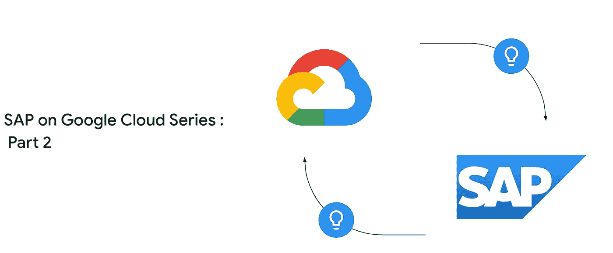

# Google Cloud 上的 SAP:部署考虑

> 原文：<https://medium.com/google-cloud/sap-on-google-cloud-deployment-considerations-3c99cccf7065?source=collection_archive---------7----------------------->

欢迎来到 SAP on Google Cloud:部署考虑博客系列的第 2 部分。下面是 [***第一部***](/google-cloud/sap-on-google-cloud-series-the-fundamentals-a92901f1f312) 供大家参考。

想知道当您考虑在 Google Cloud 上部署 SAP 时需要考虑哪些方面吗？

不熟悉云，我如何知道我是否遵循了最佳实践？

这篇博客试图回答一些关于 SAP 部署的问题。

现在，让我们首先确定在规划 SAP 迁移时最重要的组件

*   **支持 SAP 应用&数据库**的各种模块
*   **选择正确的计算方式**
*   **选择合适的储物件**
*   **网络连接**

让我们逐一挑选并详细讨论。

## **支持 SAP 应用&数据库**的各种模块

任何长期使用 SAP 系统的人都会明白，SAP 解决方案获得 SAP 认证并在任何平台上运行是多么重要。

这里的关键词是**“认证”——**，这是获得 SAP 支持的必要条件。

我将认证组件进一步分为两个部分-

I]**GCP SAP 应用程序认证**

页面 [***此处***](https://cloud.google.com/solutions/sap/docs/certifications-sap-apps) 列出了经认证可在谷歌云上运行的 SAP 应用解决方案、操作系统以及经认证可与之一起运行的计算引擎虚拟机系列。记住这是为了应用。如果你正在寻找 HANA，请看下一节。

**II】SAP HANA 在 GCP 的认证:**

此处 参见 [***页面，该页面将包含 HANA 认证机器类型的更新列表。***](https://cloud.google.com/solutions/sap/docs/certifications-sap-hana)

在上述两种情况下，不要忘记探索自定义虚拟机部分，该部分提供了有关如何调整虚拟机规模的指导原则，以确保 SAP 也能提供支持。

既然我们已经选择了经 SAP 认证可在 GCP 上运行的虚拟机系列，让我们继续探索如何为 SAP 应用程序/数据库选择合适的计算。

# **选择正确的计算方式**

首先，我们检查所需的 GCP 地区和分区 [***这里***](https://cloud.google.com/compute/docs/regions-zones/#available) 中有哪些虚拟机系列(SAP 认证的虚拟机系列有 n1、n2、n2d、c2、c2d、t2d、m1、m2)

请记住，对于 HA 部署，建议使用多区域部署。

现在，我们将 SAP 节点需求分为两种类型

**I] SAP 应用服务器或非 HANA 数据库服务器:**

从该 [***列表***](https://cloud.google.com/solutions/sap/docs/certifications-sap-apps#sap-certified-vms) 中挑选 SAP 认证的虚拟机，直到您符合总 SAP&RAM 要求。

如果 SAP 认证的虚拟机外形不符合要求，您可以考虑定制虚拟机。

对于 N1 系列虚拟机，vCPU 与 RAM 的比率至少应为 1:3.75。

对于 N2/N2D 机器，该比率至少应为 1:4。(这些比率在 [***SAP 注***](https://launchpad.support.sap.com/#/notes/0002456432) 中提到)

请遵循此处 提到的 [***中针对每个虚拟机系列的 vCPU/RAM 定制调整指南。***](https://cloud.google.com/compute/docs/general-purpose-machines#custom_machine_types)

**二】SAP HANA DB 服务器:**

从列表中选择 SAP 认证的 HANA 形状 [***此处****或*](https://www.sap.com/dmc/exp/2014-09-02-hana-hardware/enEN/#/solutions?filters=iaas;ve:29;v:deCertified;v:deTdi)*[***link 2***](https://cloud.google.com/solutions/sap/docs/certifications-sap-hana#certified-vms)*

*根据您的工作量，具体检查认证类型，即 OLTP (ECC，S4)与 OLAP (BW，DWH)与 SAP B1 认证。*

*SAP 还认证定制的 HANA 机器。*

1.  *如果是 N1 机器系列，则 vCPU 与 RAM 的比率为 1:6.5，vCPU 数量介于 32 和 64 之间(vCPU 为 2 的倍数，从 32 开始，最大值为 64)。*
2.  *如果是 N2 机器系列，vCPU 与 RAM 的比率为 1:8，vCPU 数量介于 32 和 64 之间(vCPU 是 4 的倍数，从 32 开始，最大为 64。对于 IceLake n2 机器，最大。vCPU 计数为 80)*

# ***选择正确的存储方式***

*选择合适的虚拟机后，我们来谈谈存储。*

*GCP 提供 3 种类型的块存储—硬盘、平衡固态硬盘、固态硬盘*

*IOPS &他们每个人的吞吐量指标都发表在 [***这里***](https://cloud.google.com/compute/docs/disks/performance#type_comparison)*

1.  *对于应用服务器，我们提供不同类型的持久磁盘。每种类型都有不同的性能特征。详情请参考 [***此处***](https://cloud.google.com/solutions/sap/docs/certifications-sap-apps?hl=en#persistent_disk_storage_for_sap_applications) ***链接。****
2.  *对于 HANA 服务器，我们可以考虑 SSD 或平衡 PD 至少等于或高于阈值，如表 [***此处***](https://cloud.google.com/solutions/sap/docs/certifications-sap-hana?hl=en#minimum_sizes_and_performance_for_ssd-based_persistent_disks) 中所述*
3.  *请注意，对于 HANA 机器，SSD ( `pd-ssd`)和平衡(`pd-balanced`)持久磁盘有推荐的大小，以满足生产环境中针对 SAP HANA 认证的每种计算引擎机器类型的 SAP HANA 性能要求。 [***列出的大小***](https://cloud.google.com/solutions/sap/docs/certifications-sap-hana?hl=en#minimum_sizes_and_performance_for_ssd-based_persistent_disks)*此处的提供了 SAP HANA 认证该机器类型所需的块存储性能**
4.  **对于所有 hana 目录(/hana/data、/hana/log、hana/shared、/sap)，建议考虑 SSD 以获得最佳性能。如果您想控制成本，并接受轻微的性能影响，您可以考虑平衡 PD。**
5.  **为了在成本和性能之间保持平衡，您可以考虑将 SSD 用于/data、/log，将平衡 SSD 用于 HANA/共享卷和引导磁盘。**
6.  **对于生产非 HANA 数据库服务器，您可以根据 IOPS/吞吐量要求考虑 SSD 或平衡 SSD**
7.  **对于非 HANA 数据库备份，您可以考虑使用硬盘进行本地转移。对于长期保留(根据备份频率)，谷歌云存储(基于对象的存储)可能是一个不错的选择。
    [***HANA back int API***](https://cloud.google.com/solutions/sap/docs/sap-hana-backint-overview)经过谷歌云存储(GCS)认证，即 HANA 备份可以直接写入 GCS，中间无需硬盘作为暂存。**
8.  **如果您的应用程序设置需要 NFS 共享存储，那么谷歌文件存储企业或第三方市场产品。更多信息请点击 [***此处***](https://cloud.google.com/solutions/sap/docs/filers-for-sap)**

# ****网络连接****

**需要在内部环境和 Google Cloud 之间建立网络连接，以支持 SAP 应用程序的重新托管。**

**可以使用云 VPN 或者专用互联。了解更多关于[专用互联](https://cloud.google.com/network-connectivity/docs/interconnect/concepts/dedicated-overview)、[伙伴互联](https://cloud.google.com/network-connectivity/docs/interconnect/concepts/partner-overview)和[云 VPN](https://cloud.google.com/network-connectivity/docs/vpn/concepts/overview) 的信息。**

****注意**:根据您的互联网连接和带宽要求，我们建议在生产环境中使用基于云 VPN 的专用互连或合作伙伴互连。**

**在 Google 云平台中，您需要建立自己的专用网络，以适应您的组织结构和 SAP 部署要求。根据您的需求，您可以在一个或多个共享 VPC 上部署 SAP。这两个场景在网络控制、SAP 环境隔离和网络检查方面有所不同。更多细节请参考[博客这里](https://cloud.google.com/blog/products/sap-google-cloud/set-up-your-network-for-a-seamless-sap-cloud-deployment)。**

**至此，我们系列的第 2 篇博客到此结束，敬请关注我们关于 SAP 参考架构的下一篇博客，深入探讨在 Google cloud 上部署 SAP 的安全性和最佳实践**

**敬请期待！！！**

****其他资源:****

**有关 SAP GCP 部署指南文档的更多信息，请参考-**

1.  **[***概述***](https://cloud.google.com/solutions/sap/docs/checklist-sap-overview) : SAP 在 GCP 的部署清单**
2.  **所有 SAP [***Netweaver 指南***](https://cloud.google.com/solutions/sap/docs/netweaver-guides) 均来自 GCP 视角**
3.  **所有 SAP [***HANA 指南***](https://cloud.google.com/solutions/sap/docs/sap-hana-guides) 均来自 GCP 视角**
4.  **所有 [***数据整合指南***](https://cloud.google.com/solutions/sap/docs/sap-data-integration-guides)**

**投稿人:[世纪摩尔 A K](https://medium.com/u/41b475b881ff?source=post_page-----3c99cccf7065--------------------------------)**