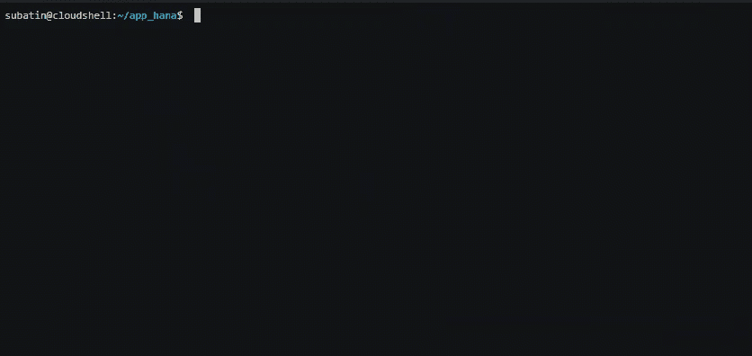

# Google Cloud 上的 SAP:HANA HDI 容器和 CI/CD 管道第 2 部分

> 原文：<https://medium.com/google-cloud/sap-on-google-cloud-hana-hdi-containers-and-ci-cd-pipelines-60cedaddfbc8?source=collection_archive---------2----------------------->

我们使用 Node.js 和 Golang 为前端和后端模块以及 SAP HANA 上的 HDI 容器构建了一个具有托管容器的应用程序。我们定义了一个 CI/CD 管道来保持它们的一致性。


在这篇博文中，我们将解释 CI/CD 管道是什么样子，以及它是如何结合 HDI 容器的概念的。接下来是第一部分。

# 应用程序

正如您在上面的方框中看到的，我们的应用程序有三个微服务:

*   一个前端，用 Node.js 写的 web 应用
*   一个后端应用程序，用 Golang 编写，也可以与翻译 API 对话
*   数据库访问层，负责使用面向 SAP HANA 的 Node.js 客户端与 SAP HANA 对话


你可以自己创建这个应用程序，希望是免费的，并且不需要刷信用卡**。我们[发布了这个 Qwiklab](https://google.qwiklabs.com/catalog_lab/2583) ，它将在你完成实验的同时，在谷歌云上为你安装一台 HANA Express 机器。最初的免费 Qwiklab 信用应该足够运行这个实验。我建议你把这个应用程序克隆到你自己的 GitHub 中，这样你以后就可以用它了。**

# 管道


我认为管道在运行时更容易理解。因此，假设我们是一组开发人员，他们在组成我们应用程序的不同微服务上工作。

以下是工具霸主将如何治理我们的日子(或者我们如何治理他们，我们会看到…)

# 共享 Git 存储库

我们选择 Google Cloud Source 作为私有的 git 存储库。这个回购和它的主分支是与应用程序一起“诞生”的。


你知道第一次部署还带来了什么吗？一个 HDI 容器！

# 创建 HDI 容器

就像我们有一个充当主分支的分支一样，我们将有一个 HDI 容器，它将充当所有分支的引用，并将加载测试数据。

这里有一个使用 [hana-cli](https://github.com/SAP-samples/hana-developer-cli-tool-example) 创建第一个容器的例子。



如果你想跟随/复制和粘贴，这里有一个脚本。

默认的-env.json 文件现在包含该容器的凭证。Node.js 库 hdi-deploy 将查找具有此名称或环境变量 VCAP 服务的文件，以连接到 SAP HANA 并将我们的新表和其他工件部署到 hdi 容器中。


稍后，我们将使用该文件中的内容创建一个名为 VCAP 服务的环境变量。


# 开始改变

为了简单起见，假设我们需要在 HDI 容器中的现有表中添加一个额外的列。

我会确保从主分支中取出所有的更改。这将把已经部署到主 HDI 容器中的最新工件也带进来。


最后，我将创建自己的分支:


就像我已经创建了自己的分支一样，我将使用刚刚从主分支中提取的部署文件来创建自己版本的 HDI 容器。

这一次，我将在我的容器名后面添加一个标记( *_LS* )，这样它就不会与主容器名冲突(Web IDE 会自动执行这个操作)。

```
hana-cli connect -shana-cli createContainer -c RUN_LS -e -s
```

现在，我有了这个容器的新的**凭证。json 文件。我将继续对我拉出的表进行更改:**


使用 default-env.json 文件中新的凭证，我将部署这个更改。缺省的-env.json 文件应该在/db 文件夹中，我们从这里运行这些命令:

```
npm install
npm start
```

这调用了 hdi-deploy 模块，因此它可以创建一个 hdi 容器，并用我的表创建一个模式。


因为我们的凭证并不意味着离开我们的本地环境，所以让我们确保。gitignore 文件包括这些 default.env*。json 文件。


现在，让我们在每次喝咖啡休息前提交+推送:


我们现在应该在 Google Cloud Source 中看到我的 Git 分支的变化:


# 合并变更

我们已经完成了一些修改，并在我们自己的容器上做了一些快速测试。我们已经将那些变更(多次)提交到我们自己的分支中。现在是时候将它们提交到主分支中了。

以防其他开发人员也在做改变，我也再次拉这个分支。


[此处 Asciinema】。](https://asciinema.org/a/xBwl5ryz8fi94XivKmXnAXcnT)

在我们合并变更后，主分支现在显示它们…如预期的那样:


# 自动化部署和测试

我们“经常部署，快速失败”的关键要素之一是自动化。我们什么时候想要它？一旦我们进入主干道。是的，就像我们刚刚做的那样。

我们希望确保以前可以工作的一切仍然可以工作，但是我们需要首先将更改部署到主容器中。

我们还想确保我们的新表和工件在别人部署时得到测试。这意味着我们的新表也需要合并到自动化测试中，所以我们也将把它们构建到管道中。

如果我们想做一些测试，比如本文[中记录的测试，我们需要一些 SAP HANA 专用工具:hana-cli、hdbsql 和 Node.js 的 HANA 客户端。](https://github.com/SAP-samples/hana-xsa-opensap-hana7/tree/hana2_sps04/srv/tests)

我们可以在 Docker 容器中预装所有这些组件，并让该容器进行部署和测试。我们将在以后的博客文章中讨论这个问题，但这里有一个大概的介绍:


我们使用的协调工具是云构建。我们使用一个触发器来启动构建和测试过程，每当有一个进入主分支:


使用 docker 容器并将 VCAP _ 服务作为环境变量注入，以便 Node.js 部署人员可以使用主 HDI 容器施展魔法，运行:


有一种更好的方法来传递这些凭证，使用秘密。但是我们会把这个留到以后的博客文章中。

关于如何为其余的微服务构建管道的细节以及在生产环境中使用管道的一些调整，[这里是第 3 部分](/google-cloud/sap-on-google-cloud-creating-the-ci-cd-pipeline-pt-3-22aa6c64123)。

[露西娅·苏巴丁](https://twitter.com/LuciaBlick)和[法蒂玛·西尔维拉](https://www.linkedin.com/in/fatimasilv/)。