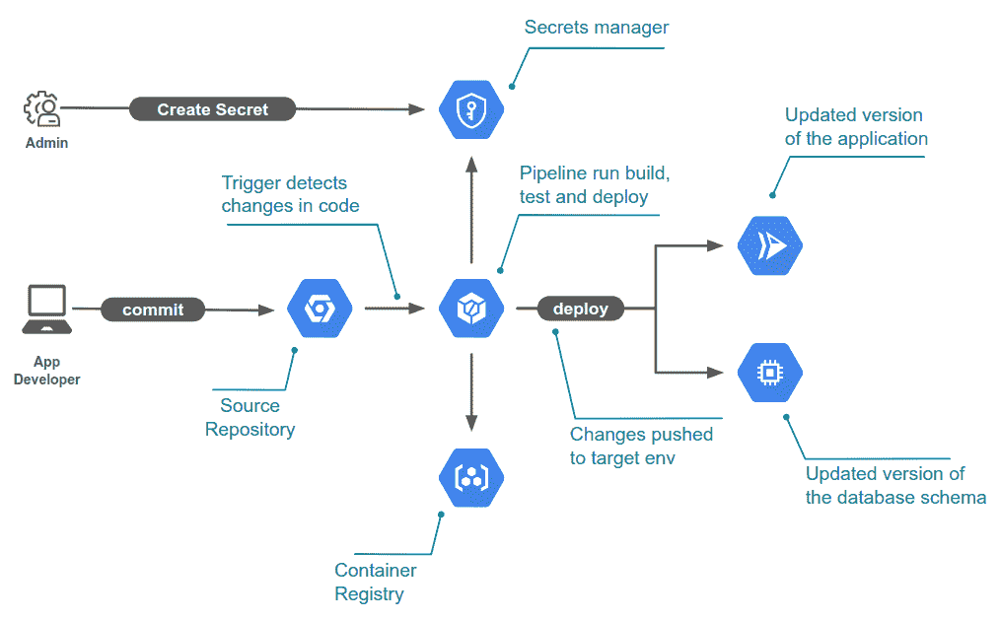
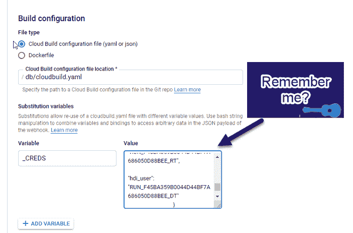
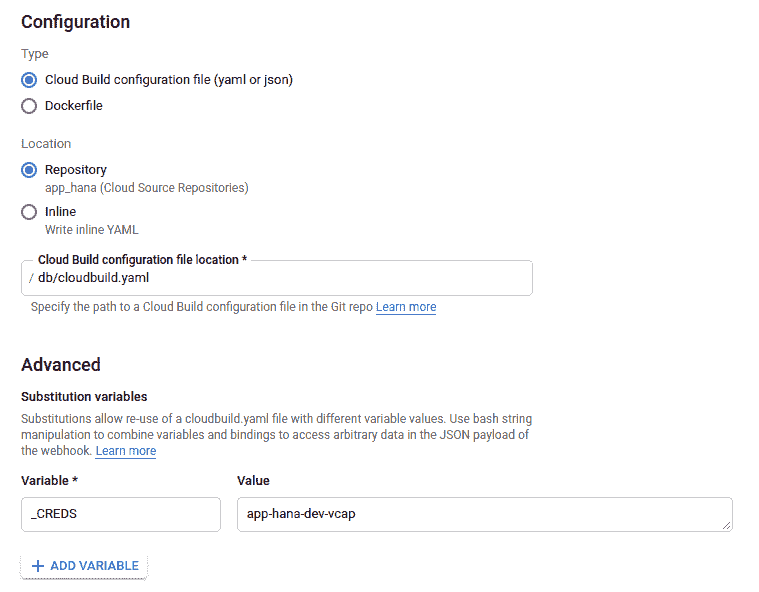

# 谷歌云上的 SAP(pt。4):你烟斗里的秘密

> 原文：<https://medium.com/google-cloud/sap-on-google-cloud-pt-4-secrets-in-your-pipes-70232071aab7?source=collection_archive---------0----------------------->



前一段时间，我们发表了一些关于创建 CICD 的帖子，今天我们决定展示更多关于如何通过隐藏秘密来使配置更加安全的内容。如果你看过我们之前关于这个主题的帖子，你就会知道如何[使用 HDI 来部署对你的 HANA](https://blogs.sap.com/2020/07/02/sap-on-google-cloud-when-sap-developers-join-the-cloud-pt.-1/) 的更改，以及它如何[与现有的云原生工作流](https://blogs.sap.com/2020/07/27/sap-on-google-cloud-hana-hdi-containers-and-ci-cd-pipelines-pt.2/)集成，同时[确保你的更改使用 CICD 管道得到正确测试](https://blogs.sap.com/2020/08/31/sap-on-google-cloud-creating-the-ci-cd-pipeline-pt.-3/)；这一切真的很酷，将加快我们的开发周期，但我们仍然缺少一些东西来将这种美丽融入产品中！

# 隐藏敏感信息

如果你一直想知道如何保护你的管道，现在 VCAP 已经掌握了所有有用的信息来处理你的 HDI 容器，那么我有好消息要告诉你。我们可以保护该信息，同时保留同样的功能。

秘密…谁没有秘密？当然不是 HANA(和许多其他应用程序)；在软件世界中，秘密是您希望保密的任何信息——如果泄露或被未授权方获取，它可能会为他们提供访问权限，这些权限可能会被用来危害或破坏您的系统。

如果你怀疑某件事是否应该保密，问问你自己，如果一个恶意的实体得到了这个信息，会发生什么？嗯，如果这发生在 VCAP 身上…你会明白的！


用 imgflip 创建

我们将使用 **Google Secret Manager** 来保护 VCAP 变量，然后我们将改变我们的**云构建**管道来安全地使用这个秘密。Google Secret Manager 是一个托管解决方案，允许我们轻松地创建和使用秘密；但是这种方法也适用于其他秘密引擎。

# 创造秘密

首先，确保您拥有 VCAP 服务的正确信息，以及专用于 CI/CD 管道的用户的详细信息，这与您之前使用 hanacli 工具创建的信息相同([“创建 HDI 容器】](/google-cloud/sap-on-google-cloud-hana-hdi-containers-and-ci-cd-pipelines-60cedaddfbc8#0972))。

如果您不再拥有包含 VCAP 服务内容的 json 文件，我们可以从触发器中恢复它——毕竟它是以明文形式存在的……这就是我们要解决的问题。

```
gcloud config set project ${PROJECT_ID} # make sure to use the correct PROJECT ID
cd app_hana/db
touch credentials.json
edit credentials.json
```

现在，导航到云构建触发器页面，在这里您已经填充了环境变量并恢复了`_CREDS`中的值，然后将其粘贴到我们刚刚创建的文件中:



如果您更愿意从命令行获得该值，请执行以下操作:

```
gcloud components install alpha
gcloud alpha builds triggers describe deploy-app-hana-db --format="value(substitutions)"
```

这将打印出`_CREDS`环境变量的值，这样您就可以复制并粘贴到文件中(确保只获得值),如上面的截图所示，如果您在创建触发器时更改了它们的名称，请确保使用上面的正确名称。

我们的下一步是创建秘密(你需要`roles/secretmanager.admin` IAM 的许可):

```
gcloud services enable secretmanager.googleapis.com
gcloud secrets create app-hana-dev-vcap --data-file=./credentials.json --labels env=dev,app=app-hana-db,usage=cicd --replication-policy automatic
gcloud secrets list
```

每个环境应该有不同的数据库，因此也应该有不同的 VCAP 值，因此我们不仅在名称中附加了环境，还添加了一些标签，以帮助我们将来编目和检索数据。标签真的很有用，所以一定要考虑你的用例的相关标签。

就这样…我们的秘密诞生了！

# 更新云构建管道

是时候修改我们的 CI/CD 管道来使用我们的`app-hana-dev-vcap`秘密了！

```
edit cloudbuild.yaml
```

这一更改相当简单，我们将在 YAML 文件中添加一个新步骤，告诉云构建如何获取秘密并将其作为文件提供给其他步骤，一旦管道被破坏，文件也随之被破坏。

我们将使用下面的`gcloud`命令来完成这个任务:

```
gcloud secrets versions access latest --secret "${_CREDS}" --format='get(payload.data)' | base64 -d >> credentials.json && exit $?
```

我们还需要将下一步修改为`waitFor`，即在开始之前完成的秘密步骤，并使用我们刚刚创建的文件来获取连接到 HDI 容器的凭证。下面是最终的 **cloudbuild.yaml** 的样子:

现在我们需要更新触发器，转到 cloud build 上的触发器页面并编辑它，现在将`_CREDS`上的值替换为我们的秘密名称(在本例中为`app-hana-dev-vcap`)。



然而，在这可以工作之前，我们仍然需要告诉 GCP 云构建管道可以访问这个秘密，为此导航到 IAM & Admin 页面，然后找到以`@cloudbuild.gserviceaccount.com`结尾的服务帐户，并赋予它`Secret Manager Secret Accessor`角色。

现在让我们测试我们的管道！推动变革，见证奇迹的发生:


你完了！尽情享受吧！

如果这对你有用，请告诉我或露西娅·苏巴丁！