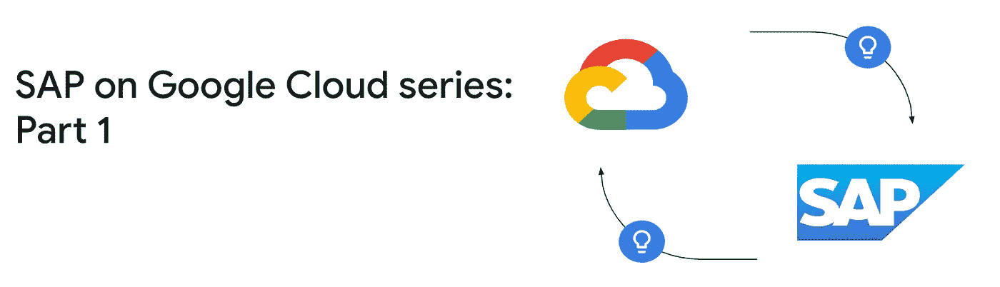

# 谷歌云上的 SAP:基础

> 原文：<https://medium.com/google-cloud/sap-on-google-cloud-series-the-fundamentals-a92901f1f312?source=collection_archive---------1----------------------->

成千上万的企业依靠 SAP 来处理财务、人力资源、仓库管理、供应链等方面的关键业务流程。SAP 系统需要最高级别的可用性、弹性和性能，否则企业可能会停滞不前。

谷歌云为 SAP 工作负载提供行业标准解决方案，无论是在 SAP 认证、基础设施可扩展性、弹性还是安全性方面。谷歌云还通过机器学习、智能分析、人工智能等增值功能实现企业的指数级增长。

在这个博客系列中，我们将探索在 Google cloud 上托管 SAP 的构造——基础、架构、安全性和最佳实践。

第 1 部分:基础(本博客)

第 2 部分:[部署注意事项](/@snehalsb/sap-on-google-cloud-deployment-considerations-3c99cccf7065)

## SAP 产品组合

在我们了解 Google cloud 为您的 SAP 工作负载带来了什么之前，这里有一个 SAP 应用程序组合基础和一些相关流行术语的快速概述。在本博客系列的后面部分，您会看到其中一些术语被引用

**SAP Business suite:**SAP Business suite 是一套行业应用组件，支持所有领先行业垂直领域的多种业务功能，即企业资源管理(ERP)、客户关系管理(CRM)、SAP 供应链管理(SCM)、产品生命周期管理(PLM)和供应商关系管理(SRM)。

**SAP ECC:** SAP ECC 代表 ERP Central component，由销售和分销(SD)、财务(FI)、人力资本管理(HCM)等几个模块组成。顾名思义，它构成了 SAP Business suite 的核心组件。

**SAP S/4 HANA:** 随着 S/4 HANA 企业应用套件的推出，SAP ERP 系统在 2015 年经历了重大变革。目前在 [S/4](http://s/4) HANA 中有多个模块可用于多个垂直行业，如能源、服务行业、金融、自然资源等

**SAP Netweaver:**SAP Netweaver 是 SAP 应用堆栈的核心。它由用 ABAP(高级业务应用程序编程)或 Java 平台企业版编写的组件组成，运行在 SAP NetWeaver 应用服务器上..

**SAP ASCS :** ABAP 中央服务(ASCS)是 SAP 的主要应用服务，由消息服务器和排队服务器组成。消息服务器处理所有传入的请求，并将它们分发到其他应用服务器。入队服务器管理表锁，以避免访问记录的操作之间的冲突。

**SAP PAS/ AAS :** PAS 代表 SAP 架构中的主要应用服务器，AAS 是附加的应用服务器。在标准部署中，除数据库之外的所有服务都在 PAS 实例上运行。分布式部署将有一个或多个 AAS 作为可选组件

**SAP BW :** Business Warehouse 是来自 SAP 的数据仓库解决方案。它可以用来创建和管理数据仓库、进行数据管理活动、创建报告和执行分析操作。它可用于构建和管理数据仓库、执行数据管理活动、执行分析操作和生成报告。

**SAP SLT:** SLT 本质上是一个 ELT 工具，支持将数据从 SAP/非 SAP 源系统加载和复制到 SAP HANA 数据库中。复制可以是实时的，也可以是预定的。

**SAP solution manager:** 该工具通常被称为 SolMan，客户使用它来集中管理、自动化和增强 SAP 环境。

**SAP Business One:**SAP Business One，通常称为 SAP B1，是 SAP 针对中小型企业推出的 ERP 解决方案。它涵盖多个业务功能，如财务、会计、库存、销售、客户关系管理等。

**SAP 费奥里:** SAP FIori 是 SAP 软件最新的用户体验(UX)解决方案，可以认为是 SAP GUI 的替代品。它为成功因素、 [S/4](http://s/4) HANA、员工中心等 SAP 解决方案提供了表示层

**SAP 数据库** : SAP 软件可以在以下任何数据库平台上运行:DB2、Oracle、SQL server、Sybase、Max DB 和 HANA。SAP HANA(高性能分析设备)是 SAP 专有的内存数据库，旨在支持 OLAP 和 OLTP 操作。虽然 ECC 支持其他数据库，但 S/4HANA 部署只能使用 HANA 作为数据库平台。

**SAPS :** SAPS 代表 SAP 应用性能标准。这些单元被定义为独立于硬件，并描述 SAP 环境系统性能。它有助于为您的 SAP 应用程序确定正确的硬件配置。

## 为什么考虑将谷歌云用于您的 SAP 工作负载

无论您的 sap 产品组合有多广泛，如果您是绿地客户，Google cloud 都会提供从头开始部署 SAP 工作负载所需的资源；如果您是棕地客户，Google cloud 会提供迁移 SAP 工作负载所需的工具和服务。谷歌云为托管企业级 SAP 解决方案提供认证硬件。让我们看看在谷歌云中托管 SAP 基础设施的一些主要优势如下

*   通过谷歌云的[实时迁移](https://cloud.google.com/compute/docs/instances/live-migration-process)功能，确保 SAP 工作负载的高可用性。您的 SAP 应用程序不会受到任何硬件维护活动或故障的影响，因为虚拟机将无缝迁移到不同的主机
*   采用[冷土豆路由](https://cloud.google.com/network-tiers/docs/overview#premium_tier)的谷歌云高速专用光纤网络有助于以最小的延迟提供更好的用户体验，这对于关键业务 SAP 应用至关重要
*   谷歌云提供内存高达 12 TB 的大型虚拟机，经 SAP HANA 认证，可用于横向扩展部署高达 64TB 以上
*   谷歌支持[定制虚拟机](https://cloud.google.com/compute/docs/instances/creating-instance-with-custom-machine-type)，在这里你可以配置你的实例所需的 CPU 内核和内存的数量，并且只为你所使用的付费。来自 N1、N2 和 N2D 系列的定制机器可用于 SAP 部署，提供明确的成本优势
*   有了[持续使用折扣](https://cloud.google.com/compute/docs/sustained-use-discounts)，您可以进一步优化按需运行的开发/测试环境的成本。
*   借助基础架构即服务提供的灵活性，您可以从小处着手调整 SAP 基础架构，并随您的发展而扩展。google cloud 中的 [Active assist](https://cloud.google.com/recommender/docs/whatis-activeassist) 服务提供了合适的规模建议，以优化您的资源使用
*   Google cloud 有一个分层的[安全](https://cloud.google.com/docs/security/infrastructure/design)模型，可以帮助您为 SAP 工作负载配置端到端的安全性。安全功能包括 Titan 芯片集成，以建立硬件信任根，大型专用网络与冷土豆路由，以保持您的数据安全，内置默认加密，DDoS 保护，访问透明，VPC 服务控制，私人谷歌访问等，仅举几例。我们将在本博客系列的后面部分详细探讨其中的一些
*   Google cloud 通过[Google Cloud Monitoring Agent for SAP HANA](https://cloud.google.com/solutions/sap/docs/sap-hana-monitoring-agent-user-guide)为 HANA 系统提供高级监控功能。代理收集的 HANA 系统指标可以与云监控集成，以便进一步分析和可视化
*   [SAP BackInt 代理](https://cloud.google.com/solutions/sap/docs/sap-hana-backint-overview)可用于 SAP HANA 数据库的备份，并可选择将备份副本直接存储在低成本的 Google 云存储中

## 入门:部署、许可和支持模式

**部署:** SAP 基础设施可以手动部署，也可以使用 Terraform 和 Cloud Deployment manager 等工具自动部署。建议使用自动化来确保遵守组织标准并消除人为错误。您还可以使用 Terraform 和部署管理器模板部署 SAP HANA。如果自动化是您组织的特权，您可以查看关于 SAP 部署自动化的[详细指南](https://cloud.google.com/solutions/sap/docs/automation-for-sap)

**许可:**Google cloud 上的 SAP 工作负载仅支持自带许可(BYOL)模式。许可证应该从 SAP 经销商处购买或直接从 SAP 处购买。Google cloud for SAP 中没有现收现付许可选项

**支持模式:** SAP 应用程序受特优和增强支持计划的支持。如果你有一个包含 SAP 的传统谷歌云支持计划，你可以继续使用它。要获得支持，SAP 实施必须仅使用经 SAP 认证的 Google Cloud VM SKUs。在规划部署时，您应该参考 SAP 应用程序和 HANA 的 SAP 认证实例。另请参考 [SAP 说明](https://launchpad.support.sap.com/#/notes/2456406)，其中包含关于 SAP on Google cloud 支持的先决条件的更多详细信息。

## 下一步是什么？

在本系列的后续博客中，我们将详细探讨 Google cloud 上的 SAP 环境。我们将涉及部署注意事项、参考架构，并深入探讨在 Google cloud 上部署 SAP 的安全性和最佳实践

观看此空间了解更多信息！！！

评审员:[斯内哈尔·贝利卡特](https://medium.com/u/b0a5aca5f37f?source=post_page-----a92901f1f312--------------------------------)