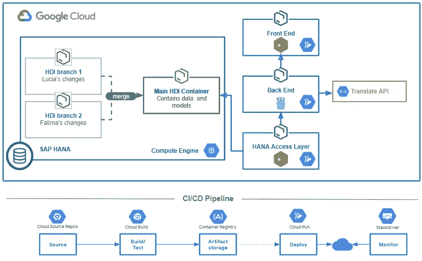
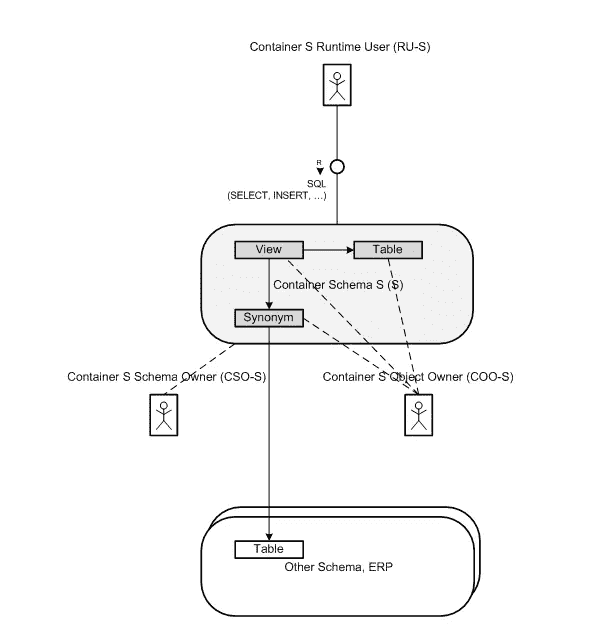
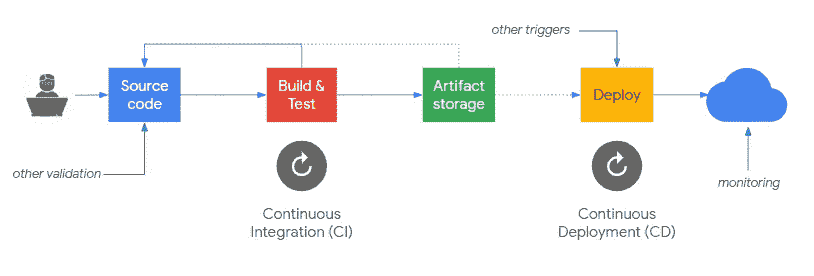
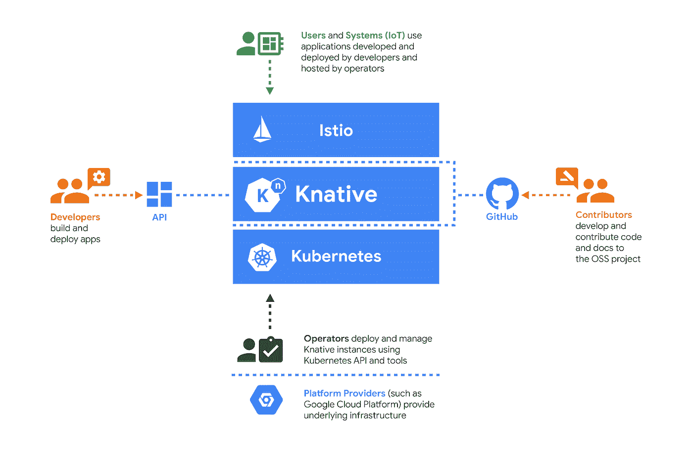

# Google Cloud 上的 SAP:当 SAP 开发者加入云(pt。1)

> 原文：<https://medium.com/google-cloud/sap-on-google-cloud-when-sap-developers-join-the-cloud-pt-1-5b4e24bf24e8?source=collection_archive---------0----------------------->

在第一次 SAP 在线跟踪期间， [Fatima Silveira](https://www.linkedin.com/in/fatimasilv/) 和我有幸分享了我们在[容器、SAP HANA、HDI 容器和 CI/CD 管道上对 SAP 进行扩展的最新实验](https://www.youtube.com/watch?v=lvtd9fD4rSI)。

微服务和 HDI 容器的 CI/CD 管道

这篇博客文章提供了一些初步的背景，是展示我们做了什么和如何做的系列文章的第一篇，并附有如何在现实生活中实现这一点的注释。

# 当 SAP 加入云时

当一个经验丰富的云原生开发人员团队听说 SAP 工作负载正在加入云时，这场冒险就开始了。这个团队已经有了一套针对云原生开发的既定实践。他们知道 SAP 是业务流程中的女王，想邀请她参加聚会。

他们知道他们可以为业务带来很多创新，他们只需要首先克服 SAP 世界中的缩写。

# 第一个缩写——HDI

在 SAP 的 HANA 世界中，随着 SAP 对 Cloud Foundry 的接管，出现了[HANA**D**e 部署**I**n 基础架构容器](https://help.sap.com/viewer/4505d0bdaf4948449b7f7379d24d0f0d/2.0.05/en-US/e28abca91a004683845805efc2bf967c.html)。尽管一起呈现，HDI 容器不需要 XS 高级或 SAP 云平台层就可以存在于 HANA 数据库中。 [Thomas Jung](https://people.sap.com/thomas.jung) 在[这篇博文](https://blogs.sap.com/2019/04/16/developing-with-hana-deployment-infrastructure-hdi-without-xsacf-or-web-ide/)中用一种实用的方法让这一点变得非常容易理解。

人类发展倡议容器——资料来源:help.sap.com

HDI 容器一直是 SAP 家庭晚宴上激烈争论的一个来源。如果不了解它们带来的好处，就很难在 sidecar HANA 中迁移以传统模式编写的现有代码库。您有自己的计算视图来支持您的报告工具，而且它工作起来很有魅力，那么为什么还要麻烦呢？

原因之一是:HDI 容器允许分支和隔离。我们将在我们的管道实践中看到这一点。

# 第二个缩写词是 CI/CD

这个词不是 SAP 创造的，但是定义这个首字母缩略词会很快变成一场争论。作为复习:

*   **持续集成:**有一个共享的 repo(比如 GitHub)，开发者把他们的代码合并到其中。这个合并过程触发了自动化的代码检查和测试，以确保新的更改不会破坏任何东西。如果测试通过，整个系统将被捆绑部署。
*   **连续交付**:人工触发工件部署的行为。例如，变更已经被批准，可以投入生产。这是一个标准化的工作流程，与大多数传统的 SAP ABAP 开发人员将传输请求转移到高效的 Netweaver 安装中的工作流程没有太大的不同。回滚更改的能力也是相关的。
*   **连续部署**:与交付相同，但是生产部署是自动的。

概念性 CI/CD 渠道

这里的要点是，我们想要做**小的、增量的改变**来给我们的代码添加功能，并尽可能频繁地发布它。我们将使用一系列工具来检查、测试和发布我们的代码。

如果你想了解更多，这里有一些介绍性的资源可以收藏:

*   [持续集成](https://www.martinfowler.com/articles/continuousIntegration.html)和[持续交付](https://www.martinfowler.com/bliki/ContinuousDelivery.html)马丁·福勒
*   谷歌的 [CI/CD 开发者中心](https://cloud.google.com/docs/ci-cd/)
*   漂亮的[介绍视频](https://www.youtube.com/watch?v=41QvqGfbz9o)带有代码示例和工具
*   另一个关于跨多种环境的 [CI/CD 的视频](https://www.youtube.com/watch?v=rt287-94Pq4)

## DevOps 呢？

嗯，DevOps 超越了 CI/CD，包括了像基础设施作为代码这样的概念，它们值得拥有完整的一章。我从 DevOps 文化中汲取的一个原则是自动化和关注更快的反馈循环。

# Cloud Run 和 Knative——不是首字母缩写，仍然很重要

自从 Cloud Run [首次发布以来，我就喜欢上了它](https://blogs.sap.com/2019/04/13/post-google-next-19-curiosity-playing-with-cloud-run-and-sap-hana/)，因为它允许您部署可自动伸缩并服务于 HTTPS 端点的托管容器，而完全不需要了解容器。

这背后的神奇之处在于 Knative，这是一个由谷歌发起的开源项目，SAP、IBM、Pivotal 和其他公司也参与其中。Knative 是关于简化部署在 Kubernetes 中的应用程序的服务和事件。

为什么是魔法？它将 Kubernetes 容器转换成无服务器应用程序。

要理解 Knative 的功能，请考虑如果 Knative 不支持上面的应用程序，您需要手动处理什么:

*   从定义 Kubernetes 的服务和部署开始
*   将传入流量路由和平衡到应用程序的新版本
*   根据传入的请求自动增加或减少副本的数量(即自动扩展，甚至到零)
*   保持一个稳定的端点，其他应用程序或用户可以连接到这个端点(即使在部署了新版本的容器之后)

现在我们已经建立了一些背景，让我们卷起袖子，深入细节。

本[文章的第 2 部分](/google-cloud/sap-on-google-cloud-hana-hdi-containers-and-ci-cd-pipelines-60cedaddfbc8)详细介绍了 SAP HANA HDI 容器如何在 CI/CD 管道中工作。

[露西娅·苏巴丁](https://twitter.com/LuciaBlick)和[法蒂玛·西尔维拉](https://www.linkedin.com/in/fatimasilv/)。