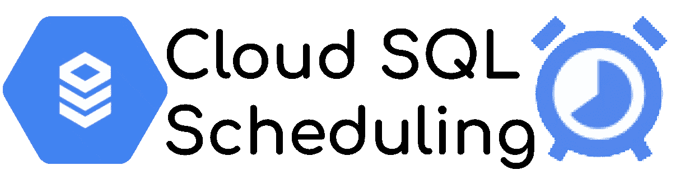
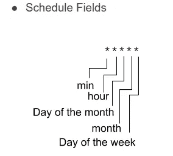
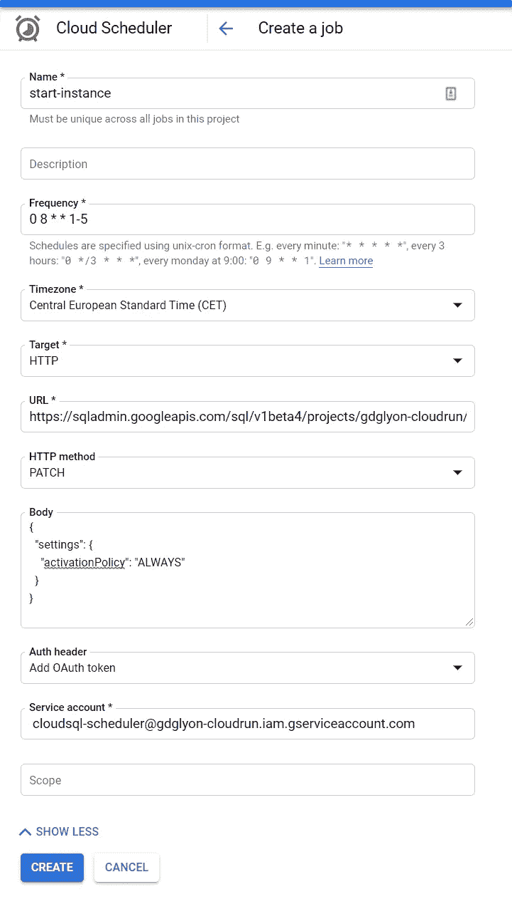
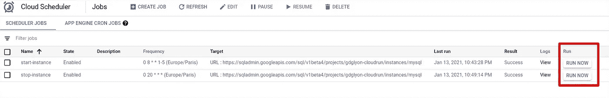

# 通过计划云 SQL 节省资金

> 原文：<https://medium.com/google-cloud/save-money-by-scheduling-cloud-sql-7981e1b65ea3?source=collection_archive---------1----------------------->



2020 年是艰难的一年，公司更加关注他们的支出，因为公司的云每年都在变得越来越大，T2 的云计费越来越受关注。
对于所有的公司来说，**理想的模式是只为他们使用的东西付费**；不会更多。**无服务器产品完全符合这一期望**。

但是，有些**服务不能采用这种模式**，尤其是技术原因。例如，关系数据库因其低延迟而受欢迎，这至少归功于两个因素

*   **实例总是运行**以避免冷启动
*   **索引保存在内存中**，并定期重建以确保最佳性能

这些技术限制阻止了按使用付费的模式。当然，像这样的**托管解决方案已经节省了资金**并避免了限制，例如让技术熟练的团队来部署、优化、执行备份、设置副本……而且是全天候的！

对这些公司来说，问题不在于是否真的要付钱，而是不花钱。由于**每个项目有多个环境**(至少是开发、试运行和生产)，在所有环境中拥有一个**生产就绪数据库是没有用的**。只有生产需要这样做，其他**环境中的数据库可以在晚上和周末关闭以节省资金**。

有了 [**云 SQL**](https://cloud.google.com/sql) 和 [**云调度器**](https://cloud.google.com/scheduler/docs/quickstart) ，部署起来还是挺轻松的。我们开始吧！

# 云 SQL API

云 SQL 服务有[管理 API](https://cloud.google.com/sql/docs/mysql/admin-api)与之交互。在我们的例子**中，我们想要更新现有的实例**并启动或关闭它。为此

*   我们将使用 API 的[实例补丁端点](https://cloud.google.com/sql/docs/mysql/admin-api/rest/v1beta4/instances/patch)
*   我们将更新[设置](https://cloud.google.com/sql/docs/mysql/admin-api/rest/v1beta4/instances#SqlActivationPolicy) `[activationPolicy](https://cloud.google.com/sql/docs/mysql/admin-api/rest/v1beta4/instances#SqlActivationPolicy)`，并将其设置为`NEVER`以停止数据库，设置为`ALWAYS`以启动数据库。

一个非常简短的 JSON 主体描述了这些设置

```
{
  "settings": {
    "activationPolicy": "NEVER"
  }
}
```

为了调用**补丁 API url，我们需要** `**projectID**` **和** `**instanceName**`。然后我们可以把它们放在一起，用 CURL 试一试

```
curl -X PATCH -d '{"settings":{"activationPolicy": "NEVER"}}' \
  -H "content-type: application/json" \
  -H "Authorization: Bearer $(gcloud auth print-access-token)" \
https://sqladmin.googleapis.com/sql/v1beta4/projects/<PROJECT_ID>/instances/<INSTANCE_NAME>
```

# 云调度程序配置

**云调度器是一个无服务器产品**，允许**调度 API 调用**。调度模式基于 Linux CRON 表达式。



为了自动启动和停止云 SQL 数据库，我们需要两个时间表:

*   **每天晚上 8 点关闭数据库**。我们可以认为在晚上 8 点以后，所有的开发人员都结束了工作。如果一个人选择在星期六工作，他将手动启动云 SQL 实例。调度程序在这里是为了防止在周末出现未停止的实例。
    这里的 CRON 表达式将是`0 20 * * *`
*   仅在周一至周五早上 8 点启动。为了更好的体验和更高的效率，我们可能希望在开发人员开始工作时有一个启动的数据库。
    这里的 CRON 表达式将`0 8 * * 1-5`
    *表示为* `*1–5*` *，是星期几。0 是星期日，* `*-*` *是设置一个间隔。*

## 云调度程序授权

正如我们在 CURL 命令中看到的，**API 调用需要被认证**。云调度程序也是如此。
要实现这一点，我们必须**使用一个服务帐户**——一个现有的帐户，或者我们可以创建一个新的帐户——**，至少拥有** `**roles/cloudsql.editor**` **授予的角色**。*该角色拥有更新云 SQL 实例的权限。*

在设置云调度程序认证的过程中，我们必须**在两种类型的令牌**之间进行选择

*   **OAuth:** 旨在**提供权限**范围，完美调用 Google Cloud API
*   **OIDC:** 旨在**提供请求者的身份**，这是安全云运行、云功能和应用引擎所必需的。

*在我们的例子中，* ***我们将使用 OAuth 令牌。***

# 设置最终配置

最后，我们可以创建包含所有部分的云调度程序作业

*   **API URL**，带有路径参数和`PATCH` HTTP 动词
*   **正文内容**
*   调度程序 **CRON 表情**
*   **安全定义**

让我们用控制台来做这件事(来启动实例)



或者使用命令行执行此操作(停止实例)

```
gcloud beta scheduler jobs create http stop-instance \
  --[oauth-service-account-email=<](mailto:oauth-service-account-email=cloudsql-scheduler@gdglyon-cloudrun.iam.gserviceaccount.com)SERVICE_ACCOUNT_EMAIL> \
  --message-body='{"settings":{"activationPolicy": "NEVER"}}' \
  --schedule="0 20 * * *" --time-zone=Europe/Paris \
  --http-method=PATCH \
  --uri=https://sqladmin.googleapis.com/sql/v1beta4/projects/<PROJECT_ID>/instances/<INSTANCE_NAME>
```

为了测试，我们可以通过点击`Run now`按钮**手动启动云调度程序作业**。



这也是一个很好的解决方案，允许任何开发者在他们想的时候启动和停止实例。

# 智能托管服务可节省资金，等等！

现在，我们有了。我们能够启动和停止实例，以最小化它们无用的运行时间。像这样，我们能够省钱，但不仅仅是。
如果我们节约资源，我们就能防止能源浪费，并与其他 Google Cloud 客户共享未使用的 CPU/内存。因此，消耗的物理“碳”资源更少，对地球更好！

通过明智地考虑托管服务的使用，**我们为所有人实现了更好的目标**！