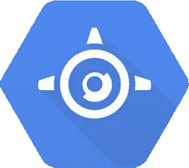
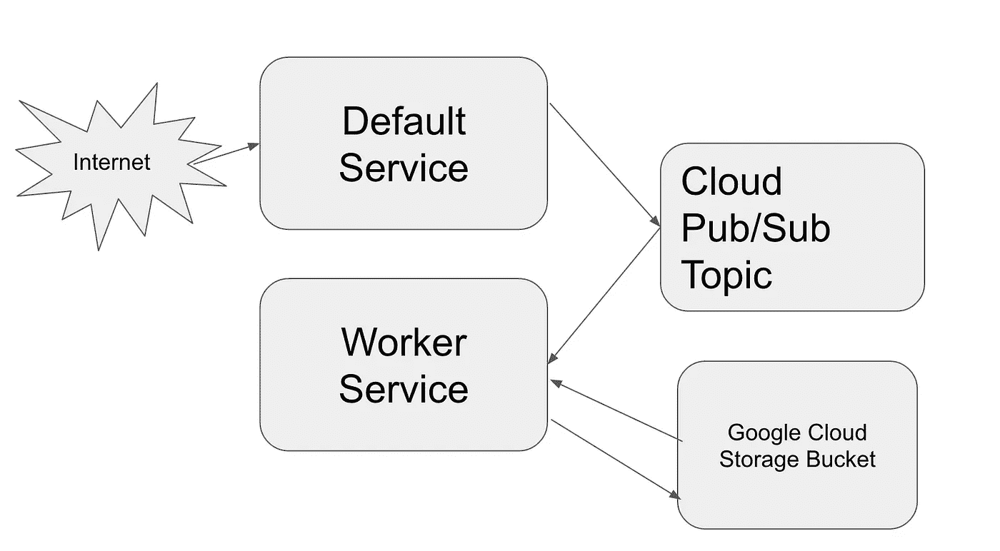
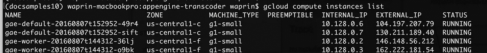
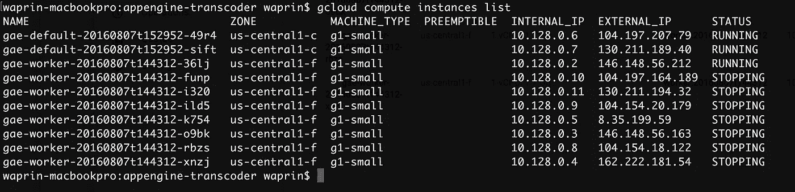

# 灵活应用引擎的可扩展视频转码

> 原文：<https://medium.com/google-cloud/scalable-video-transcoding-with-app-engine-flexible-621f6e7fdf56?source=collection_archive---------0----------------------->



应用引擎灵活的环境

这是[不](/google-cloud/deploying-django-postgres-redis-containers-to-kubernetes-9ee28e7a146#.kjn0gtqo9) [的秘密](/google-cloud/deploying-django-postgres-and-redis-containers-to-kubernetes-part-2-b287f7970a33#.wefzos81n)我是[容器引擎](https://cloud.google.com/container-engine/)(谷歌管理的 [Kubernetes](https://github.com/kubernetes/kubernetes) )的忠实粉丝，它是一种在虚拟机集群中无缝运行容器的方式。然而，这远不是在 Google Cloud 上运行容器的唯一方式。一个稍微显而易见的选择是启动 [Google 计算引擎](https://cloud.google.com/compute/)实例，然后自己运行 Docker。但是在微服务环境中运行任意容器的最简单方法之一实际上是 App Engine 的新环境， [App Engine 灵活环境](https://cloud.google.com/appengine/docs/flexible/)。

在这篇文章中，我将讨论如何使用灵活的环境来运行一个名为 [ffmpeg](https://ffmpeg.org/) 的流行库(或者更确切地说，是一个名为 [libav](https://libav.org/) 的分支)来执行常见的视频操作，如视频的代码转换和大小调整。此外，我将演示在零配置的情况下，该设置如何自动伸缩以满足负载对它的要求。

请注意，App Engine Flexible Environment 仍是测试版产品。

虽然 App Engine 多年来一直以支持 Snapchat 等产品通过最少的后端工程扩展到数百万用户而闻名，但它也是一种对用户强加了某种限制性沙盒和开发环境的产品。如果你能在这种环境下开发，那当然很好，但是如果你需要一个沙箱中没有的库，比如 ffmpeg，你也可能会陷入困境。

虽然从表面上看，App Engine Flexible Environment 看起来很像 App Engine Standard，但与 Standard 不同，它实际上旋转了 Google Compute Engine 实例和负载平衡器，以在传统的基础架构即服务上自动扩展您的应用，并在这些实例上运行 Docker。这意味着你几乎可以随心所欲地奔跑！

App Engine Flexible Environment 附带了几个默认的运行时，比如 NodeJS ( [通常用于运行解析服务器](/google-cloud/deploying-parse-server-to-google-app-engine-6bc0b7451d50#.rd9nzkm44))和 Ruby。灵活环境以 Docker 为中心的特性使得创建这些运行时并[在 Github](https://github.com/GoogleCloudPlatform/python-runtime) 上发布它们变得很容易。然而，灵活环境的一个鲜为人知的特性是创建自己的[定制 Docker 运行时](https://cloud.google.com/appengine/docs/flexible/custom-runtimes/)的能力。这个可以用来安装 ffmpeg 之类的东西。

# 与计算引擎和容器引擎相比

在查看演示代码之前，让我们简单比较一下 Google Cloud 上的视频转码选项:

*   谷歌计算引擎——计算引擎在这个领域有一个很大的优势——价格。如果您的视频需求是离线的，而不是实时的，这一点尤其正确，因为这样您可以节省高达 70%的空间并使用[可抢占的虚拟机。](https://cloud.google.com/preemptible-vms/)这些虚拟机可以在任何时候被终止，因此它们不适合对处理有时间要求的用例。但是对于长期运行的后台工作，它们是一个很好的选择。计算引擎的最大缺点是什么？要扩展它，您必须自己创建托管实例模板、托管实例组、负载平衡器等。正确设置可能需要一些工作，并且需要很长时间来重现 App Engine Flexible 开箱后的所有配置。
*   Google 容器引擎——像计算引擎一样，容器引擎可能需要大量的设置和配置工作。与 Compute Engine 不同，让基于 Docker 的微服务相互对话轻而易举。但是相比灵活的环境还是需要大量的配置和保姆。在价格方面，它将与没有可抢占虚拟机的计算引擎相同或略高，这取决于您运行的实例数量。虽然它提供了更多的灵活性，但对于简单的用例来说，它可能有点重。使用容器引擎的最好理由是如果你已经在大量使用它。

灵活环境的最佳时机是当您想要运行一些 Docker 容器，并且您正在适应一些非常常见的用例，即拥有一些响应 web 或 RPC 流量并需要负载平衡器的服务。

像容器引擎一样，灵活的环境暴露了 [**服务**](https://cloud.google.com/appengine/docs/python/microservices-on-app-engine) 的概念，除了在这种情况下，服务必须始终遵循某些约定。必须有一个监听端口 8080 上的 web 流量的默认服务，并且可以有多个后端服务。他们必须进行健康检查或明确禁用健康检查。每个服务只能运行一个镜像，这个镜像由你在 Dockerfile 文件中定义，由[云容器构建器](https://cloud.google.com/container-builder/docs/)构建。

# 演示代码评审

你可以在我的 repo[waprin/app engine-transcoder](https://github.com/waprin/appengine-transcoder)中找到示例代码。请注意，这是一个演示，而不是一个生产应用程序。一些注意事项:

*   虽然我说我用的是 ffmpeg，但实际上我用的是 ffmpeg 的一个分支，叫做 [libav](https://libav.org/) 。虽然 ffmpeg 仍在积极开发中，并被许多人认为优于 libav，但 libav 包含在 Debian 软件包管理器中，因此安装起来更简单。如果你喜欢 ffmpeg，你可以找到许多从源代码构建它的容器的例子。
*   代码是用 Python 写的，但是任何语言都可以，因为实际的代码转换是通过向 libav 发送代码来完成的。实际上有几个 Python 库更适合视频操作，如 [moviepy](http://zulko.github.io/moviepy/ref/videofx/moviepy.video.fx.all.resize.html?highlight=resize#moviepy.video.fx.all.resize) 在 ffmpeg 上提供了很好的抽象，但我想让示例 repo 尽可能简单。
*   我们的应用程序需要两个**服务**:一个默认服务响应 web 流量以开始代码转换，一个后台工作人员实际完成这项工作。我们不能在一个容器中完成所有工作的原因是因为代码转换可能需要足够长的时间，以至于 web 请求会超时，这也会扼杀作业。
*   有几种方法可以在两个服务之间进行通信，但在这种情况下，我只需向 [Cloud Pub/Sub](https://cloud.google.com/pubsub/overview) 发布一条消息。发布/订阅被设计为高度可伸缩和可靠的消息总线。开箱即用，它缺乏任务队列语义，例如任务是成功还是失败，以及任务需要多长时间。在 Pub/Sub 上使用任务队列并不过分，正如我的同事用他的 repo [psq](https://github.com/GoogleCloudPlatform/psq) 演示的那样，灵感来自于 [rq](http://python-rq.org/) 项目。如果我要生产这个应用程序，我会切换到 psq。

现在，让我们来看一下该应用的快速架构图:



服务架构

正如您所知，工作流程经历了几个步骤:

*   我们从一个 web 请求开始。在演示代码的例子中，这是一个稍微有点做作的例子，一个 web 请求启动了同一个视频从 [mp4](https://en.wikipedia.org/wiki/MPEG-4_Part_14) 到 [webm](https://www.webmproject.org/) 的一次又一次的转码。
*   接下来，该服务向发布/订阅主题发布一条消息。这是让后端服务知道它需要启动任务的一种方式，并且足够快，默认服务仍然可以在超时前用 HTTP OK 响应。
*   worker 服务正在侦听 Pub/Sub 主题，一旦收到消息，它就知道要启动这个进程。在更现实的情况下，消息可能表示要做哪项工作，但在这种情况下，任何消息都意味着对同一视频进行代码转换。
*   工人从 Google 云存储中下载要转码的视频，并将其写入临时文件系统。虽然在灵活的环境中您不应该过分依赖文件系统，因为您的实例是暂时的，但是使用临时文件是很好的。它向 libav 发出请求，然后将转码后的视频上传到谷歌云存储。

完成下载、代码转换和上传的工作代码如下所示:

```
bucket = client.bucket(‘appengine-transcoder’)
blob = bucket.blob(‘sample.mp4’)
with open(‘/tmp/sample2.mp4’, ‘w’) as f:
    blob.download_to_file(f)
os.system(‘rm /tmp/output.webm’)
ret = os.system(‘/usr/bin/avconv -i /tmp/sample2.mp4 -c:v libvpx -crf 10 -b:v 1M -c:a libvorbis /tmp/output.webm’)
if ret:
    sys.stderr.write(“FAILED”)
return “Failed”
blob = bucket.blob(‘output.webm’)
blob.upload_from_file(open(‘/tmp/output.webm’))
```

正如你所看到的，我们使用 [Python 云客户端库](https://github.com/googlecloudplatform/gcloud-python)与 Google 云存储和 Pub/Sub 对话，并在将结果上传回云存储之前，将代码转换成 libab (avconf)。写入 stderr 确保我们可以看到任何失败。

我们如何确保 libav 在系统中？嗯，在我的 [Dockerfile](https://github.com/waprin/appengine-transcoder/blob/master/worker/Dockerfile) 中，我只是确保将它安装在我最喜欢的 Python 映像之上:

```
FROM gcr.io/google_appengine/python
RUN apt-get -y update && apt-get install -y libav-tools
```

然后在我的 worker.yaml 中，我声明我为这个服务使用了一个定制的 docker 文件:

```
service: worker # name of the service (necessary for non-default)
runtime: custom # (will use Dockerfile in same directory)
vm: true # signifies flexible environmententrypoint: python /app/worker.py 
env_variables:    
    PYTHONUNBUFFERED: 1 # make sure we see logs
vm_health_check:   
    enable_health_check: False # since no real health check
```

您会注意到，在这种情况下，我只是禁用了健康检查，但在一个真正的应用程序中，您可能会希望进行健康检查，以验证您的代码转换是否成功。在文档中了解关于健康检查如何管理您的实例生命周期[的更多信息。](https://cloud.google.com/appengine/docs/flexible/python/how-instances-are-managed)

为了部署工人服务，我使用标准的 [Google Cloud SDK](https://cloud.google.com/sdk/)

```
gcloud app deploy worker.yaml
```

然后，我可以返回到顶级目录并部署我的主服务，该服务将简单地接受 web 请求并开始执行 Pub/Sub 上的任务:

```
gcloud app deploy app.yaml
```

一旦成功，我可以运行“gcloud compute instances list ”,并看到我当前为每个服务运行 2 个实例。



现在，如果我去[https://my-project-id.appspot.com/transcode](https://my-project-id.appspot.com/transcode)点击开始代码转换的端点。我可以使用 [Stackdriver Logging](http://Stackdriver Logging - Google Cloud Platform) 来检查任何错误，一旦完成，我应该可以在我的云存储桶中看到我的视频的 webm 版本。

# 看着它扩展

那么，缩放呢？已经做好了！随着服务负载的增加，将会自动创建更多的实例。如果你担心成本，请确保在 app.yaml 中设置“max_instances ”,并在[云控制台](https://console.developers.google.com)的计费部分验证你的预算。

为了进行演示，我编写了一个非常小的负载测试，它一次又一次地撞击我的端点，并提高了 worker 服务的 CPU 使用率:

```
import time
import requestsPROJECT_ID = 'your-project-id'URL = 'https://{}.appspot.com/transcode'.format(PROJECT_ID)
NUM_REQUESTS = 100 
DELAY=.1for i in range(0, NUM_REQUESTS):
    requests.get(URL)
    time.sleep(DELAY)
```

很快，我的 worker 服务的 CPU 需求导致 App Engine 创建更多实例:



如果您运行此负载测试，请确保应用程序随后缩减规模。如果你想安全起见，把工人服务一起删除。

和往常一样，如果你对更多的技术内容感兴趣，重点是 Python 和 Google 云平台产品，如 Kubernetes、App Engine 和 Bigquery，[在 Twitter 上关注我](http://twitter.com/waprin_io) @waprin_io，如果你有任何问题，请在 Medium 上发表评论，在 Twitter 上给我发消息，或在 Github 上提到我@waprin。